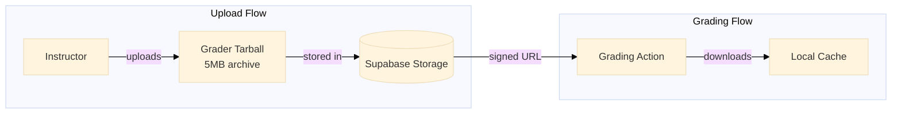
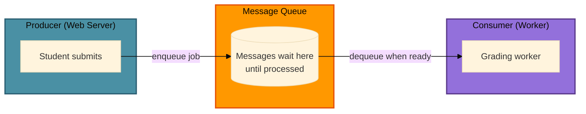
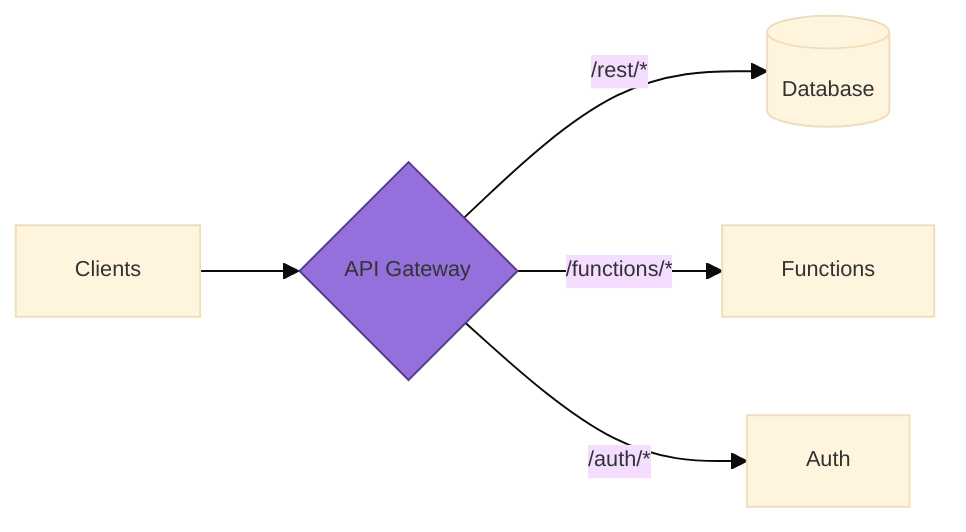

import Img from '@site/src/components/Img';
import RevealJS, { Slide } from '@site/src/components/RevealJS';

<RevealJS transition="slide">

{/* ============================================ */}
{/* COVER IMAGE */}
{/* ============================================ */}

<Slide>
  

<aside className="notes">
**Lecture overview:**
- **Total time:** ~65-70 MINUTES
- **Prerequisites:** L19 (monoliths, modular monoliths, architectural styles), L20 (distributed systems, eight fallacies, REST, security)
- **Connects to:** L22 (teams and Conway's Law), L31-33 (concurrency, event architecture)

**Structure:**
- **Foundational: What is Infrastructure?** (~8 min) — first principles for freshmen
- Recap: From Distributed to Serverless (~3 min)
- **The Cloud Deployment Spectrum** (~5 min) — builds on the "iceberg" foundation
- **What Does Your App Need?** (~3 min) — bridge: problems that lead to building blocks
- **Infrastructure Building Blocks** (~10 min) — databases, storage, queues, caches, observability
- **Defining Serverless + FaaS** (~8 min) — includes Lambda code examples with S3 triggers and Upstash
- **Architecture Comparison** (~8 min) — universal examples: image upload, email, video
- **Requirements Fit** — good fit vs poor fit (~10 min)
- **Connection to Course Concepts** (~5 min)
- **Decision Framework** (~8 min)
- Bringing It Together + L22 Preview (~5 min)

**Key theme:** Serverless is technical partitioning with a vendor — you write functions, they operate infrastructure. It's not magic; it's a point on a spectrum with real tradeoffs. The same architectural principles (information hiding, hexagonal architecture) apply at this scale.

**Important pedagogical note:** Many students have never deployed code to anything other than their own laptop. The foundational section bridges this gap before diving into cloud deployment models.

→ **Transition:** Let's start with the title...
</aside>

</Slide>

{/* ============================================ */}
{/* TITLE SLIDE */}
{/* ============================================ */}

<Slide>

# CS 3100: Program Design and Implementation II

## Lecture 21: Serverless Architecture

<p style={{marginTop: '2em', fontSize: '0.8em', color: '#666'}}>
  ©2026 Jonathan Bell, CC-BY-SA
</p>

<aside className="notes">
**Context:**
- L20 ended with the preview: "Serverless pushes many of today's concerns to the platform level"
- Today we explore what that means concretely
- Running examples: same as L19-L20 — Pawtograder and Bottlenose

**Framing the lecture:**
- "L20 was about what happens when components communicate over networks"
- "Today is about what happens when someone ELSE manages the infrastructure those components run on"
- "You're NOT expected to design serverless architectures from scratch. The goal: understand the tradeoffs so you can evaluate when serverless makes sense."

→ **Transition:** Here's what you'll be able to do after today...
</aside>

</Slide>

{/* ============================================ */}
{/* LEARNING OBJECTIVES */}
{/* ============================================ */}

<Slide>

## Learning Objectives

<p style={{fontSize: '0.85em', textAlign: 'left'}}>
After this lecture, you will be able to:
</p>

<ol style={{fontSize: '0.75em', textAlign: 'left'}}>
  <li>Recognize common <strong>infrastructure building blocks</strong> (databases, queues, caches, object storage, observability) and their architectural roles</li>
  <li>Define <strong>"serverless"</strong> architecture and <strong>Functions as a Service (FaaS)</strong> concepts</li>
  <li>Compare serverless to <strong>traditional and container-based</strong> architectures, identifying tradeoffs</li>
  <li>Identify requirements that are <strong>well-suited or poorly-suited</strong> for serverless</li>
  <li>Apply a <strong>decision framework</strong> for choosing between architectural styles based on team size, scaling needs, and operational capacity</li>
</ol>

<div className="fragment">
<p style={{fontSize: '0.75em', marginTop: '0.75em', fontStyle: 'italic', color: '#666'}}>
<strong>Important framing:</strong> You will encounter serverless systems in internships and jobs. The goal is to <em>understand why teams choose serverless</em> and reason about whether it fits a given problem — not to become a serverless architect overnight.
</p>
</div>

<aside className="notes">
**SET EXPECTATIONS:**
- "You will NOT be tested on 'design a serverless architecture from scratch'"
- "You WILL be expected to understand tradeoffs, recognize when serverless fits, and read systems that use it"

**Connection to L19-L20:**
- L19: How do we organize code? (architectural styles)
- L20: What changes when code crosses the network? (distributed systems)
- L21: What changes when someone else manages the infrastructure?

**The progression:**
- Same principles at different scales
- Information hiding, hexagonal architecture, quality attributes — all still apply
- Serverless is one point in a design space, not a silver bullet

→ **Transition:** But first — let's make sure we're all on the same page about what "infrastructure" even means...
</aside>

</Slide>

{/* ============================================ */}
{/* FOUNDATIONAL: YOUR CODE LIVES SOMEWHERE */}
{/* ============================================ */}

<Slide>

## Your Code Lives Somewhere

<p style={{fontSize: '0.82em'}}>
When you run code in IntelliJ, it executes on <strong>your laptop</strong>. But when you visit a website like Canvas or GitHub, that code is running on <strong>someone else's computer</strong> — somewhere in the world, right now, waiting for your request.
</p>


<aside className="notes">
**Start with what they know:**
- "You've been writing Java code all semester. Where does it run?"
- "On your laptop. Your machine. Under your desk."
- "When you close your laptop, the code stops. That's fine for homework."

**Bridge to the question:**
- "But think about Canvas, or GitHub, or Spotify..."
- "When you close YOUR laptop, those sites keep working"
- "Someone in Tokyo can use GitHub while you sleep"
- "That code is running SOMEWHERE — but where?"

**The insight:**
- "Web applications run on computers that are ALWAYS ON"
- "Those computers need to be reachable from anywhere in the world"
- "This is the fundamental problem we're solving today"

→ **Transition:** So what does it take to keep code running 24/7?
</aside>

</Slide>

<Slide>

## What Does It Take to Run Code 24/7?

<p style={{fontSize: '0.78em'}}>
Running code that serves users around the clock requires more than just a computer. Let's trace what's actually needed — this is what we call <strong>infrastructure</strong>.
</p>


<aside className="notes">
**Walk through each layer (bottom to top):**

**Physical space:**
- "Someone needs a building. With doors that lock."
- "Fire suppression systems. Security guards. Insurance."

**Power and cooling:**
- "Computers need electricity. Constant electricity."
- "They generate heat — a lot of it. Need AC running 24/7."
- "Power goes out? Your app goes down."

**Network:**
- "Need an internet connection. A FAST one."
- "Not your home WiFi — enterprise-grade networking"
- "Multiple redundant connections so one failure doesn't kill you"

**The computer:**
- "Actual physical hardware. CPUs, RAM, hard drives."
- "Hard drives fail. RAM goes bad. CPUs overheat."
- "Someone needs to notice and replace them."

**Operating system:**
- "Linux, Windows Server — manages the hardware"
- "Security patches. Updates. Configuration."

**Runtime:**
- "Java needs a JVM. Python needs an interpreter."
- "These need to be installed, configured, kept up to date."

**Your app (finally!):**
- "All that infrastructure... just so YOUR code can run"
- "The iceberg visual: your code is the tiny visible tip"

**Key insight:**
- "Infrastructure = everything beneath your code"
- "Someone has to manage ALL of these layers"
- "The question is: who?"

→ **Transition:** You have two choices for who manages this...
</aside>

</Slide>

<Slide>

## Two Choices: Own It or Rent It

<p style={{fontSize: '0.82em'}}>
You have a fundamental choice about who manages all that infrastructure. This is the core tradeoff that defines cloud computing — and it's exactly like choosing between <strong>owning a car</strong> and <strong>taking the T</strong>.
</p>

<div style={{display: 'grid', gridTemplateColumns: '1fr 1fr', gap: '1em', fontSize: '0.6em', marginTop: '0.75em'}}>

<div style={{padding: '0.75em', border: '2px solid #9370DB', borderRadius: '8px'}}>

**Own Your Infrastructure**

Buy servers. Rent data center space. Hire ops engineers. Configure everything yourself.

- **Total control** — choose any hardware, any software
- **Predictable costs** at high scale
- **You're responsible** for everything: uptime, security, maintenance
- When something breaks at 3 AM, **your phone rings**

</div>

<div style={{padding: '0.75em', border: '2px solid #4A90A4', borderRadius: '8px'}}>

**Rent from a Cloud Provider**

AWS, Google Cloud, Azure, Supabase — they own the data centers, you use their services.

- **Less control** — work within their constraints
- **Pay-per-use** pricing (can be cheaper... or more expensive)
- **They handle** most operational concerns
- When their stuff breaks at 3 AM, **their phone rings**

</div>

</div>

<div className="fragment">
<p style={{fontSize: '0.73em', marginTop: '0.6em', fontStyle: 'italic', color: '#666'}}>
This is the same tradeoff you make with transportation in Boston. Own a car? Total freedom, but you pay for parking, insurance, gas, maintenance — even when it sits unused. Take the T? Cheaper per trip, but you follow their schedule and routes.
</p>
</div>

<aside className="notes">
**The ownership tradeoff:**
- "This is a fundamental decision in software engineering"
- "Own vs. rent — it applies to infrastructure just like cars"

**Own it:**
- "Companies like Google and Amazon own their data centers"
- "They have tens of thousands of servers, teams of engineers"
- "When you're at that scale, it makes sense"
- "But for a small team or a class project? Probably not."

**Rent it:**
- "Cloud providers own massive infrastructure"
- "They spread the cost across thousands of customers"
- "You rent a small slice"
- "Like an apartment vs. owning a house"

**The Boston analogy:**
- "This should feel familiar to any of you who've debated bringing a car to Boston"
- "Parking at Northeastern: $2,200/semester"
- "CharlieCard: $2.40/ride"
- "If you only need to go somewhere occasionally, the math is obvious"
- "But if you need to go somewhere the T doesn't go... you're stuck"

**Foreshadowing serverless:**
- "Serverless is like ONLY paying for the rides you take"
- "No monthly parking fee. No insurance. Just per-trip cost."
- "But you REALLY have to follow their rules."

→ **Transition:** Let's see this as a spectrum...
</aside>

</Slide>

{/* ============================================ */}
{/* RECAP: FROM DISTRIBUTED TO SERVERLESS */}
{/* ============================================ */}

<Slide>

## Recap: From Distributed Systems to Serverless

<p style={{fontSize: '0.82em'}}>
In <strong>L19</strong>, we explored architectural styles — monoliths, modular monoliths, and the tradeoffs between them. In <strong>L20</strong>, we crossed the network boundary and discovered the <strong>Eight Fallacies of Distributed Computing</strong>.
</p>

<div style={{display: 'grid', gridTemplateColumns: '1fr 1fr 1fr', gap: '0.75em', fontSize: '0.6em', marginTop: '0.75em'}}>

<div style={{padding: '0.6em', border: '2px solid #9370DB', borderRadius: '8px'}}>

**L19: How do we organize code?**

Architectural styles emerge from quality attribute requirements. Monolith-first is usually right.

</div>

<div style={{padding: '0.6em', border: '2px solid #4A90A4', borderRadius: '8px'}}>

**L20: What changes over networks?**

The eight fallacies. Latency, failures, security boundaries. Every call needs timeout + retry.

</div>

<div style={{padding: '0.6em', border: '2px solid #FF9800', borderRadius: '8px'}}>

**L21: What if someone else manages it?**

Serverless = technical partitioning with a vendor. You write functions; they operate infrastructure.

</div>

</div>

<div className="fragment">
<p style={{fontSize: '0.78em', marginTop: '0.75em', fontWeight: 'bold', color: '#4CAF50'}}>
Today's key insight: Serverless doesn't eliminate distributed systems complexity — it shifts <em>who deals with it</em>. The eight fallacies still apply. You just don't write the retry logic yourself.
</p>
</div>

<aside className="notes">
**Connect to what we just covered:**
- "We just saw the iceberg — all that infrastructure beneath your code"
- "The 'own it vs. rent it' choice"
- "Now let's connect this to our architectural journey from L19 and L20"

**Connect the arc:**
- L19: Inside a single deployment — how do we structure code?
- L20: Across deployments — what changes when components talk over networks?
- L21: Who operates the infrastructure those deployments run on?

**The key framing:**
- "Serverless" sounds like magic — "no servers!"
- Reality: there ARE servers, you just don't manage them — it's the "rent it" extreme
- All eight fallacies still apply to YOUR code
- The vendor handles retry logic, scaling, availability — but you pay for that in other ways

**Conway's Law preview:**
- Serverless is technical partitioning taken to the organizational level
- The vendor specializes in infrastructure; you specialize in your domain
- This is the same principle as L19's "technical vs. domain partitioning" — but across company boundaries

→ **Transition:** The "own vs. rent" choice isn't binary — it's a spectrum. Let's map it out...
</aside>

</Slide>

{/* ============================================ */}
{/* THE CLOUD DEPLOYMENT SPECTRUM */}
{/* ============================================ */}

<Slide>

## The Cloud Deployment Spectrum


<aside className="notes">
**Connect to the iceberg:**
- "Remember the iceberg? All those layers beneath your code?"
- "This spectrum shows WHO manages each layer"
- "Each step to the right trades CONTROL for OPERATIONAL SIMPLICITY"

**Walk through the spectrum (reference the iceberg layers):**

**Left side — you manage the entire iceberg:**
- Own data center: you manage ALL layers (facility, power, network, hardware, OS, runtime, app)
- Real companies do this! Google, Amazon, large banks — when scale justifies it
- Most of you will never need to think about power and cooling

**Middle — the cloud IaaS era (2006-2015):**
- EC2 launched 2006 — revolutionary! No more buying hardware
- The cloud provider handles the bottom of the iceberg (physical stuff)
- But you still patch the OS, configure the firewall, scale manually
- Bottlenose lives here (VMs + containers)

**Right side — serverless territory:**
- PaaS (Heroku, 2007) was the first "just deploy your code"
- FaaS (Lambda, 2014) went further: just deploy FUNCTIONS
- Almost the entire iceberg is managed FOR you
- Pawtograder lives here (Supabase Edge Functions)

**The key insight:**
- "Serverless" isn't one thing — it's the rightmost portion of this spectrum
- The vendor handles more of the iceberg; you handle less
- But you're not getting something for nothing — you pay in flexibility, vendor lock-in, and sometimes cost at scale

**Connect to L20:**
- "Remember the eight fallacies? They apply at EVERY level except 'own data center'"
- "But as you move right, the VENDOR deals with more of the retry logic, scaling, and availability"
- "The fallacies don't disappear — the responsibility shifts"

→ **Transition:** But wait — just having compute isn't enough. Real apps need more than just somewhere to run code...
</aside>

</Slide>

{/* ============================================ */}
{/* BRIDGE: WHAT ELSE DOES YOUR APP NEED? */}
{/* ============================================ */}

<Slide>

## Beyond Compute: What Else Does Your Application Need?

<p style={{fontSize: '0.78em'}}>
Okay, you've got a server (or a function) running your code. But code alone isn't enough. Real applications have <strong>needs</strong> that go beyond just executing instructions.
</p>


<aside className="notes">
**Frame this as universal problems:**
- "So you've got your code running somewhere. Great!"
- "But immediately you hit problems that EVERY web application faces"
- "These aren't unique to your app — they're so common that the industry has standardized solutions"

**Walk through each problem:**

**Data persistence:**
- "Your app tracks user accounts. Where does that data GO?"
- "If the server restarts, is that data gone?"
- "You need somewhere to STORE data permanently"

**Large files:**
- "A user uploads a profile picture. Or a video. Or a 50MB PDF."
- "You can't just keep that in memory. Where does it live?"

**Traffic spikes:**
- "Your app is quiet most of the day. Then everyone submits at 11:59 PM."
- "How do you handle 1000 requests when you were handling 10?"

**Repeated work:**
- "Every request asks 'what's the course name?' — same answer every time"
- "Why fetch it from the database 1000 times?"

**Routing:**
- "Your code is running somewhere. How does a user's browser FIND it?"
- "How do you handle authentication before requests even reach your code?"

**Debugging:**
- "Something broke. You can't SSH in (especially with serverless). Now what?"
- "How do you even know something is broken?"

**Key insight:**
- "These problems are so universal that cloud platforms provide standard SOLUTIONS"
- "Let's give names to those solutions..."

→ **Transition:** Cloud platforms solve these with standardized building blocks...
</aside>

</Slide>

{/* ============================================ */}
{/* INFRASTRUCTURE BUILDING BLOCKS */}
{/* ============================================ */}

<Slide>

## Infrastructure Building Blocks

<p style={{fontSize: '0.82em'}}>
Cloud platforms provide standardized components that solve these recurring problems. Just as we have <strong>design patterns</strong> in code, these "building blocks" appear across architectural styles.
</p>

<div style={{display: 'grid', gridTemplateColumns: 'repeat(3, 1fr)', gap: '0.6em', fontSize: '0.55em', marginTop: '0.75em'}}>

<div style={{padding: '0.5em', border: '2px solid #9370DB', borderRadius: '8px', textAlign: 'center'}}>

**Databases**

Structured data persistence

*PostgreSQL, MongoDB, DynamoDB*

</div>

<div style={{padding: '0.5em', border: '2px solid #4A90A4', borderRadius: '8px', textAlign: 'center'}}>

**Object Storage**

Files and binary data at scale

*S3, Cloud Storage, Supabase Storage*

</div>

<div style={{padding: '0.5em', border: '2px solid #FF9800', borderRadius: '8px', textAlign: 'center'}}>

**Message Queues**

Async communication, buffering

*SQS, Pub/Sub, RabbitMQ, pgmq*

</div>

<div style={{padding: '0.5em', border: '2px solid #4CAF50', borderRadius: '8px', textAlign: 'center'}}>

**Caches**

Fast access to hot data

*Redis, Memcached, Upstash*

</div>

<div style={{padding: '0.5em', border: '2px solid #f44336', borderRadius: '8px', textAlign: 'center'}}>

**API Gateways**

Unified entry point, auth, routing

*AWS API Gateway, Kong*

</div>

<div style={{padding: '0.5em', border: '2px solid #666', borderRadius: '8px', textAlign: 'center'}}>

**Observability**

Logs, metrics, traces

*Sentry, Datadog, CloudWatch*

</div>

</div>

<div className="fragment">
<p style={{fontSize: '0.73em', marginTop: '0.6em', fontStyle: 'italic', color: '#666'}}>
Serverless architecture is fundamentally about <strong>composing these managed services</strong>: you write functions containing business logic; the cloud provider operates the infrastructure.
</p>
</div>

<aside className="notes">
**Connect to the problems we just saw:**
- "Each of these solves one of the problems we just identified"
- "Databases → data persistence"
- "Object Storage → large files"
- "Message Queues → traffic spikes"
- "Caches → repeated work"
- "API Gateways → routing and access"
- "Observability → debugging"

**Frame this section:**
- "These aren't serverless-specific — they appear in monoliths, microservices, everywhere"
- "But in serverless, you COMPOSE these services rather than deploying your own"
- "Let's look at each one and see how Pawtograder uses them"

**The key insight:**
- Traditional: you deploy PostgreSQL on your own server
- Serverless: you use Supabase (managed PostgreSQL) and just connect to it
- Same database, different operational model

**Why this matters:**
- When you read system architecture diagrams, you'll see these components
- Knowing what they do helps you understand the system's capabilities and constraints

→ **Transition:** Let's start with the most fundamental: databases...
</aside>

</Slide>

<Slide>

## Databases: Structured Data Persistence

<p style={{fontSize: '0.78em'}}>
When your application needs to remember something across restarts — user accounts, submissions, grades — that data lives in a database. The "right" choice depends on <strong>query patterns</strong>.
</p>

<div style={{display: 'grid', gridTemplateColumns: '1fr 1fr 1fr', gap: '0.75em', fontSize: '0.58em', marginTop: '0.5em'}}>

<div style={{padding: '0.6em', border: '2px solid #9370DB', borderRadius: '8px'}}>

**Relational (SQL)**

Complex queries, relationships, transactions

*PostgreSQL, MySQL*

```sql
SELECT s.*, a.name
FROM submissions s
JOIN assignments a ON s.assignment_id = a.id
WHERE s.student_id = ?
```

</div>

<div style={{padding: '0.6em', border: '2px solid #4A90A4', borderRadius: '8px'}}>

**Document (NoSQL)**

Flexible schemas, JSON-like, rapid prototyping

*MongoDB, Firestore*

```javascript
{
  student: "alice",
  scores: [85, 92, 78],
  metadata: { ... }
}
```

</div>

<div style={{padding: '0.6em', border: '2px solid #FF9800', borderRadius: '8px'}}>

**Key-Value**

Simple lookups by ID, extremely fast

*DynamoDB, Redis*

```
GET user:12345
SET session:abc123 {...}
```

</div>

</div>

<div className="fragment">
<p style={{fontSize: '0.68em', marginTop: '0.5em', color: '#4CAF50'}}>
<strong>Pawtograder:</strong> Uses PostgreSQL (via Supabase) — we need queries like "find all submissions by this student across all assignments" and "calculate average scores grouped by section." Relational databases shine here.
</p>
</div>

<aside className="notes">
**Query patterns drive the choice:**
- Pawtograder queries: "submissions by student," "average scores by assignment," "students who haven't submitted"
- These involve RELATIONSHIPS between students, courses, assignments, submissions
- Document databases would struggle — you'd fetch all data and filter in code

**The tradeoff:**
- Relational: powerful queries, ACID transactions, but rigid schema
- Document: flexible schema, rapid iteration, but limited query power
- Key-Value: blazing fast for simple lookups, useless for complex queries

**Both Bottlenose and Pawtograder use PostgreSQL:**
- Autograding platforms inherently involve complex relationships
- The query patterns demand relational capabilities

**Looking ahead:**
- We'll explore consistency tradeoffs more in L31-32 (Concurrency)
- "What happens when two students submit at the exact same moment?"

→ **Transition:** But not everything belongs in a database...
</aside>

</Slide>

<Slide>

## Object Storage: Files and Binary Data

<div style={{fontSize: '0.55em', marginTop: '0.5em'}}>



</div>

<div style={{display: 'grid', gridTemplateColumns: '1fr 1fr', gap: '0.75em', fontSize: '0.58em', marginTop: '0.5em'}}>

<div style={{padding: '0.5em', border: '2px solid #4CAF50', borderRadius: '8px'}}>

**Object Storage Characteristics**

- **Cheap** for large amounts of data
- **Durable** (replicated across locations)
- **Simple** (put, get, delete by key)

</div>

<div style={{padding: '0.5em', border: '2px solid #9370DB', borderRadius: '8px'}}>

**Common Services**

| Provider | Service |
|----------|---------|
| AWS | S3 |
| Google | Cloud Storage |
| Azure | Blob Storage |
| Supabase | Storage (built on S3) |

</div>

</div>

<div className="fragment">
<p style={{fontSize: '0.68em', marginTop: '0.4em', color: '#FF9800'}}>
<strong>Pawtograder:</strong> Grader tarballs (test code, build config) can be several MB. They go to Supabase Storage; Grading Actions download via signed URLs. You wouldn't put a 5MB tarball in a database column.
</p>
</div>

<aside className="notes">
**Why not just use the database?**
- Databases are expensive per GB — object storage is pennies
- Databases are optimized for queries, not serving large files
- A 5MB grader tarball doesn't need SQL queries — just "give me this file"

**Signed URLs:**
- Object storage can generate time-limited URLs
- "This URL works for 1 hour, then expires"
- Security without complex auth — the URL IS the credential
- Pawtograder generates signed URLs for grading actions to download tarballs

**The architectural pattern:**
- Store metadata (file name, size, owner) in the database
- Store the actual file in object storage
- Link them with a storage key or URL

→ **Transition:** What about communication between components?
</aside>

</Slide>

<Slide>

## Message Queues: Asynchronous Communication

<p style={{fontSize: '0.78em'}}>
A <strong>message queue</strong> lets components communicate without being online at the same time. Producer puts a message; consumer picks it up later. This decouples producers from consumers and buffers work during spikes.
</p>

<div style={{fontSize: '0.5em', marginTop: '0.3em'}}>



</div>

<div style={{display: 'grid', gridTemplateColumns: '1fr 1fr', gap: '0.75em', fontSize: '0.55em', marginTop: '0.4em'}}>

<div style={{padding: '0.5em', border: '2px solid #4A90A4', borderRadius: '8px'}}>

**Bottlenose + Orca**

Student submits → web server enqueues grading job → Orca worker picks it up.

Student sees "grading in progress" immediately. If Orca crashes, the message returns to the queue — no submissions lost.

</div>

<div style={{padding: '0.5em', border: '2px solid #9370DB', borderRadius: '8px'}}>

**Pawtograder + pgmq**

Creating repos for 200 students → enqueue "create repo" tasks → background process works through at GitHub's rate limit (60/min).

Instructor sees immediate confirmation; repos appear over minutes.

</div>

</div>

<div className="fragment">
<p style={{fontSize: '0.65em', marginTop: '0.4em', color: '#4CAF50'}}>
<strong>Key property:</strong> Once the queue confirms receipt, it <strong>guarantees eventual delivery</strong>. The producer moves on; work happens even if consumers crash and restart. This is the <em>retry + graceful degradation</em> pattern from L20, built into infrastructure.
</p>
</div>

<aside className="notes">
**Connect to L20:**
- Remember the retry pattern? Queues BUILD THAT IN
- Producer doesn't need to implement retry — the queue handles it
- "At-least-once delivery" is the default guarantee

**Why queues matter for serverless:**
- Serverless functions are stateless and ephemeral
- You can't hold work "in memory" waiting
- Queues provide durable storage for pending work

**The Pawtograder example:**
- GitHub rate limits: 60 API calls/minute
- 200 students × 1 repo each = 200 calls needed
- Without queue: fail at student 61, lose progress
- With queue: work through at sustainable pace, guaranteed completion

**Examples:**
- AWS SQS, Google Pub/Sub, RabbitMQ, Apache Kafka
- pgmq: PostgreSQL extension — queue semantics in your existing database

→ **Transition:** What about speeding up repeated access?
</aside>

</Slide>

<Slide>

## Caches and API Gateways

<div style={{display: 'grid', gridTemplateColumns: '1fr 1fr', gap: '1em', fontSize: '0.6em', marginTop: '0.5em'}}>

<div style={{padding: '0.75em', border: '2px solid #4CAF50', borderRadius: '8px'}}>

**Caches: Fast Access to Hot Data**

Store copies of frequently-accessed data in memory. Serve directly instead of querying the database every time.

| Service | Use Case |
|---------|----------|
| Redis / Upstash | Rate limiting, session data |
| Memcached | Distributed cache |
| CDN | Static files at edge |

<p style={{fontSize: '0.9em', marginTop: '0.5em', color: '#FF9800'}}>
**Tradeoff:** Speed vs. staleness. When should the cache refresh?
</p>

</div>

<div style={{padding: '0.75em', border: '2px solid #9370DB', borderRadius: '8px'}}>

**API Gateways: Unified Entry Point**

Single entry point for your APIs. Routes requests, handles auth, enforces rate limits.



*Pawtograder example:* Supabase Gateway routes
- `/auth/*` → authentication
- `/rest/v1/*` → PostgREST (database)
- `/functions/v1/*` → Edge Functions

</div>

</div>

<div className="fragment">
<p style={{fontSize: '0.68em', marginTop: '0.5em', fontStyle: 'italic', color: '#666'}}>
<strong>Connection to L20:</strong> Caching addresses Fallacies 2-3 (latency, bandwidth). API gateways centralize the authentication and security concerns we discussed.
</p>
</div>

<aside className="notes">
**Caching patterns:**
- Content-addressable: cache key IS the content hash (SHA)
- If content changes, SHA changes, cache automatically invalidates
- This is how Docker image layers work, how Git stores objects

**Why Pawtograder uses Upstash (hosted Redis):**
- Edge Functions are stateless — can't maintain in-memory counters
- Need external state for rate limiting
- Redis is perfect: fast reads/writes, automatic expiration

**API Gateway benefits:**
- One place to enforce security policies
- Clients don't need to know which backend handles what
- Can add features (caching, logging) without changing backends

**The serverless pattern:**
- Your functions don't handle auth directly
- Gateway verifies JWT before request reaches your code
- Separation of concerns at the infrastructure level

→ **Transition:** What about when things go wrong?
</aside>

</Slide>

<Slide>

## Observability: Seeing Inside Distributed Systems

<p style={{fontSize: '0.78em'}}>
In a monolith, debugging is (relatively) straightforward: one log file, one stack trace. In serverless, a single user action might trigger multiple functions across different machines that <strong>may not even exist anymore</strong>.
</p>


<div className="fragment">
<p style={{fontSize: '0.68em', marginTop: '0.3em', color: '#f44336', fontWeight: 'bold'}}>
Serverless functions are ephemeral — they spin up, execute, and disappear. You can't SSH in and look around. You <em>must</em> invest in observability, or debugging becomes impossible.
</p>
</div>

<aside className="notes">
**Why this is critical for serverless:**
- Functions are ephemeral — no persistent process to inspect
- Can't "SSH into the server" because there's no server
- If you don't capture logs BEFORE the function terminates, they're gone

**Pawtograder example:**
- Grading run fails → instructor asks "why did my student get 0?"
- We need to see: Did the build fail? Tests timeout? API call fail?
- Structured logs capture this; instructors can pull up the grading log

**The hidden cost:**
- When you split a monolith into serverless functions, debuggability decreases
- You MUST invest in observability tooling to compensate
- This is one of the hidden costs teams often underestimate

**Services:**
- Sentry: error tracking with stack traces, breadcrumbs
- Datadog: full observability (logs, metrics, traces, dashboards)
- CloudWatch: AWS's built-in, basic but functional

→ **Transition:** With this vocabulary, let's define what "serverless" actually means...
</aside>

</Slide>

{/* ============================================ */}
{/* SERVERLESS DEFINED */}
{/* ============================================ */}

<Slide>

## Defining "Serverless"

<p style={{fontSize: '0.82em'}}>
"Serverless" is a bit of a misnomer — there are still servers, you just don't manage them. The key insight is <strong>organizational</strong>: serverless is <em>technical partitioning with a vendor</em>.
</p>

<div style={{display: 'grid', gridTemplateColumns: '1fr 1fr', gap: '1em', fontSize: '0.6em', marginTop: '0.75em'}}>

<div style={{padding: '0.75em', border: '2px solid #9370DB', borderRadius: '8px'}}>

**Remember L19: Technical vs. Domain Partitioning?**

- **Technical:** Organize by role (controllers, services, repositories)
- **Domain:** Organize by business capability (users, grading, submissions)

Serverless takes technical partitioning to the **organizational level**: a cloud vendor operates infrastructure *as a service*.

</div>

<div style={{padding: '0.75em', border: '2px solid #4A90A4', borderRadius: '8px'}}>

**Conway's Law in Action**

The vendor's org specializes in infrastructure — container orchestration, auto-scaling, security patching.

Your org specializes in your domain — courses, assignments, grading.

The system boundary (your functions ↔ their infra) mirrors the organizational boundary.

</div>

</div>

<div className="fragment">
<p style={{fontSize: '0.73em', marginTop: '0.6em', color: '#FF9800', fontWeight: 'bold'}}>
You gain operational simplicity and elasticity. You lose control: vendor abstractions constrain how you build, pricing determines costs at scale, and switching vendors means rewriting infrastructure code.
</p>
</div>

<aside className="notes">
**The "technical partitioning with a vendor" framing:**
- This connects directly to L19's discussion of partitioning
- In L19: do you organize CODE by technical role or domain?
- In serverless: you partition ORGANIZATIONS — vendor handles infra, you handle domain

**Conway's Law:**
- "Organizations produce systems that mirror their communication structures"
- You and the vendor are separate orgs with a well-defined interface
- The vendor serves thousands of clients → economies of scale you can't achieve alone

**The tradeoffs are real:**
- Vendor abstractions: Edge Functions have timeouts, cold starts, memory limits
- Pricing: cheap at low scale, can be expensive at high sustained load
- Lock-in: Supabase Edge Functions → moving to AWS Lambda requires rewrites
- But Hexagonal Architecture helps! Domain logic behind ports can stay the same

→ **Transition:** Let's see what serverless code actually looks like...
</aside>

</Slide>

<Slide>

## The AWS Lambda SDK: A Programming Model

<p style={{fontSize: '0.78em'}}>
AWS Lambda provides a Java library that defines how your code interacts with the platform. The key abstraction is the <code>RequestHandler</code> interface — a <strong>generic interface</strong> you implement.
</p>

<div style={{fontSize: '0.5em', marginTop: '0.4em'}}>

```java
// From the AWS Lambda Java SDK (aws-lambda-java-core)
public interface RequestHandler<I, O> {
    O handleRequest(I input, Context context);
}
```

</div>

<div style={{display: 'grid', gridTemplateColumns: '1fr 1fr', gap: '0.75em', fontSize: '0.55em', marginTop: '0.5em'}}>

<div style={{padding: '0.6em', border: '2px solid #9370DB', borderRadius: '8px'}}>

**The Generic Types**

- **`I` (Input):** What triggers your function
  - `S3Event` — file uploaded to S3
  - `APIGatewayProxyRequestEvent` — HTTP request
  - `SQSEvent` — message from a queue
  - `ScheduledEvent` — schedule/timer trigger

- **`O` (Output):** What your function returns
  - `APIGatewayProxyResponseEvent` — HTTP response
  - `String` — simple text output
  - `void` — fire-and-forget

</div>

<div style={{padding: '0.6em', border: '2px solid #4A90A4', borderRadius: '8px'}}>

**The Context Object**

AWS passes metadata about the invocation:

```java
context.getFunctionName();     // "ImageResizer"
context.getRemainingTimeInMillis(); // 29000
context.getAwsRequestId();     // unique ID
context.getMemoryLimitInMB();  // 512
context.getLogger();           // CloudWatch logger
```

Useful for logging, timeouts, debugging.

</div>

</div>

<div className="fragment">
<p style={{fontSize: '0.65em', marginTop: '0.4em', color: '#FF9800'}}>
<strong>Notice:</strong> No <code>main()</code> method. No server setup. No port binding. You implement ONE method — AWS handles the rest.
</p>
</div>

<aside className="notes">
**Frame this as a library/SDK:**
- "Just like JUnit has @Test annotations, Lambda has RequestHandler"
- "You implement an interface, the framework calls your code"
- "This is Dependency Inversion at the platform level"

**The generic types pattern:**
- "You've seen generics before — List of String, Map of K to V"
- "RequestHandler of I and O — I is input type, O is output type"
- "Different event sources have different input types"
- "The SDK provides pre-built types for common triggers"

**Event types in the SDK:**
- S3Event: contains bucket name, object key, event type
- APIGatewayProxyRequestEvent: contains headers, body, path, query params
- SQSEvent: contains message body, attributes, receipt handle
- ScheduledEvent: contains scheduled time, rule name

**The Context object:**
- "AWS gives you metadata about THIS invocation"
- "getRemainingTimeInMillis() is crucial — check before long operations"
- "getLogger() writes to CloudWatch — how you debug serverless"

**Connection to course concepts:**
- "This is the Strategy pattern! Your handler is the strategy, AWS is the context."
- "Also Dependency Injection — AWS injects the event and context"

→ **Transition:** Let's see this in action with a real example...
</aside>

</Slide>

<Slide>

## Functions as a Service (FaaS)

<p style={{fontSize: '0.78em'}}>
Instead of deploying an application that runs continuously, you deploy <strong>functions</strong> that execute in response to events. Here's a function triggered by an HTTP request:
</p>

<div style={{fontSize: '0.46em', marginTop: '0.3em'}}>

```java
// Handles HTTP requests via API Gateway
public class CreateSubmissionHandler
        implements RequestHandler<APIGatewayProxyRequestEvent, APIGatewayProxyResponseEvent> {
    //                           ↑ HTTP request              ↑ HTTP response

    private final SubmissionRepository submissions;  // injected or created in constructor
    private final StorageService storage;

    @Override
    public APIGatewayProxyResponseEvent handleRequest(
            APIGatewayProxyRequestEvent request, Context context) {

        // Parse the JSON body from the HTTP request
        SubmissionRequest body = parseJson(request.getBody());

        // Verify the auth token from the request headers
        String token = request.getHeaders().get("Authorization");
        OIDCClaims claims = verifyGitHubOIDC(token);

        // Create submission record in database
        Submission submission = submissions.create(body.assignmentId(), claims.repository());

        // Return HTTP response with grader URL
        String graderUrl = storage.getSignedUrl(body.assignmentId());
        return new APIGatewayProxyResponseEvent()
            .withStatusCode(200)
            .withBody(toJson(new SubmissionResponse(submission.id(), graderUrl)));
    }
}
```

</div>

<div className="fragment">
<p style={{fontSize: '0.62em', marginTop: '0.2em', color: '#4CAF50'}}>
<strong>The provider lifecycle:</strong> Request arrives → AWS spins up container (or reuses warm one) → calls <code>handleRequest()</code> → returns response → container may be recycled. <strong>You pay only for execution time.</strong>
</p>
</div>

<aside className="notes">
**Walk through the code:**
- This is conceptually what Pawtograder's createSubmission does
- Pawtograder uses TypeScript/Deno, but the PATTERN is identical
- Notice: no server setup, no port binding, no main() method
- The function is JUST the handler — everything else is the platform's job

**The provider lifecycle:**
1. Request arrives at provider's infrastructure
2. Provider routes to your function
3. If no warm container: cold start (spin up new container, load runtime)
4. If warm container exists: reuse it (fast!)
5. Execute your function
6. Return response
7. Container stays warm for a bit, then gets recycled

**What you DON'T write:**
- Server startup code
- Health check endpoints
- Graceful shutdown handling
- Process management
- Scaling logic

→ **Transition:** Let's compare traditional vs serverless...
</aside>

</Slide>

<Slide>

## Traditional Server: Image Resize

<p style={{fontSize: '0.78em'}}>
With a traditional server, YOU manage the infrastructure. Here's what image resizing looks like with a simple HTTP server:
</p>

<div style={{fontSize: '0.38em', marginTop: '0.2em'}}>

```java
public class ImageResizeServer {
    private static final int PORT = 8080;
    private static volatile boolean running = true;
    
    public static void main(String[] args) throws Exception {
        // YOU set up the server
        HttpServer server = HttpServer.create(new InetSocketAddress(PORT), 0);
        server.createContext("/resize", new ResizeHandler());
        server.createContext("/health", ex -> {  // Health check for load balancer
            ex.sendResponseHeaders(200, 2);
            ex.getResponseBody().write("OK".getBytes());
            ex.close();
        });
        
        // YOU handle graceful shutdown
        Runtime.getRuntime().addShutdownHook(new Thread(() -> {
            running = false;
            server.stop(5);  // 5 second grace period
        }));
        
        server.start();
        System.out.println("Server running on port " + PORT);  // Runs FOREVER until killed
        
        while (running) { Thread.sleep(1000); }  // Keep main thread alive
    }
    
    static class ResizeHandler implements HttpHandler {
        public void handle(HttpExchange exchange) throws IOException {
            // Parse multipart form data (not shown — it's complicated)
            byte[] imageData = parseMultipartUpload(exchange);
            byte[] thumbnail = ImageUtils.resize(imageData, 200, 200);
            
            exchange.sendResponseHeaders(200, thumbnail.length);
            exchange.getResponseBody().write(thumbnail);
            exchange.close();
        }
    }
}
```

</div>

<div className="fragment">
<p style={{fontSize: '0.6em', marginTop: '0.2em', color: '#f44336'}}>
<strong>What YOU manage:</strong> Server setup, port binding, health checks, graceful shutdown, process lifecycle, scaling (run more instances), load balancing, SSL termination... <em>and the server runs 24/7 even when nobody's uploading.</em>
</p>
</div>

<aside className="notes">
**Walk through the boilerplate:**
- main() method: YOU start the server
- Port binding: YOU pick 8080, configure firewall
- Health check endpoint: load balancers need this to know you're alive
- Shutdown hook: graceful termination so in-flight requests complete
- while(running) loop: keep the JVM alive

**What's NOT shown (even more work):**
- SSL/TLS configuration
- Multipart form parsing (notoriously painful in Java)
- Rate limiting
- Request logging
- Metrics collection
- Horizontal scaling (run multiple instances, load balance)

**The economic reality:**
- This server runs 24/7
- Most of the time, nobody's uploading images
- You're paying for idle CPU and memory
- 3 AM on a Tuesday? Server's running. Zero requests.

**The operational burden:**
- Server crashes? YOU need to restart it (or configure systemd)
- Need more capacity? YOU spin up more instances
- Need to deploy new version? YOU handle zero-downtime deployment

→ **Transition:** Now let's see the same thing with Lambda...
</aside>

</Slide>

<Slide>

## Lambda: Same Feature, Less Code

<p style={{fontSize: '0.78em'}}>
Same image resize, but with Lambda. No <code>main()</code>, no health checks, no shutdown hooks. Just implement the handler — AWS runs it when a file arrives.
</p>

<div style={{fontSize: '0.44em', marginTop: '0.3em'}}>

```java
// Triggered automatically when a file is uploaded to the "uploads" S3 bucket
public class ImageResizeHandler implements RequestHandler<S3Event, String> {

    private final S3Client s3 = S3Client.create();

    @Override
    public String handleRequest(S3Event event, Context context) {
        // S3 tells us which file was uploaded
        S3EventNotification.S3Entity s3Entity = event.getRecords().get(0).getS3();
        String bucket = s3Entity.getBucket().getName();
        String key = s3Entity.getObject().getKey();  // e.g., "uploads/profile-123.jpg"

        // Download the original image
        byte[] original = s3.getObjectAsBytes(r -> r.bucket(bucket).key(key)).asByteArray();

        // Resize it (using any image library)
        byte[] thumbnail = ImageUtils.resize(original, 200, 200);

        // Save the thumbnail to a different location
        String thumbKey = key.replace("uploads/", "thumbnails/");
        s3.putObject(r -> r.bucket(bucket).key(thumbKey), RequestBody.fromBytes(thumbnail));

        return "Resized: " + key + " → " + thumbKey;
    }
}
```

</div>

<div className="fragment">
<p style={{fontSize: '0.62em', marginTop: '0.2em', color: '#4CAF50'}}>
<strong>What you didn't write:</strong> No polling loop checking for new files. No server listening. No scaling config. Upload 1000 images? 1000 functions run in parallel.
</p>
</div>

<aside className="notes">
**Walk through the code:**
- S3Event: AWS automatically passes info about the uploaded file
- Context: metadata about this invocation (request ID, time remaining, etc.)
- The function downloads, resizes, and uploads — that's it

**The trigger configuration (not shown in code):**
- In AWS Console or infrastructure-as-code: "When a file is PUT in bucket X, invoke this function"
- You configure which events trigger which functions
- The function itself doesn't know about the trigger — it just receives the event

**Why this is powerful:**
- No server running 24/7 waiting for uploads
- Scales automatically — 1000 uploads = 1000 parallel invocations
- Pay only for execution time (typically milliseconds per image)

**Real-world usage:**
- Instagram, TikTok, any app with user uploads
- Also: video transcoding, PDF generation, log processing

→ **Transition:** But serverless functions are stateless — what about state?
</aside>

</Slide>

<Slide>

## Lambda + Upstash: Rate Limiting with External State

<p style={{fontSize: '0.78em'}}>
Serverless functions are <strong>stateless</strong> — they can't remember anything between invocations. For state like rate limits, you need an external store. <strong>Upstash</strong> provides serverless Redis.
</p>

<div style={{fontSize: '0.44em', marginTop: '0.3em'}}>

```java
// Rate limit API requests: max 100 requests per minute per user
public class RateLimitedApiHandler implements RequestHandler<APIGatewayProxyRequestEvent, APIGatewayProxyResponseEvent> {

    // Upstash Redis client — connects over HTTPS, no persistent connection needed
    private final JedisPooled redis = new JedisPooled("https://your-upstash-url.upstash.io", 6379,
        new JedisClientConfig().password("your-upstash-token"));

    @Override
    public APIGatewayProxyResponseEvent handleRequest(APIGatewayProxyRequestEvent request, Context ctx) {
        String userId = request.getRequestContext().getIdentity().getUser();
        String rateLimitKey = "ratelimit:" + userId;

        // INCR atomically increments and returns the new count
        long requestCount = redis.incr(rateLimitKey);

        // First request? Set expiration to 60 seconds
        if (requestCount == 1) {
            redis.expire(rateLimitKey, 60);
        }

        // Check if over limit
        if (requestCount > 100) {
            return new APIGatewayProxyResponseEvent()
                .withStatusCode(429)
                .withBody("{\"error\": \"Rate limit exceeded. Try again in a minute.\"}");
        }

        // Process the actual request...
        return new APIGatewayProxyResponseEvent()
            .withStatusCode(200)
            .withBody("{\"message\": \"Success!\", \"requests_remaining\": " + (100 - requestCount) + "}");
    }
}
```

</div>

<div className="fragment">
<p style={{fontSize: '0.62em', marginTop: '0.2em', color: '#FF9800'}}>
<strong>Why Upstash?</strong> Traditional Redis needs a persistent connection. Upstash is HTTP-based — perfect for serverless where connections are expensive and functions are ephemeral.
</p>
</div>

<aside className="notes">
**The stateless problem:**
- Lambda function runs, returns, disappears
- Can't store "user X has made 47 requests" in memory — memory is gone
- Need external state store

**Why Redis / Upstash:**
- Redis: in-memory key-value store, extremely fast
- INCR: atomic increment — no race conditions even with concurrent requests
- EXPIRE: key automatically deletes after 60 seconds — rate limit window resets
- Upstash: serverless Redis — HTTP API, pay per request, no connection management

**The pattern:**
- Key: "ratelimit:user123"
- Value: request count
- TTL: 60 seconds (auto-expires, window resets)
- Atomic increment prevents race conditions

**Real-world usage:**
- API rate limiting (prevent abuse)
- Session storage
- Caching expensive computations
- Distributed locks

**Cost model:**
- Upstash: ~$0.20 per 100K commands
- For rate limiting: 1 INCR + maybe 1 EXPIRE per request
- Very cheap even at scale

→ **Transition:** Functions respond to many event types, not just HTTP...
</aside>

</Slide>

<Slide>

## Event-Driven Execution

<p style={{fontSize: '0.78em'}}>
Serverless functions are triggered by <strong>events</strong> — not just HTTP requests. This enables reactive architectures where functions respond to changes in the system.
</p>


<aside className="notes">
**The event-driven paradigm:**
- Traditional servers: "listen on port 8080, handle whatever comes"
- Serverless: "when THIS event happens, run THIS function"
- More declarative, more focused

**Event sources in practice:**
- HTTP: most common, what we showed in the code example
- File upload: "when a file lands in this bucket, process it"
- Database change: "when a row is inserted, trigger downstream actions"
- Schedule: "every night at 2 AM, run this cleanup job"
- Message queue: "when a message arrives, process it"

**Pawtograder examples:**
- HTTP: createSubmission, submitFeedback
- Schedule: could use for nightly grade exports (not currently implemented)
- Database triggers: handled by PostgreSQL itself, not Edge Functions

**The scaling insight:**
- 100 students submit at once? 100 function instances spin up
- You don't configure this — it just happens
- This is the "elastic" in "elastic computing"

→ **Transition:** Let's see how this compares to traditional architectures...
</aside>

</Slide>

{/* ============================================ */}
{/* ARCHITECTURE COMPARISON */}
{/* ============================================ */}

<Slide>

## The Same Problem, Three Architectures

<p style={{fontSize: '0.78em'}}>
These patterns appear everywhere. Here's how three common problems get solved differently depending on your architectural approach.
</p>


<aside className="notes">
**Walk through each row:**

**Image Upload (profile pictures):**
- Monolith: User uploads, server resizes inline, user waits 2-3 seconds
- Containers: Upload returns immediately, resize job queued, worker processes
- Serverless: File lands in S3/storage bucket, triggers Lambda, auto-resizes
- The RESULT is the same — user gets a resized image. The EXPERIENCE and OPERATIONS differ.

**Welcome Email:**
- Monolith: If email service is slow or down, signup might timeout or fail
- Containers: Signup succeeds immediately, email job queued, sent async
- Serverless: Database trigger on new user row fires function — signup code doesnt even know about emails
- Serverless shows 'reactive' architecture — respond to events, not orchestrate

**Video Processing:**
- This is where architecture differences REALLY matter
- Monolith: Encoding takes minutes/hours — you cant block the user
- Containers: Queue jobs, scale encoding workers horizontally
- Serverless: Massive parallelism — split video into chunks, process in parallel, pay only for compute time
- YouTube, TikTok, etc. all use event-driven pipelines for this

**Key insight:**
- These are UNIVERSAL patterns — not specific to any company or domain
- The choice depends on scale, team size, and operational capacity
- 'Which is best?' → 'Best for WHAT requirements?'

→ **Transition:** Let's quantify these tradeoffs...
</aside>

</Slide>

<Slide>

## Comparing the Tradeoffs

<div style={{fontSize: '0.58em', marginTop: '0.5em'}}>

| Aspect | Monolith | Containers | Serverless |
|--------|:--------:|:------------:|:------------:|
| **Scaling** | Manual | Configured | Automatic |
| **Idle cost** | Full (runs 24/7) | Reduced (scale-to-zero possible) | Zero (pay per invocation) |
| **Cold start** | None | Minimal | Noticeable (100ms-5s) |
| **Complexity** | Low | High (orchestration) | Medium |
| **Vendor lock-in** | Low | Low-Medium | High |
| **State management** | Easy (in-memory) | Medium | Difficult (must externalize) |
| **Long-running tasks** | Fine | Fine | Limited (timeouts) |

</div>

<div className="fragment">
<div style={{display: 'grid', gridTemplateColumns: '1fr 1fr', gap: '0.75em', fontSize: '0.55em', marginTop: '0.5em'}}>

<div style={{padding: '0.5em', border: '2px solid #4CAF50', borderRadius: '8px'}}>

**Serverless shines:** 1000 users upload profile pics at once → 1000 resize functions spin up automatically. Zero config. $0 at 3 AM when nobody's uploading.

</div>

<div style={{padding: '0.5em', border: '2px solid #f44336', borderRadius: '8px'}}>

**Serverless struggles:** Video encoding takes 30 minutes → exceeds function timeout. Solution: use containers for long-running work, serverless for the trigger.

</div>

</div>
</div>

<aside className="notes">
**Unpack each row:**

**Scaling:**
- Monolith: YOU decide when to add servers, manually provision
- Containers: you configure rules ("scale up when queue > 10")
- Serverless: just happens — you don't think about it (until the bill)

**Idle cost:**
- Monolith pays 24/7 whether anyone's using it or not
- Containers CAN scale to zero but it's tricky to configure
- Serverless truly pays $0 when idle — no invocations = no cost

**Cold start:**
- Monolith: always warm, instant response
- Containers: warm if running, seconds to spin up if not
- Serverless: 100ms-5s if function hasn't run recently
- For background tasks (image resize), cold starts rarely matter
- For interactive features, they can feel sluggish

**Complexity:**
- Monolith: one thing to deploy and debug
- Containers + Kubernetes: notoriously complex orchestration
- Serverless: medium — simpler ops, but debugging across functions is harder

**Vendor lock-in:**
- Monolith on a VM can move anywhere
- Containers are portable (Docker runs everywhere)
- Serverless often uses provider-specific APIs — migration = rewrites

**State management:**
- Monolith: hold state in memory, sessions, caches — easy
- Containers: harder with scaling, need external state stores
- Serverless: MUST externalize ALL state — functions are stateless by design

**Long-running:**
- Most serverless functions timeout at 15 min max
- Video encoding can take hours
- Solution: use containers for long-running work, serverless for triggers

→ **Transition:** There's also an environmental angle...
</aside>

</Slide>

<Slide>

## Energy Efficiency Considerations

<p style={{fontSize: '0.82em'}}>
Serverless architecture has interesting <strong>sustainability implications</strong> that cut both ways.
</p>

<div style={{display: 'grid', gridTemplateColumns: '1fr 1fr', gap: '1em', fontSize: '0.6em', marginTop: '0.75em'}}>

<div style={{padding: '0.75em', border: '2px solid #4CAF50', borderRadius: '8px'}}>

**Potential Energy Savings**

- **No idle power:** Monolith runs 24/7 even at 3 AM. Serverless consumes energy only when executing.

- **Shared infrastructure:** Cloud providers achieve high utilization across thousands of customers. 80% utilization > 10%.

- **Right-sized execution:** Functions get exactly the resources needed, no over-provisioned VMs.

</div>

<div style={{padding: '0.75em', border: '2px solid #f44336', borderRadius: '8px'}}>

**Potential Energy Costs**

- **Cold start overhead:** Spinning up new containers has energy costs warm monoliths avoid.

- **Per-request overhead:** Each invocation goes through routing, logging, billing infrastructure.

- **Distributed chattiness:** Many small functions calling each other = network energy costs.

</div>

</div>

<div className="fragment">
<p style={{fontSize: '0.7em', marginTop: '0.5em', fontStyle: 'italic', color: '#666'}}>
The architectural lesson: <strong>batch operations when possible</strong>. Pawtograder's <code>submitFeedback()</code> sends all test results in one call, not 100 separate calls. This saves latency, cost, AND energy.
</p>
</div>

<aside className="notes">
**The "Green Software" movement:**
- Sustainability is becoming a quality attribute
- Companies are tracking carbon footprint of their software
- Architecture choices have real environmental impact

**The calculation:**
- 6,000 grading runs/semester
- 100 tests per assignment
- Batching saves ~99 API calls per run
- 594,000 fewer API calls per semester
- Real energy savings

**The design principle:**
- "Chatty" APIs waste energy (and money, and latency)
- Batch when possible
- This is the same principle as L20's "minimize network round-trips"

**Monolith-first, again:**
- A monolith's method calls are essentially free
- Distributed calls have overhead
- Don't pay distributed costs until you need distributed benefits

→ **Transition:** When SHOULD you use serverless?
</aside>

</Slide>

{/* ============================================ */}
{/* REQUIREMENTS FIT */}
{/* ============================================ */}

<Slide>

## When Does Serverless Fit?


<aside className="notes">
**Connect to examples from today:**

**GREEN SIDE — we built these!**
- "Image resize: Remember the Lambda code? S3 event triggers function, no server running."
- "Welcome emails: From our architecture comparison — database trigger fires function."
- "Rate limiting: We used Upstash because functions are stateless — external store solves it."
- "Bursty traffic: 1000 profile uploads at deadline? 1000 Lambda instances. $0 at 3 AM."

**RED SIDE — these need different solutions:**
- "Video encoding: 30 minutes to transcode. Lambda times out at 15. Use containers."
- "Multiplayer games: Cold start of 2 seconds = player dies waiting. Need always-warm."
- "In-memory cache: Function memory disappears. That's WHY we used Upstash for rate limiting."
- "High-frequency trading: Sustained 1M requests/sec. Per-invocation pricing gets expensive fast."

**The three questions in the center:**
- "These are the same three questions from our decision framework"
- "Scaling pattern, latency needs, ops capacity"
- "If your workload is on the green side for all three → serverless is a great fit"

**Key message:**
- "This isn't about 'serverless good' or 'serverless bad'"
- "It's about matching the tool to the problem"
- "Now you have concrete examples to pattern-match against"

→ **Transition:** Let's look at the green side in more detail...
</aside>

</Slide>

<Slide>

## Good Fit for Serverless

<p style={{fontSize: '0.78em'}}>
Serverless shines for certain types of workloads. If your requirements match these patterns, serverless is worth considering.
</p>

<div style={{display: 'grid', gridTemplateColumns: '1fr 1fr', gap: '0.75em', fontSize: '0.55em', marginTop: '0.5em'}}>

<div style={{padding: '0.6em', border: '2px solid #4CAF50', borderRadius: '8px'}}>

**Event-driven, stateless operations**

```java
// Good: Register submission, return grader URL
public Response handleRequest(Request req) {
    OIDCClaims token = verifyOIDC(req.getAuth());
    Submission sub = db.create(req.assignmentId());
    return Response.ok(storage.getSignedUrl(...));
}
```

No state between requests. Each call is independent.

</div>

<div style={{padding: '0.6em', border: '2px solid #4CAF50', borderRadius: '8px'}}>

**Variable or unpredictable workloads**

Submission traffic spikes 100× near deadlines, then drops to zero.

Pay for actual usage, not provisioned capacity for peak. At 3 AM: $0.

</div>

<div style={{padding: '0.6em', border: '2px solid #4CAF50', borderRadius: '8px'}}>

**Glue code and integrations**

- Transform data between services
- Respond to webhooks (GitHub push → trigger action)
- Forward events to other systems

</div>

<div style={{padding: '0.6em', border: '2px solid #4CAF50', borderRadius: '8px'}}>

**APIs with moderate traffic**

REST/GraphQL endpoints that don't need sub-10ms latency.

Traffic patterns with idle periods fit serverless pricing perfectly.

</div>

</div>

<aside className="notes">
**Event-driven + stateless:**
- The createSubmission example: verify token, create record, return URL
- No "remember what happened last time"
- Perfect for serverless — each invocation is independent

**Variable workloads:**
- This is serverless's killer feature
- Traditional: provision for peak, pay 24/7
- Serverless: pay only for what you use
- Deadline rush: 100 instances spin up. 3 AM: zero cost.

**Glue code:**
- "When X happens, do Y"
- Webhook handlers, event processors, data transformers
- Small, focused functions that don't need persistent state

**APIs with moderate traffic:**
- Cold starts add 100ms-5s
- For background API calls (grading action → API), this doesn't matter
- For user-facing interactive features, might feel sluggish

→ **Transition:** But serverless has real limitations...
</aside>

</Slide>

<Slide>

## Poor Fit for Serverless

<p style={{fontSize: '0.78em'}}>
Serverless introduces constraints that make it unsuitable for some workloads. Recognize these patterns and choose a different approach.
</p>

<div style={{display: 'grid', gridTemplateColumns: '1fr 1fr', gap: '0.75em', fontSize: '0.55em', marginTop: '0.5em'}}>

<div style={{padding: '0.6em', border: '2px solid #f44336', borderRadius: '8px'}}>

**Long-running computations**

```java
// Bad: This will timeout (typically 15 min max)
public void gradeAllSubmissions(String assignmentId) {
    List<Submission> subs = getSubmissions(assignmentId);
    for (Submission sub : subs) {
        runTests(sub);  // Each takes 2-3 minutes...
    }
}
```

That's why Pawtograder uses GitHub Actions for grading!

</div>

<div style={{padding: '0.6em', border: '2px solid #f44336', borderRadius: '8px'}}>

**Stateful operations**

Serverless functions are stateless by design.

Can't hold connections, caches, or session data in memory across requests. Must externalize ALL state.

</div>

<div style={{padding: '0.6em', border: '2px solid #f44336', borderRadius: '8px'}}>

**Low-latency requirements**

Cold starts add 100ms-5s latency.

For real-time applications (games, trading), this is unacceptable.

</div>

<div style={{padding: '0.6em', border: '2px solid #f44336', borderRadius: '8px'}}>

**High-throughput, sustained load**

Per-invocation pricing can exceed server costs at high volume.

If you're processing millions of requests/day consistently, dedicated servers may be cheaper.

</div>

</div>

<aside className="notes">
**Long-running:**
- AWS Lambda: 15 minute timeout max
- Supabase Edge Functions: shorter
- Grading a complex assignment can take several minutes
- That's why Pawtograder delegates grading to GitHub Actions
- GitHub Actions: can run for hours, designed for CI/CD

**Stateful:**
- Traditional server: hold database connection pool in memory
- Serverless: establish new connection per request (expensive!)
- Session data: can't store in memory across requests
- Solution: externalize to Redis, database, etc.

**Low-latency:**
- Real-time games need sub-10ms response
- Trading systems: microseconds matter
- Cold start of 2 seconds = unacceptable
- Keep servers warm, or don't use serverless

**High-throughput:**
- Serverless pricing: per-invocation + execution time
- At scale, can exceed dedicated server costs
- Rule of thumb: sustained high load → dedicated; bursty → serverless

→ **Transition:** Pawtograder has an interesting pattern for pushing logic to the database...
</aside>

</Slide>

<Slide>

## Pattern: Domain Logic in the Database

<p style={{fontSize: '0.78em'}}>
Pawtograder pushes much domain logic into PostgreSQL itself — triggers, functions, and Row-Level Security. This is a distinctive serverless pattern worth understanding.
</p>

<div style={{fontSize: '0.48em', marginTop: '0.4em'}}>

```sql
-- PostgreSQL trigger enforces submission deadlines
CREATE FUNCTION check_deadline() RETURNS TRIGGER AS $$
DECLARE
  effective_deadline TIMESTAMP;
BEGIN
  -- Calculate deadline: base deadline + any per-student extension
  SELECT a.deadline + COALESCE(e.additional_hours, 0) * INTERVAL '1 hour'
  INTO effective_deadline
  FROM assignments a
  LEFT JOIN assignment_due_date_exceptions e
    ON e.assignment_id = a.id AND e.user_id = auth.uid()
  WHERE a.id = NEW.assignment_id;

  IF NOW() > effective_deadline THEN
    RAISE EXCEPTION 'Submission past deadline';
  END IF;
  RETURN NEW;  -- Allow the INSERT to proceed
END;
$$ LANGUAGE plpgsql;
```

</div>

<div style={{display: 'grid', gridTemplateColumns: '1fr 1fr', gap: '0.75em', fontSize: '0.55em', marginTop: '0.4em'}}>

<div style={{padding: '0.5em', border: '2px solid #4CAF50', borderRadius: '8px'}}>

**Why put logic in the database?**

- **Atomic enforcement:** Check + insert = one operation
- **Always runs:** Whether from Edge Function, PostgREST, or direct SQL
- **No cold starts:** Database is always warm
- **Single source of truth:** Rules live where data lives

</div>

<div style={{padding: '0.5em', border: '2px solid #FF9800', borderRadius: '8px'}}>

**Tradeoffs**

- Harder to test (need database fixtures)
- Less familiar to developers (SQL vs TypeScript)
- Vendor lock-in to PostgreSQL (though it's portable within PostgreSQL providers)

</div>

</div>

<aside className="notes">
**Walk through the code:**
- This trigger fires BEFORE any submission INSERT
- Calculates effective deadline (base + any extension for this student)
- If past deadline, RAISE EXCEPTION prevents the insert
- No Edge Function needed — the database enforces the rule

**Why this pattern?**
- Serverless functions have cold starts — database doesn't
- Race conditions are harder — the trigger is atomic with the insert
- PostgREST exposes the database directly — triggers enforce rules regardless of entry point

**The "database as application server" pattern:**
- Controversial! Developers often prefer application code
- But for data consistency rules, database IS the right place
- Deadline enforcement, grade visibility, enrollment checks — all fundamentally about data consistency

**When to use this:**
- Invariants that MUST be enforced (deadlines, permissions)
- Rules that apply regardless of how data is accessed
- High-frequency operations where cold starts matter

**When NOT to use:**
- Complex business logic with external dependencies
- Anything that needs to call external APIs
- Logic that changes frequently (deploy cycle for database objects is different)

→ **Transition:** Let's connect this back to course concepts...
</aside>

</Slide>

{/* ============================================ */}
{/* CONNECTION TO EARLIER CONCEPTS */}
{/* ============================================ */}

<Slide>

## Information Hiding at Scale

<p style={{fontSize: '0.78em'}}>
The principles from <strong>L6 (Information Hiding)</strong> scale all the way up to cloud architecture. Serverless isn't a departure from what we've learned — it's the same principles at a different scale.
</p>


<div className="fragment">
<p style={{fontSize: '0.68em', marginTop: '0.3em', color: '#4CAF50'}}>
The Grading Action calls <code>createSubmission()</code> and <code>submitFeedback()</code>. It doesn't know — or care — whether these are Edge Functions, Lambda, or a traditional server. <strong>That's information hiding at the architectural level.</strong>
</p>
</div>

<aside className="notes">
**The fractal nature of design principles:**
- L6: private fields hide implementation from other classes
- L16: ports hide adapters from domain logic
- L21: serverless hides infrastructure from your functions

**Walk through the table:**

**Hexagonal Architecture:**
- Domain logic (deadline enforcement, grade calculation) in PostgreSQL triggers
- Edge Functions are just adapters — thin wrappers that delegate to the database
- The hexagon's domain core doesn't know it's "serverless"

**Dependency Injection:**
- Edge Functions receive configured clients (database, storage) from the runtime
- Environment variables inject connection strings
- Same pattern as L17-L18, at infrastructure scale

**Information Hiding:**
- The Grading Action's code doesn't mention "Supabase" or "Edge Functions"
- It just calls HTTP endpoints
- If we migrated to AWS Lambda, the action wouldn't change

**Fallacies (L20):**
- Edge Functions still deal with network unreliability
- Supabase's client libraries include retry logic
- The fallacies don't disappear — they're handled at the infrastructure level

**Quality Attributes:**
- We chose serverless for SCALABILITY (deadline spikes) and COST (pay-per-use)
- We accepted LATENCY tradeoff (cold starts)
- Same quality attribute reasoning as L19

→ **Transition:** So how do you decide what to use?
</aside>

</Slide>

{/* ============================================ */}
{/* DECISION FRAMEWORK */}
{/* ============================================ */}

<Slide>

## Choosing an Architecture: Three Key Questions

<p style={{fontSize: '0.78em'}}>
We've covered monoliths, containers, and serverless. How do you decide which to use? It comes down to three questions.
</p>

<div style={{display: 'grid', gridTemplateColumns: '1fr 1fr 1fr', gap: '0.8em', fontSize: '0.58em', marginTop: '0.75em'}}>

<div style={{padding: '0.7em', border: '3px solid #4A90A4', borderRadius: '8px'}}>

**1. What's your scaling pattern?**

| Pattern | Best Fit |
|---------|----------|
| **Steady, predictable** | Monolith or containers |
| **Bursty with idle periods** | Serverless |
| **Sustained high throughput** | Dedicated containers |

*Profile pic uploads spike at 6 PM. Video encoding runs 24/7.*

</div>

<div style={{padding: '0.7em', border: '3px solid #FF9800', borderRadius: '8px'}}>

**2. What's your latency tolerance?**

| Requirement | Best Fit |
|-------------|----------|
| **Sub-100ms (interactive)** | Monolith or warm containers |
| **Background tasks** | Serverless is fine |
| **Real-time (games, trading)** | Dedicated infrastructure |

*Cold starts (100ms-5s) kill real-time apps but don't matter for image resizing.*

</div>

<div style={{padding: '0.7em', border: '3px solid #9370DB', borderRadius: '8px'}}>

**3. What's your operational capacity?**

| Team Reality | Best Fit |
|--------------|----------|
| **No dedicated ops** | Serverless / managed PaaS |
| **Small ops team** | Managed containers |
| **Strong ops team** | Self-managed (save $ at scale) |

*If you can't explain what Kubernetes does, don't use it.*

</div>

</div>

<div className="fragment">
<p style={{fontSize: '0.7em', marginTop: '0.6em', color: '#4CAF50', fontWeight: 'bold'}}>
These questions interact: bursty traffic + no ops team + tolerant of cold starts = serverless is a great fit.
</p>
</div>

<aside className="notes">
**Frame these as the BIG THREE:**
- "Most architectural decisions come down to these three questions"
- "They interact — you're looking for alignment"

**Scaling pattern:**
- Bursty = serverless shines (pay nothing when idle, scale instantly when busy)
- Sustained = serverless gets expensive — dedicated capacity is cheaper
- Example: Social media — bursty user uploads, but sustained content delivery

**Latency tolerance:**
- Interactive user-facing → cold starts hurt
- Background processing → cold starts don't matter
- Example: Image resize triggered by upload — user already moved on, nobody cares if it takes 2 extra seconds

**Operational capacity:**
- This is about your TEAM, not the technology
- Kubernetes is powerful but complex — needs expertise to run well
- Serverless pushes ops complexity to the vendor
- Tradeoff: vendor charges for that convenience

**The interaction:**
- If all three align with serverless → strong signal
- If they conflict → need to weigh priorities
- Example: Real-time game with bursty traffic but strict latency → containers with auto-scaling, not serverless

→ **Transition:** Let's see how Pawtograder applied these questions...
</aside>

</Slide>

<Slide>

## The Pawtograder Case Study

<p style={{fontSize: '0.78em'}}>
Why does Pawtograder use a <strong>hybrid architecture</strong>? Different components have different requirements.
</p>

<div style={{fontSize: '0.58em', marginTop: '0.5em'}}>

| Component | Architecture | Why This Choice? |
|-----------|--------------|------------------|
| **Pawtograder API** | Serverless (Edge Functions) | Bursty traffic, stateless operations, minimal ops team |
| **Grading execution** | GitHub Actions (managed compute) | Long-running jobs, isolation for untrusted code, leverages existing infra |
| **Domain logic** | PostgreSQL (triggers, RLS) | Data consistency is paramount, no cold starts, single source of truth |
| **Rate limiting** | Redis (Upstash) | Fast external state for stateless functions |

</div>

<div className="fragment">
<div style={{display: 'grid', gridTemplateColumns: '1fr 1fr', gap: '0.75em', fontSize: '0.55em', marginTop: '0.5em'}}>

<div style={{padding: '0.5em', border: '2px solid #4CAF50', borderRadius: '8px'}}>

**What the decision framework predicted:**

- Bursty traffic → serverless ✓
- Long-running + untrusted → separate execution ✓
- Small team → managed services ✓

</div>

<div style={{padding: '0.5em', border: '2px solid #9370DB', borderRadius: '8px'}}>

**Hexagonal Architecture made this possible:**

Domain logic behind ports. Different adapters (Edge Functions vs. PostgreSQL triggers) can implement the same interface.

</div>

</div>
</div>

<aside className="notes">
**Why hybrid?**
- No single architecture fits all components
- The decision framework asks different questions for different parts
- Hexagonal architecture (L16) enables mixing architectures

**Walk through each component:**

**API (Edge Functions):**
- Traffic pattern: spiky (deadlines), then quiet
- Operations: stateless (verify token, create record, return URL)
- Team: no dedicated ops person
- → Perfect serverless fit

**Grading (GitHub Actions):**
- Jobs run for minutes (timeout issues with functions)
- Student code is untrusted (need isolation)
- GitHub already provides this infrastructure
- → Leverage existing managed compute

**Domain logic (PostgreSQL):**
- Deadline enforcement MUST be atomic
- Cold starts would slow down every grade visibility check
- RLS policies enforce permissions regardless of entry point
- → Database as application server

**Rate limiting (Upstash):**
- Edge Functions can't hold state in memory
- Need fast external storage for rate limit counters
- Redis is purpose-built for this
- → Managed Redis service

**The architectural insight:**
- Different parts of ONE system can use different architectural styles
- The boundaries matter more than consistency of style
- Hexagonal architecture enables this flexibility

→ **Transition:** What mistakes should you avoid?
</aside>

</Slide>

<Slide>

## Common Mistakes to Avoid

<div style={{display: 'grid', gridTemplateColumns: '1fr 1fr', gap: '1em', fontSize: '0.6em', marginTop: '0.75em'}}>

<div style={{padding: '0.75em', border: '2px solid #f44336', borderRadius: '8px'}}>

**Premature microservices**

Don't split into services until you have a clear reason. The distributed systems complexity is real.

*"We might need to scale independently someday"* is not a reason.

</div>

<div style={{padding: '0.75em', border: '2px solid #f44336', borderRadius: '8px'}}>

**Ignoring operational costs**

Microservices and serverless require observability tooling, distributed debugging skills, CI/CD for each component.

Budget for this. It's not free.

</div>

<div style={{padding: '0.75em', border: '2px solid #f44336', borderRadius: '8px'}}>

**Chasing trends**

"Netflix uses microservices" doesn't mean you should.

Netflix has thousands of engineers and billions of users. You probably don't.

</div>

<div style={{padding: '0.75em', border: '2px solid #f44336', borderRadius: '8px'}}>

**One-way doors**

Some choices are hard to reverse — vendor lock-in, data model decisions.

Be more careful with those than with easily-reversible choices.

</div>

</div>

<div className="fragment">
<p style={{fontSize: '0.7em', marginTop: '0.5em', color: '#9370DB', fontWeight: 'bold'}}>
A well-designed monolith beats a poorly-designed microservices architecture every time. Complexity is not a feature.
</p>
</div>

<aside className="notes">
**Premature microservices:**
- The #1 mistake teams make
- "We'll need to scale eventually" — maybe, but you don't know WHERE yet
- Start monolith, understand domain, THEN extract when needed
- Extracting from a monolith is easier than merging microservices

**Operational costs:**
- Each service needs: CI/CD pipeline, monitoring, alerting, logging
- Debugging across services requires distributed tracing
- On-call rotation gets more complex
- These costs are real — budget for them

**Chasing trends:**
- Conference talks show success stories, not failures
- Survivorship bias: you hear about Netflix, not the startups that failed
- Your context matters more than what works for FAANG

**One-way doors:**
- Easy to reverse: which HTTP framework, which test runner
- Hard to reverse: which cloud provider, which database, service boundaries
- Spend more decision energy on hard-to-reverse choices
- "Two-way door" decisions can be made quickly

**The final message:**
- Complexity has costs
- Simplicity has value
- Choose the simplest architecture that meets your requirements

→ **Transition:** Let's bring it all together...
</aside>

</Slide>

{/* ============================================ */}
{/* BRINGING IT TOGETHER */}
{/* ============================================ */}

<Slide>

## Bringing It Together: L19 → L20 → L21

<div style={{fontSize: '0.6em', marginTop: '0.5em'}}>

| Lecture | Question | Key Insight |
|---------|----------|-------------|
| **L19** | How do we organize code? | Architectural styles emerge from quality attribute requirements. Monolith-first is usually right. |
| **L20** | What changes over networks? | The eight fallacies. Every network call can fail, be slow, or be intercepted. |
| **L21** | What if someone else manages infra? | Serverless = technical partitioning with a vendor. Same principles, different operational model. |

</div>

<div className="fragment">
<div style={{display: 'grid', gridTemplateColumns: '1fr 1fr', gap: '0.75em', fontSize: '0.55em', marginTop: '0.75em'}}>

<div style={{padding: '0.6em', border: '2px solid #9370DB', borderRadius: '8px'}}>

**The thread connecting all three:**

Same design principles at every scale:
- Information hiding (L6)
- Coupling and cohesion (L7)
- Hexagonal architecture (L16)
- Quality attribute tradeoffs (L19)

</div>

<div style={{padding: '0.6em', border: '2px solid #4A90A4', borderRadius: '8px'}}>

**The practical takeaway:**

No single architecture is right for everything. Pawtograder's hybrid approach demonstrates this — serverless API, managed compute for grading, PostgreSQL for domain logic.

</div>

</div>
</div>

<aside className="notes">
**Synthesis:**
- This is the end of our "architecture trilogy" (L19-L20-L21)
- Each lecture built on the previous
- The principles are consistent; the scale changes

**The common thread:**
- L6: Hide implementation behind interfaces
- L16: Hexagonal architecture — domain core doesn't know about adapters
- L19: Service boundaries follow the same principle at larger scale
- L20: Network boundaries require explicit handling of failure
- L21: Vendor boundaries let you outsource infrastructure concerns

**Pawtograder as a case study:**
- We used the same autograding example across all three lectures
- Different perspectives on the same system
- Shows how these concepts work together in practice

**What you should remember:**
- Architecture is about tradeoffs, not "best practices"
- Start simple, add complexity when you have a reason
- The eight fallacies always apply (unless you own the data center)
- Hexagonal architecture makes architectural decisions more reversible

→ **Transition:** What's next?
</aside>

</Slide>

<Slide>

## What's Next: Teams and Conway's Law

<p style={{fontSize: '0.82em'}}>
We've been implicitly assuming a single developer making all decisions. Real software is built by <strong>teams</strong> — and as Conway's Law suggests, system architecture and team structure are deeply intertwined.
</p>

<div style={{display: 'grid', gridTemplateColumns: '1fr 1fr', gap: '1em', fontSize: '0.65em', marginTop: '1em'}}>

<div style={{padding: '0.75em', border: '2px solid #9370DB', borderRadius: '8px'}}>

**L22: Teams and Collaboration**

- How teams organize, communicate, coordinate
- Conway's Law in depth: org structure → system structure
- The "inverse Conway maneuver"
- Architectural boundaries often become team boundaries

</div>

<div style={{padding: '0.75em', border: '2px solid #4A90A4', borderRadius: '8px'}}>

**The connection:**

Today we saw serverless as "technical partitioning with a vendor" — your team focuses on domain logic, the vendor focuses on infrastructure.

That's an organizational decision as much as a technical one.

</div>

</div>

<div className="fragment">
<p style={{fontSize: '0.73em', marginTop: '0.75em', fontStyle: 'italic', color: '#666'}}>
"Organizations which design systems are constrained to produce designs which are copies of the communication structures of those organizations." — Melvin Conway, 1967
</p>
</div>

<aside className="notes">
**Preview L22:**
- We mentioned Conway's Law several times today
- L22 goes deep on this
- How team structure shapes — and is shaped by — architecture

**The connection to serverless:**
- Serverless = organizational decision to outsource infrastructure
- You're choosing to make the vendor "part of your org" for infrastructure
- The service boundary (your code vs. their infra) is an org boundary

**What students should think about:**
- Your team project is coming up
- How you divide work among team members will shape your architecture
- If two people can't communicate, their code won't integrate well

**End-of-lecture recommendations:**
- Review the Pawtograder architecture diagram in the lecture notes
- Look at the decision flowchart when making your own architectural choices
- Remember: start simple, add complexity when you need it

→ **Wrap up.**
</aside>

</Slide>

<Slide>

## Key Takeaways

<div style={{fontSize: '0.65em', marginTop: '0.75em'}}>

1. **The cloud deployment spectrum** ranges from "own everything" to "own nothing but your code." Serverless is the rightmost portion — PaaS and FaaS.

2. **Infrastructure building blocks** (databases, queues, storage, caches, observability) appear in all architectures. Serverless = composing managed versions.

3. **Serverless = technical partitioning with a vendor.** You write functions; they operate infrastructure. Conway's Law applies.

4. **Tradeoffs are real:** Serverless offers elasticity and zero idle cost, but introduces cold starts, timeouts, and vendor lock-in.

5. **Good fit:** Event-driven, stateless, bursty workloads. **Poor fit:** Long-running, stateful, low-latency, high-throughput sustained.

6. **Decision framework:** Start with team size, scaling needs, latency requirements. The default is monolith — extract when you have a specific problem.

7. **Same principles at every scale:** Information hiding, hexagonal architecture, quality attributes. Serverless is one point in the design space, not magic.

</div>

<aside className="notes">
**Final framing:**
- These seven points are what students should remember
- The rest is detail they can look up when they need it

**For the exam:**
- Understand the spectrum (own vs. managed)
- Know the building blocks
- Recognize good vs. poor fit for serverless
- Apply the decision framework

**For their careers:**
- They WILL encounter serverless in internships and jobs
- Understanding the tradeoffs helps them make good decisions
- "Start simple, add complexity when needed" is timeless advice

**End of lecture.**
</aside>

</Slide>

</RevealJS>
