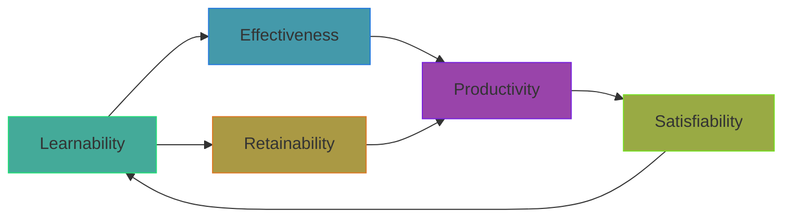

import RevealJS, { Slide } from '@site/src/components/RevealJS';
import Img from '@site/src/components/Img';

<RevealJS transition="slide">

{/* ============================================ */}
{/* COVER IMAGE */}
{/* ============================================ */}

<Slide>
  

<aside className="notes">
**Lecture overview:**
- **Total time:** ~55 minutes
- **Prerequisites:** Students understand requirements analysis (L9), domain modeling (L12)
- **Connects to:** User-centered design (next lecture), Safety and Reliability (L35)

**Structure:**
- Arc 1: Why Usability Matters (~15 min) — five aspects, trade-offs
- Arc 2: Mental Models (~5 min) — user expectations
- Arc 3: Stakeholders and Personas (~12 min) — different needs, making trade-offs explicit
- Arc 4: Usability and Safety (~5 min) — human error types
- Arc 5: Evaluating Usability (~5 min) — approaches and trade-offs
- Arc 6: Nielsen's 10 Heuristics (~15 min) — systematic evaluation
- Key Takeaways (~3 min)

**Running example:** SceneItAll IoT/smarthome control platform (familiar from L2, L8, L9)

**Narrative spine:** There's a gap between software that *works* and software people *want to use*. This lecture gives students the vocabulary (five aspects), the mindset (personas and trade-offs), and the tools (Nielsen's heuristics) to close that gap.

> **Transition:** Let's start with the learning objectives...
</aside>

</Slide>

{/* ============================================ */}
{/* TITLE SLIDE */}
{/* ============================================ */}

<Slide>

# CS 3100: Program Design and Implementation II

## Lecture 24: Usability

<p style={{marginTop: '2em', fontSize: '0.8em', color: '#666'}}>
  &copy;2026 Jonathan Bell, CC-BY-SA
</p>

<aside className="notes">
**Context from previous lectures:**
- L9: Requirements analysis — we learned to identify stakeholders and their needs
- L12: Domain modeling — we learned to structure our understanding of the problem
- Today: We ask — can users actually *use* what we build?

**Key theme:** Technical correctness is table stakes. Usability determines whether anyone actually wants to use your software.

> **Transition:** Here's what you'll be able to do after today...
</aside>

</Slide>

{/* ============================================ */}
{/* LEARNING OBJECTIVES */}
{/* ============================================ */}

<Slide>

## Learning Objectives

<p style={{fontSize: '0.85em', textAlign: 'left'}}>
After this lecture, you will be able to:
</p>

<ol style={{fontSize: '0.75em', textAlign: 'left'}}>
  <li>Define usability and describe the five key aspects of usability</li>
  <li>Identify stakeholders and their usability concerns</li>
  <li>Create personas to make design trade-offs explicit</li>
  <li>Recognize the relationship between usability and safety</li>
  <li>Apply Nielsen's 10 Usability Heuristics to evaluate an interface</li>
</ol>

<aside className="notes">
**Time allocation:**
- Objective 1: Five aspects of usability (~15 min)
- Objective 2-3: Stakeholders and personas (~12 min)
- Objective 4: Usability and safety (~5 min)
- Objective 5: Nielsen's heuristics (~15 min)

**Why this matters:** Most software projects don't fail because of bugs — they fail because users can't figure out how to use them, or hate using them.

> **Transition:** Let's start with a fundamental question...
</aside>

</Slide>

{/* ============================================ */}
{/* ARC 1: WHY USABILITY MATTERS (~15 min) */}
{/* ============================================ */}

<Slide>

## Working Software Is Table Stakes — Usable Software Wins Users


<aside className="notes">
**The key insight:**
- You can build software that passes every test, implements every requirement, and never crashes
- And still end up with software that users hate, avoid, or misuse

**SceneItAll example:**
- Technically: all device commands work, state syncs correctly, scenes execute
- But if users can't figure out how to turn off their living room lights, they'll use the physical switch instead

**Connection to L9:**
- In requirements analysis, we identified *who* the users are
- Now we ask: can they actually *use* what we build?

> **Transition:** Let's define usability more precisely...
</aside>

</Slide>

<Slide>

## Usability Measures How Well Software Serves Humans Achieving Their Goals

<p style={{fontSize: '0.9em'}}>
<strong>Usability</strong> is a measure of how well an artifact (software, device, interface) supports humans in achieving their goals.
</p>

<p style={{fontSize: '0.85em', marginTop: '1em'}}>
It's not a single property but rather a collection of related qualities:
</p>

<ul style={{fontSize: '0.8em'}}>
  <li>Can users figure out how to use it?</li>
  <li>Can they accomplish their actual tasks?</li>
  <li>How much effort does it take?</li>
  <li>Will they remember how to use it later?</li>
  <li>Do they enjoy the experience?</li>
</ul>

<p style={{fontSize: '0.85em', marginTop: '1em', fontWeight: 'bold', color: '#9370DB'}}>
Connection to L9: We identified stakeholders and their needs. Usability asks: can they actually meet those needs using our software?
</p>

<aside className="notes">
**Definition unpacked:**
- "Supports humans" — not just technically correct, but human-centered
- "Achieving their goals" — users have purposes; software should serve those purposes
- "Collection of qualities" — not a single metric, but multiple aspects

**The questions preview the five aspects we'll cover next.**

> **Transition:** Let's break down these five aspects...
</aside>

</Slide>

<Slide>

## The Five Aspects of Usability Are Distinct But Interconnected



<div style={{fontSize: '0.75em', marginTop: '0.5em'}}>

| Aspect | Question |
|--------|----------|
| **Learnability** | How easy is it for users to accomplish tasks the *first time*? |
| **Effectiveness** | Can users *successfully complete* their intended tasks? |
| **Productivity** | How *efficiently* can users accomplish tasks once learned? |
| **Retainability** | How well do users *maintain proficiency* over time? |
| **Satisfiability** | How *pleasant* is the experience of using the system? |

</div>

<aside className="notes">
**The five aspects:**
- Each captures a different dimension of usability
- They reinforce each other (learnable → retainable → productive → satisfying)
- But they can also conflict (we'll see trade-offs shortly)

**Mental model for students:**
- Think of these as five different "grades" you could give an interface
- A system could score high on some and low on others

> **Transition:** Let's examine each aspect with SceneItAll examples...
</aside>

</Slide>

<Slide>

## Learnability: First-Time Success Builds User Confidence

<p style={{fontSize: '0.9em', fontWeight: 'bold', color: '#4a9'}}>
How easy is it for users to accomplish tasks the first time they encounter the system?
</p>

<p style={{fontSize: '0.85em', marginTop: '1em'}}>
<strong>SceneItAll test:</strong> Can a new user figure out how to turn off all the living room lights without a tutorial?
</p>

<ul style={{fontSize: '0.8em', marginTop: '0.5em'}}>
  <li>High learnability: User opens app, sees "Living Room", taps it, sees light controls, adjusts them</li>
  <li>Low learnability: User opens app, sees "Area Hierarchy Browser", doesn't know where to start</li>
</ul>

<p style={{fontSize: '0.85em', marginTop: '1em'}}>
Learnability depends heavily on <strong>mental models</strong> — how well the interface matches users' existing understanding of how things work.
</p>

<aside className="notes">
**Key insight:**
- First impressions matter enormously
- Users who fail early may never try again
- Learnability is about matching user expectations

**Connection to domain modeling (L12):**
- If our domain model uses "Area" but users think "Room", there's a mismatch
- Domain vocabulary should align with user vocabulary

**Mental models preview:**
- We'll cover this more shortly when we discuss mental models
- Users bring expectations from physical world and other apps

> **Transition:** Once users learn the basics, can they actually accomplish their goals?
</aside>

</Slide>

<Slide>

## Effectiveness: Users Must Actually Achieve Their Goals

<p style={{fontSize: '0.9em', fontWeight: 'bold', color: '#49a'}}>
Can users successfully complete their intended tasks?
</p>

<p style={{fontSize: '0.85em', marginTop: '1em'}}>
<strong>SceneItAll test:</strong> Can users actually create a "Movie Night" scene that dims lights, closes shades, and sets the fan to low?
</p>

<ul style={{fontSize: '0.8em', marginTop: '0.5em'}}>
  <li><strong>Working ≠ Discoverable:</strong> The feature might exist, but can users find it?</li>
  <li><strong>Attempted ≠ Completed:</strong> Users might try but fail at some step</li>
  <li><strong>Completed ≠ Correct:</strong> Users might think they succeeded but actually didn't</li>
</ul>

<p style={{fontSize: '0.85em', marginTop: '1em', color: '#FF9800'}}>
⚠ It's surprisingly easy to build interfaces where users *think* they've completed a task but haven't.
</p>

<aside className="notes">
**The distinctions matter:**
- Feature exists but hidden → discoverability problem
- User tries but gets stuck → workflow problem
- User thinks done but isn't → feedback problem

**SceneItAll example:**
- User creates a scene, saves it, but it never runs
- Why? They didn't realize they also needed to *schedule* it or *assign* it to a button
- The system "worked" but the user failed

**Connection to L9:**
- Requirements might say "users can create scenes"
- Effectiveness asks: do users *actually* create scenes successfully?

> **Transition:** Once effective, how much effort does ongoing use require?
</aside>

</Slide>

<Slide>

## Productivity: Ongoing Cost of Using the System


<p style={{fontSize: '0.85em', marginTop: '0.5em', fontWeight: 'bold', color: '#94a'}}>
Same outcome. Vastly different effort. Both are *effective*, but only one is *productive*.
</p>

<aside className="notes">
**Productivity vs. Effectiveness:**
- Effectiveness: Can you do it at all?
- Productivity: How much time/effort does it take?

**Why productivity matters:**
- Users do tasks repeatedly
- Small inefficiencies compound into major frustrations
- Productive systems "disappear" — users focus on goals, not the tool

**Design implications:**
- Shortcuts for common operations
- Batch operations for repetitive tasks
- Predictive/smart defaults

> **Transition:** But users don't interact constantly...
</aside>

</Slide>

<Slide>

## Retainability: Users Should Pick Up Where They Left Off Months Later

<p style={{fontSize: '0.9em', fontWeight: 'bold', color: '#a94'}}>
How well do users maintain their proficiency over time?
</p>

<p style={{fontSize: '0.85em', marginTop: '1em'}}>
Users don't interact with most software constantly. They learn it, then come back days, weeks, or months later.
</p>

<ul style={{fontSize: '0.8em', marginTop: '0.5em'}}>
  <li><strong>SceneItAll guests:</strong> Visit once, come back next holiday — can they still turn on lights?</li>
  <li><strong>Seasonal features:</strong> User sets up holiday lighting in December, wants to adjust it next December</li>
  <li><strong>Rare operations:</strong> Adding a new device happens infrequently but shouldn't require re-learning</li>
</ul>

<p style={{fontSize: '0.85em', marginTop: '1em'}}>
Retainability is closely tied to learnability — interfaces that match natural mental models are easier to both learn and remember.
</p>

<aside className="notes">
**The challenge:**
- Most users are "occasional" users of most features
- Muscle memory fades; abstract procedures are forgotten
- Users shouldn't need to re-learn every time

**Design implications:**
- Consistent patterns reduce memory burden
- Visual cues help recognition (vs. recall)
- Good structure mirrors how users think about tasks

**Connection to mental models:**
- If the interface matches how users naturally think, it's easier to remember
- If it's arbitrary or technical, users forget the arbitrary mappings

> **Transition:** Finally, how do users *feel* about using it?
</aside>

</Slide>

<Slide>

## Satisfiability: Emotional Response Determines Whether Users Return

<p style={{fontSize: '0.9em', fontWeight: 'bold', color: '#9a4'}}>
How pleasant is the experience of using the system?
</p>

<p style={{fontSize: '0.85em', marginTop: '1em'}}>
This might seem "soft" compared to the other aspects, but it matters enormously:
</p>

<ul style={{fontSize: '0.8em', marginTop: '0.5em'}}>
  <li>Users who find SceneItAll <strong>satisfying</strong> explore automation features and forgive occasional connectivity issues</li>
  <li>Users who find it <strong>frustrating</strong> abandon it and use physical switches</li>
  <li>Satisfying experiences lead to recommendations; frustrating ones lead to negative reviews</li>
</ul>

<p style={{fontSize: '0.85em', marginTop: '1em'}}>
Do users feel confident and in control, or frustrated and confused?
</p>

<aside className="notes">
**Why satisfaction matters:**
- Satisfied users use more features → more value
- Satisfied users forgive occasional problems
- Satisfied users recommend to others
- Frustrated users abandon at first opportunity

**Satisfaction is holistic:**
- Combines all the other aspects
- But also includes aesthetics, responsiveness, delight
- Small touches matter (animations, feedback, polish)

**The test:**
- Would users *choose* to use this if they had alternatives?
- Do they dread or enjoy opening the app?

> **Transition:** These aspects don't always align...
</aside>

</Slide>

<Slide>

## Design Decisions Create Trade-offs Between Usability Aspects

<div style={{fontSize: '0.75em'}}>

| Design Decision | Helps | Hurts |
|-----------------|-------|-------|
| Add detailed onboarding tutorial | Learnability | Satisfiability (impatient users skip or resent) |
| Provide voice command shortcuts | Productivity | Learnability (more features to discover) |
| Show all device options on one screen | Productivity (fewer navigations) | Learnability (overwhelming for beginners) |
| Use custom creative scene icons | Satisfiability (personal, distinctive) | Learnability (unfamiliar symbols) |

</div>

<p style={{fontSize: '0.85em', marginTop: '1em', fontWeight: 'bold', color: '#9370DB'}}>
Good usability design requires understanding which aspects matter most for *your users* and *your context*.
</p>

<aside className="notes">
**The fundamental tension:**
- You can't maximize everything
- Design is about trade-offs
- Different users have different priorities

**Examples unpacked:**
- Tutorial: Great for confused newbies, annoying for tech-savvy users
- Voice shortcuts: Power users love them, but new users don't know to try
- Dense screens: Experts want everything visible, beginners get lost

**The question becomes:**
- Who are we designing for?
- Which trade-offs are right for them?
- This leads us to personas (coming up next)

> **Transition:** Here's a concrete example of trade-offs...
</aside>

</Slide>

<Slide>

## CLI vs. GUI: Neither Is Universal — Context Determines the Right Choice

<div style={{display: 'grid', gridTemplateColumns: '1fr 1fr', gap: '1em', fontSize: '0.7em'}}>

<div style={{backgroundColor: 'rgba(100,150,255,0.1)', padding: '0.5em', borderRadius: '8px'}}>

**Command-Line Interface**

```
> sceneitall set living-room lights 50%
Living room lights set to 50%
> sceneitall activate "Movie Night"
Activating scene: Movie Night...
```

| Aspect | Rating |
|--------|--------|
| Learnability | Low (must learn commands) |
| Effectiveness | High (if you know commands) |
| Productivity | Very high (for experts) |
| Retainability | Low (forget syntax) |
| Satisfiability | Varies (some love CLIs) |

</div>

<div style={{backgroundColor: 'rgba(147,112,219,0.15)', padding: '0.5em', borderRadius: '8px'}}>

**Graphical Interface**

Visual room layout with sliders, buttons, and scene cards

| Aspect | Rating |
|--------|--------|
| Learnability | High (visual, explorable) |
| Effectiveness | High (guided interactions) |
| Productivity | Medium (more clicks) |
| Retainability | High (visual cues) |
| Satisfiability | Generally higher |

</div>

</div>

<p style={{fontSize: '0.8em', marginTop: '0.5em', color: '#9370DB'}}>
Neither is "better" — it depends on who's using it and for what.
</p>

<aside className="notes">
**The lesson:**
- Tech-savvy homeowner managing 50 devices might prefer CLI
- Visiting grandparent just wants to turn on lights
- Same system, different interfaces for different users

**Design implication:**
- Maybe provide both?
- GUI as default, CLI for power users
- This is an example of *flexibility* (Nielsen H7)

**Connection to Lab 9:**
- Students worked with SceneItAll CLI
- They've experienced both sides of this trade-off

> **Transition:** Much of usability depends on matching user expectations...
</aside>

</Slide>

{/* ============================================ */}
{/* ARC 2: MENTAL MODELS (~5 min) */}
{/* ============================================ */}

<Slide>

## Usability Problems Arise When System Behavior Diverges From User Expectations

 Living Room > Reading Nook). When tapping 'All Lights Off' on Living Room, User 1 expects only Living Room affected, User 2 expects cascade up to Downstairs, User 3 expects cascade down to Reading Nook. All reasonable but contradictory."
/>

<p style={{fontSize: '0.85em', marginTop: '0.5em'}}>
Whatever SceneItAll <em>actually</em> does, it violates <em>someone's</em> mental model.
</p>

<aside className="notes">
**The fundamental problem:**
- Different users bring different expectations about hierarchy behavior
- All three mental models are reasonable based on prior experience:
  - User 1: "All Lights Off" means this room only — most specific interpretation
  - User 2: Parent areas should include children, so turning off Downstairs means Living Room too
  - User 3: "All" means everything below this point in the hierarchy
- Each user has seen apps that work each of these ways!

**Design dilemma:**
- You can only pick one actual behavior
- Some users will be surprised/confused no matter what you choose
- This is why usability is hard — it's not about finding the "right" answer

> **Transition:** So what can we do about this?
</aside>

</Slide>

<Slide>

## Good Design Either Matches Mental Models or Makes Actual Behavior Visible

<div style={{fontSize: '0.85em'}}>

**Strategy 1: Match the most common mental model**
- Research which expectation is most prevalent
- Design behavior to match that expectation
- Accept some users will need to adjust

**Strategy 2: Make actual behavior clearly visible**
- Show cascade indicators: "This will affect 3 other areas"
- Preview affected devices before confirming
- Use animations that reveal what's happening

**Strategy 3: Both**
- Choose sensible defaults that match common expectations
- AND provide clear feedback about what's happening

</div>

<p style={{fontSize: '0.85em', marginTop: '1em', fontWeight: 'bold', color: '#9370DB'}}>
When you can't match expectations, at least don't surprise users silently.
</p>

<aside className="notes">
**Strategy 1 example:**
- If 80% of users expect "edit Living Room only affects Living Room", do that
- The 20% who expected cascade can learn

**Strategy 2 example:**
- When user edits Living Room, show: "✓ Living Room (editing) | Downstairs (unchanged)"
- Now even users with different mental models understand what's happening

**Strategy 3 is best:**
- Defaults match common expectations
- But interface always shows what's actually happening
- No invisible side effects

**Connection to L12:**
- Domain modeling helps us understand the *system's* model
- Mental models are the *users'* model
- Usability is aligning these two

> **Transition:** Different users have different mental models because they have different backgrounds and needs...
</aside>

</Slide>

{/* ============================================ */}
{/* ARC 3: STAKEHOLDERS AND PERSONAS (~12 min) */}
{/* ============================================ */}

<Slide>

## Different Stakeholders Prioritize the Five Aspects Differently

<p style={{fontSize: '0.9em'}}>
Remember from L9: stakeholders are anyone who affects or is affected by the system.
</p>

<ul style={{fontSize: '0.8em', marginTop: '0.5em'}}>
  <li><strong>Direct stakeholders:</strong> Actually use the system (homeowners, family, guests)</li>
  <li><strong>Indirect stakeholders:</strong> Affected without using it (neighbors, utility companies)</li>
</ul>

<p style={{fontSize: '0.85em', marginTop: '1em'}}>
Different stakeholders care about different usability aspects:
</p>

<ul style={{fontSize: '0.8em'}}>
  <li>Daily power users → Productivity, Satisfiability</li>
  <li>Occasional users → Learnability, Retainability</li>
  <li>First-time users → Learnability, Effectiveness</li>
</ul>

<aside className="notes">
**Connection to L9:**
- We already identified stakeholder categories
- Now we analyze *which usability aspects* each category cares about most
- This drives design decisions

**Example:**
- Power user: "Don't make me click through 5 screens to do something I do every day"
- Guest: "I just want to turn on the bathroom light without breaking anything"
- Installer: "I need to configure 50 devices efficiently, not click pretty buttons"

**The insight:**
- You can't make everyone equally happy
- But you can make intentional choices about priorities

> **Transition:** Let's map SceneItAll stakeholders to their usability concerns...
</aside>

</Slide>

<Slide>

## SceneItAll Stakeholders Have Distinct Usability Concerns

<div style={{fontSize: '0.75em'}}>

| Stakeholder | Usage Pattern | Usability Priorities |
|-------------|---------------|---------------------|
| **Primary owner** | Daily, 10+ times | Productivity, Satisfiability |
| **Family members** | Daily, didn't choose system | Learnability, Effectiveness |
| **Guests** | Occasional (holidays) | Learnability, Retainability |
| **Installer** | One-time configuration | Effectiveness, Productivity |
| **Neighbors** | Indirect (affected by outdoor lights) | Safety implications |

</div>

<p style={{fontSize: '0.85em', marginTop: '1em', color: '#9370DB'}}>
Same system, same features — but each stakeholder cares about different aspects.
</p>

<aside className="notes">
**Stakeholder breakdown:**

**Primary owner (daily):**
- Uses app constantly, wants maximum productivity
- Cares about satisfiability because they chose this system
- Priority: "Make common operations fast"

**Family members (daily):**
- Didn't choose the system but must live with it
- Need things to work reliably without deep knowledge
- Priority: "Don't make me feel stupid"

**Guests (occasional):**
- Visit once, then months later
- Must figure out basics quickly and remember them next time
- Priority: "Intuitive for strangers"

**Installer (professional):**
- Configures system once, needs efficiency
- Effectiveness matters — must complete setup correctly
- Priority: "Don't waste my time"

**Neighbors (indirect):**
- Affected by outdoor lights, security system behavior
- Can't use the app, but impacted by its usability failures
- Priority: Usability problems shouldn't create safety/nuisance issues

> **Transition:** These stakeholders are still pretty abstract. Let's make them more concrete...
</aside>

</Slide>

<Slide>

## Personas Make Abstract Stakeholders Concrete and Memorable

<p style={{fontSize: '0.9em'}}>
<strong>Persona:</strong> A fictional but realistic description of a typical user, based on research about real users.
</p>

<div style={{fontSize: '0.8em', marginTop: '1em'}}>

**Why personas help:**

- Force explicit decisions about who you're designing for
- Make trade-off discussions concrete ("Would Marcus find this useful?")
- Prevent designing for yourself or an imaginary "average user"
- Create shared reference point across the team

</div>

<p style={{fontSize: '0.85em', marginTop: '1em', color: '#9370DB'}}>
Instead of "users might want...", we can say "Marcus needs... but Dorothy needs..."
</p>

<aside className="notes">
**Why not just use stakeholder categories?**
- "Occasional user" is abstract — hard to reason about
- "Dorothy, Marcus's 72-year-old mother visiting for the holidays" is concrete
- You can imagine Dorothy's reactions, frustrations, needs

**Based on research:**
- Good personas come from user research, interviews, data
- Not made up out of thin air
- But even educated personas are better than no personas

**Team alignment:**
- Everyone knows who Marcus and Dorothy are
- Discussions become "Would Dorothy find this confusing?" not "Some users might..."
- Prevents designing for developers' mental models

> **Transition:** Let's meet some SceneItAll personas...
</aside>

</Slide>

<Slide>

## SceneItAll Personas: Marcus and Dorothy


<p style={{fontSize: '0.85em', marginTop: '0.5em', color: '#9370DB'}}>
Same app. Same functionality. Vastly different needs.
</p>

<aside className="notes">
**Marcus represents:**
- Power users who invested in the ecosystem
- Users who want depth and control
- Users who will read documentation (maybe)

**Dorothy represents:**
- Occasional users who didn't choose the system
- Users who want simplicity above all
- Users who will give up if confused

**The tension:**
- Features Marcus loves (automations, rules, shortcuts) overwhelm Dorothy
- Simplicity Dorothy needs (big buttons, limited options) frustrates Marcus

**Design questions:**
- Can we serve both?
- How do we decide which needs win when they conflict?

> **Transition:** Let's see how personas help us make trade-off decisions...
</aside>

</Slide>

<Slide>

## Personas Reveal Which Trade-offs Matter

<div style={{fontSize: '0.75em'}}>

| Design Decision | Marcus | Dorothy |
|-----------------|--------|---------|
| Add onboarding tutorial | Skip it (wastes time) | Needs it (can't figure out otherwise) |
| Expose automation rules | Essential feature | Hidden complexity (confusing) |
| Voice command shortcuts | Daily use, loves them | Confusing ("what do I say?") |
| Simple big buttons | "Childish, wastes space" | Accessible, easy to tap |
| Nested area hierarchy | Powerful organization | "Where is the guest room??" |

</div>

<p style={{fontSize: '0.85em', marginTop: '1em', fontWeight: 'bold', color: '#9370DB'}}>
You can't optimize for everyone. Personas force you to choose primary users and make intentional trade-offs.
</p>

<p style={{fontSize: '0.8em', marginTop: '0.5em'}}>
<strong>Connection to L9:</strong> Remember stakeholder analysis? Personas are the usability-focused refinement of that work.
</p>

<aside className="notes">
**Key insight:**
- The trade-offs are real and unavoidable
- But with personas, they're *explicit* and *intentional*
- "We chose to optimize for Marcus at the expense of Dorothy" is honest
- "We tried to make everyone happy" usually makes no one happy

**How to use this:**
- Define primary persona (who are we really designing for?)
- Secondary personas (we'll try to accommodate if we can)
- Anti-personas (explicitly not designing for, and that's okay)

**SceneItAll example:**
- Primary: Marcus (power users who chose the system)
- Secondary: Dorothy (guests, occasional users)
- Decision: Default to simple mode, with easy access to power features

> **Transition:** Can we actually serve both personas?
</aside>

</Slide>

<Slide>

## Design Flexibility Can Serve Multiple Personas


<p style={{fontSize: '0.85em', marginTop: '0.5em', fontWeight: 'bold', color: '#9370DB'}}>
Good design often means designing *multiple experiences* within one product.
</p>

<aside className="notes">
**Progressive disclosure:**
- Show simple options by default
- More appears as users drill down
- Experts find what they need; novices aren't overwhelmed

**Guest mode example:**
- Marcus adds Dorothy's phone with guest permissions
- Dorothy's app shows: Living Room, Kitchen, Guest Room, Bathroom
- Big "Lights On/Off" buttons, nothing else
- Marcus's app shows all 50 devices, automations, schedules, etc.

**Connection to L9:**
- Requirements revealed different user types
- Now we design interfaces that serve each type appropriately

**Trade-off:**
- Flexibility adds complexity to implementation
- But it's often the right answer when personas have conflicting needs

> **Transition:** Let's shift to a more serious topic — when usability has safety implications...
</aside>

</Slide>

{/* ============================================ */}
{/* ARC 4: USABILITY AND SAFETY (~5 min) */}
{/* ============================================ */}

<Slide>

## Poor Usability Increases Human Error Probability


<aside className="notes">
**Three types of human error:**

**Slips:**
- User intended to do the right thing
- But executed the wrong action (motor error)
- Finger slipped, clicked wrong button
- Made worse by: small targets, adjacent similar buttons

**Lapses:**
- User forgot something
- Interrupted mid-task, never completed
- Forgot to save, forgot step in process
- Made worse by: long multi-step processes, no progress indicators

**Mistakes:**
- User intentionally did the "wrong" thing
- But their mental model was wrong
- They thought they understood, but didn't
- Made worse by: confusing terminology, hidden side effects

**Design implications:**
- Slips: Make targets bigger, separate dangerous buttons
- Lapses: Save state, remind users of incomplete tasks
- Mistakes: Match mental models, make behavior visible

> **Transition:** Why does this matter for a smart home app?
</aside>

</Slide>

<Slide>

## Usability Problems Create Real Safety Risks

<div style={{fontSize: '0.8em'}}>

**Safety isn't just physical — usability failures can cause many kinds of harm:**

| Category | SceneItAll Example | Broader Examples |
|----------|-------------------|------------------|
| **Physical** | Stairway lights off while someone's on stairs | Medical device misconfiguration |
| **Security** | Outdoor lights "always off" creates vulnerability | Accidentally sharing credentials |
| **Privacy** | Guest can see all family schedules | Unintended data exposure |
| **Financial** | Accidental bulk purchase of smart bulbs | Wrong billing settings |
| **Operational** | Disabling smoke detector integration | Corrupting critical data |

</div>

<p style={{fontSize: '0.85em', marginTop: '0.5em', color: '#FF9800'}}>
⚠ The same usability failures (slips, lapses, mistakes) that cause minor annoyance in most apps can cause real harm here.
</p>

<aside className="notes">
**The escalation:**
- Traditional software: Usability failure → user frustration
- Software with real-world effects: Usability failure → actual consequences

**Safety is broader than physical:**
- Security: Accidentally exposing access, disabling protections
- Privacy: Unintended data sharing, visibility to wrong users
- Financial: Accidental purchases, subscription changes, billing errors
- Operational: Data loss, system corruption, service disruption

**Design responsibilities:**
- Safety-critical actions need confirmation
- Dangerous operations should be hard to do accidentally
- Undo should be available for reversible operations

> **Transition:** This is a preview of a later lecture...
</aside>

</Slide>

<Slide>

## Safety Requirements Hide in Usability Problems

<p style={{fontSize: '0.9em'}}>
Many "usability" issues are actually <strong>safety requirements</strong> that weren't identified:
</p>

<ul style={{fontSize: '0.8em', marginTop: '0.5em'}}>
  <li>"Confirm before locking all doors" — usability enhancement or safety requirement?</li>
  <li>"Show who is home before activating Away mode" — convenience or preventing lockout?</li>
  <li>"Require re-authentication to share access" — friction or security protection?</li>
</ul>

<p style={{fontSize: '0.85em', marginTop: '1em'}}>
<strong>Forward reference:</strong> We'll return to safety-critical systems in L35 (Safety and Reliability).
</p>

<aside className="notes">
**The insight:**
- Requirements analysis (L9) should have caught these
- But safety requirements often hide until we think about usability
- "What could go wrong if a user misunderstands?" reveals safety needs

**For SceneItAll:**
- What happens if user misunderstands a scene's effects?
- What happens if user accidentally shares access with wrong person?
- What happens if user forgets app is still in "Away" mode?

**Preview of L35:**
- Safety-critical systems require special design approaches
- Defense in depth, fail-safe defaults, confirmation for dangerous actions
- Usability analysis helps identify where safety features are needed

> **Transition:** Now let's talk about how we evaluate usability systematically...
</aside>

</Slide>

{/* ============================================ */}
{/* ARC 5: EVALUATING USABILITY (~5 min) */}
{/* ============================================ */}

<Slide>

## The Usability Evaluation Dilemma: Best Evidence Comes Late


<aside className="notes">
**The fundamental trade-off:**
- Early evaluation: Cheap to change, but feedback is lower quality
- Late evaluation: High-quality feedback, but expensive to change

**Why it's a dilemma:**
- The best way to know if users can use your software is to watch them use it
- But by the time you have working software, changes are expensive
- Paper prototypes are cheap to change, but users react differently to real apps

**Sweet spots:**
- Clickable prototypes: Real enough to test, cheap enough to change
- Lab studies with mockups: Controlled observation, moderate cost
- Heuristic evaluation: Expert review, no users needed

> **Transition:** Let's look at the three main approaches...
</aside>

</Slide>

<Slide>

## Three Approaches to Usability Evaluation

<div style={{fontSize: '0.8em'}}>

**1. User Studies and Usability Testing**
- Watch real users try to accomplish tasks
- "Set up a Movie Night scene in SceneItAll" while observing
- Gold standard but expensive (recruitment, compensation, time)

**2. Surveys and Feedback Mechanisms**
- App store reviews, in-app feedback buttons, post-task surveys
- Large sample sizes, real usage context
- But self-reported; users may not know why they struggled

**3. Heuristic Evaluation (Expert Review)**
- Experts evaluate interface against established principles
- No user recruitment needed; can be done on prototypes
- Today's focus: Nielsen's 10 heuristics

</div>

<p style={{fontSize: '0.8em', marginTop: '0.5em', color: '#9370DB'}}>
<strong>Connection to L9:</strong> Similar trade-offs to requirements elicitation methods (interviews vs. surveys vs. observation).
</p>

<aside className="notes">
**User studies:**
- Most direct evidence
- Watch confusion in real-time
- But: expensive, time-consuming, small samples

**Surveys/feedback:**
- Easy to collect at scale
- Real users, real context
- But: self-reported, no observation of struggle

**Heuristic evaluation:**
- Experts apply principles systematically
- Can do early, on paper prototypes
- But: experts might miss things real users encounter

**Common approach:**
- Heuristic evaluation early and often (cheap)
- User testing at key milestones (validate assumptions)
- Ongoing feedback collection (track real-world issues)

> **Transition:** Let's focus on heuristic evaluation...
</aside>

</Slide>

<Slide>

## Heuristic Evaluation: Expert Review Without User Recruitment

<p style={{fontSize: '0.9em'}}>
<strong>Heuristic evaluation</strong> is a method where experts systematically check an interface against established usability principles.
</p>

<div style={{fontSize: '0.85em', marginTop: '1em'}}>

**Advantages:**
- Can be done early (on wireframes, prototypes)
- No user recruitment or scheduling
- Relatively fast and inexpensive
- Finds many common problems

**Limitations:**
- Experts aren't real users — may miss domain-specific issues
- Different experts find different problems
- Doesn't reveal *how severe* problems are for real users

</div>

<p style={{fontSize: '0.85em', marginTop: '1em', fontWeight: 'bold', color: '#9370DB'}}>
Today's focus: Nielsen's 10 Usability Heuristics — a 30-year-old framework that remains remarkably effective.
</p>

<aside className="notes">
**Why heuristics?**
- You can start evaluating immediately
- Don't need working software
- Paper prototype → apply heuristics → find problems → fix → iterate

**Research backing:**
- Nielsen found 3-5 evaluators catch ~75% of usability problems
- Each evaluator finds different subset
- Multiple evaluators provide coverage

**Our approach:**
- Learn the heuristics (coming up next)
- Apply them to SceneItAll examples
- Gives you a checklist for your own projects

> **Transition:** Let's dive into Nielsen's 10 heuristics...
</aside>

</Slide>

{/* ============================================ */}
{/* ARC 6: NIELSEN'S 10 USABILITY HEURISTICS (~15 min) */}
{/* ============================================ */}

<Slide>

## Nielsen's Heuristics: A 30-Year-Old Checklist That Still Works

<div style={{fontSize: '0.75em', columnCount: 2, columnGap: '1em'}}>

**H1:** Visibility of system status

**H2:** Match between system and real world

**H3:** User control and freedom

**H4:** Consistency and standards

**H5:** Error prevention

**H6:** Recognition rather than recall

**H7:** Flexibility and efficiency of use

**H8:** Aesthetic and minimalist design

**H9:** Help users recognize, diagnose, and recover from errors

**H10:** Help and documentation

</div>

<p style={{fontSize: '0.85em', marginTop: '1em'}}>
Developed in the 1990s by Jakob Nielsen, these heuristics capture recurring patterns in usability problems. Their relevance to modern apps (including mobile, IoT, voice interfaces) is a testament to the stability of human cognitive factors.
</p>

<aside className="notes">
**Why these still work:**
- Based on how humans think, not specific technologies
- Humans haven't changed since the 1990s
- The same cognitive limitations apply to modern interfaces

**How to use them:**
- Systematic checklist for evaluation
- Go through each heuristic, ask: "Does our interface violate this?"
- Document specific violations, not just "yes/no"

**Overlap:**
- The heuristics aren't perfectly independent
- A problem might violate multiple heuristics
- That's okay — use them as a framework, not a taxonomy

> **Transition:** Let's examine each heuristic with SceneItAll examples...
</aside>

</Slide>

<Slide>

## H1: Keep Users Informed About What Is Happening


<p style={{fontSize: '0.85em', marginTop: '0.5em'}}>
<strong>The system should always keep users informed</strong> about what is going on, through appropriate feedback within reasonable time.
</p>

<aside className="notes">
**Why this matters:**
- Users can't see inside the system
- Without feedback, they assume the worst (broken, frozen, lost data)
- Good feedback builds confidence and trust

**SceneItAll specifics:**
- IoT devices have real latency (network, device processing)
- Users need to know: Is it working? Which devices responded? Any failures?
- Progress indicators are essential for multi-device operations

**Common violations:**
- No loading indicators during network operations
- No confirmation after save/submit
- No progress for long-running operations

> **Transition:** Good feedback uses user language, not developer language...
</aside>

</Slide>

<Slide>

## H2: Speak the Users' Language, Not Developer Language


<aside className="notes">
**The principle:**
- Use words, phrases, and concepts familiar to users
- Follow real-world conventions
- Information should appear in natural, logical order

**Why developers mess this up:**
- We think in terms of our implementation
- DeviceStateManager makes perfect sense to us
- But users think about "lights" and "rooms"

**Domain modeling connection (L12):**
- Good domain models use ubiquitous language
- If your model says "LightEntity", your UI probably does too
- Fix the model vocabulary, fix the UI vocabulary

**SceneItAll example:**
- "brightness=127" is implementation (0-255 range)
- "50%" is user-understandable
- Same information, different framing

> **Transition:** Users also need clear escape routes...
</aside>

</Slide>

<Slide>

## H3: Provide Clear Emergency Exits

<div style={{fontSize: '0.85em'}}>

Users often choose system functions by mistake and need a clearly marked "emergency exit" to leave the unwanted state.

**SceneItAll applications:**

- **"All Lights On" panic button** when a scene goes wrong and everything's dark
- **Undo for accidental scene deletions** — don't permanently destroy user work
- **Cancel during long operations** — stop mid-execution if something's wrong
- **Easy mode switching** — stuck in advanced view? Clear path back to simple mode

</div>

<p style={{fontSize: '0.85em', marginTop: '1em', color: '#9370DB'}}>
<strong>Connection to L12:</strong> Did our domain model capture "deleted" scenes as recoverable or truly destroyed? This is a design decision with usability implications.
</p>

<aside className="notes">
**Why emergency exits matter:**
- Users explore by trying things
- If mistakes are costly, users become afraid to explore
- Confident users try more features → better productivity

**Two types of exits:**
- Undo: Reverse what just happened
- Cancel: Stop something in progress

**Implementation questions:**
- How do we implement undo? (State history, soft deletes)
- How long should undo be available? (Session? Forever?)
- What can't be undone? (External effects — already-fired device commands)

**SceneItAll challenge:**
- Can't "undo" a light that already turned on
- But can restore deleted scenes, undo schedule changes, etc.

> **Transition:** Consistency makes emergency exits (and everything else) more discoverable...
</aside>

</Slide>

<Slide>

## H4: Consistency Builds Trust and Reduces Cognitive Load

<div style={{fontSize: '0.85em'}}>

Users should not have to wonder whether different words, situations, or actions mean the same thing.

**SceneItAll consistency requirements:**

- **Tapping a device should always show its controls**, everywhere in the app
- **Same gestures for same actions** — swipe to dismiss, long-press for options
- **Consistent terminology** — don't call it "Scene" in one place and "Routine" in another
- **Platform conventions matter** — iOS users expect different patterns than Android users

</div>

<p style={{fontSize: '0.85em', marginTop: '1em'}}>
Consistency is <strong>internal</strong> (within your app) and <strong>external</strong> (with platform norms).
</p>

<aside className="notes">
**Why consistency matters:**
- Reduces what users need to learn
- Builds predictable mental models
- Makes new features easier to discover (patterns transfer)

**Internal consistency:**
- Same action → same result, everywhere
- Same terminology throughout
- Same visual patterns (icons, colors, layout)

**External consistency:**
- Follow platform conventions (iOS vs Android)
- Match common patterns (hamburger menu, swipe to delete)
- Users bring expectations from other apps

**Trade-off:**
- Sometimes consistency conflicts with optimal design for one feature
- Usually, consistency wins (predictability > local optimization)

> **Transition:** Even better than consistent recovery is preventing errors entirely...
</aside>

</Slide>

<Slide>

## H5: Design to Prevent Errors, Not Just Handle Them


<aside className="notes">
**Prevention vs. recovery:**
- H3 (emergency exits) is about recovering from errors
- H5 is about preventing errors from happening at all
- Prevention is always better when possible

**Types of prevention:**
- **Constraints:** Don't allow invalid states (grayed out options)
- **Warnings:** Alert before problematic actions
- **Confirmations:** "Are you sure?" for destructive actions
- **Smart defaults:** Pre-fill sensible values

**SceneItAll examples:**
- Can't save scene with no devices (constraint)
- Warning when schedule order seems wrong
- Confirm before deleting scenes with active schedules
- Default brightness to 100% (not 0%)

**Trade-off:**
- Too many warnings → users ignore them
- Reserve warnings for meaningful problems

> **Transition:** Another way to prevent errors is reducing memory burden...
</aside>

</Slide>

<Slide>

## H6: Recognition Over Recall Reduces Memory Burden

<div style={{fontSize: '0.85em'}}>

Minimize the user's memory load by making objects, actions, and options visible. Users should not have to remember information from one part of the interface to another.

**SceneItAll applications:**

- **Show current device states in scene editor**, not just target states
  - "Currently: 75%" when setting brightness — user knows starting point
- **Display which scenes affect which devices**
  - Don't make users remember that "Movie Night" controls living room shades
- **Show recent choices**
  - Last-used scenes, recent devices, common operations

</div>

<p style={{fontSize: '0.85em', marginTop: '1em'}}>
Recognition is easier than recall. Seeing "Living Room" is easier than remembering it.
</p>

<aside className="notes">
**The cognitive principle:**
- Recognition: "Is this the one?" (see options, pick one)
- Recall: "What was that thing?" (generate from memory)
- Recognition is much easier and less error-prone

**Design implications:**
- Show options rather than requiring users to know them
- Display current state alongside controls
- Provide visual cues that remind users what things do

**SceneItAll example:**
- Bad: Empty brightness slider — what's it set to now?
- Good: Slider shows "Currently: 75%" — user has context

**Connection to retainability:**
- Recognition-based interfaces are easier to return to after time away
- Dorothy doesn't have to remember — she recognizes

> **Transition:** But power users need more than recognition...
</aside>

</Slide>

<Slide>

## H7: Flexibility Serves Both Novices and Experts

<div style={{fontSize: '0.85em'}}>

Accelerators — unseen by the novice user — may speed up the interaction for the expert user, allowing the system to cater to both inexperienced and experienced users.

**SceneItAll flexibility spectrum:**

| User Level | Interaction Style |
|------------|-------------------|
| Novice | Tap room → tap device → adjust slider |
| Intermediate | Use scene buttons for common operations |
| Expert | Voice command: "set office lights to 30%" |
| Power user | CLI: `sceneitall set office lights 30%` |

</div>

<p style={{fontSize: '0.85em', marginTop: '1em', color: '#9370DB'}}>
<strong>Connection to earlier:</strong> This is the CLI vs. GUI trade-off — the answer is often "both."
</p>

<aside className="notes">
**Multiple pathways to same goal:**
- All roads lead to "office lights at 30%"
- Different roads for different users
- Novice path is discoverable; expert path is efficient

**Accelerators include:**
- Keyboard shortcuts
- Voice commands
- Gestures
- Automation rules
- CLI access

**Design principle:**
- Don't force experts through novice path
- Don't overwhelm novices with expert features
- Progressive disclosure bridges the gap

**Marcus vs. Dorothy again:**
- Dorothy: Simple path, always available
- Marcus: Fast path, once he learns it

> **Transition:** But more features means more potential clutter...
</aside>

</Slide>

<Slide>

## H8: Every Extra Element Competes for Attention

<div style={{fontSize: '0.85em'}}>

Interfaces should not contain information that is irrelevant or rarely needed. Every extra unit of information competes with the relevant information and diminishes their relative visibility.

**SceneItAll prioritization:**

| **Emphasize** | **De-emphasize** |
|---------------|------------------|
| On/Off toggle | Firmware version |
| Brightness slider | Network address |
| Color picker | Last-updated timestamp |
| Room name | Device ID |

</div>

<p style={{fontSize: '0.85em', marginTop: '1em'}}>
<strong>Minimalist ≠ minimal features.</strong> It means every visible element earns its space by serving user goals.
</p>

<aside className="notes">
**The attention economy:**
- Users have limited attention
- Everything visible competes for that attention
- Important things get lost in visual noise

**Information hierarchy:**
- What do users need most often? (Front and center)
- What do they occasionally need? (One tap away)
- What do they rarely need? (Settings/advanced)

**SceneItAll example:**
- Device screen: 90% of users just want on/off and brightness
- Firmware version matters once a year (during updates)
- Don't give them equal visual weight

**Common violation:**
- Developer dashboards showing everything
- "Power users might want it" → clutter for everyone

> **Transition:** When errors do happen, messages matter...
</aside>

</Slide>

<Slide>

## H9: Error Messages Should Explain Problems and Suggest Solutions

<div style={{display: 'grid', gridTemplateColumns: '1fr 1fr', gap: '1em', fontSize: '0.75em', marginTop: '0.5em'}}>

<div style={{backgroundColor: 'rgba(255,100,100,0.15)', padding: '0.8em', borderRadius: '8px'}}>

**Bad Error Message**

```
DeviceConnectionException: 
timeout at IoTBridge.sendCommand()
line 247
```

- Technical jargon
- No explanation of cause
- No path forward
- Makes user feel stupid

</div>

<div style={{backgroundColor: 'rgba(100,200,100,0.15)', padding: '0.8em', borderRadius: '8px'}}>

**Good Error Message**

```
Couldn't reach Kitchen Light

The light isn't responding. Try:
• Check if it's plugged in
• Move closer to reduce distance
• Wait a moment and try again

[Try Again]  [Skip This Device]
```

- Plain language
- Likely cause explained
- Actionable suggestions
- Clear next steps

</div>

</div>

<aside className="notes">
**Error messages are UI:**
- They're not debugging output — they're communication with users
- Users encountering errors are already frustrated
- Bad messages add insult to injury

**Good error message formula:**
1. What happened (in user terms)
2. Why it might have happened
3. What user can do about it
4. Clear action buttons

**SceneItAll context:**
- IoT devices fail often (network, power, range issues)
- Users need to understand it's often not their fault
- Give them troubleshooting steps, not stack traces

> **Transition:** Sometimes users need more than error recovery...
</aside>

</Slide>

<Slide>

## H10: Help Should Be Searchable, Task-Focused, and Concise

<div style={{fontSize: '0.85em'}}>

Even though it is better if the system can be used without documentation, it may be necessary to provide help. Such information should be easy to search, focused on the user's task, list concrete steps, and not be too large.

**SceneItAll help patterns:**

- **Contextual help:** "How do I create a scene?" appears on scenes screen
- **Task-focused:** Steps to accomplish specific goals, not feature descriptions
- **Searchable:** "How do I..." queries return relevant results
- **Not a PDF manual:** No 50-page document about IoT protocols

</div>

<p style={{fontSize: '0.85em', marginTop: '1em'}}>
The best help is <strong>available where and when users need it</strong>.
</p>

<aside className="notes">
**Help as last resort:**
- If users need help constantly, the interface has failed
- But complex systems inevitably need some documentation

**Good help characteristics:**
- Contextual: Appears where users encounter confusion
- Task-oriented: "How to do X" not "What is X"
- Concise: Answer the question, don't explain everything
- Searchable: Users can find what they need

**SceneItAll example:**
- On "Add Device" screen: "What devices work with SceneItAll?"
- On "Scenes" screen: "How do I create my first scene?"
- Not: Link to generic smart home documentation

**Modern patterns:**
- In-app tooltips
- Contextual help buttons
- Smart search that understands questions

> **Transition:** Let's wrap up the heuristics...
</aside>

</Slide>

<Slide>

## The Heuristics Overlap and Reinforce Each Other

<div style={{fontSize: '0.85em'}}>

Don't treat the heuristics as 10 independent checkboxes. They form a coherent system:

- **H1 violations** (no status) often accompany **H9 violations** (bad error messages) — if users can't see what's happening, they can't tell when it fails

- **H2 violations** (developer language) undermine **H6** (recognition over recall) — unfamiliar terms can't be recognized

- **H5** (error prevention) reduces the need for **H3** (emergency exits) and **H9** (error recovery)

</div>

<p style={{fontSize: '0.85em', marginTop: '1em'}}>
Use the heuristics as a <strong>systematic checklist</strong>, but remember they describe one coherent vision of usable software.
</p>

<aside className="notes">
**Practical application:**
- Go through each heuristic systematically
- Document specific violations (not just "violates H3")
- Note severity (minor annoyance vs. task failure)
- Prioritize fixes based on impact

**Multiple evaluators:**
- Different people catch different problems
- 3-5 evaluators catches most issues
- Compare findings, deduplicate, prioritize

**For your projects:**
- Apply heuristics to your own work
- Better to catch problems early than hear about them from users
- Even paper prototypes can be heuristically evaluated

> **Transition:** Let's wrap up with key takeaways...
</aside>

</Slide>

{/* ============================================ */}
{/* KEY TAKEAWAYS */}
{/* ============================================ */}

<Slide>

## Key Takeaways: Building Software People Actually Want to Use

<div style={{fontSize: '0.8em'}}>

1. **Five aspects of usability** (learnability, effectiveness, productivity, retainability, satisfiability) — and they trade off against each other

2. **Personas make trade-off decisions concrete and explicit** — "Would Marcus find this useful? Would Dorothy be confused?"

3. **Different stakeholders have different priorities** (L9 connection) — you can't optimize for everyone

4. **Poor usability has safety implications** — physical, security, privacy, financial, and operational risks

5. **Nielsen's heuristics provide a systematic evaluation framework** — a 30-year-old checklist that still works

6. **Mental models bridge domain understanding to interface design** (L12 connection) — when system matches expectations, it "just works"

</div>

<aside className="notes">
**The meta-message:**
- Technical correctness is necessary but not sufficient
- Usability determines whether software succeeds or fails
- It's not just "nice to have" — it's core to product success

**For your projects:**
- Think about who your users are (personas)
- Consider their varying needs (five aspects)
- Evaluate against heuristics (systematic review)
- Don't wait until the end to think about usability

> **Transition:** What's coming next...
</aside>

</Slide>

<Slide>

## Looking Ahead

<div style={{fontSize: '0.9em'}}>

**Next up:** Exam Review → Exam
- Today's usability content is **not on the exam**
- Focus your exam prep on material through last week

**After the exam:** User-Centered Design (UCD) Process
- How to integrate usability throughout development
- Prototyping techniques (paper, wireframe, interactive)
- Iterative testing and refinement

**Later this semester:** Safety and Reliability (L35)
- When usability failures cause real harm
- The intersection of usability and safety requirements

</div>

<p style={{fontSize: '0.85em', marginTop: '1em', color: '#9370DB'}}>
Today we learned to <strong>evaluate</strong> usability. After the exam, we'll learn to <strong>design for it</strong> from the start.
</p>

<aside className="notes">
**Exam logistics:**
- Next class: Exam review session
- Usability (today's content) is NOT on the exam
- Exam covers material through last week

**Preview of UCD (after exam):**
- Today: How to recognize usability problems
- UCD: How to prevent them through process
- Prototyping, user feedback loops, iterative refinement

**Connection to L35:**
- Today: Poor usability → frustrated users
- L35: Poor usability → safety incidents
- Same principles, higher stakes

**Homework connection:**
- Think about usability in your SceneItAll work
- Which personas are you designing for?
- Apply heuristics to your own interfaces

> That's it for today. Questions?
</aside>

</Slide>

</RevealJS>
