import RevealJS, { Slide } from '@site/src/components/RevealJS';
import Img from '@site/src/components/Img';
import PollSlide from '@site/src/components/PollSlide';

<RevealJS transition="slide">

{/* ============================================ */}
{/* COVER IMAGE */}
{/* ============================================ */}

<Slide>
  
</Slide>

{/* ============================================ */}
{/* TITLE SLIDE */}
{/* ============================================ */}

<Slide>

# CS 3100: Program Design and Implementation II

## Lecture 3: Inheritance and Polymorphism in Java II

<p style={{marginTop: '2em', fontSize: '0.8em', color: '#666'}}>
  ©2025 Jonathan Bell & Ellen Spertus, CC-BY-SA
</p>

<aside className="notes">
- Welcome students to Lecture 3—this continues directly from L2's coverage of inheritance and polymorphism
- Today's focus: how Java's standard library applies OOP principles in the Collections API and I/O streams
- These aren't just APIs to memorize—they're exemplars of good object-oriented design
- Students will use these libraries throughout their careers; understanding the design helps them use them effectively

**TIME MANAGEMENT NOTES:**
- If running long, consider skipping: the Big-O emoji meme slide, the ArrayList classroom analogy, and/or 1-2 of the data structure poll questions
- The LinkedList section can be condensed to just "use ArrayList unless you need a Queue"
- The "Generics Rebellion" historical slide is skippable if pressed for time
- Core priorities: generics syntax, List/Set/Map selection, wrapper == trap, try-with-resources

**Transition:** Let's start with the learning objectives for today.
</aside>

</Slide>

{/* ============================================ */}
{/* CHECK-IN POLL */}
{/* ============================================ */}

<Slide>
## How's Assignment 1 going?

{/* Add username=espertus (for example) for QR code */}
<PollSlide
  choices={["Haven't looked at it", "Looked at it but haven't started", "Started it but got stuck", "Started it and doing alright", "Pretty far along", "Completed it"]}
/>
</Slide>

{/* ============================================ */}
{/* LEARNING OBJECTIVES */}
{/* ============================================ */}

<Slide>

## Learning Objectives

<p style={{fontSize: '0.85em', textAlign: 'left'}}>
After this lecture, you will be able to:
</p>

<ol style={{fontSize: '0.75em', textAlign: 'left'}}>
  <li>Describe the role of generics in the Collections API</li>
  <li>Recognize and apply Java's core data structures (List, Set, Map)</li>
  <li>Describe the purpose of primitive wrapper types</li>
  <li>Utilize Java methods for reading input and writing output to streams</li>
</ol>

<aside className="notes">
- Four objectives today, all building on L2's inheritance/polymorphism foundation
- Objective 1 (Generics): How type parameters enable compile-time safety in collections
- Objective 2 (Data structures): Choosing between List, Set, Map based on access patterns
- Objective 3 (Wrapper types): Bridging Java's primitive/object divide for generics
- Objective 4 (I/O streams): Uniform abstraction for reading/writing from any source
- Each topic demonstrates inheritance and polymorphism in real library code

**Transition:** Before diving into new material, let's do a quick review of dynamic dispatch from last lecture.
</aside>

</Slide>

{/* ============================================ */}
{/* ARC 1: REVIEW & BRIDGE */}
{/* ============================================ */}

<Slide>

## The JVM Chooses Methods Based on Runtime Type

```mermaid
classDiagram
    class IoTDevice {
        <<interface>>
        +identify()*
        +isAvailable()*
    }
    class Light {
        <<abstract>>
        +turnOn()*
        +turnOff()*
    }
    class DimmableLight {
        +setBrightness(brightness)
    }
    class TunableWhiteLight {
        +setColorTemperature(temp)
    }
    IoTDevice <|.. Light
    Light <|-- DimmableLight
    DimmableLight <|-- TunableWhiteLight

    style IoTDevice fill:#2d4a5a,stroke:#4ac,stroke-width:2px,stroke-dasharray: 5 5
```



<p style={{marginTop: '0.5em', fontSize: '0.85em', color: '#9370DB'}}>
  <strong>Dynamic dispatch:</strong> The JVM chooses methods at runtime based on actual object type
</p>

<aside className="notes">
- Quick review slide—students saw this IoT hierarchy in L2
- Key concept: Dynamic dispatch = JVM chooses methods based on runtime type, not declared variable type
- Example: A TunableWhiteLight in a Light variable still calls TunableWhiteLight's methods
- This principle is foundational—Java's standard libraries use it extensively
- If students seem shaky on this, spend an extra minute; otherwise move quickly

**Transition:** These same OOP principles shape how Java's built-in libraries work. Let's see how.
</aside>

</Slide>

<Slide>

## Java's Standard Libraries Model Good OOP Design

<p style={{fontSize: '1.1em'}}>
  Inheritance and polymorphism aren't just theory...
</p>

<p style={{marginTop: '1em', fontSize: '1em'}}>
  They shape how Java's built-in libraries work:
</p>

<ul style={{marginTop: '0.75em', fontSize: '0.95em'}}>
  <li><strong>Collections API</strong> — Lists, Sets, Maps with type safety</li>
  <li><strong>I/O Streams</strong> — Uniform abstraction for reading/writing</li>
</ul>

<p style={{marginTop: '1em', fontSize: '0.85em', color: '#666'}}>
  Understanding these APIs deepens your grasp of OOP design
</p>

<aside className="notes">
- Bridge slide connecting L2 theory to today's practical applications
- Two major APIs today: Collections (data structures) and I/O (input/output)
- Both demonstrate OOP in action: interfaces for contracts, abstract classes for shared behavior
- Studying well-designed APIs teaches patterns students can apply to their own code
- This is why we spend time on "how it works" not just "how to use it"

**Transition:** Let's start with collections. But first, we need to understand the problem that generics solve.
</aside>

</Slide>

{/* ============================================ */}
{/* ARC 2: GENERICS — TYPE SAFETY AT SCALE */}
{/* ============================================ */}

<Slide>

## Collections Need Flexibility AND Safety

', and a rejected Fan bouncing off with 'Compile Error!' A box label now reads 'This box contains: [TYPE ERASED AT RUNTIME]' as a self-aware joke about Java's type erasure. The original type labels are preserved and visible in the generic version."
/>

<aside className="notes">
- **Learning Objective 1:** Describe the role of generics in the Collections API
- The graphic shows the "before" state: collections stored everything as Object (pre-2004 Java)
- Analogy: A warehouse where every box is labeled "stuff"—technically accurate but useless
- The problem: You can put anything in, but you can't trust what you get out
- Runtime surprises (ClassCastException) are expensive—they happen in production, in front of users

**Transition:** Let's see the concrete code that causes this problem.
</aside>

</Slide>

<Slide>

## Without Generics, Collections Are Type-Unsafe

```java
public interface List {
    void add(Object o);
    Object get(int index);
}
```

```java
List list = new ArrayList();
list.add(new TunableWhiteLight(2700));
list.add(new Fan());  // No compiler complaint!

// Runtime explosion! ClassCastException
TunableWhiteLight light = (TunableWhiteLight) list.get(1);
```

<p style={{marginTop: '0.5em', fontSize: '0.85em', color: '#c00'}}>
  The compiler can't help you — errors hide until runtime
</p>

<aside className="notes">
- Walk through the code: List interface uses Object for everything
- Point out: The compiler sees nothing wrong—Objects go in, Objects come out
- The cast on line 4 compiles fine but explodes at runtime (ClassCastException)
- This code might pass all tests if you're unlucky, then crash in production
- Key insight: Runtime errors are expensive—debugging time, user frustration, lost trust

**Transition:** Generics solve this by letting us specify what type the collection holds.
</aside>

</Slide>


<Slide>
## Java programmers demanded generic types


<aside className="notes">
**⏱️ SKIPPABLE SLIDE** — This historical context is fun but not essential. Skip if behind schedule.

- Java programmers demanded generic types.
- They were already available in C++.
- For a time, there was a schism in the community, with some using Generic Java.
- The schism ended with Java 5 (2004), which added generics to Java.
</aside>

</Slide>
<Slide>

## Generics Catch Type Errors at Compile Time

```java
/**
 * A list
 * @param <E> the type of elements in the list
 */
public interface List<E> {
    void add(E element);
    E get(int index);
}
```

```java
List<Light> lights = new ArrayList<Light>();
lights.add(new TunableWhiteLight(2700));  // ✓ Light subtype
lights.add(new Fan());  // Compile-time error! ✗
```

<p style={{marginTop: '0.5em', fontSize: '0.85em', color: '#060'}}>
  <strong>Errors detected when you write them</strong>, not when customers find them
</p>

<aside className="notes">
- Point out the `<E>` syntax—this is a type parameter (E for "element" by convention)
- When you declare `List<Light>`, the compiler enforces that only Light (or subtypes) can go in
- Trying to add a Fan now gives a compile-time error—caught immediately, fixed in seconds
- Contrast: 3 seconds to fix at compile time vs. 30+ minutes debugging in production
- This is the power of static typing: catching errors at the earliest possible moment

**Transition:** There's a small convenience feature that reduces the verbosity of generics.
</aside>

</Slide>

<Slide>

## Type Inference Eliminates Redundant Declarations

```java
// Explicit type parameters (verbose but clear)
List<Light> lights = new ArrayList<Light>();

// Java 7+: Diamond operator infers the type
List<Light> lights = new ArrayList<>();

// Works with complex types too
Map<String, List<IoTDevice>> devicesByRoom = new HashMap<>();
```

<p style={{marginTop: '0.75em', fontSize: '0.85em', color: '#666'}}>
  The compiler infers the type parameter from the variable declaration
</p>

<aside className="notes">
- Quick syntax convenience—don't dwell here unless students ask
- Diamond operator `<>` was added in Java 7 (2011)
- The compiler infers the type from the left side of the assignment
- Especially helpful with nested generics (Map of String to List of IoTDevice)
- The full type is still enforced—just less typing

**Transition:** Here are three rules that will keep students out of trouble with generics.
</aside>

</Slide>

<Slide>

## Three Rules Keep Your Generic Code Safe

<table style={{margin: '0 auto', fontSize: '0.85em'}}>
  <thead>
    <tr>
      <th style={{padding: '0.5em'}}>Rule</th>
      <th style={{padding: '0.5em'}}>Why</th>
    </tr>
  </thead>
  <tbody>
    <tr>
      <td style={{padding: '0.5em'}}><strong>Don't use raw types</strong></td>
      <td style={{padding: '0.5em'}}>Type safety is the whole point</td>
    </tr>
    <tr>
      <td style={{padding: '0.5em'}}><strong>Eliminate unchecked warnings</strong></td>
      <td style={{padding: '0.5em'}}>They're errors in disguise</td>
    </tr>
    <tr>
      <td style={{padding: '0.5em'}}><strong>Favor generic types & methods</strong></td>
      <td style={{padding: '0.5em'}}>Design for reuse</td>
    </tr>
  </tbody>
</table>

<p style={{marginTop: '0.75em', fontSize: '0.8em', color: '#666'}}>
  See Effective Java, Items 26, 27, 29, 30.
</p>

<aside className="notes">
- Three practical rules from Effective Java (reference for students who want depth)
- Rule 1: Don't use raw types (List without angle brackets)—Java allows it for backwards compatibility, but you lose all type safety
- Rule 2: Treat unchecked warnings as errors—if the compiler says "unchecked," something might fail at runtime
- Rule 3: When designing your own classes, make them generic when it makes sense—more reusable code
- These rules will prevent most generic-related bugs
- The author of Effective Java, Josh Bloch, wrote the Collections library.

**Transition:** There's one annoying limitation of generics that students should know about.
</aside>

</Slide>

<Slide>

## Generic Type Information Disappears at Runtime

```java
List<Light> lights = new ArrayList<>();
List<Fan> fans = new ArrayList<>();

// At runtime, both are just "List" — type info is gone!
System.out.println(lights.getClass() == fans.getClass());  // true!

// This won't even compile:
// if (lights instanceof List<Light>) { }  // Error!

// You can only check the raw type:
if (lights instanceof List) { }  // This works, but less useful
```

<p style={{marginTop: '0.5em', fontSize: '0.85em', color: '#666'}}>
  Generic type information is erased at runtime — a backwards compatibility compromise from 2004
</p>

<aside className="notes">
- Frustrating limitation: generic type parameters are erased at runtime
- Historical reason: backwards compatibility when generics were added in Java 5 (2004)
- Practical impact: `List<Light>` and `List<Fan>` are the same class at runtime
- You can't use instanceof to check generic types—only raw types
- Don't dwell here—just mention it so students aren't confused when they encounter it
- Generics give compile-time safety but can't help at runtime

**Transition:** Now let's see the collections themselves. Which data structure should you use when?
</aside>

</Slide>

{/* ============================================ */}
{/* ARC 3: THE COLLECTIONS TOOLBOX */}
{/* ============================================ */}

<Slide>

## Collections Form an Inheritance Hierarchy

```mermaid
classDiagram
    class Iterable~E~ {
        <<interface>>
        +iterator()*
    }
    class Collection~E~ {
        <<interface>>
        +add(E e) boolean*
        +remove(Object o) boolean*
        +contains(Object o) boolean*
        +size() int*
        +isEmpty() boolean*
    }
    class List~E~ {
        <<interface>>
        +get(int index) E*
        +add(int index, E e)*
        +indexOf(Object o) int*
    }
    class Set~E~ {
        <<interface>>
    }
    class ArrayList~E~
    class LinkedList~E~
    class HashSet~E~
    Iterable <|-- Collection
    Collection <|-- List
    Collection <|-- Set
    List <|.. ArrayList
    List <|.. LinkedList
    Set <|.. HashSet

    style Iterable fill:#2d4a5a,stroke:#4ac,stroke-width:2px,stroke-dasharray: 5 5
    style Collection fill:#2d4a5a,stroke:#4ac,stroke-width:2px,stroke-dasharray: 5 5
    style List fill:#2d4a5a,stroke:#4ac,stroke-width:2px,stroke-dasharray: 5 5
    style Set fill:#2d4a5a,stroke:#4ac,stroke-width:2px,stroke-dasharray: 5 5
```



<aside className="notes">
**⏱️ CHECKPOINT: ~10 min into lecture.** If you're past 15 min here, pick up the pace on upcoming slides.

- Walk through the hierarchy top-to-bottom:
- Iterable: anything that can be used in a for-each loop
- Collection: core operations (add, remove, contains, size)
- List: adds indexed access (get by position)
- Set: guarantees uniqueness (no duplicates)
- Concrete implementations: ArrayList, LinkedList (for List); HashSet (for Set)
- Point out: This mirrors the IoT hierarchy from L2—interfaces define contracts, classes implement
- The `~E~` notation in the diagram represents the generic type parameter

**Transition:** Let's look at Lists first, since they're the most familiar to students from Python.
</aside>

</Slide>

<Slide>

## Lists Maintain Order and Support Index Access

```java
List<Light> lights = new ArrayList<>();
lights.add(new DimmableLight("office", 100));      // Index 0
lights.add(new TunableWhiteLight("den", 2700));    // Index 1

// Direct access by index
Light first = lights.get(0);

// Insert at specific position
lights.add(0, new SwitchedLight("porch"));  // Now at index 0

// Iterate in guaranteed order
for (Light light : lights) {
    light.turnOn();  // porch, then office, then den
}
```

<p style={{marginTop: '0.5em', fontSize: '0.85em', color: '#9370DB'}}>
  <strong>Key property:</strong> Elements maintain insertion order and are accessible by index
</p>

<aside className="notes">
- Lists are most familiar to students—similar to Python lists
- Key properties: ordered, indexed access, allows duplicates
- Walk through the code: add(), get(), insert at position, iteration
- Iteration order matches insertion order
- Use List when: order matters, you need positional access, duplicates are OK

**Transition:** But wait—Java also has built-in arrays. What's the difference?
</aside>

</Slide>

<Slide>

## Arrays Are Fast but Fixed in Size

```java
// Arrays are built into the language — fixed size, declared with []
Light[] lights = new Light[3];  // Create array of exactly 3 slots
lights[0] = new DimmableLight("office", 100);
lights[1] = new TunableWhiteLight("den", 2700);
lights[2] = new SwitchedLight("porch");

// Direct access by index — O(1)
Light first = lights[0];

// Iteration
for (Light light : lights) {
    light.turnOn();
}

// But... what if we need a 4th light?
lights[3] = new Fan("oops");  // ArrayIndexOutOfBoundsException!
```

<p style={{marginTop: '0.5em', fontSize: '0.85em', color: '#c00'}}>
  <strong>Problem:</strong> Size is fixed at creation — can't grow or shrink
</p>

<aside className="notes">
- Arrays are built into the Java language itself—not a class, a primitive data structure
- Syntax: square brackets, size fixed at creation
- Arrays are fast: O(1) index access because elements are contiguous in memory
- The problem: size is fixed forever—can't grow or shrink
- If you need a 4th element in a 3-element array, you get ArrayIndexOutOfBoundsException
- Arrays are fine if you know exact size upfront; often you don't

**Transition:** Let's compare arrays to ArrayList to see the tradeoffs.
</aside>

</Slide>

<Slide>

## ArrayList Trades Slight Overhead for Flexibility

<table style={{margin: '0 auto', fontSize: '0.8em'}}>
  <thead>
    <tr>
      <th style={{padding: '0.4em 0.6em'}}></th>
      <th style={{padding: '0.4em 0.6em'}}>Array (<code>Light[]</code>)</th>
      <th style={{padding: '0.4em 0.6em'}}>ArrayList (<code>ArrayList&lt;Light&gt;</code>)</th>
    </tr>
  </thead>
  <tbody>
    <tr>
      <td style={{padding: '0.4em 0.6em'}}><strong>Size</strong></td>
      <td style={{padding: '0.4em 0.6em', color: '#c00'}}>Fixed at creation</td>
      <td style={{padding: '0.4em 0.6em', color: '#060'}}>Grows automatically</td>
    </tr>
    <tr>
      <td style={{padding: '0.4em 0.6em'}}><strong>Syntax</strong></td>
      <td style={{padding: '0.4em 0.6em'}}><code>lights[i]</code></td>
      <td style={{padding: '0.4em 0.6em'}}><code>lights.get(i)</code></td>
    </tr>
    <tr>
      <td style={{padding: '0.4em 0.6em'}}><strong>Type safety</strong></td>
      <td style={{padding: '0.4em 0.6em'}}>Built-in</td>
      <td style={{padding: '0.4em 0.6em'}}>Via generics</td>
    </tr>
    <tr>
      <td style={{padding: '0.4em 0.6em'}}><strong>Primitives</strong></td>
      <td style={{padding: '0.4em 0.6em', color: '#060'}}>Yes (<code>int[]</code>)</td>
      <td style={{padding: '0.4em 0.6em', color: '#c00'}}>No (need <code>Integer</code>)</td>
    </tr>
    <tr>
      <td style={{padding: '0.4em 0.6em'}}><strong>Length</strong></td>
      <td style={{padding: '0.4em 0.6em'}}><code>.length</code> (field)</td>
      <td style={{padding: '0.4em 0.6em'}}><code>.size()</code> (method)</td>
    </tr>
    <tr>
      <td style={{padding: '0.4em 0.6em'}}><strong>Methods</strong></td>
      <td style={{padding: '0.4em 0.6em', color: '#c00'}}>None (just indexing)</td>
      <td style={{padding: '0.4em 0.6em', color: '#060'}}><code>add</code>, <code>remove</code>, <code>contains</code>...</td>
    </tr>
  </tbody>
</table>

<p style={{marginTop: '0.5em', fontSize: '0.85em', color: '#9370DB'}}>
  <strong>Rule:</strong> Use ArrayList unless you need primitives or know the exact size
</p>

<aside className="notes">
- Walk through the table row by row
- Arrays: simpler bracket syntax, can hold primitives, .length field
- ArrayList: grows automatically, rich methods (add, remove, contains), .size() method
- Key tradeoff: Arrays can hold primitives directly; ArrayList needs wrapper types
- Practical advice: Use ArrayList unless you specifically need primitives or know the exact size
- Most real-world code uses ArrayList

**Transition:** Before we look at how ArrayList works, we need to understand how to measure "fast."
</aside>

</Slide>

{/* ============================================ */}
{/* BRIEF BIG-O INTERLUDE */}
{/* ============================================ */}


<Slide>

## What's your understanding of Big-O notation?

  <PollSlide
  choices={["I've never heard of it", "I've heard of it but don't remember it", "I know the basics", "I've mastered it"]}
  />


</Slide>

<Slide>

## Absolute Time Doesn't Measure Algorithm Quality


<aside className="notes">
- This is a brief interlude on Big-O notation—needed to discuss data structure performance
- The problem: "fast" and "slow" depend on hardware—1ms on laptop, 10ms on Raspberry Pi
- Solution: measure how time grows as input gets bigger, not absolute time
- This is called algorithmic complexity, described using Big-O notation
- The graphic shows three scenarios: constant, linear, and quadratic growth

**Transition:** Let's look at the three most common complexity classes.
</aside>

</Slide>

<Slide>

## Big-O Describes How Work Scales with Input Size

<p style={{fontSize: '0.95em'}}>
  Big-O describes how an algorithm's time (or space) scales with input size <em>n</em>
</p>

<table style={{margin: '0.5em auto', fontSize: '0.75em'}}>
  <thead>
    <tr>
      <th style={{padding: '0.4em'}}>Notation</th>
      <th style={{padding: '0.4em'}}>Name</th>
      <th style={{padding: '0.4em'}}>Example</th>
      <th style={{padding: '0.4em'}}>10 items</th>
      <th style={{padding: '0.4em'}}>1000 items</th>
    </tr>
  </thead>
  <tbody>
    <tr>
      <td style={{padding: '0.4em', color: '#060'}}><strong>O(1)</strong></td>
      <td style={{padding: '0.4em'}}>Constant</td>
      <td style={{padding: '0.4em'}}>Array access by index</td>
      <td style={{padding: '0.4em'}}>1 step</td>
      <td style={{padding: '0.4em'}}>1 step</td>
    </tr>
    <tr>
      <td style={{padding: '0.4em', color: '#c90'}}><strong>O(n)</strong></td>
      <td style={{padding: '0.4em'}}>Linear</td>
      <td style={{padding: '0.4em'}}>Search unsorted list</td>
      <td style={{padding: '0.4em'}}>10 steps</td>
      <td style={{padding: '0.4em'}}>1,000 steps</td>
    </tr>
    <tr>
      <td style={{padding: '0.4em', color: '#c00'}}><strong>O(n²)</strong></td>
      <td style={{padding: '0.4em'}}>Quadratic</td>
      <td style={{padding: '0.4em'}}>Compare all pairs</td>
      <td style={{padding: '0.4em'}}>100 steps</td>
      <td style={{padding: '0.4em'}}>1,000,000 steps</td>
    </tr>
  </tbody>
</table>

<p style={{marginTop: '0.5em', fontSize: '0.85em', color: '#666'}}>
  The "O" stands for "order of" — we care about the <em>growth pattern</em>, not exact counts
</p>

<aside className="notes">
- Walk through the table—focus on the "10 items vs 1000 items" columns
- O(1) Constant: same time regardless of size—array index access, hash lookup
- O(n) Linear: time doubles when input doubles—searching an unsorted list
- O(n²) Quadratic: time quadruples when input doubles—comparing all pairs
- Point out the concrete numbers: 1000 items → O(n²) = 1,000,000 operations!
- "O" stands for "order of"—we care about growth pattern, not exact counts

**Transition:** Let's make this concrete with everyday analogies.
</aside>

</Slide>

<Slide>

## Big-O Patterns Appear in Everyday Tasks

<div style={{display: 'grid', gridTemplateColumns: '1fr 1fr', gap: '1em', fontSize: '0.85em'}}>
  <div>
    <p style={{color: '#060'}}><strong>O(1) — Constant</strong></p>
    <ul style={{fontSize: '0.9em'}}>
      <li>Looking up a word in a dictionary <em>by page number</em></li>
      <li>Getting the first item from a shelf</li>
      <li>Checking if a light switch is on</li>
    </ul>
  </div>
  <div>
    <p style={{color: '#c90'}}><strong>O(n) — Linear</strong></p>
    <ul style={{fontSize: '0.9em'}}>
      <li>Finding a specific book on an unsorted shelf</li>
      <li>Counting people in a room</li>
      <li>Reading every line of a file</li>
    </ul>
  </div>
</div>

<div style={{marginTop: '0.75em', fontSize: '0.85em'}}>
  <p style={{color: '#c00'}}><strong>O(n²) — Quadratic</strong></p>
  <ul style={{fontSize: '0.9em'}}>
    <li>Comparing every student's answer to every other student's (plagiarism check)</li>
    <li>Bubble sort</li>
  </ul>
</div>

<aside className="notes">
- Real-world analogies help students internalize Big-O
- O(1): "Get the book on page 42"—flip directly there, doesn't matter if 100 or 1000 pages
- O(n): "Find this book on an unsorted shelf"—must check each one, more books = more time
- O(n²): Plagiarism checking—each new student must be compared to ALL existing students
- Key insight: These patterns predict how code behaves as data grows

**Transition:** Let's see why Big-O matters with real code examples.
</aside>

</Slide>

<Slide>
## Big-O Described in Emojis


<aside className="notes">
**⏱️ SKIPPABLE SLIDE** — Fun meme but adds no new content. Skip if behind schedule.

Just a quick visual reinforcement—move on quickly or skip entirely.
</aside>

</Slide>

<Slide>

## The Wrong Algorithm Fails at Scale

```java
// O(1) — accessing element at index: instant at any size
Light light = lights.get(500000);  // Same speed as get(0)

// O(n) — finding an element: slower as list grows
for (Light light : lights) {
    if (light.getId().equals("target")) { /* found! */ }
}
// 1 million lights = up to 1 million comparisons

// O(n²) — nested loops: gets very slow, very fast
for (Light a : lights) {
    for (Light b : lights) {
        // Compare a to b
    }
}
// 1000 lights = 1,000,000 comparisons
// 10000 lights = 100,000,000 comparisons!
```

<aside className="notes">
Here's why this matters in practice. An O(1) operation is essentially instant regardless of data size. An O(n) operation is fine for small data but slows down linearly—1 million items means up to 1 million steps. An O(n²) operation becomes a real problem: 1000 items gives you 1 million operations; 10,000 items gives you 100 million. That nested loop might run in milliseconds with 100 test items, then take hours in production with real data. Understanding Big-O helps you avoid writing code that works in testing but fails at scale.
</aside>

</Slide>

<Slide>

## ArrayList Is Just an Array with Bookkeeping

<div style={{fontSize: '0.85em'}}>

```java
// Simplified view of ArrayList's internal structure
public class ArrayList<E> {
    private Object[] elementData;  // The backing array!
    private int size;              // How many elements we actually have

    public ArrayList() {
        this.elementData = new Object[10];  // Default capacity: 10
        this.size = 0;
    }

    public E get(int index) {
        return (E) elementData[index];  // O(1) — just array access
    }

    public boolean add(E element) {
        if (size == elementData.length) {
            grow();  // Array full — need to resize!
        }
        elementData[size] = element;
        size++;
        return true;
    }
}
```

</div>

<p style={{marginTop: '0.5em', fontSize: '0.85em', color: '#9370DB'}}>
  ArrayList <em>is</em> an array — it just manages resizing for you!
</p>

<aside className="notes">
Here's the secret: ArrayList IS an array internally! It just wraps the array and handles the bookkeeping. The elementData field is a plain Object array. The size field tracks how many slots are actually used. When you call get(), it just accesses the backing array—that's why it's O(1). When you call add(), it puts the element in the next slot and increments size. The magic happens when the array fills up...
</aside>

</Slide>

<Slide>

## ArrayList Grows by Copying to a Larger Array

<div style={{fontSize: '0.8em'}}>

```java
private void grow() {
    int oldCapacity = elementData.length;
    int newCapacity = oldCapacity + (oldCapacity >> 1);  // Grow by 50%
    // >> is the right shift operator, which is equivalent to dividing by 2
    // So oldCapacity + (oldCapacity >> 1) is equivalent to oldCapacity * 1.5
    // but faster to compute because it's a bitwise operation

    // Create a new, bigger array
    Object[] newArray = new Object[newCapacity];

    // Copy all elements to the new array
    for (int i = 0; i < size; i++) {
        newArray[i] = elementData[i];
    }

    // Switch to the new array
    elementData = newArray;
    // Old array becomes garbage — GC will clean it up
}
```

</div>

<div style={{display: 'flex', justifyContent: 'center', gap: '0.5em', marginTop: '0.5em', fontSize: '0.75em'}}>
  <div style={{padding: '0.3em 0.5em', border: '2px solid #666', borderRadius: '4px'}}>
    <strong>Before:</strong> [A][B][C][D] (capacity 4, full!)
  </div>
  <div style={{padding: '0.3em'}}>→</div>
  <div style={{padding: '0.3em 0.5em', border: '2px solid #060', borderRadius: '4px'}}>
    <strong>After:</strong> [A][B][C][D][ ][ ] (capacity 6)
  </div>
</div>

<aside className="notes">
When the backing array fills up, ArrayList grows it. The strategy: create a new array 50% larger, copy all elements over, and discard the old array. This is O(n) because we copy every element. But here's the clever part: we don't resize on every add. If we start with capacity 10 and grow by 50% each time, we get 10, 15, 22, 33, 50... The resizes happen less and less frequently. This is why add() is "O(1) amortized"—most adds are fast, occasional resizes are slow, but averaged out it's constant time per element.
</aside>

</Slide>

<Slide>

## Classroom Analogy

<aside className="notes">
**⏱️ SKIPPABLE SLIDE** — The previous code slide already explains ArrayList resizing. This visual analogy is helpful but redundant if time is tight.

**⏱️ CHECKPOINT: ~20 min into lecture.** Should not have spent more than 25 min to reach here. If over, skip this slide and move directly to LinkedList.
</aside>


</Slide>

<Slide>

## Infrequent Resizes Average Out to O(1) Per Add

<div style={{fontSize: '0.85em'}}>

| Operation # | Array Size | Resize? | Elements Copied |
|-------------|------------|---------|-----------------|
| 1-10 | 10 | No | 0 |
| 11 | 10→15 | Yes | 10 |
| 12-15 | 15 | No | 0 |
| 16 | 15→22 | Yes | 15 |
| 17-22 | 22 | No | 0 |
| 23 | 22→33 | Yes | 22 |
| ... | ... | ... | ... |

</div>

<p style={{marginTop: '0.5em', fontSize: '0.85em'}}>
  After N adds: ~2N total copies → <strong>O(1) per add on average</strong>
</p>

<p style={{fontSize: '0.8em', color: '#666'}}>
  Doubling strategy means resizes become increasingly rare
</p>

<aside className="notes">
**⏱️ SKIPPABLE SLIDE** — Amortized analysis is a deeper concept. If short on time, just say "resizes are rare so add() averages O(1)" and move on.

Let's trace through it. First 10 adds: no resize, no copying. 11th add triggers resize—copy 10 elements. Adds 12-15: no resize. 16th add: resize, copy 15 elements. The pattern: we do O(n) work, but then get O(n) free adds before the next resize. The math works out to about 2N total copies for N insertions, which is O(1) per insertion on average. This "amortized analysis" is a key concept in algorithm design—understanding the average cost over many operations.
</aside>

</Slide>

<Slide>

## LinkedList: Use It Only for Queues

<div style={{display: 'grid', gridTemplateColumns: '1fr 1fr', gap: '1.5em', fontSize: '0.85em'}}>
  <div>
    <p><strong>How it works:</strong></p>
    <ul>
      <li>Chain of nodes, each pointing to neighbors</li>
      <li>O(1) add/remove at <em>both ends</em></li>
      <li>O(n) to access middle elements (must walk chain)</li>
    </ul>
  </div>
  <div>
    <p><strong>When to use it:</strong></p>
    <ul>
      <li>As a <code>Queue</code> (FIFO)</li>
      <li>As a <code>Deque</code> (double-ended)</li>
      <li><em>Almost never</em> as a general <code>List</code></li>
    </ul>
  </div>
</div>

```java
// Good use of LinkedList: as a Queue
Queue<Task> taskQueue = new LinkedList<>();
taskQueue.offer(new Task("process"));  // Add to end — O(1)
Task next = taskQueue.poll();          // Remove from front — O(1)

// For everything else, use ArrayList
List<Light> lights = new ArrayList<>();  // Default choice
```

<p style={{marginTop: '0.5em', fontSize: '0.9em', color: '#9370DB'}}>
  <strong>Rule: Use ArrayList unless you specifically need queue behavior</strong>
</p>

<aside className="notes">
LinkedList stores elements as a chain of nodes, each pointing to its neighbors. It has O(1) operations at both ends, but O(n) to access the middle—you must walk the chain. Use LinkedList only when you need Queue or Deque behavior. For everything else, ArrayList wins in real-world benchmarks due to better cache locality. Don't overthink this: ArrayList is your default.
</aside>

</Slide>

<Slide>

## HashSets Guarantee Uniqueness with O(1) Lookup

```java
Set<String> deviceIds = new HashSet<>();
deviceIds.add("light-001");
deviceIds.add("fan-002");
deviceIds.add("light-001");  // Silently ignored — already present!

System.out.println(deviceIds.size());  // 2, not 3
System.out.println(deviceIds.contains("fan-002"));  // true — O(1)!

// Iteration order is NOT guaranteed with HashSet
for (String id : deviceIds) {
    System.out.println(id);  // Could be either order
}
```

<p style={{marginTop: '0.5em', fontSize: '0.85em', color: '#9370DB'}}>
  <strong>Key property:</strong> No duplicates; extremely fast contains() check
</p>

<aside className="notes">
**⏱️ CHECKPOINT: ~25 min into lecture.** You should be finishing core data structures. If past 30 min here, consider skipping 1-2 poll questions ahead.

Sets guarantee uniqueness—adding a duplicate has no effect. This is perfect when you need to track "have I seen this?" The contains check is O(1) with HashSet, compared to O(n) for a List. The tradeoff: HashSet doesn't maintain any particular order. If you need order AND uniqueness, use LinkedHashSet which maintains insertion order, or TreeSet which maintains sorted order.
</aside>

</Slide>

<Slide>

## Maps Let You Find Values by Meaningful Keys

```java
Map<String, IoTDevice> deviceRegistry = new HashMap<>();

// Store devices by a meaningful key
deviceRegistry.put("living-room-main", new DimmableLight("lr", 100));
deviceRegistry.put("bedroom-fan", new Fan("bf"));
deviceRegistry.put("living-room-main", new TunableWhiteLight("lr", 2700));
// ^ Replaces the previous value for this key!

// Retrieve by key — O(1)
IoTDevice device = deviceRegistry.get("living-room-main");
device.identify();

// Check before accessing
if (deviceRegistry.containsKey("kitchen-light")) {
    deviceRegistry.get("kitchen-light").identify();
}
```

<aside className="notes">
Maps associate keys with values—think of a dictionary or phone book. Each key maps to exactly one value. If you put a new value with an existing key, it replaces the old value. Lookup by key is O(1) with HashMap. Maps aren't technically Collections—they don't extend the Collection interface—but they're part of the collections framework and work similarly. Use maps when you need to find things by a meaningful identifier rather than by position.
</aside>

</Slide>

<Slide>

## Poll: What should be used for a playlist?

<PollSlide
  choices={["ArrayList", "LinkedList", "Set", "Map", "I have no idea"]}
  bottomText="Assume that songs can be played in order or referenced by
  number and that duplicates are allowed."
/>
</Slide>

<Slide>

## Answer: Data structure for playlist

<p style={{fontSize: '1em'}}>
  <strong>Scenario:</strong> Store a playlist of songs in the order they should play
</p>

<div className="fragment">
<p style={{marginTop: '1em', fontSize: '1em', color: '#9370DB'}}>
  <strong>Use: <code>List&lt;Song&gt;</code> (ArrayList)</strong>
</p>

<ul style={{fontSize: '0.85em'}}>
  <li>Order matters — songs play in sequence</li>
  <li>May contain duplicates — same song can appear twice</li>
  <li>Need indexed access — "skip to track 5"</li>
</ul>

```java
List<Song> playlist = new ArrayList<>();
playlist.add(new Song("Bohemian Rhapsody"));
playlist.add(new Song("Stairway to Heaven"));
playlist.add(new Song("Bohemian Rhapsody"));  // Play it again!
Song track5 = playlist.get(4);
```
</div>

<aside className="notes">
Let's practice choosing collections. A playlist needs order—songs play first to last. Duplicates are fine—you might want to hear a song twice. You need indexed access to skip to a specific track. This is a classic List use case. ArrayList is the right choice.
</aside>

</Slide>

<Slide>
## Poll: What should be used for voter list?

<PollSlide
  choices={["ArrayList", "LinkedList/Queue", "Set", "Map", "I have no idea"]}
  bottomText="We need to track which users have voted to prevent double-voting."
/>

<aside className="notes">
**⏱️ SKIPPABLE POLL** — Set is straightforward; students usually get this. If behind, skip this poll and just show the answer slide quickly.
</aside>
</Slide>

<Slide>

## Answer: Data Structure for Voter List

<p style={{fontSize: '1em'}}>
  <strong>Scenario:</strong> Track which users have already voted (prevent double-voting)
</p>

<div className="fragment">
<p style={{marginTop: '1em', fontSize: '1em', color: '#9370DB'}}>
  <strong>Use: <code>Set&lt;String&gt;</code> (HashSet)</strong>
</p>

<ul style={{fontSize: '0.85em'}}>
  <li>No duplicates — each user votes once</li>
  <li>Order doesn't matter — just need "has this user voted?"</li>
  <li>Fast contains() check — O(1)</li>
</ul>

```java
Set<String> voterIds = new HashSet<>();

public boolean recordVote(String voterId, String choice) {
    if (voterIds.contains(voterId)) {
        return false;  // Already voted!
    }
    voterIds.add(voterId);
    // ... record the vote
    return true;
}
```
</div>

<aside className="notes">
Preventing double-voting is a perfect Set use case. You only care "has this user ID been seen before?" not "in what order did people vote?" The Set automatically rejects duplicates, and the contains check is blazing fast. Using a List here would work but would be O(n) for every vote check—that gets slow with thousands of voters.
</aside>

</Slide>

<Slide>
## Poll: What should be used for a student grade?

<PollSlide
  choices={["ArrayList", "LinkedList/Queue", "Set", "Map", "I have no idea"]}
  bottomText="Given a student ID, we want to find their course average."
/>
</Slide>

<Slide>

## Answer: Data Structure for Student Grade

<p style={{fontSize: '1em'}}>
  <strong>Scenario:</strong> Look up a student's average by student ID
</p>

<div className="fragment">
<p style={{marginTop: '1em', fontSize: '1em', color: '#9370DB'}}>
  <strong>Use: <code>Map&lt;String, Double&gt;</code> (HashMap)</strong>
</p>

<ul style={{fontSize: '0.85em'}}>
  <li>Need to find values by a key (student ID)</li>
  <li>Each student has exactly one grade</li>
  <li>Fast lookup — O(1)</li>
</ul>

```java
Map<String, Double> grades = new HashMap<>();
grades.put("12345", 92.5);
grades.put("67890", 87.0);

double grade = grades.get("12345");  // 92.5
grades.put("12345", 94.0);  // Update after extra credit
```
</div>

<aside className="notes">
 When you have a natural key—like student ID—and need to look up associated data, use a Map. The student ID is the key, the grade is the value. O(1) lookup means you can handle millions of students without slowdown. If you used a List, you'd have to search through every student to find the one you want.
</aside>

</Slide>

<Slide>
## Poll: What should be used for office hours requests?

<PollSlide
  choices={["ArrayList", "LinkedList/Queue", "Set", "Map", "I have no idea"]}
  bottomText="We want to process office hour requests in the order they arrive."
/>
</Slide>

<Slide>

## Answer: Data Structure for Office Hours Requests

<p style={{fontSize: '1em'}}>
  <strong>Scenario:</strong> Process office hour requests in the order they arrived
</p>

<div className="fragment">
<p style={{marginTop: '1em', fontSize: '1em', color: '#9370DB'}}>
  <strong>Use: <code>Queue&lt;Ticket&gt;</code> (LinkedList)</strong>
</p>

<ul style={{fontSize: '0.85em'}}>
  <li>First-in, first-out (FIFO) order</li>
  <li>Add at the end, remove from the front</li>
  <li>Don't need random access</li>
</ul>

```java
Queue<Ticket> supportQueue = new LinkedList<>();
supportQueue.offer(new Ticket("build problem"));
supportQueue.offer(new Ticket("debug help"));

Ticket next = supportQueue.poll();  // Gets "build problem"
```
</div>

<aside className="notes">
Here's a case where LinkedList shines—when used as a Queue. The Queue interface adds offer (add to end) and poll (remove from front). FIFO order means first-come, first-served. LinkedList is actually a good choice here because you're only adding at one end and removing from the other—no random access needed. This is fair customer service: whoever called first gets helped first.
</aside>

</Slide>

<Slide>
## Poll: What should be used to store devices by room?

<PollSlide
  choices={["ArrayList", "LinkedList/Queue", "Set", "Map", "I have no idea"]}
  bottomText="Given a room, we want to retrieve all of the devices in it."
/>

<aside className="notes">
**⏱️ SKIPPABLE POLL** — This nested generics example is advanced. Skip if behind—the summary table covers the essentials.
</aside>
</Slide>

<Slide>

## Answer: Data Structures for Devices by Room

<p style={{fontSize: '1em'}}>
  <strong>Scenario:</strong> Store all devices in each room of a smart home
</p>

<div className="fragment">
<p style={{marginTop: '1em', fontSize: '1em', color: '#9370DB'}}>
  <strong>Use: <code>Map&lt;String, List&lt;IoTDevice&gt;&gt;</code></strong> or
  <strong>Use: <code>Map&lt;String, Set&lt;IoTDevice&gt;&gt;</code></strong> Or

</p>

<ul style={{fontSize: '0.85em'}}>
  <li>Look up by room name (key)</li>
  <li>Each room has multiple devices (value is a List)</li>
  <li>Nested generics — Map of String to List of IoTDevice</li>
</ul>

```java
Map<String, List<IoTDevice>> devicesByRoom = new HashMap<>();
devicesByRoom.put("living-room", new ArrayList<>());
devicesByRoom.get("living-room").add(new DimmableLight("lr1", 100));
devicesByRoom.get("living-room").add(new Fan("lr-fan"));

// Turn off all devices in living room
for (IoTDevice device : devicesByRoom.get("living-room")) {
    // ...
}
```
</div>

<aside className="notes">
Real problems often need nested collections. Here we want to find devices by room, but each room has multiple devices. So the Map's value is itself a List. This pattern is extremely common: grouping things by category. The outer Map gives O(1) room lookup; the inner List maintains order within each room. Notice how the generic types compose: Map of String to List of IoTDevice.
</aside>

</Slide>

<Slide>

## Match Your Data Structure to Your Access Pattern

<table style={{margin: '0 auto', fontSize: '0.75em'}}>
  <thead>
    <tr>
      <th style={{padding: '0.4em'}}>Need</th>
      <th style={{padding: '0.4em'}}>Use</th>
      <th style={{padding: '0.4em'}}>Why</th>
    </tr>
  </thead>
  <tbody>
    <tr>
      <td style={{padding: '0.4em'}}>Ordered sequence, indexed access</td>
      <td style={{padding: '0.4em'}}><code>ArrayList</code></td>
      <td style={{padding: '0.4em'}}>O(1) random access</td>
    </tr>
    <tr>
      <td style={{padding: '0.4em'}}>FIFO queue</td>
      <td style={{padding: '0.4em'}}><code>LinkedList</code></td>
      <td style={{padding: '0.4em'}}>O(1) add/remove at ends</td>
    </tr>
    <tr>
      <td style={{padding: '0.4em'}}>Unique elements, fast lookup</td>
      <td style={{padding: '0.4em'}}><code>HashSet</code></td>
      <td style={{padding: '0.4em'}}>O(1) contains</td>
    </tr>
    <tr>
      <td style={{padding: '0.4em'}}>Key-value lookup</td>
      <td style={{padding: '0.4em'}}><code>HashMap</code></td>
      <td style={{padding: '0.4em'}}>O(1) by key</td>
    </tr>

  </tbody>
</table>

<aside className="notes">
**⏱️ CHECKPOINT: ~35 min into lecture.** Collections section complete. If past 40 min, you're behind—move quickly through wrapper types, focus on the == trap.

Here's your cheat sheet. ArrayList for most list needs. LinkedList only for queues. HashSet for fast membership testing. HashMap for key-value lookup. With practice, choosing the right collection becomes second nature—you'll think "I need to find things by ID" and immediately reach for HashMap.
</aside>

</Slide>

{/* ============================================ */}
{/* ARC 4: BRIDGING PRIMITIVES AND OBJECTS */}
{/* ============================================ */}

<Slide>

## Primitives Need Wrapper Classes for Collections

 is ILLEGAL.'

MIDDLE ZONE - WRAPPING & THE TRAP:

The Wrapping Line: Harried attendants in retro department store uniforms are frantically stuffing the small primitives into massively oversized, ornate, heavy-looking gift boxes. A tiny '42' int is being put into a huge, decorated box labeled 'Integer (16 bytes)'. A wall meter with a needle in the red zone reads: 'MEMORY USAGE: ×4' and 'CPU OVERHEAD: Autoboxing in progress'. Bins are overflowing with discarded wrapping paper waste. One attendant has a thought bubble: 'A million of these per second in that loop...'

The Center Trap (Focal Point): In the dead center, under a spotlight, two identical, beautifully wrapped 'Integer' gift boxes sit side-by-side on a counter. Both visibly contain the number '128' inside through a small window. A stylized developer character in a suit confidently uses a large tool labeled '==' to compare them. A dramatic, jagged comic-book explosion bubble erupts between the boxes with the text 'false!'. The developer character has a horrified expression with shock lines. A large warning sign next to them points with an arrow: 'ALWAYS use .equals() for wrapper comparison! == compares BOXES (object identity), not contents!'

RIGHT ZONE - RETURN & UNWRAPPING: Wrapped object boxes return on a separate conveyor belt. An unwrapping station tears the ornate packaging apart violently to extract the small primitives inside, creating massive piles of garbage and shredded cardboard. A visual overlay of code text is near the trash pile: 'int sum = 0; for (Integer i : list) { sum += i; } // unbox million times!'

BOTTOM RIGHT CORNER INSET: A smiling, wise engineer character in practical work clothes completely bypasses the entire wrapping station chaos. They are carrying a simple, neat tray labeled 'int[]' full of raw numbers. A helpful sign points to them: 'When you can, skip the wrapping entirely. Prefer primitives for computation.'"/>

<aside className="notes">
Learning Objective 3: Describe primitive wrapper types. Here's a quirk of Java's design. Generics only work with reference types—objects. But Java also has primitive types like int, double, boolean that aren't objects. You can't write List of int. So Java provides wrapper classes that box primitives into objects. The JVM automatically boxes and unboxes, but there's overhead. And there's a nasty trap with == comparison that we'll see next.
</aside>

</Slide>

<Slide>

## Java Automatically Boxes and Unboxes Primitives

<div style={{display: 'grid', gridTemplateColumns: '1fr 1fr', gap: '1.5em'}}>
  <div>
    <table style={{fontSize: '0.85em'}}>
      <thead>
        <tr>
          <th style={{padding: '0.4em'}}>Primitive</th>
          <th style={{padding: '0.4em'}}>Wrapper</th>
        </tr>
      </thead>
      <tbody>
        <tr><td style={{padding: '0.4em'}}><code>int</code></td><td style={{padding: '0.4em'}}><code>Integer</code></td></tr>
        <tr><td style={{padding: '0.4em'}}><code>double</code></td><td style={{padding: '0.4em'}}><code>Double</code></td></tr>
        <tr><td style={{padding: '0.4em'}}><code>boolean</code></td><td style={{padding: '0.4em'}}><code>Boolean</code></td></tr>
        <tr><td style={{padding: '0.4em'}}><code>char</code></td><td style={{padding: '0.4em'}}><code>Character</code></td></tr>
        <tr><td style={{padding: '0.4em'}}><code>long</code></td><td style={{padding: '0.4em'}}><code>Long</code></td></tr>
      </tbody>
    </table>
  </div>
  <div>
```java
// Must use wrapper for generics
List<Integer> numbers = new ArrayList<>();

// Autoboxing: int → Integer
numbers.add(42);

// Autounboxing: Integer → int
int x = numbers.get(0);

// Can do arithmetic directly
numbers.set(0, numbers.get(0) + 1);
```
  </div>
</div>

<aside className="notes">
Every primitive has a corresponding wrapper class in java.lang. Integer wraps int, Double wraps double, and so on. Autoboxing means the compiler automatically converts primitives to wrappers when needed—like when you add an int to a List of Integer. Autounboxing goes the other direction. This makes generics usable with primitives, but at a cost: wrapper objects use more memory and have overhead.
</aside>

</Slide>

<Slide>

## Never Use == to Compare Wrapper Objects

```java
// Primitives: == compares values
int x = 1, y = 1;
System.out.println(x == y);  // true ✓

// Wrappers: == compares object identity!
Integer a = 128, b = 128;
System.out.println(a == b);  // false! 😱
```

<div className="fragment">
<p style={{marginTop: '0.75em', fontSize: '0.9em', color: '#c00'}}>
  <strong>Integer caches values -128 to 127</strong> — small values share objects!
</p>
<p style={{fontSize: '0.9em', color: '#060'}}>
  Always use <code>.equals()</code> for object comparison, or prefer primitives
</p>
</div>

<aside className="notes">
This is one of Java's most notorious gotchas. With primitives, == compares values. With objects, == compares identity—are these the same object in memory? Two Integer objects containing 128 are different objects, so == returns false. But Java caches small Integer values (-128 to 127), so two Integers containing 1 might be the same cached object! This inconsistency has caused countless bugs. The fix: use .equals() for wrapper comparison, or stick with primitives when possible. Effective Java recommends preferring primitives to wrapper types.
</aside>

</Slide>

<Slide>

## Wrapper Objects Add Overhead—Prefer Primitives

```java
// Prefer this:
int count = 0;
for (int i = 0; i < 1000000; i++) {
    count += i;
}

// Over this (much slower!):
Integer count = 0;
for (Integer i = 0; i < 1000000; i++) {
    count += i;  // Unbox, add, rebox... million times
}
```

<ul style={{marginTop: '0.75em', fontSize: '0.85em'}}>
  <li><strong>Use primitives</strong> for local variables, loop counters, arithmetic</li>
  <li><strong>Use wrappers</strong> only when required (generics, nullability)</li>
  <li><strong>Be careful</strong> with == on wrappers</li>
</ul>

<aside className="notes">
**⏱️ SKIPPABLE SLIDE** — The performance point is nice-to-know but not critical. The == trap (previous slide) is the must-know content.

The performance difference can be dramatic. Each boxing/unboxing operation allocates memory and does extra work. In a tight loop, this adds up fast. The second example creates millions of temporary Integer objects. Rule of thumb: use primitives for computation, wrappers only when you must—like putting numbers in collections. And never use == on wrapper types unless you really mean identity comparison.
</aside>

</Slide>

{/* ============================================ */}
{/* ARC 5: I/O STREAMS */}
{/* ============================================ */}

<Slide>

## Streams Provide a Uniform Abstraction for All I/O


<aside className="notes">
**⏱️ CHECKPOINT: ~40 min into lecture.** Starting I/O section. If past 45 min here, condense remaining I/O slides—focus on Scanner and try-with-resources.

Learning Objective 4: Utilize Java I/O methods. Programs need to interact with the outside world—read from files, accept user input, write results. Java's stream abstraction treats all these uniformly: data flows in through InputStreams, flows out through OutputStreams. Whether you're reading from a file, network, or keyboard, the API is consistent. This is polymorphism in action: different sources and destinations, same interface.
</aside>

</Slide>

<Slide>

## Every Java Program Inherits Three Standard Streams

<table style={{margin: '0 auto', fontSize: '0.9em'}}>
  <thead>
    <tr>
      <th style={{padding: '0.5em'}}>Stream</th>
      <th style={{padding: '0.5em'}}>Purpose</th>
      <th style={{padding: '0.5em'}}>Type</th>
    </tr>
  </thead>
  <tbody>
    <tr>
      <td style={{padding: '0.5em'}}><code>System.in</code></td>
      <td style={{padding: '0.5em'}}>Standard input (keyboard)</td>
      <td style={{padding: '0.5em'}}><code>InputStream</code></td>
    </tr>
    <tr>
      <td style={{padding: '0.5em'}}><code>System.out</code></td>
      <td style={{padding: '0.5em'}}>Standard output (console)</td>
      <td style={{padding: '0.5em'}}><code>PrintStream</code></td>
    </tr>
    <tr>
      <td style={{padding: '0.5em'}}><code>System.err</code></td>
      <td style={{padding: '0.5em'}}>Standard error (console)</td>
      <td style={{padding: '0.5em'}}><code>PrintStream</code></td>
    </tr>
  </tbody>
</table>

<p style={{marginTop: '0.75em', fontSize: '0.85em', color: '#666'}}>
  Unix heritage from 1969 that every Java program inherits
</p>

```java
System.out.println("Normal output");
System.err.println("Error message");  // Often shown in red
```

<aside className="notes">
Every Java program automatically has three streams connected. System.in reads from the keyboard by default. System.out and System.err both write to the console, but they're separate—error messages can be redirected separately from normal output. This design comes from Unix in 1969 and is still the standard today. You've been using System.out.println since day one—now you know it's writing to a PrintStream connected to standard output.
</aside>

</Slide>

<Slide>

## Stream Classes Use Inheritance for Flexibility

```mermaid
classDiagram
    class Closeable {
        <<interface>>
        +close()*
    }
    class InputStream {
        <<abstract>>
        +read() int*
        +read(byte[] b) int
    }
    class OutputStream {
        <<abstract>>
        +write(int b)*
        +write(byte[] b)
    }
    class FileInputStream {
        +FileInputStream(String name)
        +read() int
    }
    class FileOutputStream {
        +FileOutputStream(String name)
        +write(int b)
    }
    class PrintStream {
        +print(String s)
        +println(String s)
    }
    Closeable <|.. InputStream
    Closeable <|.. OutputStream
    InputStream <|-- FileInputStream
    OutputStream <|-- FileOutputStream
    OutputStream <|-- PrintStream
    style Closeable fill:#2d4a5a,stroke:#4ac,stroke-width:2px,stroke-dasharray: 5 5
```



<aside className="notes">
**⏱️ SKIPPABLE SLIDE** — This hierarchy diagram reinforces OOP but isn't essential for using I/O. If behind, skip and go directly to Scanner usage.

Here's the inheritance hierarchy. Closeable defines close()—streams must be closed when done. InputStream and OutputStream are abstract base classes defining raw byte operations. FileInputStream and FileOutputStream read/write files. PrintStream extends OutputStream with convenient formatting methods like println. Notice the pattern: interface defines the contract (Closeable), abstract classes provide basic implementation, concrete classes handle specific sources/destinations.
</aside>

</Slide>

<Slide>

## PrintStream Makes Writing Formatted Output Easy

```java
// We've been doing this all along!
System.out.println("Hello, world!");

// println accepts any type — calls toString()
System.out.println(42);
System.out.println(new DimmableLight("test", 100));

// Write to a file instead of console
PrintStream fileOut = new PrintStream("output.txt");
fileOut.println("Written to file!");
fileOut.println("Line 2");
fileOut.close();  // Don't forget to close!
```

<p style={{marginTop: '0.5em', fontSize: '0.85em', color: '#666'}}>
  <code>PrintStream</code> wraps the complexity of byte-level I/O
</p>

<aside className="notes">
You've been writing output since your first Java program. System.out is a PrintStream that writes to the console. PrintStream's println method accepts any type and calls toString() on objects. You can create a PrintStream to a file just as easily—same methods, different destination. This is polymorphism: you write the same code regardless of where the output goes. Just remember to close file streams when done—we'll see a better way shortly.
</aside>

</Slide>

<Slide>

## Scanner Parses Formatted Input from Any Source

```java
Scanner scanner = new Scanner(System.in);  // Wrap standard input

System.out.print("Enter device name: ");
String name = scanner.nextLine();  // Read entire line

System.out.print("Enter brightness (0-100): ");
int brightness = scanner.nextInt();  // Parse as integer

DimmableLight light = new DimmableLight(name, brightness);
System.out.println("Created: " + light);

scanner.close();
```

<p style={{marginTop: '0.5em', fontSize: '0.85em', color: '#666'}}>
  <code>Scanner</code> parses formatted input from any source
</p>

<aside className="notes">
Reading input is trickier because you often need to parse structured data—integers, words, lines. The Scanner class handles this. You wrap any input source in a Scanner, then call methods like nextLine(), nextInt(), nextDouble() to read and parse. Scanner can wrap System.in for keyboard input, a File for file input, or even a String for parsing. It's a versatile tool for formatted input.
</aside>

</Slide>

<Slide>

## The Same Scanner API Works for Files or Console

```java
Scanner fileScanner = new Scanner(new File("devices.txt"));

List<String> deviceNames = new ArrayList<>();
while (fileScanner.hasNextLine()) {
    String line = fileScanner.nextLine();
    deviceNames.add(line);
}

fileScanner.close();  // Always close when done!
System.out.println("Loaded " + deviceNames.size() + " devices");
```

<p style={{marginTop: '0.5em', fontSize: '0.85em', color: '#666'}}>
  Same methods, different source — polymorphism in action
</p>

<aside className="notes">
Same Scanner, different source. Instead of System.in, we wrap a File object. The methods are identical: hasNextLine() checks for more input, nextLine() reads it. This is the power of abstraction—you learn Scanner once, use it everywhere. The hasNext methods are particularly useful for files where you don't know how much data there is. Always close file resources when done—the OS has limited file handles.
</aside>

</Slide>

<Slide>

## Try-With-Resources Guarantees Streams Are Closed

<div style={{display: 'grid', gridTemplateColumns: '1fr 1fr', gap: '1em'}}>
  <div>
    <p style={{fontSize: '0.8em', color: '#c00'}}>The verbose way (pre-Java 7):</p>
```java
Scanner scanner = null;
try {
    scanner = new Scanner(
        new File("input.txt"));
    while (scanner.hasNext()) {
        System.out.println(
            scanner.nextLine());
    }
} catch (FileNotFoundException e) {
    System.err.println("Error!");
} finally {
    if (scanner != null) {
        scanner.close();
    }
}
```
  </div>
  <div>
    <p style={{fontSize: '0.8em', color: '#060'}}>The modern way (Java 7+):</p>
```java
try (Scanner scanner =
        new Scanner(
            new File("input.txt"))) {
    while (scanner.hasNext()) {
        System.out.println(
            scanner.nextLine());
    }
} catch (FileNotFoundException e) {
    System.err.println("Error!");
}
// Automatically closed!
```
  </div>
</div>

<aside className="notes">
**⏱️ CHECKPOINT: ~50 min into lecture.** Try-with-resources is essential—don't skip this one! Should have ~10 min left for wrap-up.

Remember Closeable from the hierarchy? Any Closeable can be used in try-with-resources. Declare the resource in parentheses after try, and Java automatically calls close() when the block exits—even if an exception is thrown. This is much cleaner than manually closing in a finally block. It took Java 15 years to get this syntax, but now there's no excuse for resource leaks. Use try-with-resources for all Closeable resources: streams, scanners, database connections.
</aside>

</Slide>

<Slide>

## Combine Collections, I/O, and Parsing for Real Programs

```java
public List<IoTDevice> loadDevices(String filename) {
    List<IoTDevice> devices = new ArrayList<>();

    try (Scanner scanner = new Scanner(new File(filename))) {
        while (scanner.hasNextLine()) {
            String line = scanner.nextLine();
            String[] parts = line.split(",");
            String type = parts[0];
            String id = parts[1];

            if (type.equals("light")) {
                int brightness = Integer.parseInt(parts[2]);
                devices.add(new DimmableLight(id, brightness));
            } else if (type.equals("fan")) {
                devices.add(new Fan(id));
            }
        }
    } catch (FileNotFoundException e) {
        System.err.println("Could not load devices: " + e.getMessage());
    }

    return devices;
}
```

<aside className="notes">
**⏱️ SKIPPABLE SLIDE** — Good capstone example but can be cut if behind. Students will see similar patterns in lab.

Here's a realistic example combining what we've learned. We read a CSV file of devices, parse each line, and create appropriate objects. Notice try-with-resources ensures the Scanner closes. We use a List to collect devices. Integer.parseInt converts strings to ints. The method returns an empty list if the file doesn't exist rather than crashing. This pattern—read file, parse lines, build objects—is extremely common in real applications.
</aside>

</Slide>

<Slide>
## Commonly Confused Term: Overloading

<p style={{fontSize: '0.9em'}}>Overloading is having multiple methods with the same name and different parameter types.</p>
```java
public class Vet {
    public void treat(Animal a) { System.out.println("Treating animal"); }
    public void treat(Dog d) { System.out.println("Treating dog"); }
}

Vet vet = new Vet();
Animal a = new Animal();
Animal d = new Dog();    // declared: Animal, runtime: Dog
vet.treat(a);   // prints "Treating animal"
vet.treat(d);   // prints "Treating animal" - uses declared type!
```

<p style={{fontSize: '0.9em'}}>Methods are resolved at **compile-time** based on declared parameter types.</p>

</Slide>

<Slide>
## Commonly Confused Term: Overriding

<p style={{fontSize: '0.9em'}}>Overriding is providing a new implementation of an inherited method in a subclass.</p>
```java
public class Animal {
    public String speak() { return "..."; }
}
public class Dog extends Animal {
    @Override
    public String speak() { return "Woof!"; }
}

Animal a = new Animal();
Animal d = new Dog();    // declared: Animal, runtime: Dog
a.speak();   // returns "..."
d.speak();   // returns "Woof!" - uses runtime type
```

<p style={{fontSize: '0.9em'}}>Methods are resolved at **run-time** based on the actual object type.</p>

</Slide>

{/* ============================================ */}
{/* ARC 6: SUMMARY */}
{/* ============================================ */}

<Slide>

## Summary

<table style={{margin: '0 auto', fontSize: '0.8em'}}>
  <tbody>
    <tr>
      <td style={{padding: '0.5em'}}><strong>Generics</strong></td>
      <td style={{padding: '0.5em'}}>Compile-time type safety for collections</td>
    </tr>
    <tr>
      <td style={{padding: '0.5em'}}><strong>Collections</strong></td>
      <td style={{padding: '0.5em'}}>List (ordered), Set (unique), Map (key-value)</td>
    </tr>
    <tr>
      <td style={{padding: '0.5em'}}><strong>Wrapper types</strong></td>
      <td style={{padding: '0.5em'}}>Bridge primitives to the object world; beware ==</td>
    </tr>
    <tr>
      <td style={{padding: '0.5em'}}><strong>Streams</strong></td>
      <td style={{padding: '0.5em'}}>Uniform abstraction for I/O; InputStream, OutputStream</td>
    </tr>
    <tr>
      <td style={{padding: '0.5em'}}><strong>Scanner</strong></td>
      <td style={{padding: '0.5em'}}>Parse formatted input from any source</td>
    </tr>
    <tr>
      <td style={{padding: '0.5em'}}><strong>try-with-resources</strong></td>
      <td style={{padding: '0.5em'}}>Automatic cleanup for Closeable resources</td>
    </tr>
  </tbody>
</table>

<aside className="notes">
Let's recap. Generics give you compile-time type safety—no more ClassCastExceptions from bad casts. Collections provide the right tool for each job: Lists for ordered sequences, Sets for uniqueness, Maps for key-value lookup. Wrapper types let primitives work with generics, but watch out for == traps. Streams provide a uniform abstraction for I/O regardless of source or destination. Scanner parses formatted input. Try-with-resources ensures cleanup. These APIs demonstrate good OOP design—study them as examples.
</aside>

</Slide>

<Slide>

## Next Steps

<ul style={{fontSize: '0.95em'}}>
  <li>Complete flashcard set 3 (Collections & I/O)</li>
  <li>Read: <a href="https://learning.oreilly.com/library/view/core-java-volume/9780135328385/v1/ch3/index.xhtml">Core Java Volume I, Chapter 3</a> (Fundamental Programming Structures)</li>
  <li>Assignment 1 due Thursday, January 15 at 11:59 PM</li>
</ul>

<aside className="notes">
For next time, practice with the flashcards covering today's material. The reading gives you more depth on Java fundamentals. Lab 3 will have you working hands-on with collections and file I/O. Come to office hours if you have questions—these APIs are foundational and worth understanding well. Any questions before we wrap up?
</aside>

</Slide>

</RevealJS>
