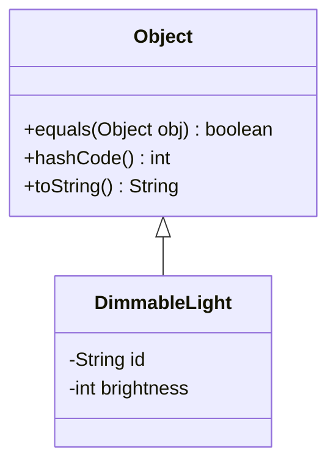

import RevealJS, { Slide } from '@site/src/components/RevealJS';
import Img from '@site/src/components/Img';
import PollSlide from '@site/src/components/PollSlide';

<RevealJS transition="slide">

{/* ============================================ */}
{/* COVER IMAGE */}
{/* ============================================ */}

<Slide>
  

<aside className="notes">
**Lecture overview:**
- **Total time:** ~50 minutes
- **Prerequisites:** Students understand Java basics, inheritance, interfaces from L1-L3
- **Connects to:** Assignment 1 (writing well-specified methods), Lab 3 (code readability)

**Structure:**
- Why specifications matter (psychology + modularity) (~10 min)
- Three criteria for good specs: restrictiveness, generality, clarity (~15 min)
- Type annotations for machine-readable specs (~8 min)
- Common Object contracts: toString, equals, hashCode, compareTo (~17 min)

**Key theme:** Specifications are contracts between implementers and clients—they enable large-scale software development by letting developers reason about code without reading implementations.

→ **Transition:** Let's start with the learning objectives...
</aside>

</Slide>

{/* ============================================ */}
{/* TITLE SLIDE */}
{/* ============================================ */}

<Slide>

# CS 3100: Program Design and Implementation II

## Lecture 4: Specifications and Common Contracts

<p style={{marginTop: '2em', fontSize: '0.8em', color: '#666'}}>
  ©2025 Jonathan Bell, CC-BY-SA
</p>

<aside className="notes">
**Context from L2-L3:**
- Students learned inheritance, polymorphism, Java syntax details
- This lecture focuses on *how to document* what methods do
- Critical for working in teams and on larger codebases

**Key theme:** Good specifications are the glue that holds large software systems together.

→ **Transition:** Here's what you'll be able to do after today...
</aside>

</Slide>

{/* ============================================ */}
{/* LEARNING OBJECTIVES */}
{/* ============================================ */}

<Slide>

## Learning Objectives

<p style={{fontSize: '0.85em', textAlign: 'left'}}>
After this lecture, you will be able to:
</p>

<ol style={{fontSize: '0.75em', textAlign: 'left'}}>
  <li>Describe the role of method specifications in achieving program modularity and improving readability</li>
  <li>Evaluate the efficacy of a given specification using the terminology of restrictiveness, generality, and clarity</li>
  <li>Utilize type annotations to express invariants such as non-nullness</li>
  <li>Define the role of methods common to all Objects in Java (toString, equals, hashCode, compareTo)</li>
</ol>

<aside className="notes">
**Time allocation:**
- Objective 1: Why specs matter—psychology and modularity (~10 min)
- Objective 2: The three criteria—restrictiveness, generality, clarity (~15 min)
- Objective 3: Type annotations—@NonNull, @NullMarked (~8 min)
- Objective 4: Object contracts—four essential methods (~17 min)

**Why this matters:** Students will write Javadoc for A1 methods. They need to understand what makes a spec good vs. merely present. They'll also override equals/hashCode for domain classes.

**AI foreshadowing:** Later in the course, students will use AI assistants. The spec skills they learn today directly apply—ambiguous prompts yield unpredictable results.

→ **Transition:** Let's start with a surprising fact about human memory...
</aside>

</Slide>

{/* ============================================ */}
{/* ARC 1: WHY SPECIFICATIONS MATTER */}
{/* ============================================ */}

<Slide>

## Humans Can Only Hold 7±2 Items in Working Memory

<p style={{fontSize: '0.85em', marginTop: '0.5em'}}>
  Which is easier to remember?
</p>

<ul style={{fontSize: '0.8em'}}>
  <li><strong>Random order:</strong> 50, 30, 60, 20, 80, 10, 40, 70</li>
  <li><strong>Pattern:</strong> 10, 20, 30, 40, 50, 60, 70, 80</li>
</ul>

<aside className="notes">
**Miller's Law (1956):**
- George Miller's famous paper: "The Magical Number Seven, Plus or Minus Two"
- We can only hold ~7 items in short-term/working memory at once
- BUT: items can be "chunks" of variable size

**The example:**
- Both lists contain the same 8 numbers
- Random order: 8 separate items (exceeds capacity)
- Pattern: 1 chunk ("multiples of 10")
- Same information, dramatically different cognitive load

**Why this matters for programming:**
- We can't hold entire programs in our heads
- We need to "chunk" code into understandable pieces
- Specifications are how we create mental chunks

→ **Transition:** Let's dig deeper into what "chunking" means...
</aside>

</Slide>

<Slide>

## Chunking Lets Us Manage More Than 7 Items

<p style={{fontSize: '0.9em'}}>
  <strong>Chunking</strong> = organizing information into meaningful units
</p>

<ul style={{fontSize: '0.85em', marginTop: '1em'}}>
  <li>"FBI" is 1 chunk, not 3 letters</li>
  <li>"555-1234" is 2 chunks, not 7 digits</li>
  <li>A chess master sees "castled king position" not 5 pieces</li>
</ul>

<p style={{fontSize: '0.9em', marginTop: '1em', color: '#9370DB'}}>
  Expert programmers chunk code the same way:
</p>

<ul style={{fontSize: '0.85em'}}>
  <li>"Binary search" → one chunk (not 15 lines)</li>
  <li>"HashMap lookup" → one chunk (not the internal algorithm)</li>
</ul>

<aside className="notes">
**The psychology:**
- Experts don't have bigger working memory
- They have better chunks
- A chess grandmaster and novice have same 7±2 limit
- But grandmaster's chunks are entire board positions

**For programmers:**
- Novice: sees individual statements, loops, conditions
- Expert: sees "sorting," "searching," "validation"
- Specs let everyone think at the expert level

**The key insight:**
- Chunking requires LABELS for the chunks
- In code, the label is the specification
- Without a spec, you can't chunk the method—you have to hold the whole thing

→ **Transition:** So how do specifications enable chunking?
</aside>

</Slide>

<Slide>

## Specifications Enable Mental Chunking for Code

<p style={{fontSize: '0.9em'}}>
  When reading a program, we want to understand method behavior <strong>without</strong> reading the implementation.
</p>

<div style={{display: 'flex', gap: '1em', marginTop: '1em'}}>
<div style={{flex: 1}}>

**Without spec:** 🤯

```java
public boolean mystery(Object[] arr, Object o) {
    for (int i = 0; i < arr.length; i++) {
        if (arr[i].equals(o)) return true;
    }
    return false;
}
```

<p style={{fontSize: '0.7em', color: '#888'}}>Must read every line to understand</p>

</div>
<div style={{flex: 1}}>

**With spec:** 😌

```java
/**
 * Returns true if this collection contains
 * the specified element.
 * @return true if this collection contains o
 */
boolean contains(Object o);
```

<p style={{fontSize: '0.7em', color: '#888'}}>Spec tells you what it does</p>

</div>
</div>

<aside className="notes">
**The chunking connection:**
- Left side: must hold the entire implementation in memory
- Right side: one chunk—"checks if collection contains element"
- The spec lets you skip the implementation details

**Connection to L3:**
- You learned Collection.contains() last lecture
- You used it without reading ArrayList's implementation!
- That's the power of good specifications

**Real-world scale:**
- Methods call other methods, which call other methods...
- Without specs, understanding one method requires understanding all its dependencies
- With specs, each method is a self-contained chunk

→ **Transition:** Let's see the real-world impact of this...
</aside>

</Slide>

<Slide>

## You Spend 10x More Time Reading Code Than Writing It

<p style={{fontSize: '0.9em'}}>
  Consider understanding this call from L3:
</p>

```java
Map<String, List<IoTDevice>> devicesByRoom = new HashMap<>();
devicesByRoom.get("living-room").add(new DimmableLight("lr1", 100));
```

<div style={{display: 'flex', gap: '1em', marginTop: '0.5em', fontSize: '0.8em'}}>
<div style={{flex: 1}}>

**Without spec:**
- Open HashMap source (2000+ lines)
- Trace through hash buckets
- Understand resize logic
- **Time: 30+ minutes**

</div>
<div style={{flex: 1}}>

**With spec:**
- Read Map.get() Javadoc
- "Returns the value for this key, or null"
- **Time: 30 seconds**

</div>
</div>

<p style={{fontSize: '0.85em', marginTop: '0.5em', color: '#9370DB'}}>
  You used HashMap without reading its 2000-line implementation!
</p>

<aside className="notes">
**The math:**
- Average codebase: thousands of methods
- Each method calls several others
- Without specs: O(n²) effort to understand
- With specs: O(n) effort

**Connection to L3:**
- Students used HashMap, ArrayList, HashSet
- Did anyone read the implementation? No!
- They relied on the specification (Javadoc + interface contract)

**The investment:**
- Yes, writing specs takes time
- But it's amortized across every future reader
- Write once, read hundreds of times

→ **Transition:** So specs are valuable. But what makes a spec *good*?
</aside>

</Slide>

<Slide>

## A Good Specification Lets You Predict Behavior

<p style={{fontSize: '0.95em'}}>
  The goal: a developer can understand what a method does <strong>without reading its code</strong>.
</p>

<ul style={{fontSize: '0.85em', marginTop: '1em'}}>
  <li>Any implementation that <strong>satisfies</strong> the spec is correct</li>
  <li>Any implementation that <strong>violates</strong> the spec is incorrect</li>
  <li>The spec should be <strong>easier to understand</strong> than the implementation</li>
</ul>

<p style={{fontSize: '0.9em', marginTop: '1.5em', color: '#9370DB'}}>
  But how do we evaluate whether a specification is good?
</p>

<aside className="notes">
**Three requirements of a good spec:**
1. Correct implementations satisfy it (not too restrictive)
2. Incorrect implementations violate it (sufficiently restrictive)
3. It's actually easier to understand than the code

**The balance:**
- Too vague: doesn't rule out incorrect implementations
- Too detailed: might as well read the code
- Just right: captures essential behavior, omits implementation details

**Source material:**
- This framework comes from Liskov & Guttag, "Program Development in Java"
- Chapter 9.2 is excellent reference for students who want more depth

→ **Transition:** Let's look at three specific criteria for evaluating specifications...
</aside>

</Slide>

{/* ============================================ */}
{/* ARC 2: THREE CRITERIA FOR GOOD SPECIFICATIONS */}
{/* ============================================ */}

<Slide>

## Good Specifications Balance Three Criteria


<aside className="notes">
**The three-legged stool metaphor:**
- All three legs must be the right length
- If any one is wrong, the stool (and your spec) falls over

**Quick definitions:**
- **Restrictiveness:** Does the spec rule out BAD implementations?
- **Generality:** Does the spec allow GOOD implementations?
- **Clarity:** Can readers UNDERSTAND the spec correctly?

**The tension:**
- More restrictive often means less general (and vice versa)
- More detailed might help clarity OR hurt it (too long to read)
- Good specs balance all three

→ **Transition:** Let's look at each criterion with concrete examples, starting with restrictiveness...
</aside>

</Slide>

<Slide>

## Restrictive Specs Rule Out Bad Implementations

<p style={{fontSize: '0.9em'}}>
  A spec is <strong>restrictive</strong> if it rules out implementations that clients would find unacceptable.
</p>

<p style={{fontSize: '0.85em', marginTop: '1em'}}>
  Think of it as: <em>"What BAD behaviors does this spec prohibit?"</em>
</p>

<ul style={{fontSize: '0.85em', marginTop: '1em'}}>
  <li>Does it specify what happens for ALL inputs?</li>
  <li>Does it prohibit surprising or dangerous behavior?</li>
  <li>Could a malicious implementer satisfy it while being useless?</li>
</ul>

<aside className="notes">
**The key question:**
- For every possible input, is the behavior defined?
- If not, an implementer could do ANYTHING for undefined inputs
- "Undefined behavior" in specs = bugs waiting to happen

**Examples of restrictiveness failures:**
- Not specifying null handling
- Not specifying ordering guarantees
- Not specifying thread safety
- Not specifying what exceptions can be thrown

**The adversarial test:**
- Imagine an "evil" implementer trying to satisfy the spec while being unhelpful
- If they can do something bad that satisfies the spec, it's not restrictive enough

→ **Transition:** Let's see a concrete example of an under-specified method...
</aside>

</Slide>

<Slide>

## Under-Specified Behavior Allows Bugs to Hide

<p style={{fontSize: '0.9em'}}>
  Consider this spec for <code>Map.get()</code>:
</p>

```java
/**
 * Returns the value associated with the specified key.
 * @param key the key whose value is to be returned
 * @return the value associated with key
 */
V get(Object key);
```

<p style={{fontSize: '0.85em', marginTop: '0.5em', color: '#e74c3c'}}>
  What happens if the key isn't in the map?
</p>

<ul style={{fontSize: '0.8em'}} className="fragment">
  <li>Return null?</li>
  <li>Throw KeyNotFoundException?</li>
  <li>Return a default value?</li>
</ul>

<aside className="notes">
**The problem:**
- Spec says nothing about missing keys
- Behavior is "undefined" for keys not in the map
- Implementation could: return null, throw exception, return default...
- All would technically satisfy this spec!

**Why this matters:**
- Callers can't predict what happens with missing keys
- Different implementations might behave differently
- This is exactly the kind of ambiguity that causes bugs

**Real-world impact:**
- Python's dict raises KeyError for missing keys
- Java's Map returns null for missing keys
- Same concept, different behavior—spec must clarify!

→ **Transition:** Let's see how Java actually specifies this...
</aside>

</Slide>

<Slide>

## Every Input Needs Defined Behavior

<p style={{fontSize: '0.85em', color: '#27ae60'}}>
  ✓ The actual Map.get() specification:
</p>

```java
/**
 * Returns the value to which the specified key is mapped,
 * or null if this map contains no mapping for the key.
 *
 * @param key the key whose associated value is to be returned
 * @return the value to which the specified key is mapped,
 *         or null if this map contains no mapping for the key
 * @throws ClassCastException if the key is of an inappropriate type
 * @throws NullPointerException if the key is null and this map
 *         does not permit null keys
 */
V get(Object key);
```

<p style={{fontSize: '0.85em', marginTop: '0.5em'}}>
  Now <strong>every input</strong> has defined behavior.
</p>

<aside className="notes">
**What the real spec adds:**
- "or null if this map contains no mapping for the key" — the critical edge case!
- ClassCastException for wrong key types
- NullPointerException if null keys aren't allowed

**The principle:**
- Every possible input should have defined behavior
- Either: specify the result, or specify the error
- Silence = undefined = bugs

**Connection to L3:**
- This is why you could confidently write: `if (map.get(key) == null)`
- You KNEW it wouldn't throw an exception for missing keys
- The spec told you exactly what to expect

→ **Transition:** Here's another example from the Collections API...
</aside>

</Slide>

<Slide>

## Silence in a Spec Means Undefined Behavior

<div style={{display: 'flex', gap: '1em', fontSize: '0.85em'}}>
<div style={{flex: 1}}>

❌ **Underspecified:**
```java
/**
 * Returns an iterator over
 * the elements in this set.
 * @return an Iterator over the
 *         elements in this set
 */
public Iterator<E> iterator()
```

<p style={{fontSize: '0.8em', color: '#888'}}>
  Client might assume insertion order...
</p>

</div>
<div style={{flex: 1}}>

✓ **Properly specified:**
```java
/**
 * Returns an iterator over
 * the elements in this set.
 * The elements are returned in
 * no particular order.
 * @return an Iterator over the
 *         elements in this set
 */
public Iterator<E> iterator()
```

</div>
</div>

<aside className="notes">
**The iterator example:**
- Left: client might assume elements come in insertion order
- Right: explicitly states "no particular order"
- Prevents incorrect assumptions

**Why this matters:**
- HashSet iterates in hash-bucket order (essentially random)
- LinkedHashSet iterates in insertion order
- TreeSet iterates in sorted order
- Same interface, different behavior—spec must clarify!

**Key insight:**
- Restrictiveness is about RULING OUT bad behavior
- Sometimes that means restricting what the CALLER can assume
- "No particular order" = caller can't rely on order

→ **Transition:** Let's see what happens when you assume order that isn't guaranteed...
</aside>

</Slide>

<Slide>

## Assuming Unspecified Behavior Creates Flaky Tests


<p style={{fontSize: '0.85em', marginTop: '0.5em', color: '#e74c3c'}}>
  "Works on my machine" isn't a specification!
</p>

<aside className="notes">
**The flakiness trap:**
- HashSet doesn't guarantee iteration order
- On YOUR machine, it might always be the same
- So your tests pass locally... then fail on the CI server

**Why it happens:**
- Different JVM versions, different behavior
- The spec says "no particular order"—believe it!

**Key lesson:**
- If the Javadoc doesn't promise it, don't rely on it
- Test behavior, not implementation details

**Foreshadowing (Hyrum's Law, L6):**
- "With enough users, all observable behaviors will be depended on"
- Even unspecified behavior gets relied upon—then breaks when implementations change
- This is why information hiding matters (coming in Lecture 6)

→ **Transition:** But we can go too far—what if we're TOO restrictive?
</aside>

</Slide>

<Slide>

## General Specs Don't Over-Constrain Implementations

<p style={{fontSize: '0.9em'}}>
  A spec is <strong>general</strong> if it doesn't rule out implementations that would be correct.
</p>

<p style={{fontSize: '0.85em', marginTop: '1em'}}>
  Think of it as: <em>"What GOOD implementations does this spec allow?"</em>
</p>

<ul style={{fontSize: '0.85em', marginTop: '1em'}}>
  <li>Does it describe WHAT the method does, or HOW?</li>
  <li>Could a faster algorithm satisfy it?</li>
  <li>Does it over-specify implementation details?</li>
</ul>

<aside className="notes">
**The key distinction:**
- Definitional spec: describes the result ("returns the sum")
- Operational spec: describes the steps ("loop through and add each")

**Why generality matters:**
- Allows optimization without breaking contract
- Permits multiple correct implementations
- Future-proofs the API

**The test:**
- Think of different ways to implement this method
- If a correct implementation would violate the spec, it's too restrictive

→ **Transition:** Let's see an example of an overly operational spec...
</aside>

</Slide>

<Slide>

## Operational Specs Reject Valid Implementations

<p style={{fontSize: '0.85em', color: '#e74c3c'}}>
  ❌ Too operational (not general):
</p>

```java
/**
 * Returns true if this set contains the specified element.
 * Iterates through all elements using a for-each loop,
 * comparing each element using equals().
 *
 * @param o the element to search for
 * @return true if found, false otherwise
 */
boolean contains(Object o);
```

<p style={{fontSize: '0.85em', marginTop: '0.5em', color: '#e74c3c'}}>
  This spec requires O(n) linear search!
</p>

<aside className="notes">
**The problem:**
- This spec describes HOW to implement, not WHAT the method does
- "Iterates through all elements" — requires linear search
- HashSet's O(1) implementation would violate this spec!

**Why too restrictive:**
- HashSet uses hash buckets, not iteration
- TreeSet uses binary search tree traversal
- Both are correct implementations of Set.contains()

**Operational vs. Definitional:**
- Operational: describes steps to execute
- Definitional: describes the result/effect
- Specs should be definitional (what), not operational (how)

→ **Transition:** Let's see the actual Set.contains() spec...
</aside>

</Slide>

<Slide>

## Describe Results, Not Algorithms

<p style={{fontSize: '0.85em', color: '#27ae60'}}>
  ✓ The actual Set.contains() specification:
</p>

```java
/**
 * Returns true if this set contains the specified element.
 * More formally, returns true if and only if this set contains
 * an element e such that Objects.equals(o, e).
 *
 * @param o element whose presence in this set is to be tested
 * @return true if this set contains the specified element
 * @throws ClassCastException if the type of o is incompatible
 * @throws NullPointerException if o is null and this set
 *         does not permit null elements
 */
boolean contains(Object o);
```

<p style={{fontSize: '0.85em', marginTop: '0.5em'}}>
  This permits: HashSet (O(1)), TreeSet (O(log n)), LinkedHashSet...
</p>

<aside className="notes">
**What changed:**
- No mention of HOW to search
- Defines the RESULT: "contains an element e such that Objects.equals(o, e)"
- Same restrictiveness for error cases

**Benefits:**
- HashSet can use hash buckets — O(1)
- TreeSet can use binary search — O(log n)
- Future implementations can optimize freely

**Connection to L3:**
- This is why we said "HashSet has O(1) contains"
- The spec doesn't REQUIRE O(1), but it PERMITS it
- That's the power of definitional specs

→ **Transition:** Sometimes you DO need to be more specific...
</aside>

</Slide>

<Slide>

## The Right Balance Depends on What Callers Need

<p style={{fontSize: '0.9em'}}>
  Compare these two List methods:
</p>

<div style={{display: 'flex', gap: '1em', fontSize: '0.75em'}}>
<div style={{flex: 1}}>

**General (contains):**
```java
/**
 * Returns true if this list
 * contains the specified element.
 */
boolean contains(Object o);
```

<p style={{color: '#9370DB'}}>Any implementation OK</p>

</div>
<div style={{flex: 1}}>

**Specific (indexOf):**
```java
/**
 * Returns the index of the first
 * occurrence of the specified
 * element, or -1 if not found.
 */
int indexOf(Object o);
```

<p style={{color: '#9370DB'}}>Must return FIRST index</p>

</div>
</div>

<p style={{fontSize: '0.85em', marginTop: '0.5em'}}>
  <code>indexOf</code> is more restrictive because callers need to know <em>which</em> occurrence.
</p>

<aside className="notes">
**The key insight:**
- Generality vs. restrictiveness is a tradeoff
- The "right" balance depends on requirements

**When to be more specific:**
- Callers genuinely need a specific behavior
- indexOf() must return FIRST because callers iterate from there
- The extra constraint enables useful assumptions

**When to be more general:**
- Multiple implementations could satisfy callers
- contains() just needs yes/no—any implementation works
- Flexibility to optimize later

**Connection to L3:**
- You used both methods in L3
- indexOf() for finding positions, contains() for membership
- Different specs for different needs

→ **Transition:** Now let's look at clarity—can readers understand the spec correctly?
</aside>

</Slide>

<Slide>

## The Most Dangerous Specs Are Misunderstood Specs

<p style={{fontSize: '0.9em'}}>
  A spec is <strong>clear</strong> if readers understand it correctly.
</p>

<p style={{fontSize: '0.85em', marginTop: '1em'}}>
  The most dangerous specs are those where readers <em>think</em> they understand but don't.
</p>

<ul style={{fontSize: '0.85em', marginTop: '1em'}}>
  <li><strong>Too brief:</strong> Readers fill in gaps with assumptions</li>
  <li><strong>Too long:</strong> Readers skim and miss important details</li>
  <li><strong>Jargon-heavy:</strong> Readers guess at meaning</li>
  <li><strong>Redundant:</strong> Readers wonder what's different about each statement</li>
</ul>

<aside className="notes">
**The danger:**
- Unclear specs don't just confuse—they mislead
- Reader thinks they understand, writes code based on wrong assumption
- Bug only discovered much later

**Clear specs are:**
- Concise (but not too brief)
- Use terms the reader knows
- Define domain-specific terms
- Avoid unnecessary repetition

**The test:**
- Show spec to someone unfamiliar with the code
- Ask them to explain what the method does
- Do their assumptions match reality?

→ **Transition:** Let's see examples of clarity problems...
</aside>

</Slide>

<Slide>

## Redundancy Creates Confusion, Not Clarity

<p style={{fontSize: '0.85em', color: '#e74c3c'}}>
  ❌ Redundant (hurts clarity):
</p>

```java
/**
 * Closes this stream and releases any resources.
 * This method closes the stream. After closing,
 * the stream is closed and cannot be used.
 * Closing releases resources held by the stream.
 */
void close() throws IOException;
```

<p style={{fontSize: '0.8em', marginTop: '0.5em'}}>
  "Close closes the closed stream" — we got it the first time!
</p>

<aside className="notes">
**Problems with redundancy:**
- Longer to read = higher cognitive load
- Repeated information suggests there might be subtle differences
- Reader wonders: "Why keep saying 'close'? Is there a difference?"

**Clear specs are concise:**
- Say it once, say it well
- Don't explain concepts the reader already knows
- Extra words = extra chances for confusion

**Connection to L3:**
- You used close() with try-with-resources
- The actual Closeable.close() spec is concise
- It just says what happens, once

→ **Transition:** Sometimes more detail helps—when the concept isn't universally known...
</aside>

</Slide>

<Slide>

## Domain-Specific Terms Need Definitions

<p style={{fontSize: '0.85em', color: '#e74c3c'}}>
  ❌ Unclear (assumes domain knowledge):
</p>

```java
/**
 * Iterates over elements in natural order.
 * @return an iterator in natural order
 */
Iterator<E> iterator();
```

<p style={{fontSize: '0.85em', color: '#27ae60', marginTop: '1em'}}>
  ✓ Clear (defines the term):
</p>

```java
/**
 * Iterates over elements in natural order.
 * Natural order is defined by the elements' compareTo() method,
 * with smaller elements appearing before larger ones.
 * @return an iterator in ascending natural order
 */
Iterator<E> iterator();
```

<aside className="notes">
**The problem:**
- "Natural order" is a Java term—not everyone knows it
- Does it mean insertion order? Alphabetical? Something else?
- Risk: reader THINKS they understand but doesn't

**The fix:**
- One sentence defining "natural order"
- Now reader knows it's based on compareTo()

**Connection to L3:**
- TreeSet iterates in "natural order"
- LinkedHashSet iterates in "insertion order"
- HashSet iterates in "no particular order"
- Each spec must clarify what it means!

**General principle:**
- Define domain-specific terms
- Don't define common programming terms
- When in doubt, err toward clarity

→ **Transition:** The same spec principles apply whether you're writing for humans or AI...
</aside>

</Slide>

{/* ============================================ */}
{/* BRIDGE: SPECS SCALE FROM METHODS TO AI */}
{/* ============================================ */}

<Slide>

## The Same Spec Principles Apply at Every Scale

 2°C, compensate by...' The robot executes EXACTLY what's specified—no more, no less. One batch shows perfect cookies. Another batch shows the robot has stopped mid-production because the spec said 'halt' but didn't say what to do after refilling flour. An engineer scratches their head: 'It did exactly what we said...' Caption: 'AI/automation executes literally. Every gap becomes a decision point.'

BOTTOM UNIFYING ELEMENT:
A horizontal strip showing the same three principles (Restrictive, General, Clear) as measuring cups that appear in all three kitchens—same tools, different scales. Central message: 'The recipe-writing principles don't change. The consequences of ambiguity do. A vague instruction like 'bake until done' works when YOU'RE baking—but fails at scale.'

THE TWIST (Important callout box):
Shows the home cook returning to their kitchen 6 months later, following their own vague recipe... and the cookies come out wrong. Thought bubble: 'Wait, did I used to bake these at 350 or 375? What did I mean by golden?' Caption: 'Plot twist: Even YOUR context changes over time. Future-you is also a different implementer.'

BOTTOM TAGLINE:
'Every implementer—including yourself tomorrow—fills gaps with their own context. The question isn't WHO interprets your spec. It's whether your spec eliminated the wrong interpretations.'

Style: Warm bakery aesthetic with rich browns, warm yellows, and cream colors. Each panel should feel progressively more industrial/technical while maintaining the cooking metaphor. The home kitchen is cozy and personal, the restaurant is professional but human, the robot bakery is precise and clinical. Should feel like a relatable story that makes students think: 'Oh, I've been that home cook who couldn't follow my own recipe later!'"
  />

<aside className="notes">
**The recipe metaphor:**
- Everyone's written a vague recipe that worked... for them, that day
- But try handing that recipe to someone else, or following it 6 months later
- Same problem with code specs!

**Home kitchen (you as implementer):**
- "Bake until golden" works because YOU know what golden means to YOU
- Your context matches your intent perfectly
- This is why quick personal scripts don't need elaborate docs

**Restaurant kitchen (team of humans):**
- Same recipe, 5 cooks, 5 interpretations of "golden brown"
- One cook's "golden" is another's "burnt"
- The new hire has NO context—what even IS golden brown?
- This is enterprise software: same spec, different developers, different results

**Robot baker (AI/automation):**
- Must specify EVERYTHING: exact temperatures, sensor readings, error handling
- Robot does EXACTLY what you say—no more, no less
- "Halt if flour low" → robot halts... forever, because you didn't say what happens AFTER refilling
- AI is the same: fills gaps with training data patterns, might be totally wrong for YOUR context

**The twist (key insight!):**
- Ask students: "Ever tried to follow your own recipe months later?"
- YOUR context changes too! Future-you is also a different implementer
- This is why we document code—even for ourselves

**The real lesson:**
- It's not "humans good, AI bad"
- ALL implementers fill gaps with their own context
- AI just makes this visible FASTER (and with more surprising context)
- Good specs protect you from everyone—including yourself tomorrow

**Connection to later course:**
- Lecture 13: AI-Assisted Development
- You'll write specs (prompts) for AI assistants
- Same skills, faster feedback loop

→ **Transition:** Let's see what happens when ambiguous specs compound over time...
</aside>

</Slide>

<Slide>

## "Process" and "Handle" Are Not Specifications

<p style={{fontSize: '0.9em'}}>
  Consider this IoT device manager API:
</p>

```java
/**
 * Handles the given device event.
 *
 * @param event the device event to handle
 */
public void handleEvent(DeviceEvent event)
```

<p style={{fontSize: '0.85em', marginTop: '1em', color: '#e74c3c'}}>
  What does "handle" actually mean? Every implementer fills the gap differently.
</p>

<ul style={{fontSize: '0.75em', marginTop: '0.5em'}}>
  <li>Log it? Update device state? Notify other devices?</li>
  <li>What if the device is offline? Retry? Queue for later?</li>
  <li>Thread-safe? Can it be called concurrently?</li>
</ul>

<aside className="notes">
**The "handle" trap:**
- "Handle" is a verb that sounds specific but isn't
- Same problem with: process, manage, deal with, take care of
- These words delegate ALL decisions to the implementer

**Connection to L3:**
- If IoTDevice.identify() just said "handles identification"...
- Would you know it prints to console? Returns a string? Logs somewhere?
- The actual spec tells you exactly what happens

**The key insight:**
- It's not "humans right, AI wrong"
- It's "ambiguous specs → unpredictable implementations"
- A human with wrong assumptions is just as dangerous—just slower

**The fix:**
- Define WHAT happens, not just that something happens
- Every edge case needs explicit behavior
- "Handle" should become specific: "logs to System.out", "updates device.lastSeen", etc.

→ **Transition:** Unclear specs have long-term costs beyond immediate confusion...
</aside>

</Slide>

<Slide>

## Ambiguity Creates Specification Debt


<aside className="notes">
**The hidden cost:**
- Ambiguous spec → implementation decision
- Developer might not realize they're choosing
- Choice becomes embedded in shipped code
- Users affected by "accidental" decisions

**The grading example:**
- "Promptly" is vague—doesn't specify order
- Alphabetical is a reasonable implementation choice
- But it has fairness implications the spec didn't consider
- Now changing it requires refactoring + explaining to users

**Specification debt:**
- Like technical debt, but in the contract
- Works fine initially, creates liability over time
- More users = more diverse expectations = more debt

**Prevention:**
- Ask: "Could different interpretations lead to different outcomes for different groups?"
- Resolve ambiguity BEFORE implementation

→ **Transition:** So far we've written specs as comments. Can we do better?
</aside>

</Slide>

{/* ============================================ */}
{/* ARC 3: TYPE ANNOTATIONS */}
{/* ============================================ */}

<Slide>

## Type Annotations Let Compilers Enforce Specs


<p style={{fontSize: '0.85em', marginTop: '0.5em'}}>
  Type annotations let the <strong>compiler</strong> enforce specification invariants.
</p>

<aside className="notes">
**The problem with comments:**
- Javadoc says "arr must not be null"
- But caller can pass null anyway
- Error only discovered at runtime (if you're lucky)

**Type annotations (Java 8+):**
- Researchers at University of Washington proposed this
- One of few academic contributions accepted into Java
- Annotations on types, not just declarations

**The benefit:**
- Compiler checks nullness at compile time
- Error before the code even runs
- Documentation AND enforcement in one

→ **Transition:** Let's see how to use nullness annotations in practice...
</aside>

</Slide>

<Slide>

## @NonNull Turns Documentation Into Enforcement

```java
import org.jspecify.annotations.NonNull;
import org.jspecify.annotations.Nullable;

public int sum(@NonNull int[] arr) {
    int sum = 0;
    for (int i = 0; i < arr.length; i++) {
        sum += arr[i];
    }
    return sum;
}
```

<p style={{fontSize: '0.85em', marginTop: '1em'}}>
  With <code>@NonNull</code>, the compiler enforces that <code>arr</code> is never null.
</p>

<p style={{fontSize: '0.8em', marginTop: '0.5em', color: '#888'}}>
  Note: Java has many competing <code>@NonNull</code> definitions. We use <a href="https://jspecify.dev/">JSpecify</a>.
</p>

<aside className="notes">
**JSpecify:**
- Coalition: Google, JetBrains, Microsoft, Uber, Oracle
- Standard nullness annotations (finally!)
- Used with NullAway checker in this course

**What changes:**
- `@NonNull` = this parameter/return/field is never null
- `@Nullable` = this CAN be null, handle it
- Compiler error if you pass null to @NonNull

**The annotation mess:**
- javax.annotation.NonNull, org.jetbrains.annotations.NotNull, etc.
- Each tool had its own definition
- JSpecify standardizes this (we hope)

→ **Transition:** Writing @NonNull everywhere gets tedious. There's a better approach...
</aside>

</Slide>

<Slide>

## @NullMarked Makes Non-Null the Default

<p style={{fontSize: '0.9em'}}>
  Mark the whole package as "non-null by default":
</p>

```java
// In package-info.java
@NullMarked
package edu.neu.cs3100.myproject;

import org.jspecify.annotations.NullMarked;
```

<p style={{fontSize: '0.9em', marginTop: '1em'}}>
  Now only mark exceptions with <code>@Nullable</code>:
</p>

```java
// In a @NullMarked package:
public int sum(int[] arr) { ... }  // arr assumed non-null

public String format(@Nullable String prefix, String value) { ... }
// prefix can be null, value cannot
```

<aside className="notes">
**The pattern:**
1. Add @NullMarked to package-info.java
2. All types in that package are non-null by default
3. Only annotate things that CAN be null with @Nullable

**Why this is better:**
- Most types are non-null in practice
- Less annotation clutter
- Explicit about the exceptional cases

**For this course:**
- New projects use @NullMarked
- You'll see this in starter code
- Add @Nullable only when needed

→ **Transition:** Let's see what this looks like in a real method...
</aside>

</Slide>

<Slide>

## Annotations Make Nullability Explicit at a Glance

```java
// In a @NullMarked package

/**
 * Formats a user's display name.
 *
 * @param firstName the user's first name
 * @param middleName the user's middle name, or null if none
 * @param lastName the user's last name
 * @return formatted name (such as "John Q. Public")
 */
public String formatName(
    String firstName,            // non-null (default)
    @Nullable String middleName, // explicitly nullable
    String lastName              // non-null (default)
) {
    if (middleName == null) {
        return firstName + " " + lastName;
    }
    return firstName + " " + middleName.charAt(0) + ". " + lastName;
}
```

<aside className="notes">
**What the annotations tell us:**
- firstName: required, cannot be null
- middleName: optional, might be null
- lastName: required, cannot be null
- Return: always non-null (default in @NullMarked)

**The compiler enforces:**
- Caller must provide non-null firstName and lastName
- Caller can pass null for middleName
- Method must check middleName before using it
- Method must return non-null

**Compare to just Javadoc:**
- Javadoc says "middleName, or null if none"
- But nothing enforces the caller reads this
- @Nullable makes it compiler-checked

→ **Transition:** What about working with existing code that isn't annotated?
</aside>

</Slide>

<Slide>

## Legacy Code Requires Gradual Annotation Adoption

<p style={{fontSize: '0.9em'}}>
  Two approaches for existing codebases:
</p>

<div style={{display: 'flex', gap: '1em', marginTop: '1em', fontSize: '0.8em'}}>
<div style={{flex: 1}}>

**Approach A: @NullMarked (new code)**
- Mark new packages @NullMarked
- Existing code left unannotated
- Gradually migrate package by package

</div>
<div style={{flex: 1}}>

**Approach B: @NonNull everywhere (legacy)**
- Don't use @NullMarked
- Add @NonNull as you verify each type
- Safer but more verbose

</div>
</div>

<p style={{fontSize: '0.85em', marginTop: '1em', color: '#9370DB'}}>
  For this course: new projects use @NullMarked. You'll see this in starter code.
</p>

<aside className="notes">
**For new code (this course):**
- Always use @NullMarked on your packages
- Fewer annotations, cleaner code
- Only add @Nullable when needed

**For legacy code (industry):**
- Often can't add @NullMarked to existing packages
- Would require auditing every type
- Gradual @NonNull approach is safer

**The future:**
- JSpecify + NullAway are gaining adoption
- Eventually most Java code may be null-checked
- Skills you learn now will be valuable

**Active research area:**
- Beyond nullness: immutability annotations, ownership types
- Making more invariants machine-checkable

→ **Transition:** But what about calling code that ISN'T annotated?
</aside>

</Slide>

<Slide>

## Unannotated Libraries Need Runtime Assertions

<p style={{fontSize: '0.9em'}}>
  Even <code>java.util</code> isn't fully annotated! The checker can't know if library methods return null.
</p>

```java
String name = "Alice";
List<String> names = List.of(name); // Checker: "might be null!"
System.out.println(names.size()); // Warning!
```

<p style={{fontSize: '0.85em', marginTop: '1em'}}>
  Use <code>Objects.requireNonNull</code> to assert your domain knowledge:
</p>

```java
List<String> names = Objects.requireNonNull(List.of(name));
// Checker now knows names is non-null
```

<aside className="notes">
**The problem:**
- You call List.of() which NEVER returns null (it's documented!)
- But the checker doesn't know—Java standard library isn't annotated
- You get a warning even though your code is correct

**Objects.requireNonNull does two things:**
1. Tells the nullness checker "I guarantee this is non-null"
2. Fails fast with clear NPE if you're wrong (instead of confusing error later)

**When to use it:**
- Calling standard library methods like List.of(), Set.of(), Map.of() that never return null
- Calling library methods documented as non-null
- Receiving values from unannotated third-party code

**Caution:**
- Don't use it to silence warnings you don't understand
- If unsure whether something can be null, add a proper null check
- requireNonNull is for when YOU know it's non-null but the CHECKER doesn't
- DON'T use it for methods like Map.get() that genuinely CAN return null—that needs real null handling

→ **Transition:** Beyond nullness, Java has other standard contracts—let's look at the ones every Object has...
</aside>

</Slide>

{/* ============================================ */}
{/* ARC 4: COMMON OBJECT CONTRACTS */}
{/* ============================================ */}

<Slide>

## Every Java Object Inherits Four Key Contracts

<p style={{fontSize: '0.9em'}}>
  Every class extends <code>java.lang.Object</code>, which defines methods you should consider overriding:
</p>

<ul style={{fontSize: '0.85em', marginTop: '1em'}}>
  <li><code>toString()</code> — human-readable representation</li>
  <li><code>equals(Object)</code> — logical equality</li>
  <li><code>hashCode()</code> — hash value for collections</li>
</ul>

<p style={{fontSize: '0.85em', marginTop: '1em'}}>
  Plus the <code>Comparable</code> interface:
</p>

<ul style={{fontSize: '0.85em'}}>
  <li><code>compareTo(T)</code> — natural ordering</li>
</ul>

<aside className="notes">
**Why these matter:**
- toString: debugging, logging
- equals: comparing objects, Set membership, List.contains()
- hashCode: HashMap keys, HashSet membership
- compareTo: sorting, TreeSet, TreeMap

**The contracts are interdependent:**
- If you override equals, you MUST override hashCode
- compareTo should be consistent with equals
- Getting these wrong causes subtle, hard-to-find bugs

**Source:**
- "Effective Java" by Joshua Bloch has excellent coverage
- Items 10-14 cover these methods in detail

→ **Transition:** Let's start with the simplest one—toString...
</aside>

</Slide>

<Slide>

## toString Should Be Concise But Informative

<p style={{fontSize: '0.9em'}}>
  From the Java documentation:
</p>

<blockquote style={{fontSize: '0.8em', fontStyle: 'italic', borderLeft: '3px solid #9370DB', paddingLeft: '1em'}}>
  "Returns a string that textually represents this object. The result should be a concise but informative representation that is easy for a person to read."
</blockquote>

<div style={{display: 'flex', gap: '1em', marginTop: '1em', fontSize: '0.8em'}}>
<div style={{flex: 1}}>

**Default (useless):**
```
DimmableLight@1a2b3c4d
```

</div>
<div style={{flex: 1}}>

**Overridden (helpful):**
```
DimmableLight(color=2700K,
  brightness=100, on=true)
```

</div>
</div>

<aside className="notes">
**The default:**
- Class name + "@" + hex hash code
- Essentially useless for debugging
- Tells you the type but nothing about state

**The contract is flexible:**
- "Concise but informative"
- OK to change between versions
- OK to return different strings for same object state

**Always override toString:**
- Called by println, logging, debugger
- Good toString methods save hours of debugging

→ **Transition:** Let's see implementation tips...
</aside>

</Slide>

<Slide>

## Good toString Saves Hours of Debugging

```java
// From the IoT device hierarchy in L3
@Override
public String toString() {
    return "DimmableLight(id=" + id + ", " +
           "brightness=" + brightness + ", " +
           "on=" + isOn() + ")";
}
```

<p style={{fontSize: '0.85em', marginTop: '1em'}}>
  <strong>Best practices:</strong>
</p>

<ul style={{fontSize: '0.8em'}}>
  <li>Include the class name</li>
  <li>Include fields that matter for understanding the object</li>
  <li>Format for readability (not just dump all fields)</li>
</ul>

<p style={{fontSize: '0.8em', marginTop: '0.5em', color: '#9370DB'}}>
  When you <code>System.out.println(deviceList)</code>, good toString() makes debugging easy.
</p>

<aside className="notes">
**Connection to L3:**
- When debugging collections of IoT devices, toString() is essential
- System.out.println(lights) shows each device's state
- Without toString(), you just see memory addresses

**Format considerations:**
- Include class name (helps when logging collections of mixed types)
- Show key fields with their names
- Keep it single-line for log readability

**What NOT to do:**
- Don't include passwords or sensitive data
- Don't make it too long (logs become unreadable)

→ **Transition:** Now let's look at equals—it's more complex and more critical...
</aside>

</Slide>

{/* Begin discussion of equals() */}
<Slide>

## What does this print (==)?

<PollSlide
  code={`
    public class DimmableLight {
        private String id;
        private int brightness;

        public DimmableLight(String id, int brightness) {
            this.id = id;
            this.brightness = brightness;
        }

        public static void main(String[] args) {
            DimmableLight light1 = new DimmableLight("living-room", 100);
            DimmableLight light2 = new DimmableLight("living-room", 100);
            System.out.println(light1 == light2);
        }
    }
  `}
  choices={["true", "false", "I have no idea"]}
/>

</Slide>


<Slide>

## What does this print (equals()) ?

<PollSlide
  code={`
    public class DimmableLight {
        private String id;
        private int brightness;

        public DimmableLight(String id, int brightness) {
            this.id = id;
            this.brightness = brightness;
        }

        public static void main(String[] args) {
            DimmableLight light1 = new DimmableLight("living-room", 100);
            DimmableLight light2 = new DimmableLight("living-room", 100);
            System.out.println(light1.equals(light2));
        }
    }
  `}
  choices={["true", "false", "I have no idea"]}
/>

</Slide>

<Slide>

## Where does `equals()` come from?

<div style={{display: 'flex', gap: '2em', alignItems: 'flex-start', marginTop: '1em'}}>

<div style={{flex: 1}}>


</div>

<div style={{flex: 1}}>

**Object's implementation:**
```java
public boolean equals(Object obj) {
    return (this == obj);
}
```


</div>

</div>

<p style={{fontSize: '0.9em'}}>Since <code>DimmableLight</code> doesn't override <code>equals()</code>, it inherits this version—which just checks reference equality.</p>

</Slide>

<Slide>

## Overriding `equals()`

```java
public class DimmableLight {
    private String id;
    private int brightness;

    // ... constructor ...

    @Override
    public boolean equals(Object obj) {
        if (this == obj) return true;
        if (!(obj instanceof DimmableLight other)) return false;
        return brightness == other.brightness
            && Objects.equals(id, other.id);
    }

    @Override
    public int hashCode() {
        return Objects.hash(id, brightness);
    }
}
```

<p style={{fontSize: '0.75em', marginTop: '0.5em'}}>What's hashCode()? And why do we need it?</p>

</Slide>

<Slide>

## hashCode Enables O(1) Lookup in HashSets and HashMaps


<aside className="notes">
**How hash collections work:**
- Objects sorted into "buckets" by hashCode
- Each bucket is a small list
- To find an object: compute hash → go to bucket → linear search with equals()

**Why both are needed:**
- hashCode: fast, approximate (which bucket?)
- equals: slow, exact (is this the one?)
- hashCode narrows the search, equals confirms

**The contract connection:**
- Equal objects MUST have equal hash codes
- Otherwise: object in wrong bucket → never found
- This is why overriding equals requires overriding hashCode

→ **Transition:** Let's look at the hashCode contract...
</aside>

</Slide>

<Slide>

## Why override `hashCode()`?

<p className="fragment"><code>Object</code>'s <code>hashCode()</code> returns a value based on the object's memory address.</p>

<p className="fragment">Can two different objects have the same memory address? <strong className="fragment">No.</strong></p>

<div className="fragment">

```java
// DimmableLight with equals() but NO hashCode() override
DimmableLight light1 = new DimmableLight("living-room", 100);
DimmableLight light2 = new DimmableLight("living-room", 100);

System.out.println(light1.equals(light2));  // true (we overrode equals)

Set<DimmableLight> lights = new HashSet<>();
lights.add(light1);
System.out.println(lights.contains(light2));  // false!
```

</div>

<p className="fragment" style={{fontSize: '0.8em', marginTop: '0.5em'}}><strong>The problem:</strong> <code>light1</code> and <code>light2</code> are equal, but have different hash codes, so <code>HashSet</code> looks in the wrong bucket.</p>

</Slide>

{/* Slide 2: equals() comparison */}

<Slide>

## Equal Objects Must Have Equal hashCode() Values

<p style={{fontSize: '0.9em'}}>
  The contract (simplified):
</p>

<ul style={{fontSize: '0.85em'}}>
  <li><strong>Required:</strong> If <code>x.equals(y)</code>, then <code>x.hashCode() == y.hashCode()</code></li>
  <li><strong>Recommended:</strong> If <code>!x.equals(y)</code>, hash codes <em>should</em> differ</li>
  <li><strong>Required:</strong> Consistent within one execution</li>
</ul>

<p style={{fontSize: '0.9em', marginTop: '1em', color: '#e74c3c'}}>
  ⚠️ If you override <code>equals</code>, you <strong>must</strong> override <code>hashCode</code>!
</p>

<aside className="notes">
**The critical rule:**
- Equal objects MUST have equal hash codes
- Otherwise HashMap/HashSet break completely

**The recommendation:**
- Unequal objects SHOULD have different hash codes
- If all objects have same hash code, HashMap becomes a linked list
- O(1) lookup becomes O(n)

**What the contract allows:**
- Unequal objects CAN have same hash code (collision)
- hashCode can change between JVM executions
- hashCode should NOT change during one execution

→ **Transition:** Here's how to implement hashCode...
</aside>

</Slide>

<Slide>

## Use the Same Fields in hashCode as in equals

```java
// For DimmableLight with fields: id, brightness
@Override
public int hashCode() {
    int result = Objects.hashCode(id);
    result = 31 * result + Integer.hashCode(brightness);
    return result;
}

// Or simply:
@Override
public int hashCode() {
    return Objects.hash(id, brightness);
}
```

<p style={{fontSize: '0.8em', marginTop: '0.5em'}}>
  Use the <strong>same fields</strong> as <code>equals</code>. See <em>Effective Java</em> Item 11 for details.
</p>

<aside className="notes">
**The recipe:**
1. Start with hashCode of first field
2. Combine: 31 * result + nextField.hashCode()
3. Return result

**The easy way:**
- Objects.hash(field1, field2, ...) does this for you
- Slightly slower (creates array) but correct
- Use for non-performance-critical code

**Key rule:**
- Same fields in equals → same fields in hashCode
- If a field affects equality, it must affect hash code

**Connection to L3:**
- This is why HashSet.contains() works correctly
- The hash code directs to the right bucket
- equals() confirms the match
</aside>

</Slide>

<Slide>

## Sorting with the Comparable Interface

'.
THE STANDARDIZED INTERFACE:
Close-up of the input port showing its shape—a plug socket with two prongs labeled 'compareTo()' and 'consistent ordering'. A sign above reads: 'ANY object welcome—as long as you have the right plug!' Annotation: 'The algorithm doesn't care WHAT you are, only that you can answer: 'Are you less than, equal to, or greater than this other object?''
THE PARADE OF OBJECTS:
A conveyor belt brings diverse objects toward the machine, each holding an identical plug (their Comparable implementation):

A String 'apple' with a plug showing 'compareTo() → alphabetical order'
An Integer 42 with a plug showing 'compareTo() → numeric order'
A Student object (name='Alex', nuid=1234567) with a plug showing 'compareTo() → by NUID'
A custom 'HighScore' object with a plug showing 'compareTo() → by points descending'
Each object is different, but all plugs fit the same socket. Annotation: 'Every class decides its OWN natural ordering—String uses alphabetical, Integer uses numeric, you choose what makes sense for your class.'
INSIDE THE MACHINE:
A cutaway view showing the sorting algorithm at work. The machine's internal logic is simple—just a series of compareTo() calls represented as a judge holding up cards: '-1' (less than), '0' (equal), '+1' (greater than). The judge doesn't see the objects themselves, only the answers. Annotation: 'The algorithm is GENERIC. It just asks compareTo() over and over until everything is sorted.'
THE OUTPUT:
Objects emerge from the machine in perfect order. A display shows:

Strings: 'apple', 'banana', 'cherry'
Integers: 1, 2, 3, 42, 100
Students: sorted by NUID
Caption: 'Same machine, same algorithm, different types—all sorted correctly.'
BOTTOM COMPARISON - With vs Without Comparable:
Left: 'Without Comparable: Write a new sorting method for EVERY type' — shows a frustrated programmer surrounded by duplicate code: sortStrings(), sortIntegers(), sortStudents(), sortHighScores()... Caption: 'Repetitive, error-prone, exhausting.'
Right: 'With Comparable: ONE sort method works for ALL types' — shows the single elegant machine accepting everything. Caption: 'Write compareTo() once, get sorting and searching for free.'
THE CONTRACT CALLOUT:
A warning sign showing the rules:

'sgn(x.compareTo(y)) == -sgn(y.compareTo(x))' → illustrated as a reversible arrow
'Transitive: if a < b and b < c, then a < c' → illustrated as three objects in a chain
'Consistent with equals (recommended)' → shows compareTo() returning 0 exactly when equals() returns true
Caption: 'Break these rules and the machine jams—objects end up in random order!'
KEY INSIGHT CALLOUT:
'Comparable = a PROMISE that your object can be ordered'
'compareTo() = the METHOD that defines that ordering'
'Algorithms don't sort objects—they sort Comparables. Your class just needs to speak the language.'
Style: Clean, friendly industrial aesthetic with color-coded conveyor belts, satisfying plug-and-socket connections, and a sense of elegant machinery. The plugs should look identical across all object types to emphasize the uniform interface. Highlight the 'aha moment' that one algorithm works for infinite types. Should make polymorphism feel practical and empowering rather than abstract."
alt="An educational infographic titled 'The Universal Sorting Machine' that uses a factory metaphor to explain Java's Comparable interface. Diverse objects, such as fruit boxes representing Strings, numbered blocks representing Integers, and people representing Student objects, are shown on a conveyor belt. Despite their differences, each object carries an identical electrical plug labeled compareTo(). These objects are fed into a large central machine labeled Collections.sort(), which accepts the universal plugs to produce sorted output lists. The illustration demonstrates how implementing the single compareTo() method allows different object types to be sorted by the same generic algorithm, contrasting this efficiency with a disorganized scene of a programmer writing repetitive code without the interface."/>

</Slide>

<Slide>

## The Comparable Interface

```mermaid
classDiagram
    class Comparable~T~ {
        <<interface>>
        +compareTo(T o)* int
    }
    class DimmableLight {
        -String id
        -int brightness
        +compareTo(DimmableLight o) int
    }
    Comparable <|.. DimmableLight
    style Comparable fill:#2d4a5a,stroke:#4ac,stroke-width:2px,stroke-dasharray: 5 5
```

<div style={{display: 'flex', gap: '2em', alignItems: 'flex-start', marginTop: '1em', fontSize: '0.8em'}}>

<div style={{flex: 1}}>



</div>

<div style={{flex: 1}}>

```java
public interface Comparable<T> {
    /**
     * Compares this object with the
     * specified object for order.
     *
     * @return negative if this < o,
     *         zero if this == o,
     *         positive if this > o
     */
    int compareTo(T o);
}
```

</div>

</div>

</Slide>

<Slide>

## compareTo Defines How Objects Sort Naturally

<p style={{fontSize: '0.9em'}}>
  For classes with a natural order, implement <code>Comparable&lt;T&gt;</code>:
</p>

```java
/**
 * A dimmable light. Lights are ordered by id, then by brightness.
 */
public class DimmableLight implements Comparable<DimmableLight> {
    private String id;
    private int brightness;

    @Override
    public int compareTo(DimmableLight other) {
        int idCompare = this.id.compareTo(other.id);
        if (idCompare != 0) {
            return idCompare;  // different ids
        }
        // same id, sort by brightness
        return Integer.compare(this.brightness, other.brightness);
    }
}
```

<p style={{fontSize: '0.8em', marginTop: '0.5em'}}>
  Returns: negative if <code>this &lt; other</code>, zero if equal, positive if <code>this &gt; other</code>
</p>

<aside className="notes">
**When to implement Comparable:**
- When there's an obvious natural ordering
- IoT devices: by id (alphabetical)
- Timestamps: chronological
- Numbers: numerical

**The contract:**
- Reversible: sgn(x.compareTo(y)) == -sgn(y.compareTo(x))
- Transitive: if x > y and y > z, then x > z
- Consistent with equals (recommended): x.compareTo(y) == 0 implies x.equals(y)

**Connection to L3:**
- This is what enables Collections.sort(lights)
- And TreeSet DimmableLight to maintain order
- One interface, universal sorting

→ **Transition:** Let's summarize what we've learned...
</aside>

</Slide>


{/* ============================================ */}
{/* SUMMARY */}
{/* ============================================ */}

<Slide>

## Summary: Specifications as Contracts

<ol style={{fontSize: '0.8em'}}>
  <li><strong>Specifications enable modularity</strong> — you used HashMap without reading its 2000 lines</li>
  <li><strong>Good specs balance three criteria:</strong></li>
    <ul>
      <li>Restrictiveness — Map.get() specifies null for missing keys</li>
      <li>Generality — Set.contains() permits O(1) or O(log n) implementations</li>
      <li>Clarity — no redundancy, domain terms defined</li>
    </ul>
  <li><strong>Type annotations</strong> make specs machine-checkable (@NullMarked, @Nullable)</li>
  <li><strong>Object contracts</strong> (toString, equals, hashCode, compareTo) enable Collections to work</li>
</ol>

<p style={{fontSize: '0.8em', marginTop: '0.5em', color: '#9370DB'}}>
  <strong>Critical rule:</strong> Override equals → MUST override hashCode (or HashSet breaks!)
</p>

<aside className="notes">
**Key takeaways:**
- Specs let us reason about large systems (Miller's Law, chunking)
- The Collections API you learned in L3 is a masterclass in good specs
- Balance restrictiveness, generality, clarity
- Use type annotations when possible (compiler > comments)

**Critical rules:**
- Override equals → MUST override hashCode
- Use same fields in both
- equals(null) returns false, compareTo(null) throws

**Connections to upcoming work:**
- A1: Write good Javadoc for your methods
- A1: Override equals/hashCode for domain classes
- Lab 3: Evaluate specification quality

→ **Transition:** Let's look at next steps.
</aside>

</Slide>

<Slide>

## Next Steps

<ul style={{fontSize: '0.95em'}}>
  <li>Assignment 1 due Thursday, January 15 at 11:59 PM</li>
  <li>Complete flashcard set 4 (Specifications & Contracts)</li>
</ul>

<p style={{marginTop: '1.5em', fontSize: '0.9em'}}><strong>Optional readings:</strong></p>

<ul style={{fontSize: '0.85em'}}>
  <li><a href="https://learning.oreilly.com/library/view/effective-java-3rd/9780134686097/ch3.xhtml">Effective Java, Items 10-14</a> (equals, hashCode, toString, Comparable)</li>
  <li><a href="https://learning.oreilly.com/library/view/program-development-in/9780768685299/ch9.html">Liskov & Guttag, Chapter 9.2</a> (Specification theory)</li>
  <li><a href="https://jspecify.dev/docs/start-here/">JSpecify Documentation</a> (Nullness annotations standard)</li>
</ul>

<p style={{marginTop: '1.5em', fontSize: '0.9em'}}><strong>Next time:</strong> Functional Programming and Readability</p>

<aside className="notes">
Assignment 1 is due Thursday—make sure your methods have good Javadoc and that you override equals/hashCode correctly for your domain classes. The flashcards will help reinforce today's concepts.

**Optional readings:**
- Effective Java Items 10-14 go deeper on the Object method contracts—highly recommended if you want to understand the edge cases
- Liskov & Guttag provides the theoretical foundation for specification design
- JSpecify docs if you want to understand the nullness annotation ecosystem

**Next lecture preview:**
- We'll learn lambdas, records, and method references
- Java was decades late to functional programming—Haskell had lambdas in 1990, Java got them in 2014
- But better late than never! These tools let us write code where intent is visible, not buried in boilerplate

Any questions before we wrap up?
</aside>

</Slide>

</RevealJS>

