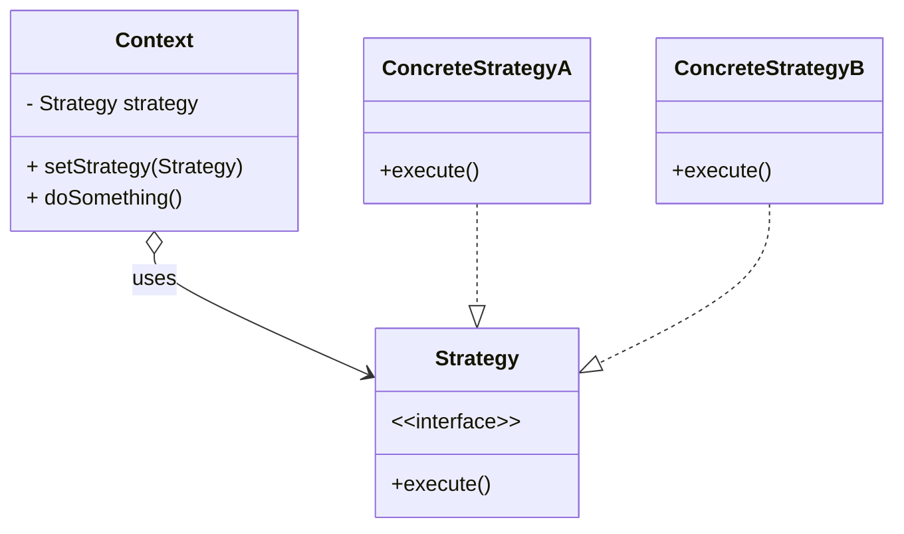
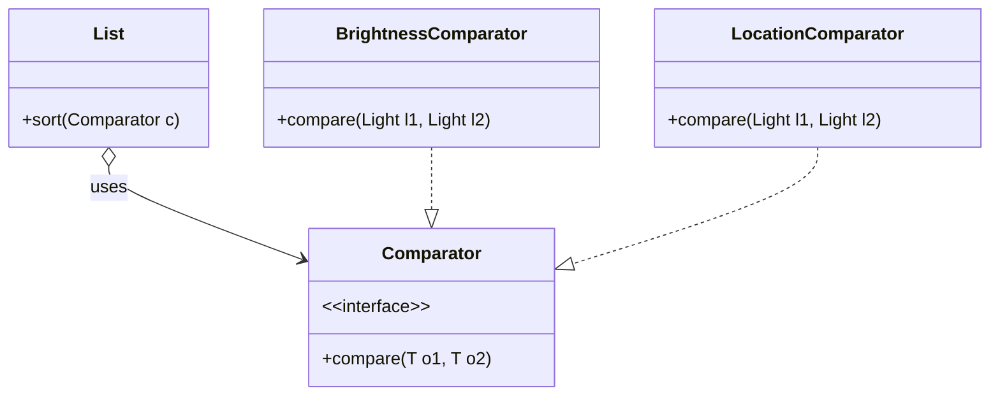

import RevealJS, { Slide } from '@site/src/components/RevealJS';
import ImageSlide from '@site/src/components/ImageSlide';
import Img from '@site/src/components/Img';

<RevealJS transition="slide">

{/* ============================================ */}
{/* COVER IMAGE */}
{/* ============================================ */}

<Slide>
  

<aside className="notes">
**Lecture overview:**
- **Total time:** ~50 minutes
- **Theme:** Java finally caught up—let's use it
- **The cover:** The "fashionably late" visual sets the tone—Java took 40 years to get features other languages had from the start
- **Prerequisites:** Students understand Java basics, specifications, Object contracts from L1-L4
- **Connects to:** Assignment 1 (using lambdas for sorting), Lab 4 (refactoring)

**The narrative:**
- Readability matters (why we care)
- Other languages solved this decades ago (the context)
- Java finally has the tools (what we'll learn)
- Now we can write readable Java too (the payoff)

**Key message:** For decades, Java developers wrote mountains of boilerplate that developers in other languages didn't have to write. That era is over. Today we learn to use the tools Java finally gave us.

→ **Transition:** Let's start with the learning objectives...
</aside>

</Slide>

{/* ============================================ */}
{/* TITLE SLIDE */}
{/* ============================================ */}

<Slide>

# CS 3100: Program Design and Implementation II

## Lecture 5: Functional Programming and Readability

<p style={{marginTop: '2em', fontSize: '0.8em', color: '#666'}}>
  ©2025 Jonathan Bell, CC-BY-SA
</p>

<aside className="notes">
**Context from L4:**
- Students learned about specifications, contracts, equals/hashCode
- This lecture connects those ideas to HOW we write readable code
- The theme: less ceremony, more clarity

**Key message:** Modern Java has powerful tools for writing readable code. Today we learn to use them effectively.

→ **Transition:** Here's what you'll be able to do after today...
</aside>

</Slide>

{/* ============================================ */}
{/* LEARNING OBJECTIVES */}
{/* ============================================ */}

<Slide>

## Learning Objectives

<p style={{fontSize: '0.85em', textAlign: 'left'}}>
After this lecture, you will be able to:
</p>

<ol style={{fontSize: '0.75em', textAlign: 'left'}}>
  <li>Explain why readability is the primary goal of good code design</li>
  <li>Describe how treating functions as objects enables more readable code</li>
  <li>Read and write Java lambdas, method references, and records</li>
  <li>Choose between lambdas, method references, and named methods based on readability</li>
  <li>Apply evidence-based naming practices to maximize code clarity</li>
</ol>

<aside className="notes">
**The thread:**
- Objective 1: WHY readability matters (the goal)
- Objective 2: The conceptual breakthrough (functions as objects)
- Objective 3: The syntax (how to write it)
- Objective 4: The judgment (when to use it)
- Objective 5: The foundation (naming)

**Why this order:** We start with WHY, then the big idea, then mechanics, then judgment, then the thing syntax can't fix.

→ **Transition:** Let's start with the most important question: why does readability matter?
</aside>

</Slide>

{/* ============================================ */}
{/* ARC 1: THE READABILITY IMPERATIVE */}
{/* ============================================ */}

<Slide>

## Where Does Readability Fit in the Design Process?

  <ImageSlide
    imageSrc="/img/software_design_process_fall_2025.png"
    imageAlt="Software Design Process: Requirements → Design → Implementation → Validation → Operations"
    imageHeight="50vh"
    belowText={
      <p style={{fontSize: '0.85em', color: '#9370DB'}}>
      Today: Making code readable during <strong>Implementation</strong> to reduce costs in <strong>Operations</strong> and when developing new features
      </p>
    }
  />

<aside className="notes">
**Quick review of the design process:**
- Requirements → Design → Implementation → Validation → Operations
- We've been working through this left-to-right
- L1-L4: Specs, contracts, Object methods—all about correctness

**Today's focus:**
- We're in the Implementation phase
- But what we do here affects EVERYTHING downstream
- Readable code makes validation easier (code review!)
- Readable code makes operations cheaper (maintenance!)

**The connection:**
- "Shift left" = find problems earlier
- But readable code also "shifts left" understanding
- Future readers don't have to work as hard

**Why readability matters for the process:**
- Bad code in implementation → expensive operations
- Good code in implementation → sustainable systems

→ **Transition:** Let's see just how much of software cost is in operations...
</aside>

</Slide>

<Slide>

## Most Software Cost Is Maintenance, Not Development


<p style={{fontSize: '0.9em', marginTop: '0.5em', color: '#9370DB'}}>
  Development takes months. Maintenance takes <strong>decades</strong> (if you are lucky).
</p>

<aside className="notes">
**The economics:**
- Writing code: weeks or months
- Maintaining code: years or decades
- Most cost is in maintenance, not creation

**Who reads your code:**
- You (during development)
- Reviewers (during code review)
- New team members (onboarding)
- Future you (6 months later)
- Future maintainers (for years)

**The implication:**
- Optimize for READING, not writing
- Time saved writing is lost many times over in reading
- Readable code is maintainable code

→ **Transition:** And those readers might be very different from you...
</aside>

</Slide>

<Slide>

## Code Must Be Readable to People Who Aren't You

<p style={{fontSize: '0.9em'}}>
  Your future readers may have:
</p>

<ul style={{fontSize: '0.85em'}}>
  <li>Different backgrounds and experience levels</li>
  <li>Different native languages</li>
  <li>Different assumptions about "obvious" patterns</li>
  <li>Never met you to ask questions</li>
</ul>

<p style={{fontSize: '0.85em', marginTop: '1em', color: '#e74c3c'}}>
  <strong>The lottery factor:</strong> If code is only readable to its author, the project is at risk.
</p>

<aside className="notes">
**The lottery factor:**
- "What happens if the author wins the lottery and quits?"
- Code should survive beyond its creator

**Career implications:**
- You WANT to move to bigger projects
- That requires others to maintain your old code
- Readable code = career mobility

**Diversity matters:**
- International contributors have different contexts
- Junior developers need to learn
- Clear code welcomes everyone

→ **Transition:** So what actually makes code readable?
</aside>

</Slide>

<Slide>

## Readable Code Reveals Intent, Hides Ceremony

<p style={{fontSize: '0.9em'}}>
  When you read code, you want to see <strong>what it does</strong>, not <strong>how Java makes you say it</strong>.
</p>

<div style={{display: 'flex', gap: '1em', marginTop: '1em', fontSize: '0.8em'}}>
<div style={{flex: 1, textAlign: 'center'}}>

**Ceremony (noise):**
- Type declarations the compiler could infer
- Boilerplate method signatures
- Structural requirements of the language

</div>
<div style={{flex: 1, textAlign: 'center'}}>

**Intent (signal):**
- What the code actually does
- The business logic
- The meaningful choices

</div>
</div>

<p style={{fontSize: '0.9em', marginTop: '1em', color: '#27ae60'}}>
  <strong>Goal:</strong> Maximize signal, minimize noise.
</p>

<aside className="notes">
**The distinction:**
- Ceremony: Stuff you HAVE to write for Java
- Intent: Stuff you WANT to express
- Readable code has high signal-to-noise ratio

**Examples of ceremony:**
- `new Comparator<DimmableLight>() { @Override public int compare(...`
- All the boilerplate in a simple data class
- Explicit type declarations when context is clear

**Examples of intent:**
- `l1.getBrightness() vs l2.getBrightness()`
- The actual comparison logic
- The meaningful part

→ **Transition:** Today we'll learn three tools for reducing ceremony...
</aside>

</Slide>

<Slide>

## Today: Three Tools for More Readable Java

<ol style={{fontSize: '0.9em'}}>
  <li><strong>Lambdas:</strong> Express behavior without boilerplate classes</li>
  <li><strong>Records:</strong> Define data classes without boilerplate methods</li>
  <li><strong>Good naming:</strong> Make intent clear even when syntax is perfect</li>
</ol>

<p style={{fontSize: '1.1em', marginTop: '1em', color: '#9370DB', textAlign: 'center'}}>
  <strong>What if functions were objects?</strong>
</p>

<aside className="notes">
**The three tools:**
1. Lambdas — for behavior (sorting, filtering, transforming)
2. Records — for data (DTOs, value objects)
3. Naming — for everything (the foundation)

**The conceptual key:**
- Lambdas only make sense if you understand "functions as objects"
- This is the big idea of functional programming
- Let's explore it before we dive into syntax

→ **Transition:** Let's explore this idea of functions as objects...
</aside>

</Slide>

{/* ============================================ */}
{/* ARC 2: FUNCTIONS AS OBJECTS */}
{/* ============================================ */}

<Slide>

## What If You Could Store a Function in a Variable?

<p style={{fontSize: '0.9em'}}>
  You can store data in variables:
</p>

```java
int brightness = 100;
String name = "Living Room Light";
DimmableLight light = new DimmableLight(name, brightness);
```

<p style={{fontSize: '0.9em', marginTop: '1em'}}>
  What if you could also store <strong>behavior</strong>?
</p>

```java
??? comparison = "compare two lights by brightness";
lights.sort(comparison);  // Use the behavior later
```

<aside className="notes">
**The question:**
- We store DATA in variables all the time
- What if we could store BEHAVIOR the same way?
- Store it, pass it, return it...

**Why this is powerful:**
- Behavior becomes flexible, swappable
- Same code can do different things based on what behavior you pass
- This is the core insight of functional programming

**The mystery:**
- What TYPE would this variable have?
- How do we write "the behavior of comparing by brightness"?
- Java 8 gave us the answer

→ **Transition:** Let's see what this looks like when we can actually do it...
</aside>

</Slide>

<Slide>

## Functions as Objects: Store, Pass, Return


<p style={{fontSize: '0.85em', marginTop: '0.5em'}}>
  <strong>Functional programming:</strong> Functions can be stored, passed, and returned like any other value.
</p>

<aside className="notes">
**The three capabilities:**
1. **Store:** Put a function in a variable
2. **Pass:** Give a function to another method
3. **Return:** Create and return a function

**This is functional programming:**
- Functions as first-class values
- Can be stored, passed, and returned like any other data
- Enables powerful abstractions

**Java's approach:**
- Functions ARE objects (functional interfaces)
- Lambdas hide the object creation
- You write behavior, Java wraps it

→ **Transition:** Let's see how this works in Java...
</aside>

</Slide>

<Slide>

## Anonymous Classes vs Lambda Expressions

<p style={{fontSize: '0.85em'}}>
  The traditional way to store "behavior" required creating an object:
</p>

```java
// Anonymous class: Create an object that holds the behavior
Comparator<Light> comp = new Comparator<Light>() {
    @Override
    public int compare(Light l1, Light l2) {
        return Integer.compare(l1.getBrightness(), l2.getBrightness());
    }
};
```

<p style={{fontSize: '0.85em', marginTop: '0.5em'}}>
  <strong>Lambda expressions</strong> let you write just the behavior:
</p>

```java
// Lambda: Just write the behavior
Comparator<Light> comp = (l1, l2) ->
    Integer.compare(l1.getBrightness(), l2.getBrightness());
```

<aside className="notes">
**The comparison:**
- Anonymous class: 6 lines of ceremony
- Lambda: 1 line of intent
- Both create a Comparator object
- Lambda lets Java infer the boilerplate

**When you'll see anonymous classes:**
- Legacy code
- When you need multiple methods
- When you need instance fields

**Prefer lambdas:**
- For simple, single-method implementations
- Much more readable
- Standard modern Java style

→ **Transition:** Let's see the full transformation from verbose to concise...
</aside>

</Slide>

{/* ============================================ */}
{/* ARC 3: FROM VERBOSE TO CONCISE */}
{/* ============================================ */}

<Slide>

## The Same Behavior, Three Ways to Write It

<p style={{fontSize: '0.85em'}}>
  Sorting lights by brightness—verbose to concise:
</p>

```java
// 1. Anonymous class (6 lines of ceremony)
lights.sort(new Comparator<DimmableLight>() {
    @Override
    public int compare(DimmableLight l1, DimmableLight l2) {
        return Integer.compare(l1.getBrightness(), l2.getBrightness());
    }
});

// 2. Lambda expression (1 line)
lights.sort((l1, l2) -> Integer.compare(l1.getBrightness(), l2.getBrightness()));

// 3. Method reference (most concise)
lights.sort(Comparator.comparingInt(DimmableLight::getBrightness));
```

<aside className="notes">
**The progression:**
1. Anonymous class: All the ceremony, behavior buried
2. Lambda: Just parameters and behavior
3. Method reference: Just "compare by brightness"

**Signal vs noise:**
- Version 1: ~5% signal, ~95% noise
- Version 2: ~80% signal, ~20% noise
- Version 3: ~95% signal, ~5% noise

**All three:**
- Create a Comparator object
- Sort by brightness
- Are functionally identical

→ **Transition:** But wait—this anonymous class pattern has a name...
</aside>

</Slide>

<Slide>

## Aside: This Is the Strategy Pattern

<p style={{fontSize: '0.85em'}}>
  The anonymous <code>Comparator</code> is an example of the <strong>Strategy Pattern</strong>:
</p>



<p style={{fontSize: '0.8em', marginTop: '0.5em'}}>
  <strong>Strategy Pattern:</strong> Define a family of algorithms, encapsulate each one, and make them interchangeable.
</p>

<aside className="notes">
**The pattern:**
- Context has a Strategy (interface)
- Multiple ConcreteStrategies implement the interface
- Client chooses which strategy to use at runtime

**In our Comparator example:**
- Context = `Collections.sort()` or `List.sort()`
- Strategy = `Comparator` interface
- ConcreteStrategy = `BrightnessComparator`, `LocationComparator`, etc.

**Why it exists:**
- Allows algorithm selection at runtime
- Follows Open/Closed Principle (open for extension, closed for modification)
- Decouples the algorithm from the code that uses it

**You should:**
- Recognize this pattern when you see it
- Understand why it's useful
- But prefer lambdas for implementation (next slide)

→ **Transition:** Here's how Comparator uses the strategy pattern...
</aside>

</Slide>

<Slide>

## Comparator as Strategy Pattern



<p style={{fontSize: '0.85em', marginTop: '0.5em'}}>
  The client chooses the strategy at runtime:
</p>

```java
Comparator<Light> comparator = userWantsBrightness 
    ? new BrightnessComparator() 
    : new LocationComparator();
lights.sort(comparator);
```

<aside className="notes">
**How it maps:**
- `List.sort()` is the Context
- `Comparator` is the Strategy interface
- `BrightnessComparator`, `LocationComparator` are ConcreteStrategies

**The flexibility:**
- `sort()` doesn't know how to compare lights
- It just needs SOMETHING that implements Comparator
- The client decides which comparator to use

**Before lambdas:**
- Each strategy needed a named class
- Or an anonymous class (verbose)
- Lots of ceremony for simple behavior

→ **Transition:** Lambdas make strategies trivial to create...
</aside>

</Slide>

<Slide>

## Lambdas Make Strategy Pattern Trivial

<div style={{display: 'flex', gap: '1em', fontSize: '0.75em'}}>
<div style={{flex: 1}}>

**Before Java 8 (Strategy classes):**

```java
class BrightnessComparator 
    implements Comparator<Light> {
  @Override
  public int compare(Light l1, Light l2) {
    return Integer.compare(
      l1.getBrightness(), 
      l2.getBrightness());
  }
}

lights.sort(new BrightnessComparator());
```

</div>
<div style={{flex: 1}}>

**After Java 8 (Lambdas):**

```java
lights.sort((l1, l2) -> 
  Integer.compare(
    l1.getBrightness(), 
    l2.getBrightness()));

// Or even simpler:
lights.sort(Comparator
  .comparingInt(Light::getBrightness));
```

</div>
</div>

<p style={{fontSize: '0.85em', marginTop: '0.5em', color: '#27ae60'}}>
  <strong>Recognize</strong> the Strategy Pattern. <strong>Implement</strong> it with lambdas.
</p>

<aside className="notes">
**The evolution:**
- Same pattern, less ceremony
- The Strategy Pattern is still there conceptually
- But lambdas remove the need for named classes

**When to still use named classes:**
- Complex strategy with multiple methods
- Strategy needs state/fields
- Strategy is reused across many places
- Strategy needs documentation/testing

**The rule:**
- Recognize Strategy Pattern in code
- Prefer lambdas for simple strategies
- Use named classes for complex ones

→ **Transition:** Let's look at what the lambda really expresses...
</aside>

</Slide>

<Slide>

## Intent vs Ceremony: What You Mean vs What You Write

 Integer.compare(l1.getBrightness(), l2.getBrightness())
Label: 'Intent visible'

BELOW WATER (now minimal, ~20%):
Just a small base representing the functional interface machinery
Label: 'Minimal ceremony'

CENTER ANNOTATION:
An arrow between the two panels labeled 'Lambdas raise the waterline'

BOTTOM MESSAGE:
'The intent was always there—buried under ceremony.'
'Modern Java lets it surface.'

VISUAL STYLE:
- Classic iceberg blue/white palette
- The above-water portions should be warm, sunlit, inviting
- The below-water portions should be cold, dim, forbidding
- The contrast between the two panels should be dramatic
- Consider showing fish or sea creatures in the 'ceremony depths' with labels like 'Boilerplate Monster'

Style notes: The power of this visual is showing that the meaningful part (intent) was always small—it was just submerged under ceremony. Lambdas don't add new capability, they reveal what was hidden."
  />

<p style={{fontSize: '0.85em', marginTop: '0.5em'}}>
  The anonymous class has 6 lines. Only <strong>one line</strong> expresses intent.
</p>

<aside className="notes">
**The insight:**
- The meaningful part was always just one line
- Anonymous class: 1 line of intent, 5 lines of ceremony
- Lambda: All intent, minimal ceremony

**What the ceremony did:**
- Declared a type (Comparator)
- Declared a method (compare)
- Specified parameter types (DimmableLight)
- Said @Override
- Used braces and return

**What the lambda does:**
- Lets Java infer all of that
- You write JUST the comparison logic
- Same result, visible intent

→ **Transition:** Let's learn the lambda syntax systematically...
</aside>

</Slide>

<Slide>

## Anatomy of a Lambda Expression

```java
(l1, l2) -> Integer.compare(l1.getBrightness(), l2.getBrightness())
```

<p style={{fontSize: '0.85em', marginTop: '1em'}}>
  Three parts:
</p>

<ul style={{fontSize: '0.85em'}}>
  <li><code>(l1, l2)</code> — <strong>Parameters:</strong> The inputs to the function</li>
  <li><code>-&gt;</code> — <strong>Arrow:</strong> "maps to" or "produces"</li>
  <li><code>Integer.compare(...)</code> — <strong>Body:</strong> The result or action</li>
</ul>

<p style={{fontSize: '0.85em', marginTop: '1em'}}>
  Types are <strong>inferred</strong>. You can add them if it helps readability:
</p>

```java
(DimmableLight l1, DimmableLight l2) -> Integer.compare(l1.getBrightness(), l2.getBrightness())
```

<aside className="notes">
**Reading the syntax:**
- Parameters: What goes in
- Arrow: Separates input from output
- Body: What comes out

**Type inference:**
- Compiler knows sort() expects Comparator&lt;DimmableLight&gt;
- So parameters must be DimmableLight
- Usually omit types for brevity

**When to add types:**
- When inference fails (rare)
- When it helps readers understand
- Generally: omit for concision

→ **Transition:** The syntax varies based on parameter count...
</aside>

</Slide>

{/* ============================================ */}
{/* ARC 4: LAMBDA SYNTAX MASTERY */}
{/* ============================================ */}

<Slide>

## Lambda Syntax Quick Reference

<div style={{fontSize: '0.8em'}}>

| Parameters | Syntax | Example |
|------------|--------|---------|
| Zero | `() -> expr` | `() -> System.out.println("Hi")` |
| One | `x -> expr` | `s -> s.toUpperCase()` |
| Multiple | `(x, y) -> expr` | `(a, b) -> a + b` |
| Block body | `(x) -> { ... }` | `(s) -> { return s.toUpperCase(); }` |

</div>

<p style={{fontSize: '0.8em', marginTop: '1em'}}>

**Rules:**
- Types are inferred (usually omit them)
- One parameter: parentheses optional
- Multiple parameters: parentheses required  
- Single expression: `return` is implicit
- Block body: must use explicit `return`

</p>

<aside className="notes">
**Zero parameters:**
- Empty parentheses required: `() -> ...`
- Common with Runnable

**One parameter:**
- Parentheses optional: `x -> ...` or `(x) -> ...`
- Pick one style, be consistent

**Multiple parameters:**
- Parentheses required: `(x, y) -> ...`

**Block body:**
- Curly braces for multiple statements
- Must use explicit `return`

**Key point:**
- Most lambdas should be single expressions
- If you need a block, consider a named method

→ **Transition:** Method references are even more concise...
</aside>

</Slide>

<Slide>

## Method References Point to Existing Behavior

<p style={{fontSize: '0.9em'}}>
  If a lambda just calls one method, use a <strong>method reference</strong>:
</p>

<div style={{display: 'flex', gap: '1em', fontSize: '0.85em', marginTop: '1em'}}>
<div style={{flex: 1}}>

**Lambda:**
```java
light -> light.getBrightness()
```

</div>
<div style={{flex: 1}}>

**Method reference:**
```java
DimmableLight::getBrightness
```

</div>
</div>

<p style={{fontSize: '0.85em', marginTop: '1em'}}>
  The <code>::</code> means "reference to this method":
</p>

<ul style={{fontSize: '0.8em'}}>
  <li><code>ClassName::staticMethod</code> — static method</li>
  <li><code>ClassName::instanceMethod</code> — instance method (called on parameter)</li>
  <li><code>object::instanceMethod</code> — instance method (called on specific object)</li>
  <li><code>ClassName::new</code> — constructor</li>
</ul>

<aside className="notes">
**When to use method references:**
- Lambda just calls a single method
- Method name is clear and descriptive
- More concise AND more readable

**Reading them:**
- `DimmableLight::getBrightness`
- "The getBrightness method of DimmableLight"
- "For each light, call getBrightness"

**The four types:**
1. Static: `Integer::parseInt`
2. Instance via type: `String::toLowerCase`
3. Instance via object: `myList::add`
4. Constructor: `ArrayList::new`

→ **Transition:** Let's see the full progression with Comparator...
</aside>

</Slide>

<Slide>

## The Full Progression: From Ceremony to Clarity

```java
// Level 1: Anonymous class (ceremony dominates)
lights.sort(new Comparator<DimmableLight>() {
    @Override
    public int compare(DimmableLight l1, DimmableLight l2) {
        return Integer.compare(l1.getBrightness(), l2.getBrightness());
    }
});

// Level 2: Lambda (intent visible)
lights.sort((l1, l2) -> Integer.compare(l1.getBrightness(), l2.getBrightness()));

// Level 3: Method reference (pure intent)
lights.sort(Comparator.comparingInt(DimmableLight::getBrightness));
```

<p style={{fontSize: '0.85em', marginTop: '0.5em', color: '#27ae60'}}>
  Level 3 reads like English: "Sort by comparing int: brightness"
</p>

<aside className="notes">
**The readability progression:**
- Level 1: "There's some comparing happening... where is it?"
- Level 2: "Compare l1 and l2 by brightness"
- Level 3: "Sort by brightness"

**Why Level 3 wins:**
- Reads almost like natural language
- No variables to track
- Pure intent

**When to use each:**
- Level 1: Legacy code (pre-Java 8)
- Level 2: When you need parameter names
- Level 3: When a method reference works

→ **Transition:** Lambdas need to work with interfaces...
</aside>

</Slide>

<Slide>

## Lambdas Implement Functional Interfaces

<p style={{fontSize: '0.9em'}}>
  A <strong>functional interface</strong> has exactly one abstract method:
</p>

```java
@FunctionalInterface  // Optional but recommended
public interface Comparator<T> {
    int compare(T o1, T o2);  // The ONE abstract method
    
    // Other methods are OK:
    default Comparator<T> reversed() { ... }
    static <T> Comparator<T> naturalOrder() { ... }
}
```

<p style={{fontSize: '0.85em', marginTop: '1em'}}>
  The lambda's parameters and return type match that method:
</p>

```java
// Lambda implements compare(T o1, T o2) -> int
(l1, l2) -> Integer.compare(l1.getBrightness(), l2.getBrightness())
```

<aside className="notes">
**The connection:**
- Lambda needs a "shape" to implement
- Functional interface provides that shape
- One abstract method = one lambda signature

**@FunctionalInterface:**
- Optional annotation
- Compiler enforces single abstract method
- Documentation for readers

**Why "functional":**
- The interface represents a function
- Lambda is a concise way to implement it
- Functions as objects

→ **Transition:** Java provides standard functional interfaces...
</aside>

</Slide>

<Slide>

## Java Provides Standard Functional Interfaces

<p style={{fontSize: '0.85em'}}>
  Before creating your own, check <code>java.util.function</code>:
</p>

<div style={{fontSize: '0.8em'}}>

| Interface | Method | Description |
|-----------|--------|-------------|
| `Predicate<T>` | `boolean test(T)` | Test a condition |
| `Function<T, R>` | `R apply(T)` | Transform T to R |
| `Consumer<T>` | `void accept(T)` | Do something with T |
| `Supplier<T>` | `T get()` | Produce a T |

</div>

```java
Predicate<Light> isBright = light -> light.getBrightness() > 50;
Function<Light, String> getName = Light::getName;
Consumer<Light> turnOn = Light::turnOn;
Supplier<Light> factory = () -> new DimmableLight("default", 100);
```

<aside className="notes">
**Why standard interfaces:**
- Developers recognize them instantly
- Work with Stream API
- No need to define your own

**Memory aids:**
- Predicate: "Does this pass the test?" → boolean
- Function: "Transform T into R"
- Consumer: "Do something with T" → void
- Supplier: "Give me a T" → T

**Using them:**
- `filter(predicate)` in streams
- `map(function)` in streams
- `forEach(consumer)` on collections
- `orElseGet(supplier)` on Optional

→ **Transition:** There are also primitive versions...
</aside>

</Slide>

<Slide>

## Primitive Interfaces Avoid Boxing Overhead

<p style={{fontSize: '0.85em'}}>
  Generic interfaces like <code>Function&lt;Integer, Integer&gt;</code> require boxing. Use primitive specializations:
</p>

<div style={{fontSize: '0.75em'}}>

| Generic | Primitive Version | Signature |
|---------|------------------|-----------|
| `Predicate<Integer>` | `IntPredicate` | `int → boolean` |
| `Function<T, Integer>` | `ToIntFunction<T>` | `T → int` |
| `Function<Integer, R>` | `IntFunction<R>` | `int → R` |
| `Consumer<Integer>` | `IntConsumer` | `int → void` |

</div>

<p style={{fontSize: '0.85em', marginTop: '0.5em'}}>
  That's why it's <code>Comparator.comparingInt()</code>, not <code>comparing()</code>:
</p>

```java
// comparingInt takes ToIntFunction (T → int), avoids boxing
lights.sort(Comparator.comparingInt(DimmableLight::getBrightness));
```

<aside className="notes">
**Why primitives matter:**
- Boxing/unboxing has overhead
- Creates garbage objects
- Can cause NullPointerException

**The naming convention:**
- `comparingInt`, `comparingLong`, `comparingDouble`
- `mapToInt`, `mapToLong`, `mapToDouble`
- The name tells you: "this uses primitives"

**The rule:**
- When working with int, long, or double
- Prefer primitive specializations
- More efficient, clearer intent

→ **Transition:** One more syntax detail: variable capture...
</aside>

</Slide>

<Slide>

## Lambdas Can Access Surrounding Variables (If Final)

<p style={{fontSize: '0.9em'}}>
  Lambdas share scope with their enclosing method:
</p>

```java
int threshold = 50;  // Effectively final
Predicate<Light> isBright = light -> light.getBrightness() > threshold;
```

<p style={{fontSize: '0.85em', marginTop: '1em', color: '#e74c3c'}}>
  But captured variables must be <strong>effectively final</strong>:
</p>

```java
int threshold = 50;
threshold = 60;  // Now it's not final!
Predicate<Light> isBright = light -> light.getBrightness() > threshold;  // ERROR
```

<p style={{fontSize: '0.8em', marginTop: '0.5em', color: '#888'}}>
  "Effectively final" = could have `final` keyword without changing behavior.
</p>

<aside className="notes">
**Variable capture:**
- Lambda can "see" variables from enclosing scope
- Useful for configuration, context

**The restriction:**
- Captured variables must be effectively final
- Either declared `final` or never modified

**Why:**
- Lambda might run later
- What value should the variable have?
- Java avoids confusion by requiring finality

**In practice:**
- Most captured variables ARE effectively final
- If you need to modify, reconsider the design

→ **Transition:** Now let's discuss WHEN to use these tools...
</aside>

</Slide>

{/* ============================================ */}
{/* ARC 5: CHOOSING THE RIGHT ABSTRACTION */}
{/* ============================================ */}

<Slide>

## The Right Tool Depends on Readability

<p style={{fontSize: '0.9em'}}>
  More concise isn't always more readable. Choose based on <strong>clarity</strong>:
</p>

<div style={{fontSize: '0.8em', marginTop: '1em'}}>

| Situation | Best Choice | Why |
|-----------|-------------|-----|
| Simple, obvious behavior | Method reference | Maximum clarity |
| Need parameter names for clarity | Lambda | Names document intent |
| Complex logic (>3 lines) | Named method | Can be documented |
| Reused in multiple places | Named method | Single source of truth |

</div>

<aside className="notes">
**The hierarchy:**
1. Method reference (when possible)
2. Lambda (when simple)
3. Named method (when complex or reused)

**The key question:**
- Can a reader understand this at a glance?
- If not, it needs more structure (named method)

**Don't:**
- Use lambda for complex multi-line logic
- Repeat the same lambda in multiple places
- Force method reference when lambda is clearer

→ **Transition:** Let's see examples of each choice...
</aside>

</Slide>

<Slide>

## Method Reference When a Method Already Exists

```java
// Good: Method name documents intent
lights.sort(Comparator.comparingInt(DimmableLight::getBrightness));
lights.forEach(Light::turnOn);
strings.stream().map(String::toUpperCase);
```

<p style={{fontSize: '0.85em', marginTop: '1em'}}>
  Use lambda when parameter names add clarity:
</p>

```java
// Lambda is clearer: names explain the roles
map.merge(key, newValue, (oldVal, newVal) -> oldVal + newVal);

// Method reference would hide which is which:
map.merge(key, newValue, Integer::sum);  // Which is old? Which is new?
```

<aside className="notes">
**Method references shine when:**
- Method name is descriptive
- Single method call
- No need to explain parameters

**Lambdas shine when:**
- Parameter names matter for understanding
- The method name alone isn't clear
- You need to do something small but custom

**The merge example:**
- `(oldVal, newVal)` documents which is which
- `Integer::sum` hides this information
- Lambda wins here

→ **Transition:** Named methods for complex cases...
</aside>

</Slide>

<Slide>

## Named Method When Logic Needs Documentation

<p style={{fontSize: '0.85em', color: '#e74c3c'}}>
  ❌ Lambda is too complex:
</p>

```java
data.stream()
    .filter(x -> x.getValue() > threshold && x.isActive() && 
                 !x.getCategory().equals("excluded") && 
                 x.getDate().isAfter(cutoffDate))
    .collect(Collectors.toList());
```

<p style={{fontSize: '0.85em', color: '#27ae60', marginTop: '1em'}}>
  ✓ Named method documents intent:
</p>

```java
data.stream()
    .filter(this::isEligibleForProcessing)  // Clear intent
    .collect(Collectors.toList());

/** Returns true if item should be processed based on business rules. */
private boolean isEligibleForProcessing(DataItem x) {
    return x.getValue() > threshold 
        && x.isActive() 
        && !x.getCategory().equals("excluded")
        && x.getDate().isAfter(cutoffDate);
}
```

<aside className="notes">
**The problems with the lambda:**
- What does this filter DO?
- No name to describe purpose
- No Javadoc for edge cases
- Debugging: "anonymous lambda at line 47"

**The solution:**
- Named method with descriptive name
- Can have Javadoc
- Easier to debug
- Can be tested independently

**The rule:**
- If you need to explain it, name it
- If it's more than 3 lines, name it
- If it's reused, name it

→ **Transition:** Records are another tool for readable code...
</aside>

</Slide>

<Slide>

## Before Records: 30 Lines for "I Want x and y"

<div style={{fontSize: '0.65em'}}>

```java
public final class Point {           // final = can't extend
    private final int x;             // final = immutable
    private final int y;

    public Point(int x, int y) { this.x = x; this.y = y; }

    public int x() { return x; }     // accessors
    public int y() { return y; }

    @Override public boolean equals(@Nullable Object obj) {
        if (this == obj) return true;
        if (!(obj instanceof Point other)) return false;
        return x == other.x && y == other.y;
    }

    @Override public int hashCode() { return Objects.hash(x, y); }

    @Override public String toString() { return "Point[x=" + x + ", y=" + y + "]"; }
}
```

</div>

<p style={{fontSize: '0.85em', marginTop: '0.5em', color: '#e74c3c'}}>
  All of this just to say: "I have an immutable point with x and y."
</p>

<aside className="notes">
**The ceremony:**
- Class declaration (final for immutability)
- Two final fields (immutable)
- Constructor to initialize them
- Accessor methods
- equals (from L4—essential for value semantics!)
- hashCode (must match equals)
- toString (for debugging)

**Why immutability matters:**
- Fields are `final` — can't be changed after construction
- Class is `final` — can't be extended to break immutability
- No setters — only way to "change" is create a new one
- Thread-safe by default

**The problem:**
- 30 lines to express a 5-word concept
- Every data class needs this
- Easy to get equals/hashCode wrong

→ **Transition:** Records compress all of this...
</aside>

</Slide>

<Slide>

## Records: Data Classes Without Boilerplate

<p style={{fontSize: '0.9em'}}>
  A <strong>record</strong> is all 30 lines in one:
</p>

```java
public record Point(int x, int y) {}
```

<p style={{fontSize: '0.85em', marginTop: '0.5em'}}>
  You get automatically:
</p>

<ul style={{fontSize: '0.8em'}}>
  <li>Constructor: <code>new Point(1, 2)</code></li>
  <li>Accessors: <code>point.x()</code>, <code>point.y()</code></li>
  <li>Correct <code>equals</code>, <code>hashCode</code>, <code>toString</code></li>
  <li><strong>Immutability</strong>: all fields are <code>final</code>, class is <code>final</code></li>
</ul>

<aside className="notes">
**What records give you:**
- Constructor that takes all fields
- Accessor methods (x(), y() — not getX(), getY())
- equals() that compares all fields
- hashCode() consistent with equals
- toString() showing all fields
- Immutability enforced by the compiler

**When to use records:**
- Data transfer objects (DTOs)
- Value objects (like Point, ColorTemperature)
- Return types when you need multiple values
- Any class that's primarily "data"

**When NOT to use records:**
- When you need mutable state
- When you need inheritance
- When you need to hide fields

→ **Transition:** Records can have validation and custom methods...
</aside>

</Slide>

<Slide>

## Records Can Have Validation and Custom Methods

```java
public record ColorTemperature(int kelvin) {
    // Compact constructor for validation
    public ColorTemperature {
        if (kelvin < 1000 || kelvin > 10000) {
            throw new IllegalArgumentException(
                "Kelvin must be between 1000 and 10000");
        }
    }

    // Custom methods
    public int toMired() {
        return 1000000 / kelvin;
    }
    
    public static ColorTemperature warm() {
        return new ColorTemperature(2700);
    }
}
```

<aside className="notes">
**Compact constructor:**
- No parameter list—uses record's components
- Runs before field assignment
- Perfect for validation

**Custom methods:**
- Add any methods you need
- Can't add instance fields
- Can have static fields and methods

**Intent is clear:**
- The record declaration says "this is temperature in Kelvin"
- The validation ensures it's valid
- Custom methods provide convenience

→ **Transition:** Pattern matching is another readability tool...
</aside>

</Slide>

<Slide>

## Pattern Matching for instanceof

<div style={{display: 'flex', gap: '1em', fontSize: '0.85em'}}>
<div style={{flex: 1}}>

**Traditional approach:**

```java
if (obj instanceof DimmableLight) {
    DimmableLight light =
        (DimmableLight) obj;
    light.setBrightness(50);
}
```

</div>
<div style={{flex: 1}}>

**With pattern matching:**

```java
if (obj instanceof DimmableLight light) {
    // light is already cast!
    light.setBrightness(50);
}
```

</div>
</div>

<p style={{fontSize: '0.85em', marginTop: '0.5em'}}>
  Pattern variable is only in scope where it's valid. Use it in <code>equals()</code>!
</p>

```java
if (!(obj instanceof DimmableLight light)) return false;
return this.brightness == light.brightness;  // light in scope here
```

<aside className="notes">
**The improvement:**
- Traditional: check type, cast, use (three steps)
- Pattern matching: check and bind in one step
- Eliminates redundancy and potential errors

**Why this matters:**
- No more forgetting the cast
- No more ClassCastException from copy-paste errors
- Cleaner, more readable code

**Use it in equals():**
- The pattern variable has smart scoping
- In the negative case (`!instanceof`), it's NOT in scope
- After early return, it IS in scope
- Perfect for equals() implementation

→ **Transition:** Now for what syntax can't fix...
</aside>

</Slide>

{/* ============================================ */}
{/* ARC 6: THE FOUNDATION - NAMING */}
{/* ============================================ */}

<Slide>

## Style Guides Provide Consistency, Not Readability

<p style={{fontSize: '0.9em'}}>
  Style guides (like <a href="https://google.github.io/styleguide/javaguide.html">Google's Java Style Guide</a>) enforce consistent formatting:
</p>

<ul style={{fontSize: '0.85em'}}>
  <li>Indentation (tabs vs spaces)</li>
  <li>Brace placement</li>
  <li>Line length limits</li>
  <li>Import ordering</li>
</ul>

<p style={{fontSize: '0.85em', marginTop: '1em', color: '#e74c3c'}}>
  But consistency ≠ readability. A <strong>consistently formatted mess</strong> is still a mess.
</p>

<p style={{fontSize: '0.8em', marginTop: '0.5em', color: '#888'}}>
  We use automated formatters (Spotless + google-java-format). Configure once, forget forever.
</p>

<aside className="notes">
**What style guides do:**
- Enforce consistent formatting
- End debates about tabs vs spaces
- Make diffs cleaner (no formatting noise)

**What style guides don't do:**
- Make code understandable
- Fix bad architecture
- Choose good names

**Our approach:**
- Use automated formatters (Spotless)
- Don't waste time on formatting debates
- Focus on what actually matters: structure and naming

**The real question:**
- Is the code STRUCTURED well?
- Are the NAMES meaningful?
- These matter far more than formatting

→ **Transition:** What matters more than formatting? Naming...
</aside>

</Slide>

<Slide>

## All the Concise Syntax Can't Save Bad Names

<p style={{fontSize: '0.9em'}}>
  Lambdas, records, and pattern matching reduce ceremony.<br/>
  But they can't make unclear code clear.
</p>

```java
// Concise but cryptic
lights.sort(Comparator.comparingInt(DimmableLight::getX));
data.stream().filter(d -> d.getA() > d.getB()).map(Thing::doC);
```

```java
// Concise AND clear
lights.sort(Comparator.comparingInt(DimmableLight::getBrightness));
orders.stream().filter(o -> o.getTotal() > o.getDiscount()).map(Order::ship);
```

<p style={{fontSize: '0.85em', marginTop: '1em', color: '#9370DB'}}>
  <strong>Naming is the foundation.</strong> Everything else builds on it.
</p>

<aside className="notes">
**The point:**
- Syntax improvements amplify good naming
- They can't fix bad naming
- Garbage in, garbage out

**The first example:**
- What is X? What is A? What is B? What is doC?
- Concise syntax, zero clarity
- Reader must read implementation

**The second example:**
- getBrightness, getTotal, getDiscount, ship
- Names carry meaning
- Reader understands without diving in

→ **Transition:** Research shows naming is THE most important factor...
</aside>

</Slide>

<Slide>

## Future Developers Will Excavate Your Code


<p style={{fontSize: '0.85em', marginTop: '0.5em'}}>
  Your code will outlive your memory of writing it. Name accordingly.
</p>

<aside className="notes">
**The archaeology metaphor:**
- Future maintainers ARE archaeologists
- They're reconstructing meaning from artifacts (code)
- You won't be there to explain it

**Good names = Rosetta Stone:**
- Immediately translatable
- Self-documenting
- Future developers can understand without help

**Bad names = Hieroglyphics:**
- Require extensive analysis
- Force reading implementations
- Lead to guesswork and bugs

**The humor:**
- "Here Be Technical Debt"
- Ancient TODO comments
- The contrast between discovery joy and frustration

→ **Transition:** Research confirms what the archaeology metaphor suggests...
</aside>

</Slide>

<Slide>

## Research Shows: Names Are Navigation Beacons

<p style={{fontSize: '0.9em'}}>
  Studies on programmer cognition reveal that names help developers:
</p>

<ul style={{fontSize: '0.85em'}}>
  <li><strong>Navigate:</strong> Find relevant code quickly</li>
  <li><strong>Understand:</strong> Grasp behavior without reading implementation</li>
  <li><strong>Remember:</strong> Build mental models of the codebase</li>
</ul>

<p style={{fontSize: '0.85em', marginTop: '1em'}}>
  Dror Feitelson describes the <strong>Name Mold Method</strong>—a systematic approach:
</p>

<ol style={{fontSize: '0.85em'}}>
  <li><strong>Select concepts</strong> to include in the name</li>
  <li><strong>Choose words</strong> to represent each concept (consistently!)</li>
  <li><strong>Construct</strong> the name following codebase conventions</li>
</ol>

<aside className="notes">
**The research:**
- Names are primary navigation tool
- Good names reduce cognitive load
- Bad names force reading implementations

**The Name Mold Method:**
1. What concepts? (what, when, unit)
2. What words? (same word = same concept)
3. How to assemble? (consistent ordering)

**Source:**
- "The Programmer's Brain" by Felienne Hermans
- Chapter 8 covers naming research in depth

→ **Transition:** Let's walk through the three steps...
</aside>

</Slide>

<Slide>

## The Name Mold Method: Building Good Names


<aside className="notes">
**Step 1: Select concepts**
- What is this? (color temperature)
- When does it apply? (startup, current, target)
- Units? (if ambiguous in codebase)

**Step 2: Choose words**
- ONE word per concept
- Use it EVERYWHERE
- Don't mix synonyms!

**Step 3: Construct**
- Consistent ordering
- Follow language conventions
- Length matches scope

→ **Transition:** Getting this wrong has caused real disasters...
</aside>

</Slide>

<Slide>

## Unit Confusion Has Caused Expensive Disasters

<p style={{fontSize: '0.9em'}}>
  When names don't clarify units, mistakes happen:
</p>

<ul style={{fontSize: '0.85em', marginTop: '1em'}}>
  <li><strong>Mars Climate Orbiter (1999):</strong> Lost ($327M) — newton-seconds vs pound-force-seconds</li>
  <li><strong>Gimli Glider (1983):</strong> Plane ran out of fuel mid-flight — pounds vs kilograms (no serious injuries)</li>
  <li><strong>Tokyo Disneyland Space Mountain (2003):</strong> Axle broke — metric vs inches (no serious injuries)</li>
</ul>

<p style={{fontSize: '0.85em', marginTop: '1em', color: '#9370DB'}}>
  When units matter, include them in names:
</p>

```java
int colorTemperatureKelvin;  // vs colorTemperatureMired
int delayMillis;             // vs delaySeconds
double distanceMeters;       // vs distanceFeet
```

<aside className="notes">
**The disasters:**
- All caused by unit confusion
- All preventable with clear naming
- Millions of dollars, lives at risk

**The fix:**
- If units matter, include them
- Or use types that enforce units
- `ColorTemperature` record that stores Kelvin internally

**The lesson:**
- Names carry critical information
- Ambiguity has real costs
- Invest in good naming

→ **Transition:** Let's summarize everything...
</aside>

</Slide>

{/* ============================================ */}
{/* SUMMARY */}
{/* ============================================ */}

<Slide>

## Step 1: Select the Concepts to Include

<p style={{fontSize: '0.9em'}}>
  What ideas does this variable, method, or class represent?
</p>

<p style={{fontSize: '0.85em', marginTop: '0.5em'}}>
  Consider a field storing the color temperature of a light:
</p>

<ul style={{fontSize: '0.85em'}}>
  <li><strong>What</strong> we're tracking (color temperature)</li>
  <li><strong>When</strong> it applies (startup? current? target?)</li>
  <li><strong>Unit</strong> of measurement (Kelvins? Is that obvious to everyone?)</li>
</ul>

```java
// Concepts: "startup" + "color temperature"
int startupColorTemperature;

// Should we include the unit?
int startupColorTemperatureKelvin;
```

<p style={{fontSize: '0.8em', marginTop: '0.5em', color: '#888'}}>
  Decision depends on your codebase. If ALL temperatures are in Kelvins, including the unit adds noise.
</p>

<aside className="notes">
**The question to ask:**
- What concepts MUST be in the name for it to be clear?
- What concepts are OBVIOUS from context?

**Examples of context:**
- If the class is `ColorTemperatureController`, you might not need "colorTemperature" in every field
- If the codebase mixes Kelvin and mired, you MUST include units
- If everything is startup configuration, you might not need "startup" prefix

**The tradeoff:**
- Too few concepts → ambiguous
- Too many concepts → verbose
- Find the minimum for clarity

→ **Transition:** Once you know the concepts, you need words for them...
</aside>

</Slide>

<Slide>

## Step 2: Choose Words Consistently

<p style={{fontSize: '0.9em'}}>
  <strong>Same concept = same word EVERYWHERE.</strong>
</p>

<div style={{display: 'flex', gap: '1em', fontSize: '0.8em', marginTop: '1em'}}>
<div style={{flex: 1}}>

**✓ Consistent:**
```java
int getColorTemperature();
void setColorTemperature(int ct);
Predicate<Light> filterByColorTemperature;
ColorTemperature defaultColorTemperature;
```

</div>
<div style={{flex: 1}}>

**✗ Inconsistent:**
```java
int getColorTemperature();
void setCCT(int cct);
Predicate<Light> filterByWhitePoint;
ColorTemp defaultColorTemp;
```

</div>
</div>

<p style={{fontSize: '0.85em', marginTop: '1em', color: '#e74c3c'}}>
  Mixing synonyms forces readers to verify: "Do these mean the same thing?"
</p>

<aside className="notes">
**The consistency rule:**
- Pick ONE word for each concept
- Use it EVERYWHERE
- Never mix synonyms

**Why this matters:**
- Reader builds mental model: "colorTemperature means X"
- Synonyms break the model: "Wait, is CCT the same as colorTemperature?"
- Now they have to READ implementations to verify

**Team practice:**
- Some teams maintain a LEXICON
- Documented mapping: concept → canonical word
- Especially valuable for large/long-lived projects

**Common violations:**
- Full word vs abbreviation (colorTemperature vs colorTemp)
- Technical vs user term (CCT vs colorTemperature)
- Different teams using different words

→ **Transition:** Now assemble the name...
</aside>

</Slide>

<Slide>

## Step 3: Construct the Name Consistently

<p style={{fontSize: '0.9em'}}>
  Assemble words in a <strong>consistent order</strong>:
</p>

<div style={{display: 'flex', gap: '1em', fontSize: '0.85em', marginTop: '1em'}}>
<div style={{flex: 1}}>

**Modifier-first:**
```java
startupColorTemperature
currentColorTemperature
targetColorTemperature
```

</div>
<div style={{flex: 1}}>

**Modifier-last:**
```java
colorTemperatureStartup
colorTemperatureCurrent
colorTemperatureTarget
```

</div>
</div>

<p style={{fontSize: '0.85em', marginTop: '1em'}}>
  <strong>Name length should match scope:</strong>
</p>

```java
// Short scope = short name is fine
for (TunableWhiteLight light : lights) {
    light.setColorTemperature(2700);
}

// Long-lived field = descriptive name
private final int startupColorTemperatureKelvin;
```

<aside className="notes">
**Word ordering:**
- Pick a convention (modifier-first or modifier-last)
- Use it consistently throughout codebase
- Don't mix: startupColorTemperature AND colorTemperatureTarget

**Casing conventions:**
- Java: camelCase for variables/methods, PascalCase for classes
- The SPECIFIC convention matters less than CONSISTENCY
- Use your team's style guide

**Length vs scope:**
- Loop variable: `light` is fine
- Method parameter: `colorTemperature` is clearer
- Class field: `startupColorTemperatureKelvin` is appropriate
- The longer something lives, the more context it needs

→ **Transition:** Let's see complete examples...
</aside>

</Slide>

<Slide>

## Naming in Practice: Before and After

<div style={{fontSize: '0.75em'}}>

```java
// BEFORE: Cryptic, inconsistent, ambiguous
class LightMgr {
    private int ct;           // What is ct?
    private int lvl;          // Level of what?
    private boolean stat;     // Status? Static?

    void proc(int x) {        // Process what? What is x?
        if (stat) lvl = x;
    }

    int getTemp() { return ct; }  // Temperature? Temporary?
}
```

```java
// AFTER: Clear, consistent, unambiguous
class DimmableLightController {
    private int colorTemperatureKelvin;
    private int brightnessPercent;
    private boolean isOn;

    void setBrightness(int brightnessPercent) {
        if (isOn) this.brightnessPercent = brightnessPercent;
    }

    int getColorTemperatureKelvin() { return colorTemperatureKelvin; }
}
```

</div>

<aside className="notes">
**The problems with BEFORE:**
- `ct`, `lvl`, `stat` — abbreviations hide meaning
- `proc`, `x` — what does this DO?
- `getTemp` — temperature? temporary value?
- `LightMgr` — manager of what exactly?

**The improvements in AFTER:**
- Full words reveal meaning
- Units in names (Kelvin, Percent)
- Boolean named as question: `isOn`
- Method name describes action: `setBrightness`
- Class name is specific: `DimmableLightController`

**The test:**
- Can someone new understand this WITHOUT reading the implementation?
- BEFORE: No, they have to trace through everything
- AFTER: Yes, the names tell the story

→ **Transition:** Here's a real-world example of why this matters...
</aside>

</Slide>

<Slide>

## The Reader's Journey: Maze or Path?


<p style={{fontSize: '0.85em', marginTop: '0.5em'}}>
  Both paths lead to understanding. One respects your reader's time.
</p>

<aside className="notes">
**The key insight:**
- Bad code IS eventually understandable
- It just takes 10x-100x longer
- That cost multiplies by every reader, every time

**The maze obstacles:**
- Cryptic names force implementation reading
- Missing context requires archaeology
- Inconsistent patterns cause backtracking
- Each obstacle is time and mental energy

**The path advantages:**
- Good names are signposts
- Consistent patterns are familiar roads
- Clear structure is an open landscape
- Reader arrives quickly and ready to contribute

**The business case:**
- 30 minutes vs 30 seconds
- Multiply by every developer, every day
- Readable code is a competitive advantage

→ **Transition:** Let's summarize everything we've learned...
</aside>

</Slide>

<Slide>

## Summary: Modern Java Tools for Readable Code

<ol style={{fontSize: '0.75em'}}>
  <li><strong>Readability is the goal</strong> — code is read far more than written</li>
  <li><strong>Functions as objects</strong> — store, pass, and return behavior</li>
  <li><strong>Lambdas reveal intent</strong> — express behavior without boilerplate</li>
  <li><strong>Records eliminate boilerplate</strong> — define data classes concisely</li>
  <li><strong>Pattern matching reduces ceremony</strong> — combine type checks and casts</li>
  <li><strong>Choose based on readability</strong> — not just conciseness</li>
  <li><strong>Naming is the foundation</strong> — syntax can't save bad names</li>
</ol>

<p style={{fontSize: '0.85em', marginTop: '0.5em', color: '#9370DB'}}>
  Modern Java has powerful tools for readable code. <strong>Use them.</strong>
</p>

<aside className="notes">
**Key takeaways:**
- Readability matters because code is read far more than written
- Use lambdas, records, pattern matching
- Choose based on readability, not just brevity
- But remember: naming is still the foundation

**Connections:**
- A1: Use lambdas for sorting, filtering
- A1: Consider records for value objects
- Lab: Practice refactoring verbose code

→ **Transition:** Here's what's coming up...
</aside>

</Slide>

<Slide>

## Next Steps

<p style={{fontSize: '0.9em', color: '#e74c3c', marginBottom: '1em'}}>
  ⚠️ <strong>Assignment 1 due tonight (Thursday Jan 15)!</strong>
</p>

<p style={{fontSize: '0.85em'}}>
  <strong>Optional readings</strong> (from <em>Effective Java</em> and <em>The Programmer's Brain</em>):
</p>

<ul style={{fontSize: '0.8em'}}>
  <li><a href="https://learning.oreilly.com/library/view/effective-java-3rd/9780134686097/ch7.xhtml#lev42">Prefer lambdas to anonymous classes</a> (EJ Item 42)</li>
  <li><a href="https://learning.oreilly.com/library/view/effective-java-3rd/9780134686097/ch7.xhtml#lev43">Prefer method references to lambdas</a> (EJ Item 43)</li>
  <li><a href="https://learning.oreilly.com/library/view/effective-java-3rd/9780134686097/ch7.xhtml#lev44">Favor standard functional interfaces</a> (EJ Item 44)</li>
  <li><a href="https://learning.oreilly.com/library/view/the-programmers-brain/9781617298677/Text/ch08.htm">On Naming</a> (The Programmer's Brain, Ch. 8)</li>
</ul>

<aside className="notes">
**Assignment 1:**
- Due TONIGHT
- Use lambdas for sorting (you've seen the syntax today)
- Consider records if you're creating simple data classes

**Optional readings:**
- All accessible through O'Reilly via Northeastern library
- Effective Java chapters go deeper on when/why to use each feature
- The Programmer's Brain chapter has fascinating research on naming

**Questions?**
- Now is a good time for questions on lambdas, records, or A1
- Office hours available for A1 help

→ **End of lecture.**
</aside>

</Slide>

</RevealJS>
