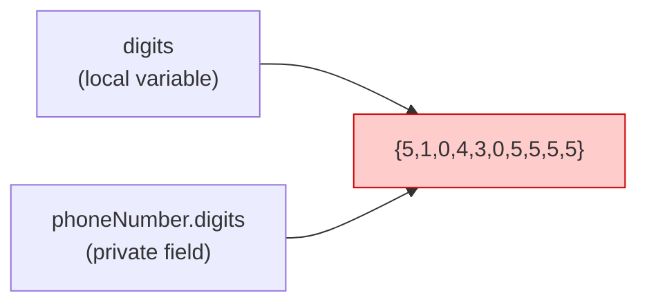
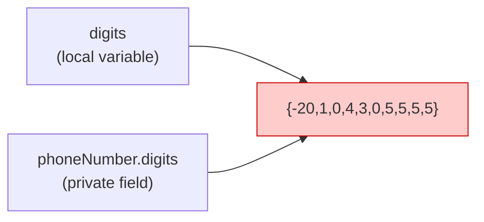
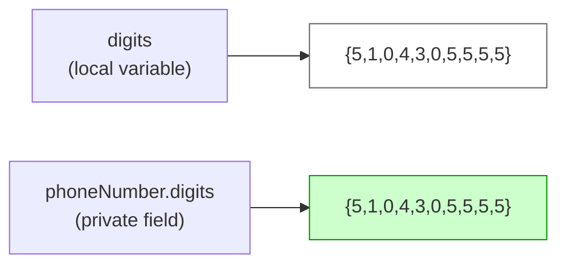
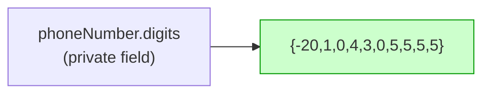

import RevealJS, { Slide } from '@site/src/components/RevealJS';
import Img from '@site/src/components/Img';
import QuoteSlide from '@site/src/components/QuoteSlide';
import ImageSlide from '@site/src/components/ImageSlide';
import PollSlide from '@site/src/components/PollSlide';

<RevealJS transition="slide">

{/* ============================================ */}
{/* COVER IMAGE */}
{/* ============================================ */}

<Slide>
  

<aside className="notes">
**Lecture overview:**
- **Total time:** ~50 minutes
- **Prerequisites:** Students understand specs, interfaces, and basic OO from L1-L5
- **Connects to:** Assignment design decisions, future lectures on design patterns

**Structure:**
- Why changeability matters (~10 min)
- Modularity and its benefits (~5 min)
- Information hiding mechanisms (~35 min): access modifiers, immutability, sealed classes, modules

**Key theme:** The majority of software cost is in maintenance—designing for change from the start is essential.

→ **Transition:** Let's start with the title slide...
</aside>

</Slide>

{/* ============================================ */}
{/* TITLE SLIDE */}
{/* ============================================ */}

<Slide>

# CS 3100: Program Design and Implementation II

## Lecture 6: Changeability I — Modularity and Information Hiding

<p style={{marginTop: '2em', fontSize: '0.8em', color: '#666'}}>
  ©2025 Jonathan Bell, CC-BY-SA
</p>

<aside className="notes">
**Context from L4-L5:**
- Students learned about specifications and contracts
- They've seen interfaces as a way to abstract behavior
- Now we zoom in on *why* those abstractions matter for real software

**Key message:** We're shifting from "how to write correct code" to "how to write code that stays correct as requirements change."

→ **Transition:** Here's what you'll learn today...
</aside>

</Slide>

{/* ============================================ */}
{/* ACADEMIC INTEGRITY */}
{/* ============================================ */}

<Slide>

## Poll: What are your goals for CS 3100 (revised, anonymous)?
<PollSlide choices={["Learning as much as possible", "Getting a high grade", "Getting a strong letter of recommendation",
"Having time for other projects", "Being ready for co-op", "Behaving with integrity"]} />

<p style={{fontSize: '0.7em', textAlign: 'left'}}>
This slide is totally anonymous. Feel free to use incognito mode.
</p>
</Slide>

<Slide>

## Poll: What should you do if you are having trouble with an assignment?
<PollSlide choices={["Give up", "Keep grinding away", "Go to office hours", "Ask a friend for help",
"View Pawtograder posts", "Ask AI for help with your problem", "Ask AI how to download the autograder code"]} />

</Slide>


{/* ============================================ */}
{/* LEARNING OBJECTIVES */}
{/* ============================================ */}

<Slide>

## Learning Objectives

<p style={{fontSize: '0.85em', textAlign: 'left'}}>
After this lecture, you will be able to:
</p>

<ol style={{fontSize: '0.75em', textAlign: 'left'}}>
  <li>Describe the importance of changeability as a goal of program design and implementation</li>
  <li>Describe the relevance of modularity to changeability</li>
  <li>Describe the role of information hiding and immutability in enabling effective modularity</li>
  <li>Apply Java language features to achieve information hiding and immutability</li>
</ol>

<aside className="notes">
**Time allocation:**
- Objective 1: Why changeability matters (~10 min)
- Objective 2: Modularity basics (~5 min)
- Objective 3-4: Java features for information hiding (~35 min)
  - Access modifiers (~7 min)
  - Immutability (~10 min)
  - Sealed classes (~10 min)
  - Java Module System (~10 min)

**Why this matters:** Students need to understand that good design isn't just about making code work—it's about making code that can evolve.

→ **Transition:** Let's start by reviewing where we are in the design process...
</aside>

</Slide>

{/* ============================================ */}
{/* ARC 1: WHY CHANGEABILITY MATTERS */}
{/* ============================================ */}

<Slide>

## The Tire Swing Meme


<p style={{fontSize: '0.7em', textAlign: 'center', color: '#666', marginTop: '0.5em'}}>
  See: <a href="https://www.businessballs.com/amusement-stress-relief/tree-swing-cartoon-pictures-early-versions/">History of the Tree Swing</a>
</p>

<aside className="notes">
**Show the classic image** (from A Pattern Language or online versions):
- "What the customer described"
- "What the analyst heard"
- "What was designed"
- "What was implemented"
- "What the customer actually needed" (a tire swing)

**The lesson:**
- Each step introduces interpretation
- Perfect requirements are impossible to write
- Even if we could, they'd change
- So we must design for change

→ **Transition:** Let's make this concrete with an example...
</aside>

</Slide>

<Slide>

## Example: A "Simple" Requirement

<p style={{fontSize: '1em', fontStyle: 'italic', marginTop: '1em'}}>
  "The Pawtograder platform should allow graders to annotate student submissions with feedback on the quality of the code."
</p>

<div style={{marginTop: '1.5em'}}>
<p style={{fontSize: '0.85em', color: '#9370DB'}}>Questions we'll have to answer:</p>
<ul style={{fontSize: '0.75em'}}>
  <li>Do annotations directly affect the score? Positive or negative scoring?</li>
  <li>Is there a rubric? How detailed? Structured with categories and levels?</li>
  <li>Are annotations associated with part of a line, or the whole line?</li>
  <li>How does the grader specify which lines to annotate?</li>
  <li>...</li>
</ul>
</div>

<aside className="notes">
**Discussion prompt:**
- Ask students: "What other questions would you ask?"
- Let them brainstorm for 1-2 minutes

**The point:**
- A single sentence spawns dozens of design decisions
- We can't answer all of them upfront
- We'll make choices that we may need to reverse

→ **Transition:** How do we handle this uncertainty?
</aside>

</Slide>

<Slide>

## The Response: Design for Changeability

<div style={{marginTop: '1em'}}>
<p style={{fontSize: '0.9em'}}>
  A core principle of modern software design:
</p>

<p style={{fontSize: '1.1em', color: '#9370DB', marginTop: '0.5em'}}>
  <strong>Favor rapid prototyping and iteration</strong> over getting requirements perfect.
</p>

<p style={{fontSize: '0.85em', marginTop: '1em'}}>
  But throwing away a design and starting over is expensive...
</p>

<p style={{fontSize: '1em', marginTop: '0.5em'}}>
  So our goal is to instill a sense of <strong>changeability</strong> in our designs.
</p>
</div>

<aside className="notes">
**Define changeability:**
- One design is more changeable than another if it is easier to make changes to it
- This is *relative* to specific kinds of changes
- We can't anticipate ALL changes—that would be over-engineering

**The balance:**
- Don't try to predict everything (YAGNI: You Ain't Gonna Need It)
- But DO structure code so that likely changes are easy
- This takes judgment and experience

→ **Transition:** What kinds of changes might we need to anticipate?
</aside>

</Slide>

<Slide>

## Types of Unknowns

| Type | Examples | Course Topics |
|------|----------|---------------|
| **Technical** | Scale? Change databases? Add features? | Modularity, interfaces, design patterns |
| **Economic** | Hosting costs? Business model changes? | Architecture, dependencies, vendor lock-in |
| **Social** | New user groups? Changing values? | Requirements, domain modeling, stakeholder analysis |
| **Environmental** | Energy costs? Efficiency regulations? | Performance, resource management |

<p style={{fontSize: '0.8em', marginTop: '1em', textAlign: 'center'}}>
  For now, we focus on <strong>technical</strong> unknowns. Other dimensions resurface later.
</p>

<aside className="notes">
**Preview of the course:**
- Today: Technical changeability (information hiding, modularity)
- Later: Economic (architecture, vendor lock-in)
- Later: Social (user-centered design, accessibility)
- Later: Environmental (performance, sustainability)

**Today's focus:**
- How do we structure code so that technical changes are easy?
- Answer: Modularity and information hiding

→ **Transition:** Let's define what we mean by modularity...
</aside>

</Slide>

{/* ============================================ */}
{/* ARC 2: MODULARITY */}
{/* ============================================ */}

<Slide>

## What is Modularity?

<div style={{display: 'flex', gap: '1.5em', alignItems: 'center'}}>
<div style={{flex: 1}}>

<p style={{fontSize: '0.95em'}}>
  The core idea: design systems as <strong>relatively independent modules</strong>.
</p>

<p style={{fontSize: '0.8em', marginTop: '0.5em'}}><strong>A module is a self-contained unit of code:</strong></p>
<ul style={{fontSize: '0.75em'}}>
  <li>Has a <strong>well-defined interface</strong> that specifies behavior</li>
  <li>Implementation is <strong>hidden</strong> and can be independently compiled</li>
  <li>Does not depend on <strong>implementation details</strong> of other modules</li>
</ul>

<p style={{fontSize: '0.75em', marginTop: '0.5em', color: '#666'}}>
  A module could be a class, a package, or even a whole program.
</p>

</div>
<div style={{flex: 1}}>

</div>
</div>

<aside className="notes">
**Levels of modularity:**
- Class: smallest unit of modularity in Java
- Package: groups of related classes
- Library/Module: groups of packages
- Service: independent program

**The pattern is fractal:**
- Same principles apply at each level
- Interfaces hide implementations
- Changes don't ripple across boundaries

→ **Transition:** But what makes a good interface? We already know the answer...
</aside>

</Slide>

<Slide>

## Good Specs Enable Modularity

<p style={{fontSize: '0.9em'}}>
  Remember <strong>Set.contains()</strong> from L4? A good spec describes <strong>what</strong>, not <strong>how</strong>.
</p>

<div style={{display: 'flex', gap: '1em', marginTop: '0.5em'}}>
<div style={{flex: 1}}>

**Definitional spec (good):**
```java
/**
 * Returns true if this set contains
 * an element e such that
 * Objects.equals(o, e).
 */
boolean contains(Object o);
```

<p style={{fontSize: '0.75em', color: '#27ae60'}}>Permits HashSet (O(1)), TreeSet (O(log n)), LinkedHashSet...</p>

</div>
<div style={{flex: 1}}>

**Operational spec (bad):**
```java
/**
 * Iterates through all elements
 * using a for-each loop,
 * comparing each with equals().
 */
boolean contains(Object o);
```

<p style={{fontSize: '0.75em', color: '#e74c3c'}}>Forces O(n) linear search!</p>

</div>
</div>

<p style={{fontSize: '0.85em', marginTop: '0.5em', color: '#9370DB'}}>
  The spec IS the module boundary. Over-constrain it, and you lose changeability.
</p>

<aside className="notes">
**Connection to L4:**
- We learned specs should be definitional, not operational
- Now we see WHY: operational specs prevent implementation changes
- The spec IS the module boundary

**The vending machine from L4:**
- Same interface (buttons, coin slot, item tray)
- Different implementations (gravity, pneumatic, hamster-powered)
- Spec says "insert money, press button, get item"
- Doesn't say HOW the item gets dispensed

→ **Transition:** But what IS a module, exactly?
</aside>

</Slide>

<Slide>

## Modules Exist at Every Scale

<p style={{fontSize: '0.85em'}}>
  A <strong>module</strong> is any unit of code with a well-defined interface. The same principles apply at every scale:
</p>

| Scale | Module | Interface |
|-------|--------|-----------|
| **Method** | A single function | Its signature and Javadoc |
| **Class** | A single type | Its public methods |
| **Package** | A group of related classes | Its public classes |
| **Library** | A group of packages | Its exported packages |
| **Service** | A whole program | Its API |

<p style={{fontSize: '0.85em', marginTop: '0.5em', color: '#9370DB'}}>
Today's challenge: Why modules, and how to enforce their boundaries?
  Next lecture's challenge: How do we decide what belongs in a module? Where are the boundaries?
</p>

<aside className="notes">
**The fractal nature:**
- Same principles at every level
- Interface hides implementation
- Changes don't ripple across boundaries

**The hard questions (coming in L7):**
- How do we decide module boundaries?
- What should be in the same module vs separate modules?
- How much should modules know about each other?

**Vocabulary preview (L7):**
- **Coupling**: How much modules depend on each other
- **Cohesion**: How related things within a module are
- Goal: Low coupling, high cohesion

→ **Transition:** So what are the benefits of getting this right?
</aside>

</Slide>

<Slide>

## Benefits of Modularity

<p style={{fontSize: '0.85em'}}>
  Why break systems into independent modules?
</p>

<div style={{display: 'grid', gridTemplateColumns: '1fr 1fr', gap: '1em', marginTop: '1em', fontSize: '0.75em'}}>
  <div>
    <p><strong>Efficiency</strong></p>
    <p style={{color: '#666'}}>Teams work in parallel without coordination (Brooks' Law)</p>
  </div>
  <div>
    <p><strong>Readability</strong></p>
    <p style={{color: '#666'}}>Easier to understand when modules are independent</p>
  </div>
  <div>
    <p><strong>Changeability</strong></p>
    <p style={{color: '#666'}}>Change one module without affecting others</p>
  </div>
  <div>
    <p><strong>Testability</strong></p>
    <p style={{color: '#666'}}>Test modules in isolation; easier to debug failures</p>
  </div>
</div>

<p style={{fontSize: '0.9em', marginTop: '1em', color: '#9370DB', textAlign: 'center'}}>
  Note: All benefits require that modules are <strong>truly independent</strong>.
</p>

<aside className="notes">
**Discuss each benefit:**
- **Efficiency:** Without independence, teams block each other. This is the lesson of Brooks' "Mythical Man-Month."
- **Readability:** You can understand one module without understanding all others.
- **Changeability:** The whole point of today's lecture.
- **Testability:** Unit tests work because modules are isolated.

**The catch:**
- These benefits only work if modules are *actually* independent
- Leaky abstractions undermine modularity
- That's why we need information hiding

→ **Transition:** But what happens when modularity breaks down?
</aside>

</Slide>

{/* ============================================ */}
{/* ARC 3: WHAT GOES WRONG */}
{/* ============================================ */}

<Slide>

## What Happens Without Modularity: The Big Ball of Mud

<p style={{fontSize: '0.85em'}}>
  The most common software architecture in practice is... no architecture at all.
</p>

<QuoteSlide
  quote="A Big Ball of Mud is a haphazardly structured, sprawling, sloppy, duct-tape-and-baling-wire, spaghetti-code jungle."
  attribution="Brian Foote and Joseph Yoder, 1997"
  size="medium"
/>

<p style={{fontSize: '0.8em', marginTop: '0.5em'}}>
  It happens gradually: shortcuts, tight deadlines, "temporary" hacks that become permanent.
</p>

<aside className="notes">
**The Big Ball of Mud paper (1997):**
- Foote and Yoder documented a pattern they saw everywhere
- Not a good pattern—an anti-pattern
- But extremely common in real codebases

**How it happens:**
- "We'll refactor later" (later never comes)
- One "quick fix" that bypasses the interface
- Copy-paste instead of creating abstractions
- No time for design reviews

**The result:**
- Everything depends on everything
- No clear boundaries
- Changes are terrifying because you don't know what will break

→ **Transition:** Let's see what this looks like in practice...
</aside>

</Slide>

<Slide>

## Symptoms of a Big Ball of Mud

<div style={{display: 'grid', gridTemplateColumns: '1fr 1fr', gap: '1.5em', marginTop: '1em', fontSize: '0.8em'}}>
  <div>
    <p><strong>🕸️ Everything touches everything</strong></p>
    <p style={{color: '#666', fontSize: '0.9em'}}>Change one file, break ten others. No clear boundaries between concerns.</p>
  </div>
  <div>
    <p><strong>😱 Fear of change</strong></p>
    <p style={{color: '#666', fontSize: '0.9em'}}>"Don't touch that code—nobody knows how it works anymore."</p>
  </div>
  <div>
    <p><strong>🔄 Duplicate code everywhere</strong></p>
    <p style={{color: '#666', fontSize: '0.9em'}}>Safer to copy-paste than risk calling shared code that might change.</p>
  </div>
  <div>
    <p><strong>📚 Tribal knowledge required</strong></p>
    <p style={{color: '#666', fontSize: '0.9em'}}>Only the original author understands it. Onboarding takes months.</p>
  </div>
</div>

<p style={{fontSize: '0.85em', marginTop: '1em', color: '#9370DB', textAlign: 'center'}}>
  The root cause: modules that <strong>should</strong> be independent aren't actually independent.
</p>

<aside className="notes">
**Ask students:**
- Have you ever worked on code where you were afraid to make changes?
- Have you seen code that "only Alice understands"?
- These are symptoms of poor modularity

**The vicious cycle:**
- Bad structure makes changes hard
- So people take shortcuts
- Shortcuts make structure worse
- Eventually: Big Ball of Mud

**Breaking the cycle:**
- Design for change from the start
- Enforce boundaries with language features
- That's what information hiding gives us

→ **Transition:** How do we prevent this?
</aside>

</Slide>

<Slide>

## "Life of a Software Engineer" by Manu Cornet


</Slide>
<Slide>

## The Cure: Enforce Module Boundaries

<p style={{fontSize: '0.9em'}}>
  Good intentions aren't enough. We need <strong>enforcement</strong>.
</p>

<div style={{display: 'flex', gap: '1.5em', marginTop: '1em'}}>
<div style={{flex: 1, fontSize: '0.8em'}}>

**Without enforcement:**
- "Please don't use this internal method"
- "This field is for internal use only"
- "Don't depend on this behavior"

<p style={{color: '#e74c3c', marginTop: '0.5em'}}>Developers will do it anyway. Deadlines happen.</p>

</div>
<div style={{flex: 1, fontSize: '0.8em'}}>

**With enforcement:**
- `private` — compiler rejects access
- `final` — compiler rejects modification
- `sealed` — compiler rejects subclasses
- Modules — compiler rejects unexported packages

<p style={{color: '#27ae60', marginTop: '0.5em'}}>The compiler is your boundary guard.</p>

</div>
</div>

<aside className="notes">
**The key insight:**
- Documentation and conventions don't scale
- "Please don't" becomes "someone did"
- Language-level enforcement is the only reliable protection

**Preview of what's coming:**
- Access modifiers (private, public, etc.)
- Immutability (final fields, final classes)
- Sealed classes (controlled inheritance)
- Module system (package-level hiding)

→ **Transition:** Let's see how this plays out at scale...
</aside>

</Slide>

<Slide>

## Information Hiding Across Languages

<p style={{fontSize: '0.85em'}}>
  Not all languages enforce modularity the same way. Compare Java and Python:
</p>

<div style={{display: 'grid', gridTemplateColumns: '1fr 1fr', gap: '2em', marginTop: '1em', fontSize: '0.75em'}}>

  <div>
    <p><strong>Python: Convention-Based</strong></p>
```python
    class GradeBook:
        def __init__(self):
            self._grades = []  # "please don't"
            self.__secret = [] # name-mangled

    book._GradeBook__secret  # still works!
```
    <p style={{color: '#666', fontSize: '0.9em', marginTop: '0.5em'}}>
      "We're all consenting adults here."
    </p>
  </div>
    <div>
    <p><strong>Java: Compiler-Enforced</strong></p>
```java
    public class GradeBook {
        private List<Double> grades;
        // Compiler error if accessed
        // from outside the class
    }
```
    <p style={{color: '#666', fontSize: '0.9em', marginTop: '0.5em'}}>
      The language <em>prevents</em> violations (mostly—reflection exists).
    </p>
  </div>
</div>

<p style={{fontSize: '0.85em', marginTop: '1em', color: '#9370DB', textAlign: 'center'}}>
  Both communities function—different tradeoffs between <strong>enforcement</strong> and <strong>trust</strong>.
</p>

<aside className="notes">
**Python's philosophy:**
- Single underscore `_field`: "treat this as internal"
- Double underscore `__field`: name mangling to `_ClassName__field`
- But nothing actually stops you from accessing it

**The tradeoff:**
- Java: compiler catches violations immediately
- Python: relies on social contract and code review
- Python's view: if you bypass the underscore convention and something breaks, that's on you

**Why this matters for the course:**
- Information hiding is a *design principle*, not just a language feature
- Java gives you tools to enforce it
- But even Java's `private` can be bypassed with reflection (see content coupling later)
- The principle is what matters; the language just helps you stick to it

**Discussion question:**
- Which approach do you prefer? Why?
- What happens on a team with mixed experience levels?
</aside>

</Slide>

<Slide>

## The Python Approach


</Slide>

<Slide>

## The Java Approach


</Slide>

{/* ============================================ */}
{/* ARC 4: INFORMATION HIDING */}
{/* ============================================ */}

<Slide>

## Information Hiding: The Key to True Modularity

<p style={{fontSize: '0.95em', marginTop: '0.5em'}}>
  Even with good design, developers will find unintended ways to use your module...
</p>

<QuoteSlide
  quote="With a sufficient number of users of an API, it does not matter what you promise in the contract: all observable behaviors of a system will be depended on by somebody."
  attribution="Hyrum Wright/Titus Winters"
  size="medium"
  imageSrc="/img/lectures/web/l6-hyrum-wright.jpg"
  imageAlt="Hyrum Wright"
/>


<aside className="notes">
**Explain Hyrum's Law:**
- Named after Hyrum Wright at Google
- If behavior is observable, someone will depend on it
- Even bugs become "features" that people rely on

**The solution:**
- Information hiding = make internal behaviors *unobservable*
- If users can't see it, they can't depend on it
- Then you're free to change it

→ **Transition:** XKCD illustrates this perfectly...
</aside>

</Slide>

<Slide>

## Information Hiding (XKCD)


<p style={{fontSize: '0.7em', textAlign: 'center', color: '#666', marginTop: '0.5em'}}>
  <a href="https://xkcd.com/1172/">XKCD 1172</a> — "Every change breaks someone's workflow"
</p>

<aside className="notes">
**The comic:**
- Developer fixes a bug
- User complains: "You broke my workflow!"
- User was RELYING on the bug behavior

**This is Hyrum's Law in action:**
- The bug wasn't in the spec
- But it was observable
- So someone depended on it
- Now fixing it is a "breaking change"

**The lesson:**
- Observable behavior becomes de facto API
- Even unintended behavior
- Information hiding prevents this by making internals unobservable

→ **Transition:** Where did this idea come from?
</aside>

</Slide>

<Slide>

## A Brief History of Information Hiding

<p style={{fontSize: '0.85em'}}>
  David Parnas proposed information hiding in 1972 — before most programming languages supported it.
</p>

<p style={{fontSize: '0.8em', marginTop: '0.5em'}}>Back then:</p>
<ul style={{fontSize: '0.75em'}}>
  <li>You could organize code into modules...</li>
  <li>...but nothing prevented access to internal details</li>
  <li>Discipline was the only enforcement</li>
</ul>

<aside className="notes">
**Historical context:**
- 1972: Before C even had structs
- Parnas was arguing for something languages didn't support
- His paper became foundational for OO design

→ **Transition:** Let's see what code looked like without language-enforced information hiding...
</aside>

</Slide>

<Slide>

## Important Terminology

* **invariant**: a property that always holds
* **precondition**: a property that must hold before an action is performed
* **postcondition**: a property guaranteed to hold after an action is completed


</Slide>

<Slide>

## Without Information Hiding: Everything is Accessible

<p style={{fontSize: '0.85em'}}>
  Imagine Java without <code>private</code> — all fields are accessible:
</p>

```java
// Counter "module" — intended to only increment
class Counter {
    int count = 0;  // count will never be negative

    void increment() { count++; }
    int getCount() { return count; }
}
```

```java
// Client code in another file...
Counter c = new Counter();
c.increment();     // Intended use
c.count = -999;    // Nothing stops this!
c.count = c.count * 2;  // Or this!
```

<p style={{fontSize: '0.8em', marginTop: '0.5em', color: '#e74c3c'}}>
  The "module" can't enforce its own invariants. Any client can break it.
</p>

<aside className="notes">
**The problem:**
- Counter is SUPPOSED to only increment
- But without `private`, anyone can directly modify `count`
- The module author has NO control
- Invariants (count >= 0, monotonically increasing) can't be enforced

**In 1972:**
- This was how ALL code worked
- Parnas argued we NEED language support for hiding
- "Please don't touch this field" doesn't scale

**Why this matters for changeability:**
- What if Counter needs to log every change?
- What if we need to notify listeners?
- Can't do it—clients bypass the methods entirely

→ **Transition:** Modern languages solved this...
</aside>

</Slide>

<Slide>

## Modern Languages Enforce Information Hiding

<p style={{fontSize: '0.85em'}}>
  Java gives us: access modifiers, <code>final</code>, sealed classes, and modules — all <strong>language-level</strong> enforcement.
</p>

```java
class Counter {
    private int count = 0;  // Now enforced by compiler!

    public void increment() { count++; }
    public int getCount() { return count; }
}
```

```java
Counter c = new Counter();
c.increment();     // OK
c.count = -999;    // Compiler error!
```

<p style={{fontSize: '0.8em', marginTop: '0.5em', color: '#27ae60'}}>
  Now the module controls its own state. Invariants are enforceable.
</p>

<aside className="notes">
**What changed:**
- `private` makes the field invisible outside the class
- Compiler ENFORCES the hiding—not just documentation
- Module author has control over their own state

**Benefits:**
- Can add logging in increment() — all changes go through it
- Can add validation — reject invalid states
- Can change internal representation — clients don't know or care

**The key insight:**
- Information hiding isn't just "good practice"
- It's what makes modularity REAL
- Without enforcement, "modules" are just suggestions

→ **Transition:** Let's look at all the Java features for information hiding...
</aside>

</Slide>

<Slide>

## Java Language Features for Information Hiding

<p style={{fontSize: '0.9em', marginTop: '1em'}}>
  In OO design, these features enable <strong>encapsulation</strong>:
</p>

<ol style={{fontSize: '0.85em', marginTop: '1em', paddingLeft: '1.5em'}}>
  <li style={{paddingLeft: '0.3em'}}><strong>Access modifiers</strong> — control who can see what</li>
  <li style={{paddingLeft: '0.3em'}}><strong>Immutable classes</strong> — prevent state changes after construction</li>
  <li style={{paddingLeft: '0.3em'}}><strong>Sealed classes</strong> — control who can extend a type</li>
  <li style={{paddingLeft: '0.3em'}}><strong>The module system</strong> — hide entire packages from library consumers</li>
</ol>

<aside className="notes">
**Roadmap for the rest of the lecture:**
- ~7 min on access modifiers
- ~10 min on immutability
- ~10 min on sealed classes
- ~10 min on modules

**The progression:**
- Each mechanism hides information at a larger scale
- Access modifiers: hide fields within a class
- Immutability: hide ability to change state
- Sealed classes: hide ability to extend
- Modules: hide entire packages

→ **Transition:** Let's start with access modifiers...
</aside>

</Slide>

{/* ============================================ */}
{/* ACCESS MODIFIERS */}
{/* ============================================ */}

<Slide>

## Access Modifiers in Java

<div style={{display: 'flex', gap: '1.5em', alignItems: 'center'}}>
<div style={{flex: 1}}>

<p style={{fontSize: '0.8em'}}>
  Every class, method, and field has an access modifier:
</p>

<table style={{fontSize: '0.7em', marginTop: '0.5em', width: '100%'}}>
  <thead>
    <tr>
      <th>Modifier</th>
      <th>Visibility</th>
    </tr>
  </thead>
  <tbody>
    <tr>
      <td><code>public</code></td>
      <td>Accessible from anywhere</td>
    </tr>
    <tr>
      <td><code>protected</code></td>
      <td>Accessible from package and subclasses</td>
    </tr>
    <tr>
      <td><em>(default)</em></td>
      <td>Package-private: same package only</td>
    </tr>
    <tr>
      <td><code>private</code></td>
      <td>Accessible only within the class</td>
    </tr>
  </tbody>
</table>

<p style={{fontSize: '0.8em', marginTop: '0.5em', color: '#9370DB'}}>
  Rule: <strong>Minimize accessibility</strong> of classes and members.
</p>

</div>
</div>

<aside className="notes">
**Effective Java Item 15:**
- "Minimize the accessibility of classes and members"
- Everything public is part of your API
- Once public, hard to take back

**Order of preference:**
1. Private (strongest encapsulation)
2. Package-private (default—useful for implementation helpers)
3. Protected (needed for inheritance)
4. Public (only for genuine API)

→ **Transition:** Why is this especially important for fields?
</aside>

</Slide>

<Slide>

## Why Make Fields Private?

<div style={{display: 'flex', gap: '1em'}}>
<div style={{flex: 1}}>

**Public field:** 😬

```java
/**
 * Counter increments monotonically.
 */
public class Counter {
    public int count;  // BAD

    public void increment() {
        count++;
    }
}
```

```java
Counter c = new Counter();
c.increment(); // count = 1
c.count = 0;   // Surprise!
```

</div>
<div style={{flex: 1}}>

**Private field:** ✅

```java
/**
 * Counter increments monotonically.
 */
public class Counter {
    private int count;  // GOOD

    public int getCount() {
        return count;
    }

    public void increment() {
        count++;
    }
}
```

</div>
</div>

<aside className="notes">
**The invariant:**
- The spec says count increments monotonically
- But with a public field, anyone can set it to anything!
- The class can't enforce its own invariants

**With private fields:**
- The only way to modify count is through increment()
- The class controls all access
- Invariants are preserved

**Even without explicit invariants:**
- Private fields let you change implementation later
- Add validation, logging, lazy initialization...
- All without changing the API

→ **Transition:** Now let's talk about preventing change entirely...
</aside>

</Slide>

{/* ============================================ */}
{/* IMMUTABILITY */}
{/* ============================================ */}

<Slide>

## Immutable Classes

<div style={{display: 'flex', gap: '1.5em', alignItems: 'center'}}>
<div style={{flex: 1}}>

<p style={{fontSize: '0.85em'}}>
  <strong>Immutable classes:</strong> instances cannot be changed after construction.
</p>

<ul style={{fontSize: '0.75em', marginTop: '0.5em'}}>
  <li>Simpler to reason about—behavior determined by constructor</li>
  <li>Safe to pass between modules—no surprise mutations</li>
  <li>Thread-safe by default</li>
</ul>

<p style={{fontSize: '0.85em', marginTop: '0.5em', color: '#9370DB'}}>
  Default to immutable. Only make mutable if there's a good reason.
</p>

</div>
</div>

<aside className="notes">
**Effective Java Item 17:**
- "Minimize mutability"
- Make classes immutable unless there's a compelling reason not to

**Why immutability helps:**
- No defensive copying needed
- Can share instances freely
- Easier to test (no state changes to track)
- Thread-safe without synchronization

**When to allow mutability:**
- Objects with identity (not just value)
- Performance-critical accumulation
- Domain truly requires it

→ **Transition:** Let's see how to make a class immutable...
</aside>

</Slide>

<Slide>

## Example: An Immutable PhoneNumber Class

```java
public final class PhoneNumber {
    private final short areaCode;
    private final short centralOfficeCode;
    private final short number;

    public PhoneNumber(short areaCode, short centralOfficeCode, short number) {
        this.areaCode = areaCode;
        this.centralOfficeCode = centralOfficeCode;
        this.number = number;
    }

    public short getAreaCode() { return areaCode; }
    public short getCentralOfficeCode() { return centralOfficeCode; }
    public short getNumber() { return number; }
}
```

<p style={{fontSize: '0.8em', marginTop: '0.5em', color: '#9370DB'}}>
  This looks a lot like a <strong>record</strong> from L5! And indeed, <code>record PhoneNumber(short areaCode, short centralOfficeCode, short number) {'{}'}</code> would give us the same immutability guarantees with less boilerplate.
</p>

<aside className="notes">
**The recipe so far:**
1. `final` class — prevents subclasses from adding mutability
2. `private final` fields — can't be changed after construction
3. No setters — only getters

**Connection to records:**
- Records are Java's shorthand for exactly this pattern
- Records are implicitly final with final fields
- But understanding the manual version helps you see *why* records work

**Why final class?**
- A subclass could override methods
- That subclass could add mutable behavior
- Users of the parent type wouldn't know

**For primitives, this is enough. But what about reference types?**

→ **Transition:** There's a subtle trap with reference fields...
</aside>

</Slide>

<Slide>

## Can you break the invariant from a client? 1

```java
/**
 * A phone number consisting of 10 digits in the range 0-9 inclusive.
 */
public class PhoneNumber {
  private final int[] digits;

  public PhoneNumber(int[] digits) {
    Objects.requireNonNull(digits);
    if (digits.length != 10) {
      throw new IllegalArgumentException("numbers length must be 10");
    }
    for (int i = 0; i < digits.length; i++) {
      if (digits[i] < 0 || digits[i] > 9) {
        throw new IllegalArgumentException("digits must be between 0 and 9");
      }
    }
    this.digits = digits;
  }
}
```

<div className="fragment">
```java
  public static void main(String[] args) {
    int[] digits = {5, 1, 0, 4, 3, 0, 5, 5, 5, 5};
    PhoneNumber phoneNumber = new PhoneNumber(digits);
    digits[0] = -20; // breaks invariant
  }
```
</div>

</Slide>

<Slide>

# Visualization 1

```java
int[] digits = {5, 1, 0, 4, 3, 0, 5, 5, 5, 5};
PhoneNumber phoneNumber = new PhoneNumber(digits);
```



<div className="fragment">
```java
digits[0] = -20; // breaks invariant
```


</div>
</Slide>

<Slide>

## Can you break the invariant from a client? 2

```java
/**
 * A phone number consisting of 10 digits in the range 0-9 inclusive.
 */
public class PhoneNumber {
  private final int[] digits;

  public PhoneNumber(int[] digits) {
    // validation code hidden
    this.digits = digits.clone(); // make a defensive copy
  }

  public int[] getDigits() {
    return digits;
  }
}
```

<div className="fragment">
```java
  public static void main(String[] args) {
    int[] digits = {5, 1, 0, 4, 3, 0, 5, 5, 5, 5};
    PhoneNumber phoneNumber = new PhoneNumber(digits);
    digits[0] = -20; // does not affect phoneNumber.digits
    phoneNumber.getDigits()[0] = -20; // breaks invariant
  }
```
</div>

</Slide>

<Slide>

# Visualization 2

```java
int[] digits = {5, 1, 0, 4, 3, 0, 5, 5, 5, 5};
PhoneNumber phoneNumber = new PhoneNumber(digits);
```



<div className="fragment">
```java
phoneNumber.getDigits()[0] = -20
```


</div>
</Slide>

<Slide>

## Correct Implementation

```java
/**
 * A phone number consisting of 10 digits in the range 0-9 inclusive.
 */
public class PhoneNumber {
  private final int[] digits;

  public PhoneNumber(int[] digits) {
    Objects.requireNonNull(digits);
    if (digits.length != 10) {
      throw new IllegalArgumentException("numbers length must be 10");
    }
    for (int i = 0; i < digits.length; i++) {
      if (digits[i] < 0 || digits[i] > 9) {
        throw new IllegalArgumentException("digits must be between 0 and 9");
      }
    }
    this.digits = digits.clone(); // make a defensive copy
  }

  public int[] getDigits() {
    return digits.clone(); // make a defensive copy
  }
}
```

</Slide>


<Slide>

## Defensive Copies Protect Reference Fields

<p style={{fontSize: '0.9em'}}>
  For reference types, make copies on the way in <strong>and</strong> out:
</p>

```java
public final class PhoneNumber {
    private final short[] number;

    public PhoneNumber(short[] number) {
        // Defensive copy on the way in
        this.number = new short[number.length];
        System.arraycopy(number, 0, this.number, 0, number.length);
    }

    public short[] getNumber() {
        // Defensive copy on the way out
        short[] copy = new short[number.length];
        System.arraycopy(number, 0, copy, 0, number.length);
        return copy;
    }
}
```

<aside className="notes">
**Effective Java Item 50:**
- "Make defensive copies when needed"
- Copy mutable parameters on entry
- Copy mutable fields on exit

**System.arraycopy:**
- More efficient than a loop
- Same effect as copying element by element

**Alternative: Use immutable types:**
- `List.of()` returns an immutable list
- `Collections.unmodifiableList()` wraps existing list
- Prefer immutable types over defensive copying when possible

→ **Transition:** Let's summarize the recipe...
</aside>

</Slide>

<Slide>
 ## Poll: Can a Client Break the Invariant?

 <PollSlide
  choices = {["yes, both fields are vulnerable", "yes, name is vulnerable", "yes, entranceYear is vulnerable",  "no, it's safe", "I don't know"]}
  code={`
  /**
   * A Northeastern student whose entrance year is no earlier than
   * NU's founding and no later than the current year.
   */
  public class NortheasternStudent {
    private static final int FOUNDING_YEAR = 1898;
    private String name;
    private int entranceYear;

    public NortheasternStudent(String name, int entranceYear) {
      this.name = name;
      if (entranceYear < FOUNDING_YEAR || entranceYear > Year.now().getValue()) {
        throw new IllegalArgumentException("entranceYear " + entranceYear +
            " is out of range " + FOUNDING_YEAR + "..." + Year.now().getValue());
      }
      this.entranceYear = entranceYear;
    }
  }
  `}
 />


</Slide>

<Slide>

## Recipe for Safety

<ul style={{fontSize: '0.85em'}}>
  <li>Do not provide any <strong>mutators</strong> (methods that change state)</li>
  <li>Make the class <code>final</code> to prevent subclasses</li>
  <li>Make all fields <code>final</code></li>
  <li>Make all fields <code>private</code></li>
  <li>For reference fields, make <strong>defensive copies</strong> of <strong>mutable objects</strong> in constructors and getters</li>
  <ul>
    <li> Copies are automatically made with primitive assignment (`this.year = year;`)</li>
    <li> There's no need to make copies of immutable object types, such as `String`</li>
  </ul>
</ul>

<p style={{fontSize: '0.85em', marginTop: '1em', color: '#9370DB'}}>
  Even without a specific invariant to protect, prefer immutability. It makes code easier to understand and maintain.
</p>

<aside className="notes">
**The five steps:**
1. No setters, no mutating methods
2. `final class` — no sneaky subclasses
3. `final` fields — set once in constructor
4. `private` fields — controlled access
5. Defensive copies — isolate from external mutation

**Java Records (Java 16+):**
- Records are a shorthand for immutable data classes
- `record PhoneNumber(short areaCode, short centralOffice, short number) {}`
- Automatically final, with final fields and getters
- But still need defensive copies for reference types!

→ **Transition:** What about controlling *who can extend* a class?
</aside>

</Slide>

{/* ============================================ */}
{/* SEALED CLASSES */}
{/* ============================================ */}

<Slide>

## Uncontrolled Subtyping

)"
prompt="Create a two-panel illustration for a computer science lecture slide about 'uncontrolled subtyping' in object-oriented programming.
Left panel - 'The Type Hierarchy':
Show a family tree structure. At the top is a friendly parent figure labeled 'IoTDevice'. Below it, connected by clear inheritance lines, are three children: a warm, friendly lightbulb labeled 'DimmableLight', a trustworthy thermostat labeled 'Thermostat', and a sinister spiky red-eyed robot labeled 'MaliciousDevice'. All three connect upward to the same parent—the malicious one got in because the parent couldn't control who its children would be.
Right panel - 'The Trusting Method':
Show a friendly office worker, security guard, or butler at a door labeled 'sendCommandToAll(List<IoTDevice>)'. They're cheerfully waving through a line of devices—the nice lightbulb, the friendly thermostat, and (uh oh!) the malicious robot, who is poorly disguised with a fake smile but still clearly sinister underneath. All of the devices are heading toward the entrance. The worker can't refuse entry because everyone in line has valid 'IoTDevice' credentials. Perhaps the malicious device is hiding something behind its back or has a thought bubble showing evil plans.
The connection between panels: because the type hierarchy allows anyone in (left), the method that trusts that type has no way to refuse the imposter (right).
Saturday morning cartoon aesthetic—playful but the danger should be clear. Horizontal orientation, clean composition suitable for a presentation slide. No code or text other than the labels mentioned." />
</Slide>

<Slide>

## The Problem: Uncontrolled Inheritance

<p style={{fontSize: '0.85em'}}>
  Imagine you're building a smart home system with different device types:
</p>

```java
public class IoTDevice {
    public void sendCommand(String cmd) { /* ... */ }
}

public class DimmableLight extends IoTDevice { /* ... */ }
public class Thermostat extends IoTDevice { /* ... */ }
```

<p style={{fontSize: '0.85em', marginTop: '0.5em'}}>
  But someone else adds this their deployment of your code:
</p>

```java
public class MaliciousDevice extends IoTDevice {
    @Override
    public void sendCommand(String cmd) {
        uploadToHackerServer(cmd);  // Oops!
        super.sendCommand(cmd);
    }
}
```

<p style={{fontSize: '0.8em', marginTop: '0.5em', color: '#9370DB'}}>
  <code>final</code> on <code>IoTDevice</code> would prevent this—but then you can't have <em>any</em> subclasses!
</p>

<aside className="notes">
**The dilemma:**
- You want DimmableLight, Thermostat, etc. to extend IoTDevice
- But you don't want arbitrary code to create new subclasses
- `final` is too restrictive—prevents ALL inheritance
- Without `final`, anyone can subclass and break your invariants

**Real-world examples:**
- Security-sensitive code where you need to control the type hierarchy
- Domain models where only certain subtypes make sense
- APIs where you want to add subtypes later but control what exists now

→ **Transition:** Java 17 introduced sealed classes to solve this...
</aside>

</Slide>


<Slide>

## Sealed Classes: Controlled Inheritance

<p style={{fontSize: '0.85em'}}>
  <strong>Sealed classes</strong> let you specify exactly which classes can extend:
</p>

```java
public sealed class IoTDevice
    permits DimmableLight, SwitchedLight, Thermostat {
    // ...
}
```


<aside className="notes">
**The middle ground:**
- `final` = no subclasses
- `sealed` = controlled subclasses
- (default) = anyone can subclass

**Why this matters:**
- You can add new permitted subclasses later
- But you prevent unexpected subclasses from appearing
- Control over your type hierarchy

→ **Transition:** What must the permitted subclasses declare?
</aside>

</Slide>

<Slide>

## Subclasses of Sealed Classes

<p style={{fontSize: '0.85em'}}>
  Classes extending a sealed class must declare themselves as one of:
</p>

<table style={{fontSize: '0.7em', marginTop: '0em'}}>
  <tbody>
    <tr><td><code>final</code></td><td>Cannot be extended further</td></tr>
    <tr><td><code>sealed</code></td><td>Must specify its own permitted subclasses</td></tr>
    <tr><td><code>non-sealed</code></td><td>Reopens the hierarchy—anyone can extend</td></tr>
  </tbody>
</table>

```java
public sealed class IoTDevice permits DimmableLight, SwitchedLight, Thermostat { }

public final class DimmableLight extends IoTDevice { }  // Cannot be extended

public final class SwitchedLight extends IoTDevice { }  // Cannot be extended

public non-sealed class Thermostat extends IoTDevice { }  // Open for extension
```


<aside className="notes">
**The three options:**
- `final`: This branch of the hierarchy is closed
- `sealed`: Continue controlled extension
- `non-sealed`: Open this branch to anyone

**Flexibility:**
- Can mix and match in a hierarchy
- Some branches closed, others open
- Fine-grained control

→ **Transition:** Why do sealed classes matter for changeability?
</aside>

</Slide>

<Slide>

## Why Sealed Classes Matter

<p style={{fontSize: '0.9em'}}><strong>1. Controlled evolution</strong></p>
<p style={{fontSize: '0.8em', color: '#666'}}>Add new permitted subclasses in future versions without breaking existing code.</p>

<p style={{fontSize: '0.9em', marginTop: '1em'}}><strong>2. Exhaustive pattern matching</strong></p>
<p style={{fontSize: '0.8em', color: '#666'}}>The compiler knows all possible subtypes:</p>

```java
public String describe(IoTDevice device) {
    if (device instanceof DimmableLight d) {
        return "Dimmable light at " + d.getBrightness() + "%";
    } else if (device instanceof SwitchedLight s) {
        return "Switched light: " + (s.isOn() ? "on" : "off");
    } else if (device instanceof Thermostat t) {
        return "Thermostat set to " + t.getTargetTemp() + "°";
    }
    // Compiler warns if we miss a case (unless non-sealed in hierarchy)
    return "Unknown device";
}
```

<aside className="notes">
**Exhaustiveness checking:**
- Compiler knows all possible types
- Can warn about missing cases
- Safer refactoring when adding new subtypes

**Note about non-sealed:**
- `Thermostat` is non-sealed, so there could be unknown subtypes
- That's why we need the default case here
- If all were final, compiler would know we covered everything

→ **Transition:** Third benefit...
</aside>

</Slide>

<Slide>

## Sealed Classes for Domain Modeling

<p style={{fontSize: '0.9em'}}>
  Sealed classes model domains with a <strong>closed set of possibilities</strong>:
</p>

```java
public sealed interface PaymentMethod
    permits CreditCard, BankTransfer, DigitalWallet { }

public final class CreditCard implements PaymentMethod { ... }
public final class BankTransfer implements PaymentMethod { ... }
public final class DigitalWallet implements PaymentMethod { ... }
```

<p style={{fontSize: '0.85em', marginTop: '1em'}}>
  The type system now enforces that a <code>PaymentMethod</code> is one of exactly three things. Adding a new subtype requires a change to <code>PaymentMethod</code>
</p>

<aside className="notes">
**Domain modeling:**
- Some domains have enumerated possibilities
- Not just "any implementation"—a specific set
- Sealed types make this explicit

**Works with interfaces too:**
- `sealed interface` permits specific implementations
- Combines interface benefits with controlled hierarchy

**Compare to enums:**
- Enums: fixed set of singleton values
- Sealed: fixed set of types (with different instances)

→ **Transition:** Now let's scale up to the library level...
</aside>

</Slide>

{/* ============================================ */}
{/* JAVA MODULE SYSTEM */}
{/* ============================================ */}

<Slide>

## Scaling Up: The Java Module System

<p style={{fontSize: '0.85em'}}>
  Access modifiers work at the <strong>class level</strong>. But what about <strong>library</strong> level?
</p>

<p style={{fontSize: '0.8em', marginTop: '0.5em'}}><strong>The problem:</strong></p>
<ul style={{fontSize: '0.75em'}}>
  <li>Internal classes must be <code>public</code> for your packages to use them</li>
  <li>But that makes them visible to library <em>consumers</em> too!</li>
  <li>"Internal API - do not use" doesn't stop determined developers</li>
</ul>

<p style={{fontSize: '0.85em', marginTop: '0.5em', color: '#9370DB'}}>
  This is Hyrum's Law at the library scale.
</p>

<aside className="notes">
**The real-world problem:**
- You have utility classes shared across packages
- They must be `public` so your packages can see them
- But consumers see them too
- Consumers depend on them
- Now you can't change them!

**Before Java 9:**
- No solution except discipline
- "Please don't use this" in Javadoc
- Doesn't work

→ **Transition:** Java 9 introduced the module system to solve this...
</aside>

</Slide>

<Slide>

## The `module-info.java` File

<p style={{fontSize: '0.85em'}}>
  Declare which packages are part of your public API:
</p>

```java
// module-info.java for a hypothetical grading library
module com.pawtograder.grading {
    // These packages are our public API - consumers can use them
    exports com.pawtograder.grading.api;
    exports com.pawtograder.grading.model;

    // com.pawtograder.grading.impl is NOT exported
    // Classes there can be public but invisible to consumers
}
```

<p style={{fontSize: '0.8em', marginTop: '1em'}}>
  Unexported packages are <strong>module-private</strong>—even <code>public</code> classes are hidden!
</p>

<aside className="notes">
**How it works:**
- `exports` declares packages that consumers can access
- Unexported packages are hidden
- Public classes in unexported packages are invisible outside the module

**This is a new level of encapsulation:**
- At class level: private fields
- At package level: package-private classes
- At module level: unexported packages

→ **Transition:** Let's visualize this...
</aside>

</Slide>

<Slide>

## Encapsulation at Every Level

| Scope | Mechanism | What it hides |
|-------|-----------|---------------|
| Field | `private` keyword | Implementation state within a class |
| Class | Package-private (default) | Helper classes within a package |
| Library | Module system (`exports`) | Internal packages within a library |

<p style={{fontSize: '0.85em', marginTop: '1em'}}>
  Same principle at different scales:
</p>

<ul style={{fontSize: '0.8em'}}>
  <li>Reduced coupling</li>
  <li>Clearer contracts</li>
  <li>Safer evolution</li>
</ul>

<aside className="notes">
**The fractal nature:**
- Private fields → can change class internals
- Package-private classes → can change package internals
- Unexported packages → can change library internals

**The consistent theme:**
- Hide implementation details
- Expose only what's needed
- Preserve freedom to change

→ **Transition:** Let's wrap up...
</aside>

</Slide>

{/* ============================================ */}
{/* CONCLUSION */}
{/* ============================================ */}

<Slide>

## Key Takeaways

<div style={{display: 'flex', gap: '1.5em', alignItems: 'center'}}>
<div style={{flex: 1}}>

<ol style={{fontSize: '0.8em'}}>
  <li><strong>Changeability is essential</strong> — most software cost is maintenance</li>
  <li><strong>Modularity enables change</strong> — independent modules evolve independently</li>
  <li><strong>Information hiding protects modularity</strong> — Hyrum's Law warns us</li>
  <li><strong>Java provides tools at every scale:</strong> Access modifiers, immutability, sealed classes, modules</li>
</ol>

</div>
</div>

<aside className="notes">
**Summary:**
1. Requirements change; code must adapt
2. Modularity is the strategy
3. Information hiding is the tactic
4. Java gives us language-level enforcement

**Looking ahead:**
- Next lectures: More design principles for changeability
- Design patterns for flexible designs
- Later: Architecture and system-level modularity

→ **Transition:** Any questions?
</aside>

</Slide>

<Slide>

## Looking Ahead

<p style={{fontSize: '0.9em'}}>
  The module system is our first glimpse of how design principles scale beyond individual classes.
</p>

<div style={{marginTop: '1em', fontSize: '0.85em'}}>
<p>Later in the course:</p>
<ul>
  <li><strong>Software Architecture</strong> (Lecture 19) — System-level modularity</li>
  <li><strong>Open Source Ecosystems</strong> (Lecture 23) — Library boundaries</li>
  <li><strong>Sustainability</strong> (Lecture 36) — Long-term technical health</li>
</ul>
</div>

<p style={{fontSize: '1em', marginTop: '1em', color: '#9370DB', textAlign: 'center'}}>
  <strong>Information hiding is fractal.</strong><br/>
  <span style={{fontSize: '0.85em'}}>The same principle that makes a well-designed class easier to change also makes a well-designed system easier to change.</span>
</p>

<aside className="notes">
**Preview:**
- Today: Class and package level
- Later: Service and organization level
- Same principles apply throughout

**The big picture:**
- Good design is about managing complexity
- Information hiding is the core technique
- It works at every scale

**Questions?**
</aside>

</Slide>

</RevealJS>
