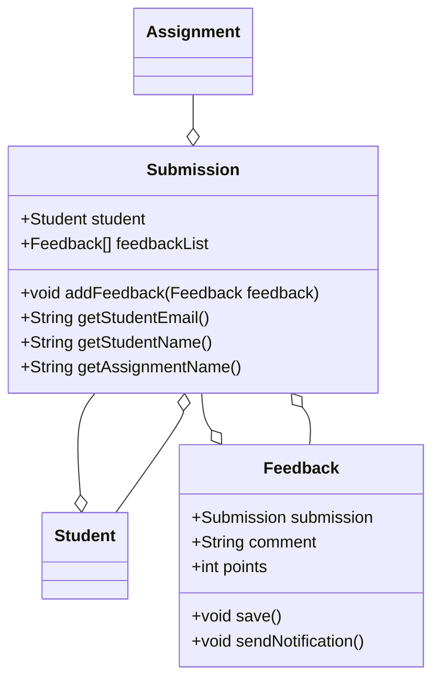
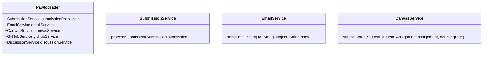
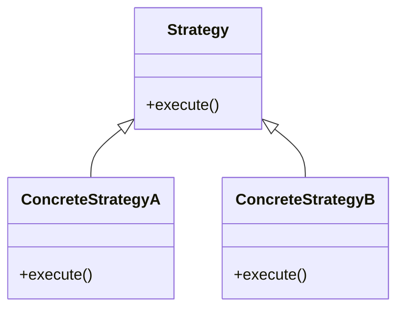
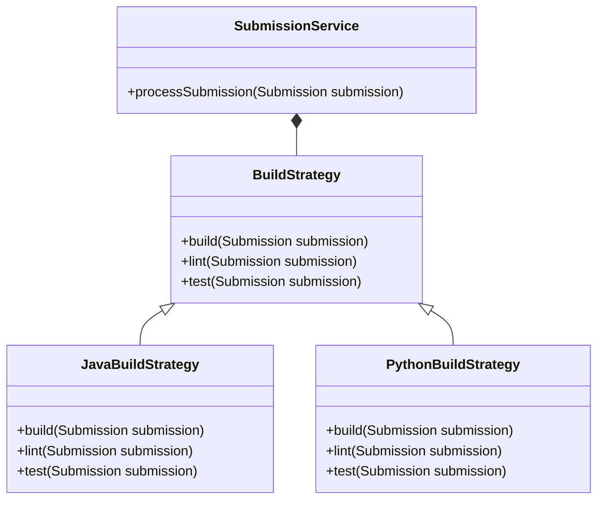
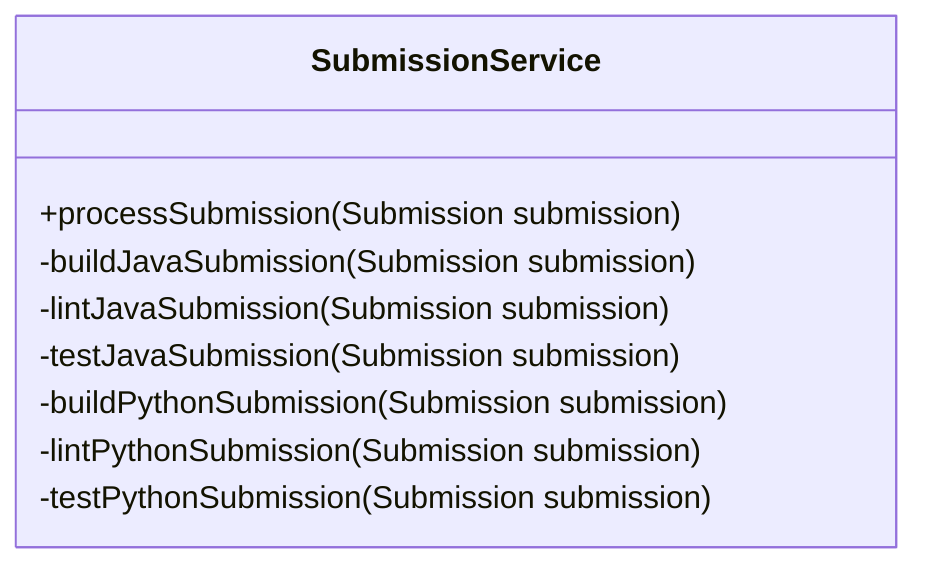

import RevealJS, { Slide } from '@site/src/components/RevealJS';
import Img from '@site/src/components/Img';
import PollSlide from '@site/src/components/PollSlide';

<RevealJS transition="slide">

{/* ============================================ */}
{/* COVER IMAGE */}
{/* ============================================ */}

<Slide>
  

<aside className="notes">
**Lecture overview:**
- **Total time:** ~55 minutes
- **Prerequisites:** Students understand Java basics, design patterns from L5-L6
- **Connects to:** Assignment 2 (designing changeable systems), Lab 4 (refactoring)

**Structure:**
- Analyzing changeability with coupling and cohesion (~10 min)
- Types of coupling: data, stamp, control, common, content (~20 min)
- Types of cohesion: coincidental through functional (~15 min)
- Strategy pattern through the lens of coupling/cohesion (~10 min)

**Key theme:** Good software design minimizes coupling between modules and maximizes cohesion within modules, making code easier to change.

→ **Transition:** Let's start with the learning objectives...
</aside>

</Slide>

{/* ============================================ */}
{/* TITLE SLIDE */}
{/* ============================================ */}

<Slide>

# CS 3100: Program Design and Implementation II

## Lecture 7: Changeability II — Coupling and Cohesion

<p style={{marginTop: '2em', fontSize: '0.8em', color: '#666'}}>
  ©2025 Jonathan Bell, CC-BY-SA
</p>

<aside className="notes">
**Context from L6:**
- Students learned about designing for change
- Requirements evolve, and software must adapt
- This lecture gives vocabulary for analyzing changeability

**Key theme:** Coupling and cohesion are the fundamental metrics for evaluating how easy code will be to modify.

→ **Transition:** Here's what you'll be able to do after today...
</aside>

</Slide>

{/* ============================================ */}
{/* LEARNING OBJECTIVES */}
{/* ============================================ */}

<Slide>

## Learning Objectives

<p style={{fontSize: '0.85em', textAlign: 'left'}}>
After this lecture, you will be able to:
</p>

<ol style={{fontSize: '0.75em', textAlign: 'left'}}>
  <li>Analyze the changeability of a software module for some hypothetical change using the language of coupling and cohesion</li>
  <li>Define and recognize cases of data coupling, stamp coupling, control coupling, common coupling, and content coupling</li>
  <li>Define and recognize cases of coincidental, logical, temporal, procedural, communication, sequential, and functional cohesion</li>
  <li>Use the vocabulary of coupling and cohesion to review the Strategy pattern</li>
</ol>

<aside className="notes">
**Time allocation:**
- Objective 1: Coupling and cohesion overview (~10 min)
- Objective 2: Five types of coupling (~20 min)
- Objective 3: Seven types of cohesion (~15 min)
- Objective 4: Strategy pattern revisited (~10 min)

**Why this matters:** These concepts help students evaluate their own designs and recognize code smells that indicate poor modularity.

→ **Transition:** Let's review what coupling and cohesion mean...
</aside>

</Slide>

{/* ============================================ */}
{/* ARC 1: COUPLING AND COHESION OVERVIEW */}
{/* ============================================ */}

<Slide>

## Coupling and Cohesion Measure How Easy Code is to Change

<p style={{fontSize: '0.9em', marginTop: '1em'}}>
  You should recall these terms from CS 2100:
</p>

<ul style={{fontSize: '0.85em', marginTop: '1em'}}>
  <li><strong>Coupling:</strong> How much a module is affected by changes in <em>other</em> modules</li>
  <li><strong>Cohesion:</strong> How closely related the elements <em>internal</em> to a module are</li>
</ul>

<p style={{fontSize: '0.85em', marginTop: '1.5em', color: '#9370DB'}}>
  These terms apply at any scale: methods, classes, or entire systems.
</p>

<aside className="notes">
**The key insight:**
- Coupling is about *external* dependencies
- Cohesion is about *internal* organization
- Both affect how easy it is to change code

**Design goal:**
- **Low coupling:** Changes stay localized
- **High cohesion:** Each module has a clear, focused purpose

**Scale reminder:**
- We can compare individual methods
- We can compare entire classes
- We can compare whole subsystems

→ **Transition:** Let's see why coupling matters for changeability...
</aside>

</Slide>

<Slide>

## High Coupling Creates a Ripple Effect of Changes


<ul style={{fontSize: '0.85em', marginTop: '0.5em'}}>
  <li>Changes to B may require changes to A</li>
  <li>You must understand more code to make any change</li>
  <li>Higher risk of introducing bugs</li>
  <li>More likely to conflict with other developers</li>
</ul>

<p style={{fontSize: '0.9em', marginTop: '0.5em'}}>
  <strong>Goal:</strong> Minimize coupling to isolate changes.
</p>

<aside className="notes">
**The ripple effect:**
- Change one thing, break three others
- This is the nightmare scenario in large codebases
- High coupling creates a "house of cards"

**Team impact:**
- Multiple developers touching the same files
- Merge conflicts become common
- Code review becomes harder

**The fix:**
- Design explicit boundaries between modules
- Limit what one module knows about another
- Use interfaces and abstraction

→ **Transition:** Even with low coupling, there's another problem...
</aside>

</Slide>

<Slide>

## Low Cohesion Creates a "Junk Drawer" of Unrelated Code


<ul style={{fontSize: '0.85em', marginTop: '0.5em'}}>
  <li>The code appears unorganized</li>
  <li>Methods seem unrelated to each other</li>
  <li>The module's "responsibility" is unclear</li>
</ul>

<p style={{fontSize: '0.9em', marginTop: '0.5em'}}>
  <strong>Goal:</strong> Each module should have a single, clear purpose.
</p>

<aside className="notes">
**The "junk drawer" problem:**
- A class with 50 unrelated methods
- Hard to find anything
- Hard to know where new code belongs

**Why it matters:**
- You can't understand the module without reading everything
- No mental "chunk" to hold
- Changes might accidentally affect unrelated code

**The fix:**
- Group related functionality together
- Split modules that do too much
- Each module should have a clear "job"

→ **Transition:** Let's see an example of good vs. bad design...
</aside>

</Slide>

<Slide>

## Good Design: Clear Responsibilities with Minimal Dependencies

<p style={{fontSize: '0.85em'}}>
  Requirement: Allow graders to annotate student submissions with feedback.

```mermaid
classDiagram
    class Submission {
        +Student student
        +Assignment assignment
        +File[] code
        +FeedbackItem[] feedbackList
        +void addFeedback(String comment, int points, int lineNumber, NotificationService notifier)
        +FeedbackItem[] getAllFeedback()
    }

    class FeedbackItem {
        +String comment
        +int points
        +int lineNumber
    }

    class NotificationService {
        <<interface>>
        +void notify(Student student, String message)*
    }

    Student --o Submission
    Assignment --o Submission
    FeedbackItem --o Submission
    style NotificationService fill:#2d4a5a,stroke:#4ac,stroke-width:2px,stroke-dasharray: 5 5
```

</p>



<aside className="notes">
**This design:**
- `Submission` is coupled to `Student`, `Assignment`, `FeedbackItem`
- Each class has a clear responsibility
- `NotificationService` is an interface (loose coupling)

**Key observations:**
- Coupling is unavoidable—modules must communicate
- The question is: how *much* and *what kind* of coupling?

→ **Transition:** Let's see a more coupled design...
</aside>

</Slide>

<Slide>

## Bad Design: Circular Dependencies and Mixed Responsibilities

<div style={{display: 'grid', gridTemplateColumns: '1.2fr 1fr', gap: '1.5em', marginTop: '0.5em'}}>

<div>


</div>

<div style={{fontSize: '0.8em'}}>

What's wrong with this?

</div>

</div>

<aside className="notes">
**Problems with this design:**

1. **Back-edges everywhere:**
   - `Student` knows about `Submission`
   - `Feedback` knows about `Submission`
   - Circular dependencies

2. **Responsibility confusion:**
   - `Feedback` saves itself AND sends notifications?
   - `Submission` exposes student info directly?

3. **Change impact:**
   - Change submission entry → modify Student AND Assignment
   - Change notifications → modify Feedback class
   - Change student info representation → modify Submission AND callers

→ **Transition:** Now let's be more precise about types of coupling...
</aside>

</Slide>

{/* ============================================ */}
{/* ARC 2: TYPES OF COUPLING */}
{/* ============================================ */}

<Slide>

## Coupling Exists on a Spectrum from Safe to Dangerous


<p style={{fontSize: '0.7em'}}>
  Let's look more closely at each of these...
</p>

<aside className="notes">
**The five types (from safe to dangerous):**
1. **Data coupling** — passing primitive/standard types
2. **Stamp coupling** — passing custom data structures
3. **Control coupling** — passing flags that control flow
4. **Common coupling** — sharing global data
5. **Content coupling** — bypassing interfaces entirely

**The spectrum:**
- Some coupling is unavoidable and fine
- The goal is to stay on the "green" end
- Red coupling is a code smell

**Key principle:**
- More information shared = more coupling
- More control transferred = more coupling
- Bypassing interfaces = worst coupling

→ **Transition:** Let's examine each type...
</aside>

</Slide>

<Slide>

## Data Coupling: Pass Only What You Need

<p style={{fontSize: '0.9em'}}>
  Modules share only <strong>primitive types</strong> or <strong>standard library types</strong>.
</p>

```java
class EmailService {
    void sendNotification(String toEmail, String studentName, String assignmentName) {
        // Only receives exactly what it needs - no unused data
        String body = "Hi " + studentName + ", you received feedback on "
            + assignmentName;
        send(toEmail, "New Feedback", body);
    }
}
```

<p style={{fontSize: '0.85em', marginTop: '1em', color: '#4CAF50'}}>
  ✓ Types are unlikely to change (String, int, ArrayList, etc.)
</p>

<aside className="notes">
**Why this is good:**
- `String`, `int`, `ArrayList` won't change
- EmailService only knows what it needs
- No dependency on our custom types

**The tradeoff:**
- Sometimes leads to many parameters
- But this is explicit about what's needed

→ **Transition:** What if we need to pass custom objects?
</aside>

</Slide>

<Slide>

## Stamp Coupling: Passing Entire Objects Creates Hidden Dependencies

<div style={{display: 'flex', gap: '1em', alignItems: 'flex-start'}}>
<div style={{flex: 1}}>


</div>
<div style={{flex: 1.2}}>

```java
class EmailService {
    void sendNotification(Submission submission) {
        // Only uses 3 fields but receives entire complex structure
        String toEmail = submission.student.email;        // ✓ Used
        String name = submission.student.name;            // ✓ Used
        String assignmentName = submission.assignment.name; // ✓ Used
        String body = "Hi " + name + ", you received feedback on " + assignmentName;
        send(toEmail, "New Feedback", body);
    }
}
```

</div>
</div>

<p style={{fontSize: '0.85em', marginTop: '0.5em', color: '#8BC34A'}}>
  ⚠ EmailService depends on the Submission structure.
</p>

<aside className="notes">
**The problem:**
- EmailService is now coupled to `Submission`
- If `Submission` changes, EmailService might break
- EmailService has access to data it doesn't need

**Why "stamp"?**
- Like a rubber stamp—you get the whole thing
- Even if you only need part of it

**Mitigation:**
- Use well-designed interfaces
- Only expose what's truly needed

→ **Transition:** What about passing control flags?
</aside>

</Slide>

<Slide>

## Control Coupling: Flags That Control Flow Violate Single Responsibility


<p style={{fontSize: '0.85em'}}>
  A parameter controls the <strong>flow of execution</strong> inside the method.
</p>

```java
public void sendNotification(User destination, String message, DeliveryType type) {
    if (type == DeliveryType.EMAIL) {
        // Send email
    } else if (type == DeliveryType.SMS) {
        // Send SMS
    } else if (type == DeliveryType.PUSH) {
        // Send push notification
    } else if (type == DeliveryType.IN_APP) {
        // Send in-app notification
    } else if (type == DeliveryType.CANVAS) {
        // Send Canvas notification
    }
}
```

<aside className="notes">
**Why this is problematic:**
- The caller decides *how* the method works internally
- Adding a new type requires modifying this method
- Violates Single Responsibility Principle

**The smell:**
- Giant switch/if-else on a type parameter
- Method is doing too many different things

→ **Transition:** How can we fix this?
</aside>

</Slide>

<Slide>

## Fix Control Coupling (1) with Separate Methods

<p style={{fontSize: '0.9em'}}>
  Instead of one method with a flag, use separate methods:
</p>

```java
public void sendPushNotification(User destination, String message);
public void sendInAppNotification(User destination, String message);
public void sendCanvasNotification(User destination, String message);
public void sendEmailNotification(User destination, String message);
public void sendSmsNotification(User destination, String message);
```

<p style={{fontSize: '0.85em', marginTop: '1em'}}>
  <strong>Or even better:</strong> Use the Strategy pattern (we'll revisit this later).
</p>

<aside className="notes">
**Benefits:**
- Each method has a single responsibility
- Adding a new notification type = new method
- No risk of breaking existing notifications

**Tradeoff:**
- More methods to maintain
- But each one is simpler and focused

**Strategy pattern preview:**
- Each notification type becomes a separate class
- Even better separation of concerns

→ **Transition:** Now for more dangerous coupling types...
</aside>

</Slide>

<Slide>

## Fix Control Coupling (2) with the Strategy Pattern

```mermaid
classDiagram
    class NotificationSender {
        <<interface>>
        +send(User destination, String message)*
    }
    class EmailSender {
        +send(User destination, String message)
    }
    class SmsSender {
        +send(User destination, String message)
    }
    class PushSender {
        +send(User destination, String message)
    }

    NotificationSender <|.. EmailSender
    NotificationSender <|.. SmsSender
    NotificationSender <|.. PushSender

    style NotificationSender fill:#2d4a5a,stroke:#4ac,stroke-width:2px,stroke-dasharray: 5 5
```



```java
interface NotificationSender {
    void send(User destination, String message);
}

class EmailSender implements NotificationSender {
    @Override
    public void send(User destination, String message) {
        // Send email
    }
}
```

```java
void notifyUser(User user, String message,
                NotificationSender sender) {
    sender.send(user, message);
}
```


<aside className="notes">
**Key insight:** The branching still exists somewhere—at object construction time—but the rest of your code just works with the interface.

**Adding a new notification type:**
- Create a new class implementing NotificationSender
- No existing code changes

**Compare to the other approaches:**
- Flag parameter: modify the if/else chain
- Separate methods: modify every call site that dispatches

This is the Open-Closed Principle: open for extension, closed for modification.
</aside>

</Slide>

<Slide>

## Common Coupling: Global State Creates Invisible Dependencies

<p style={{fontSize: '0.9em'}}>
  Multiple modules share a <strong>common data structure</strong> (often global).
</p>

```java
class Assignment {
    // A global map that stores all assignments and their submissions.
    public static Map<Assignment, List<Submission>> submissions = new HashMap<>();
    // ...
}

class NotificationService {
    public static void sendGradeReleaseNotifications(Assignment assignment) {
        List<Submission> submissions = Assignment.submissions.get(assignment);
        ...
    }
}
```

<aside className="notes">
**Why this is harmful:**

1. **Over-sharing:** NotificationService can access ALL submissions
2. **No contract:** No explicit interface between modules
3. **Hard to debug:** Who modified the global state?

**The hidden dependencies:**
- Change the map structure → break NotificationService
- No compiler warning—just runtime bugs

→ **Transition:** There's one type even worse...
</aside>

</Slide>


<Slide>

## The Secret Truth: Reflection Bypasses Enforcement
 

</Slide>

<Slide>

## Content Coupling Breaks Encapsulation

<p style={{fontSize: '0.85em'}}>
  The use of the `private` keyword and defensive copying _should_ protect our data.
  </p>

```java
class Assignment {
    private List<Submission> submissions = new ArrayList<>();

    public void addSubmission(Submission submission) {
        submissions.add(submission);
    }

    public List<Submission> getSubmissions() {
        return new ArrayList<>(submissions); // Returns a copy
    }
}
```

<p style={{fontSize: '0.85em', marginTop: '0.5em'}}>
  This can be subverted!
</p>

<aside className="notes">
**The design intent:**
- Submissions can only be added, not removed
- `getSubmissions()` returns a copy (defensive)
- The invariant: submissions list only grows

**But what if someone needs to replace a submission?**
- The "right" answer: add a method to Assignment
- The "wrong" answer: use reflection to bypass the interface

→ **Transition:** Let's see the reflection hack...
</aside>

</Slide>

<Slide>

## Example of Content Coupling Using Reflection
 {/* Removing because the slide is too tall.

*/}

```java
class SubmissionReplacementService {
    public static void replaceSubmission(Assignment assignment,
                                         Submission oldSub,
                                         Submission newSub) {
        // Use reflection to access the private submissions field
        Field submissionsField = Assignment.class.getDeclaredField("submissions");
        submissionsField.setAccessible(true);
        List<Submission> submissions = (List<Submission>) submissionsField.get(assignment);
        submissions.remove(oldSub);
        submissions.add(newSub);
    }
}
```

<p style={{fontSize: '0.85em',  color: '#f44336'}}>
  ✗ Ignores the interface<br/>
  ✗ Changes to Assignment will silently break this<br/>
  ✗ "Find usages" won't find this dependency!
</p>

<aside className="notes">
**Why this is "pathological":**
- Completely bypasses the public API
- Violates the class's invariants
- Invisible to normal analysis tools

**Debugging nightmare:**
- "I never call remove(), why are submissions disappearing?"
- Good luck finding this with grep

**Also happens in large systems:**
- Module B directly accesses Module A's database
- Bypasses the API that Module A provides
- Same problem at a larger scale

→ **Transition:** Now let's look at cohesion...
</aside>

</Slide>

<Slide>

## Coupling Summary

<p style={{fontSize: '0.75em', marginTop: '0.5em'}}>
* **Data coupling** shares common types, such as `String`
* **Stamp coupling** shares user-defined types that might change
* **Control Coupling** happens when a parameter to a method controls the flow of execution
* **Common Coupling** involves multiple modules sharing a common data structure without proper encapsulation
* **Control Coupling** violates encapsulation
</p>

</Slide>

{/* ============================================ */}
{/* ARC 3: TYPES OF COHESION */}
{/* ============================================ */}

<Slide>

## Cohesion is a Ladder: Aim for the Top


<aside className="notes">
**The seven types (from worst to best):**
1. **Coincidental** — parts are together by accident
2. **Logical** — parts do similar things (e.g., all formatters)
3. **Temporal** — parts execute at the same time
4. **Procedural** — parts follow a procedure together
5. **Communicational** — parts operate on the same data
6. **Sequential** — output of one is input to another
7. **Functional** — all parts contribute to a single task

**The goal:** Maximize cohesion (aim for green)

**Key insight:**
- Lower cohesion = harder to understand the module's purpose
- Higher cohesion = clearer mental model

**Real-world examples coming up for each type...**

→ **Transition:** Let's start with the worst...
</aside>

</Slide>

<Slide>

## Coincidental Cohesion: "Utility" Classes are Code Smell

<p style={{fontSize: '0.9em'}}>
  Parts are grouped together <strong>by accident</strong>—no real relationship.
</p>

```java
class Utility {
    public static String formatNameForSorting(String firstName, String lastName) {
        return String.format("%s, %s", lastName, firstName);
    }
    public static String formatDueDate(Date dueDate) {
        return String.format(Locale.getDefault(), "Due on %tB %<te, %<tY", dueDate);
    }
    public static String celsiusToFahrenheit(double celsius) {
        return String.format("%.2f°F", celsius * 9 / 5 + 32);
    }
    public static boolean isInstructorForStudent(Instructor instructor, Student student) {
        return instructor.getStudents().contains(student);
    }
}
```

<aside className="notes">
**The "junk drawer" class:**
- Name formatting, date formatting, temperature, authorization
- No unifying theme at all
- "Utility" is often a red flag

**Why it's harmful:**
- Where do you look for temperature conversion?
- Where does new string formatting code go?
- The class will grow without bound

→ **Transition:** A slight improvement...
</aside>

</Slide>

<Slide>

## Logical Cohesion: Same Category ≠ Same Responsibility

<p style={{fontSize: '0.9em'}}>
  Parts perform <strong>logically similar</strong> tasks.
</p>

```java
class Formatter {
    public static String formatNameForSorting(String firstName, String lastName) {
        return String.format("%s, %s", lastName, firstName);
    }
    public static String formatNameForDisplay(String firstName, String lastName) {
        return String.format("%s %s", firstName, lastName);
    }
    public static String formatDueDate(Date dueDate) {
        return String.format(Locale.getDefault(), "Due on %tB %<te, %<tY", dueDate);
    }
}
```

<p style={{fontSize: '0.85em', marginTop: '1em', color: '#FF9800'}}>
  Better: All methods format something. But name formatting and date formatting are still unrelated.
</p>

<aside className="notes">
**The improvement:**
- At least there's a theme: "formatting"
- You know where to look for formatting code

**Still problematic:**
- `formatDueDate` has nothing to do with names
- Different parts of the codebase use different methods
- Only weakly related

→ **Transition:** Time-based grouping...
</aside>

</Slide>

<Slide>

## Temporal Cohesion: "Runs Together" is Weak Justification

<p style={{fontSize: '0.9em'}}>
  Parts are grouped because they execute at the <strong>same time</strong>.
</p>

```java
class SystemLifecycle {
    public static void initialize() {
        createSubmissionService();
        createRegradeService();
        setupDatabase();
        setupWebServer();
        setupEmailService();
        setupCanvasService();
    }

    private static void createSubmissionService() { /* ... */ }
    private static void createRegradeService() { /* ... */ }
    private static void setupDatabase() { /* ... */ }
    private static void setupWebServer() { /* ... */ }
    private static void setupEmailService() { /* ... */ }
    private static void setupCanvasService() { /* ... */ }
}
```

<aside className="notes">
**Common examples:**
- Startup/initialization code
- Shutdown/cleanup code
- "Before each test" setup

**The problem:**
- The methods do completely different things
- They're only related by *when* they run
- Changes to email setup don't affect database setup

**When it's acceptable:**
- Sometimes temporal grouping is necessary
- But be aware it's weak cohesion

→ **Transition:** Procedure-based grouping...
</aside>

</Slide>

<Slide>

## Procedural Cohesion: Steps in a Workflow Belong Together

<p style={{fontSize: '0.9em'}}>
  Parts follow a <strong>procedure</strong> together (they're related steps).
</p>

```java
class SubmissionService {
    public void processSubmission(Submission submission) {
        TestResult testResult = runTests(submission);
        LintResult lintResult = lintSubmission(submission);
        GradingResult gradeResult = gradeSubmission(submission, testResult, lintResult);
        saveSubmission(submission, gradeResult);
    }

    private TestResult runTests(Submission submission) { /* ... */ }
    private LintResult lintSubmission(Submission submission) { /* ... */ }
    private GradingResult gradeSubmission(Submission sub, TestResult t, LintResult l) { /* ... */ }
    private void saveSubmission(Submission submission, GradingResult gradeResult) { /* ... */ }
}
```

<aside className="notes">
**Why it's better:**
- Methods are steps in a process
- There's a clear workflow
- Temporal relationship + ordered steps

**Still has issues:**
- Testing, linting, grading are different concerns
- Could each be their own module
- But at least they're clearly related

→ **Transition:** Data-based grouping...
</aside>

</Slide>

<Slide>

## Communicational Cohesion: Operating on Shared Data Creates Relatedness

<p style={{fontSize: '0.9em'}}>
  Parts operate on the <strong>same data</strong>.
</p>

<p style={{fontSize: '0.85em', marginTop: '1em'}}>
  The `SubmissionService` example also shows communicational cohesion:
</p>

<ul style={{fontSize: '0.85em'}}>
  <li>All methods operate on `Submission` objects</li>
  <li>Data flows through the process</li>
  <li>Methods share a common domain concept</li>
</ul>

<p style={{fontSize: '0.85em', marginTop: '1em', color: '#8BC34A'}}>
  This is getting stronger—the methods are clearly related by their data.
</p>

<aside className="notes">
**Key distinction from procedural:**
- Procedural: related by workflow order
- Communicational: related by shared data

**Often overlap:**
- Most procedural cohesion also has communicational aspects
- The more types of cohesion, the better

→ **Transition:** Sequential relationships...
</aside>

</Slide>

<Slide>

## Sequential Cohesion: Pipelines Have Clear Data Flow

<p style={{fontSize: '0.9em'}}>
  The <strong>output of one part</strong> is the <strong>input to another</strong>.
</p>

```java
public void processSubmission(Submission submission) {
    TestResult testResult = runTests(submission);        // Output: testResult
    LintResult lintResult = lintSubmission(submission);  // Output: lintResult
    GradingResult gradeResult = gradeSubmission(         // Input: testResult, lintResult
        submission, testResult, lintResult);             // Output: gradeResult
    saveSubmission(submission, gradeResult);             // Input: gradeResult
}
```

<p style={{fontSize: '0.85em', marginTop: '1em'}}>
  <strong>Key:</strong> `gradeSubmission` <em>must</em> be called after `runTests` and `lintSubmission`.
</p>

<aside className="notes">
**Pipeline pattern:**
- Each step transforms data
- Order is determined by data dependencies
- Clear flow through the process

**Why it's strong:**
- You can trace the data flow
- Dependencies are explicit
- Each method has a clear role in the chain

→ **Transition:** The strongest form...
</aside>

</Slide>

<Slide>

## Functional Cohesion: One Module, One Job, Done Well

<p style={{fontSize: '0.9em'}}>
  All parts contribute to a <strong>single, well-defined task</strong>.
</p>



<aside className="notes">
**Each service has one job:**
- `SubmissionService`: process submissions
- `EmailService`: send emails
- `CanvasService`: sync grades to Canvas

**Why this is ideal:**
- Clear mental model for each module
- Easy to understand, test, and modify
- Changes are localized to one service

**The test:**
- Can you describe the module's purpose in one sentence?
- If yes, you likely have functional cohesion

→ **Transition:** Let's apply this to the Strategy pattern...
</aside>

</Slide>

{/* ============================================ */}
{/* ARC 4: STRATEGY PATTERN REVISITED */}
{/* ============================================ */}

<Slide>

## Strategy Pattern Reduces Coupling and Increases Cohesion

<p style={{fontSize: '0.9em'}}>
  Recall the Strategy pattern from Lecture 5: different algorithms used interchangeably.
</p>



<aside className="notes">
**Quick review:**
- Strategy defines an interface
- Concrete strategies implement it
- Client can use any strategy interchangeably

**Today's lens:**
- How does this affect coupling?
- How does this affect cohesion?

→ **Transition:** Let's see a concrete example...
</aside>

</Slide>

<Slide>

## Strategy Pattern: Each Language Gets Its Own Focused Class



<aside className="notes">
**The design:**
- `SubmissionService` doesn't know Java vs Python
- It only knows `BuildStrategy` interface
- Each language has its own strategy class

**Adding TypeScript:**
- Create `TypeScriptBuildStrategy`
- No changes to `SubmissionService`
- Clean extension point

→ **Transition:** Compare to the alternative...
</aside>

</Slide>

<Slide>

## Without Strategy: One Class Does Too Much



<p style={{fontSize: '0.85em', marginTop: '1em', color: '#f44336'}}>
  ✗ All language logic in one class<br/>
  ✗ Adding TypeScript means modifying SubmissionService<br/>
  ✗ Java and Python code might accidentally interact
</p>

<aside className="notes">
**Coupling problems:**
- High coupling between unrelated language handlers
- Changes to Java handling might affect Python
- No clear boundary between concerns

**Cohesion problems:**
- `SubmissionService` does too much
- Low cohesion—multiple unrelated responsibilities
- Hard to understand what the class "is about"

→ **Transition:** Let's summarize the benefits...
</aside>

</Slide>

<Slide>

## Strategy Pattern Enables Extension Without Modification


<table style={{fontSize: '0.7em', width: '100%'}}>
<thead>
<tr>
<th>Aspect</th>
<th>Without Strategy</th>
<th>With Strategy</th>
</tr>
</thead>
<tbody>
<tr>
<td><strong>Coupling</strong></td>
<td>Java/Python code coupled in same class</td>
<td>Each strategy isolated; only interface shared</td>
</tr>
<tr>
<td><strong>Cohesion</strong></td>
<td>Low—class does many unrelated things</td>
<td>High—each class has one job</td>
</tr>
<tr>
<td><strong>Adding languages</strong></td>
<td>Modify SubmissionService</td>
<td>Add new strategy class</td>
</tr>
<tr>
<td><strong>Testing</strong></td>
<td>Must test all paths together</td>
<td>Test each strategy in isolation</td>
</tr>
</tbody>
</table>

<aside className="notes">
**The pattern enforces good design:**
- Compiler enforces the interface boundary
- Can't accidentally access internals of other strategies
- Each strategy is functionally cohesive

**Key insight:**
- Design patterns often exist to reduce coupling
- And increase cohesion
- They encode best practices in reusable structures

→ **Transition:** Let's wrap up...
</aside>

</Slide>

{/* ============================================ */}
{/* KEY TAKEAWAYS */}
{/* ============================================ */}

<Slide>

## Key Takeaways


<ul style={{fontSize: '0.8em'}}>
  <li><strong>Low coupling</strong> = changes stay localized</li>
  <li><strong>High cohesion</strong> = modules have clear purposes</li>
  <li>Prefer <strong>data coupling</strong> over stamp, control, common, or content</li>
  <li>Aim for <strong>functional cohesion</strong> where each module does one thing</li>
</ul>

<aside className="notes">
**For assignments:**
- Think about coupling when designing classes
- Think about cohesion when organizing methods
- These concepts apply at every scale

**For code reviews:**
- "This is stamp coupling—do we need the whole object?"
- "This class has coincidental cohesion—can we split it?"
- Shared vocabulary makes feedback clearer

→ **Questions?**
</aside>

</Slide>

</RevealJS>
