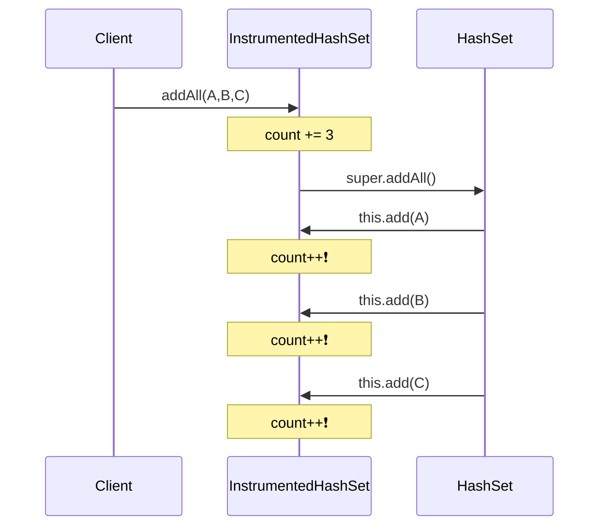
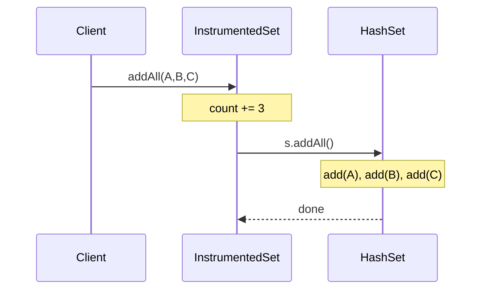
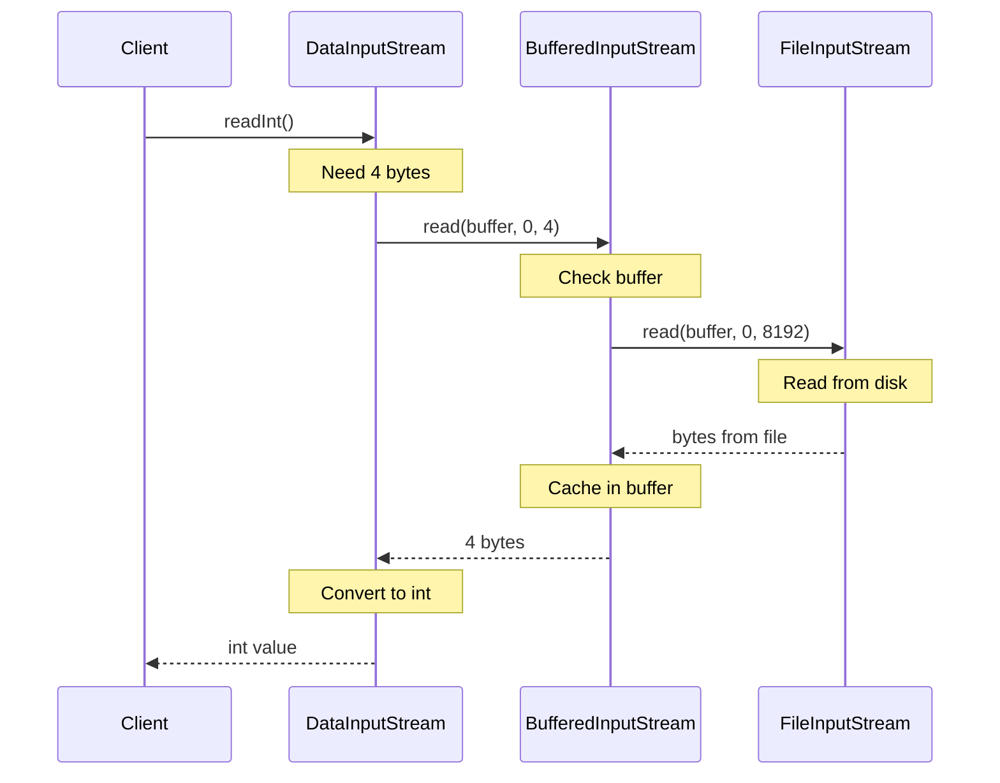

import RevealJS, { Slide } from '@site/src/components/RevealJS';
import Img from '@site/src/components/Img';
import PollSlide from '@site/src/components/PollSlide';
import SolidPrinciple from "@site/src/components/SolidPrinciple"

<RevealJS transition="slide">

{/* ============================================ */}
{/* COVER IMAGE */}
{/* ============================================ */}

<Slide>
  

<aside className="notes">
**Lecture overview:**
- **Total time:** ~60 minutes
- **Prerequisites:** Students understand coupling and cohesion from L7
- **Connects to:** Assignment 2 (designing changeable systems)

**Structure:**
- SOLID principles overview (~20 min)
- Composition over inheritance (~10 min)
- Rules for safe inheritance (~5 min)
- Decorator pattern (~15 min)
- When to use inheritance (~10 min)

**Key theme:** Inheritance is powerful but risky. Learn when to use it, when to avoid it, and how to do it safely.

→ **Transition:** Let's start with the learning objectives...
</aside>

</Slide>

{/* ============================================ */}
{/* TITLE SLIDE */}
{/* ============================================ */}

<Slide>

# CS 3100: Program Design and Implementation II

## Lecture 8: Changeability III — Principles for Inheritance

<p style={{marginTop: '2em', fontSize: '0.8em', color: '#666'}}>
  ©2025 Jonathan Bell & Ellen Spertus, CC-BY-SA
</p>

<aside className="notes">
**Context from L7:**
- Students learned about coupling and cohesion
- They can now analyze code for changeability
- This lecture provides concrete design principles

**Key theme:** SOLID principles and composition patterns help us write code that's easier to change and extend.

→ **Transition:** Here's what you'll be able to do after today...
</aside>

</Slide>

<Slide>

## Poll: Have you read any <em>Effective Java</em>?

<PollSlide
  choices={["Never heard of it", "Not yet", "I've found it online", "I've skimmed parts", "I've read 1 or 2 items", "I've read many items"]}
/>

</Slide>

{/* ============================================ */}
{/* LEARNING OBJECTIVES */}
{/* ============================================ */}

<Slide>

## Learning Objectives

<p style={{fontSize: '0.85em', textAlign: 'left'}}>
After this lecture, you will be able to:
</p>

<ol style={{fontSize: '0.75em', textAlign: 'left'}}>
  <li>Apply the SOLID principles to evaluate and improve object-oriented designs</li>
  <li>Explain why composition is generally preferred over inheritance and identify cases where each is appropriate</li>
  <li>Describe rules for safely implementing inheritance in your own code</li>
  <li>Define the Decorator pattern and explain its relationship to design for change</li>
</ol>

<aside className="notes">
**Time allocation:**
- Objective 1: SOLID principles (~20 min)
- Objective 2: Composition over inheritance (~10 min)
- Objective 3: Safe inheritance rules (~5 min)
- Objective 4: Decorator pattern (~15 min)
- Plus cases for inheritance (~10 min)

**Why this matters:** These principles guide decisions you'll make on every software project.

→ **Transition:** Let's review what coupling and cohesion mean...
</aside>

</Slide>

{/* ============================================ */}
{/* ARC 1: SOLID PRINCIPLES */}
{/* ============================================ */}

<Slide>

## SOLID Principles Guide Decisions About Class Design


<aside className="notes">
**Historical context:**
- Robert C. Martin ("Uncle Bob") wrote about these in 2000
- He didn't invent all of them—Bertrand Meyer (O) in 1988, Barbara Liskov (L) in 1987
- Michael Feathers coined "SOLID" in 2004

**Key insight:**
- These are guidelines, not laws
- Trade-offs always exist
- We'll look at each principle in context

→ **Transition:** Let's start with Single Responsibility...
</aside>

</Slide>

<Slide>

## Classes With Multiple Responsibilities Are Hard to Change

<p style={{fontSize: '0.9em', fontWeight: 'bold', color: '#9370DB'}}>
  Single Responsibility Principle: "A class should have only one reason to change."
</p>

<p style={{fontSize: '0.85em', marginTop: '0.5em'}}>
  This is cohesion applied to classes. A class with a single responsibility is easier to understand, test, and modify.
</p>

```java
// Violates SRP - five reasons to change!
public class SubmissionService {
    public void processSubmission(Submission submission) {
        TestResult testResult = runTests(submission);        // Testing logic
        LintResult lintResult = lintSubmission(submission);  // Linting logic
        GradingResult grade = gradeSubmission(submission, testResult, lintResult);  // Grading
        saveSubmission(submission, grade);                   // Persistence logic
        sendNotification(submission.student, grade);         // Notification logic
    }
}
```

<SolidPrinciple principle="S" />
<aside className="notes">
**The problem:**
- Five different responsibilities in one class
- Change to email format → modify SubmissionService
- Change to grading algorithm → modify SubmissionService
- Change to database schema → modify SubmissionService

**This is low cohesion:**
- Methods do unrelated things
- You must understand everything to change anything

→ **Transition:** How do we fix this?
</aside>

</Slide>

<Slide>

## Delegation Separates Concerns Into Focused Classes

```java
public class SubmissionProcessor {
    private final TestRunner testRunner;
    private final Linter linter;
    private final Grader grader;
    private final SubmissionRepository repository;
    private final NotificationService notifier;

    public void processSubmission(Submission submission) {
        TestResult testResult = testRunner.run(submission);
        LintResult lintResult = linter.analyze(submission);
        GradingResult gradeResult = grader.grade(submission, testResult, lintResult);
        repository.save(submission, gradeResult);
        notifier.notify(submission.student, gradeResult);
    }
}
```

<p style={{fontSize: '0.8em', marginTop: '0.5em', color: '#4CAF50'}}>
  ✓ Each class has one job. Changes to linting don't touch testing or grading code.
</p>
<SolidPrinciple principle="S" />
<aside className="notes">
**Benefits:**
- Each class has a single, focused responsibility
- `SubmissionProcessor` orchestrates but doesn't implement
- Changes to linting only affect `Linter`
- You don't need to look at other files

**Connection to L7:**
- This is functional cohesion at the class level
- Low coupling between the components

→ **Transition:** Next principle: Open/Closed...
</aside>

</Slide>

<Slide>

## Can you create a subtype without modifying existing code?

<PollSlide code={`
public interface IoTDevice {
    void identify();
    boolean isAvailable();
}

public class Light implements IoTDevice {
    // ... implementation ...
}`}
  choices={["Yes, for both types", "Only for IoTDevice", "Only for Light", "Not for either"]}
/>
<SolidPrinciple principle="O" />
</Slide>


<Slide>

## Good Modules Can Be Extended Without Being Modified

<p style={{fontSize: '0.9em', fontWeight: 'bold', color: '#9370DB'}}>
  Open/Closed Principle: "Software entities should be open for extension but closed for modification."
</p>


<SolidPrinciple principle="O" />
<aside className="notes">
**The goal:**
- Add new behavior without touching existing code
- Existing code is tested and working—don't risk breaking it

**How we achieve this:**
- Design with abstraction and polymorphism
- New functionality = new classes implementing existing interfaces

→ **Transition:** Let's see an example...
</aside>

</Slide>


<Slide>

## Interfaces Enable Extension Without Modification

```java
// Existing interface - OPEN for extension, CLOSED for modification
public interface IoTDevice {
    void identify();
    boolean isAvailable();
}

// Existing implementation - works, don't touch it
public class Light implements IoTDevice {
    // ... implementation ...
}
```
<div className="fragment">
```java
// OPEN for extension - add new device types freely!
public class SmartThermostat implements IoTDevice {
    @Override
    public void identify() { /* Flash display */ }

    @Override
    public boolean isAvailable() { return true; }

    // New behavior specific to thermostats
    public void setTemperature(int temp) { /* ... */ }
}
```

<p style={{fontSize: '0.8em', marginTop: '0.5em', color: '#4CAF50'}}>
  Adding `SmartThermostat` doesn't require changing `IoTDevice` or `Light`.
</p>
</div>
<SolidPrinciple principle="O" />

<aside className="notes">
**Key insight:**
- The interface defines the contract
- Anyone can implement it
- Existing code that uses `IoTDevice` automatically works with `SmartThermostat`

**This is Strategy pattern territory:**
- Different implementations behind a common interface
- We saw this in L7

→ **Transition:** The next principle ensures extensions behave correctly...
</aside>

</Slide>

<Slide>

## Poll: Which can be subtypes of Mammal?

<PollSlide choices={["Bird", "Fish", "Person", "Plant", "Cat"]}
/>
<SolidPrinciple principle="L" />
</Slide>

<Slide>

## Subclasses Must Be Substitutable for Their Parent Classes

<p style={{fontSize: '0.9em', fontWeight: 'bold', color: '#9370DB'}}>
  Liskov Substitution Principle: Objects of a supertype should be replaceable with objects of its subtypes without breaking the application.
</p>


<SolidPrinciple principle="L" />

<aside className="notes">
**We introduced this in Lecture 2:**
- Behavioral subtyping
- Subtypes must honor the contract of the parent
- The supertype can be a class or an interface

**Why it matters:**
- Code written for the supertype should work with any subtype
- If a subclass breaks expectations, it breaks all calling code

→ **Transition:** Let's see good and bad examples...
</aside>

</Slide>

<Slide>

## Subclasses That Break Expectations Break All Calling Code

<div style={{display: 'grid', gridTemplateColumns: '1fr 1fr', gap: '1em'}}>

<div>

**Good: LSP preserved**

```java
public class DimmableLight extends Light {
  private int brightness = 100;

  @Override
  public void turnOn() {
    // Honor contract by turning on light
    super.turnOn();
    // Can also add dimming capability
  }

  public void setBrightness(int b) {
    this.brightness = b;
  }
}
```

</div>

<div>

**Bad: LSP violated**

```java
public class BrokenLight extends Light {
  @Override
  public void turnOn() {
    // Does not honor contract!
    throw new UnsupportedOperationException(
      "This light can't be turned on!");
  }
}
```

</div>

</div>

<p style={{fontSize: '0.8em', marginTop: '0.5em', color: '#FF9800'}}>
  Code that calls `light.turnOn()` shouldn't need to check if it's a `BrokenLight` first.
</p>

<SolidPrinciple principle="L" />

<aside className="notes">
**The test:**
- Can you use the subclass anywhere the superclass is expected?
- Does it behave as expected?

**Violations are subtle:**
- Throwing unexpected exceptions
- Returning unexpected values
- Strengthening preconditions or weakening postconditions

→ **Transition:** Next up: Interface Segregation...
</aside>

</Slide>
<Slide>

## Poll: What type of interface(s) to prefer?

<div style={{display: 'flex', gap: '2em', fontSize: '0.7em'}}>
<div style={{flex: 1}}>

**A: One large interface**
```java
public interface SmartDevice {
    void turnOn();
    void turnOff();
    void setBrightness(int level);
    void setColorTemperature(int temp);
    void setFanSpeed(int speed);
}
```

</div>
<div style={{flex: 1}}>

**B: Many small interfaces**
```java
public interface Switchable {
    void turnOn();
    void turnOff();
}

public interface Dimmable {
    void setBrightness(int level);
}

public interface ColorAdjustable {
    void setColorTemperature(int temp);
}
```

</div>
</div>
<SolidPrinciple principle="I" />

<aside className="notes">
Give students a moment to vote before revealing that B demonstrates the Interface Segregation Principle.

**Discussion points:**
- What if you have a simple fan that can only turn on/off?
- With A, you'd have to implement methods you don't need
- With B, just implement `Switchable`
</aside>

</Slide>


<Slide>

## Large Interfaces Force Clients to Depend on Methods They Don't Use

<p style={{fontSize: '0.9em', fontWeight: 'bold', color: '#9370DB'}}>
  Interface Segregation Principle: "Clients should not be forced to depend on interfaces they don't use."
</p>


<SolidPrinciple principle="I" />

<aside className="notes">
**This is SRP for interfaces:**
- Don't bundle unrelated capabilities
- Clients shouldn't depend on methods they don't use

**Why it matters:**
- Changes to unused methods still require recompilation
- Implementations must provide methods they don't need
- Interface becomes harder to understand

→ **Transition:** Let's see the code...
</aside>

</Slide>

<Slide>

## Smaller Interfaces Reduce Unnecessary Dependencies

```java
// Bad: Monolithic interface
public interface SmartDevice {
    void turnOn();
    void turnOff();
    void setBrightness(int level);    // Not all devices have this!
    void setColorTemperature(int temp); // Or this!
    void setFanSpeed(int speed);       // Or this!
}

// Better: Segregated interfaces
public interface Switchable {
    void turnOn();
    void turnOff();
}

public interface Dimmable {
    void setBrightness(int level);
}

public interface ColorAdjustable {
    void setColorTemperature(int temp);
}
```

<SolidPrinciple principle="I" />

<aside className="notes">
**The improvement:**
- Each interface has one focused purpose
- Devices implement only what they need

**Java allows multiple interface implementation:**
- `class SmartBulb implements Switchable, Dimmable, ColorAdjustable`
- `class SimpleFan implements Switchable`

→ **Transition:** Final SOLID principle...
</aside>

</Slide>

<Slide>

## Classes Should Implement Only the Interfaces They Need

```java
// Simple fan - just needs on/off
public class SimpleFan implements Switchable {
    public void turnOn() { /* start motor */ }
    public void turnOff() { /* stop motor */ }
    // No need to implement dimming or color!
}

// Smart bulb - implements all capabilities
public class SmartBulb implements Switchable, Dimmable, ColorAdjustable {
    public void turnOn() { /* ... */ }
    public void turnOff() { /* ... */ }
    public void setBrightness(int level) { /* ... */ }
    public void setColorTemperature(int temp) { /* ... */ }
}
```

<p style={{fontSize: '0.8em', marginTop: '0.5em', color: '#4CAF50'}}>
  ✓ Each class implements exactly the interfaces it needs—no more, no less.
</p>

<SolidPrinciple principle="I" />

<aside className="notes">
**Benefits:**
- Clear what each device supports
- No dummy implementations throwing `UnsupportedOperationException`
- Easier to test—only test what the interface promises

→ **Transition:** Last principle: Dependency Inversion...
</aside>

</Slide>

<Slide>

## Poll: Which dependency is better?

<div style={{display: 'flex', gap: '2em', fontSize: '0.65em'}}>
<div style={{flex: 1}}>

**A: Dependency on concrete type**

```java
public class UserRepository {
    private MySQL database;

    public UserRepository(MySQL database) {
        this.database = database;
    }
}
```

</div>
<div style={{flex: 1}}>

**B: Dependency on abstract type**

```java
public class UserRepository {
    private Database database;

    public UserRepository(Database database) {
        this.database = database;
    }
}
```

</div>
</div>

<div style={{display: 'flex', justifyContent: 'center', fontSize: '0.65em'}}>



</div>

<SolidPrinciple principle="D" />

</Slide>

<Slide>

```mermaid
classDiagram
    class Database {
        <<interface>>
    }
    Database <|.. MySQL
    Database <|.. PostgreSQL
    Database <|.. MongoDB
    style Database fill:#2d4a5a,stroke:#4ac,stroke-width:2px,stroke-dasharray: 5 5
```

## High-Level Modules Should Not Depend on Low-Level Details

<p style={{fontSize: '0.9em', fontWeight: 'bold', color: '#9370DB'}}>
  Dependency Inversion Principle: "Depend on abstractions, not on concretions."
</p>


<SolidPrinciple principle="D" />

<aside className="notes">
**The inversion:**
- Instead of high-level depending on low-level...
- Both depend on an abstraction (interface)

**Why "inversion"?**
- Traditionally, high-level calls low-level directly
- We invert this by introducing an interface between them

→ **Transition:** Let's see code...
</aside>

</Slide>

<Slide>

## Abstractions Allow Implementations to Be Swapped

<div style={{display: 'grid', gridTemplateColumns: '1fr 1fr', gap: '1em'}}>

<div>

**Bad: Direct dependency**

```java
public class PawtograderSystem {
    // Hardcoded to MySQL!
    private MySQLDatabase database =
        new MySQLDatabase();

    public void saveSubmission(
            Submission s) {
        database.save(s);
    }
}
```

</div>

<div>

**Good: Depend on abstraction**

```java
public class PawtograderSystem {
    private final Database database;

    // Accepts any Database!
    public PawtograderSystem(
            Database database) {
        this.database = database;
    }

    public void saveSubmission(
            Submission s) {
        database.save(s);
    }
}
```

</div>

</div>

```java
public interface Database {
    void save(Submission submission);
}
```

<SolidPrinciple principle="D" />

<aside className="notes">
**Benefits:**
- Can swap MySQL for PostgreSQL without changing PawtograderSystem
- Can use a mock Database for testing
- High-level policy separated from low-level details

**This is constructor injection:**
- The dependency is "injected" via the constructor
- Very common in modern Java frameworks

→ **Transition:** Let's summarize SOLID...
</aside>

</Slide>

<Slide>

## SOLID Principles Work Together to Enable Change

| Principle | Key Idea | Benefit |
|-----------|----------|---------|
| **S**ingle Responsibility | One reason to change | High cohesion |
| **O**pen/Closed | Extend, don't modify | Safe evolution |
| **L**iskov Substitution | Subtypes honor contracts | Reliable polymorphism |
| **I**nterface Segregation | Small, focused interfaces | Minimal dependencies |
| **D**ependency Inversion | Depend on abstractions | Loose coupling |

<p style={{fontSize: '0.8em', marginTop: '1em', color: '#FF9800'}}>
  ⚠ These are guidelines, not laws. Always consider trade-offs in your specific context.
</p>

<aside className="notes">
**Looking ahead:**
- These same principles scale to entire systems
- In Lectures 19-20, we'll see how they inform software architecture

**For now:**
- Apply these when designing classes and interfaces
- Use them to evaluate existing designs
- They help identify potential problems early

→ **Transition:** Now let's talk about inheritance specifically...
</aside>

</Slide>


{/* ============================================ */}
{/* ARC 2: COMPOSITION OVER INHERITANCE */}
{/* ============================================ */}

<Slide>

## Inheritance Creates Tight Coupling That Composition Avoids

<p style={{fontSize: '1.1em', marginTop: '1em'}}>
  <em>Effective Java Item 18:</em> "Favor composition over inheritance"
</p>

<aside className="notes">
**Why favor composition?**
- Inheritance creates tight coupling
- Subclass depends on superclass implementation details
- Changes to superclass can break subclasses unexpectedly

**Composition is more flexible:**
- Objects are assembled from parts
- Parts can be swapped independently
- Each part has its own interface

→ **Transition:** Let's see a concrete example of the problem...
</aside>

</Slide>

<Slide>

## Subclasses Depend on Superclass Implementation Details

<p style={{fontSize: '0.7em'}}>
  Imagine we want a `Set` that counts how many times its `add()` method is called:
</p>

```java
public class InstrumentedHashSet<E> extends HashSet<E> {
    private int addCount = 0;

    @Override
    public boolean add(E e) {
        addCount++;
        return super.add(e); // return true if added
    }

    @Override
    public boolean addAll(Collection<? extends E> c) {
        addCount += c.size();
        return super.addAll(c);
    }

    public int getAddCount() { return addCount; }
}
```

<p style={{fontSize: '0.7em', marginTop: '0.5em'}}>
  What does `getAddCount()` return after `s.addAll(Arrays.asList("A", "B", "C"))`?
</p>

<aside className="notes">
**The trap:**
- This looks reasonable at first glance
- We increment count in both `add` and `addAll`

**Think about it:**
- We add 3 elements with `addAll`
- What will `getAddCount()` return?

→ **Transition:** Let's find out...
</aside>

</Slide>

<Slide>

## Hidden Implementation Details Cause Unexpected Behavior

```java
InstrumentedHashSet<String> s = new InstrumentedHashSet<>();
s.addAll(Arrays.asList("A", "B", "C"));
System.out.println(s.getAddCount()); // Prints 6, not 3!
```


<aside className="notes">
**What happened:**
- `HashSet.addAll()` internally calls `add()` for each element
- Our `add()` increments the counter
- Our `addAll()` also increments the counter
- Double counting!

**The fundamental problem:**
- We depended on implementation details of HashSet
- Those details aren't part of the public contract
- HashSet could change this behavior in a future version

→ **Transition:** How do we fix this?
</aside>

</Slide>

<Slide>

## Composition Delegates Without Depending on Implementation

```java
public class InstrumentedSet<E> implements Set<E> {
    private final Set<E> s;        // Composition: HAS-A Set
    private int addCount = 0;

    public InstrumentedSet(Set<E> s) {
        this.s = s;
    }

    @Override
    public boolean add(E e) {
        addCount++;
        return s.add(e);           // Delegate to wrapped set
    }

    @Override
    public boolean addAll(Collection<? extends E> c) {
        addCount += c.size();
        return s.addAll(c);        // Delegate - don't care how it's implemented!
    }

    public int getAddCount() { return addCount; }

    // Forward all other Set methods to s...
    @Override public int size() { return s.size(); }
    @Override public boolean isEmpty() { return s.isEmpty(); }
    // ... etc ...
}
```

<aside className="notes">
**Why this works:**
- We don't extend HashSet—we wrap it
- We call `s.addAll()`, not `super.addAll()`
- We don't care if `addAll` calls `add` internally
- Our counting is independent of the wrapped set's implementation

**Bonus flexibility:**
- Can wrap ANY Set implementation
- `new InstrumentedSet<>(new HashSet<>())`
- `new InstrumentedSet<>(new TreeSet<>())`

→ **Transition:** Let's visualize the difference...
</aside>

</Slide>

<Slide>

## Composition Keeps Method Calls Inside the Wrapped Object

<div style={{display: 'grid', gridTemplateColumns: '1fr 1fr', gap: '0.5em', fontSize: '0.6em'}}>

<div>

**Inheritance: count = 6 ❌**



</div>

<div>

**Composition: count = 3 ✓**



</div>

</div>

<aside className="notes">
**The key insight:**
- With inheritance, `super.addAll()` calls `this.add()`, which is our override
- With composition, `s.addAll()` calls its own `add()`, not ours

**This respects encapsulation:**
- We don't need to know how HashSet implements addAll
- We just use its public interface
- Changes to HashSet won't break us

→ **Transition:** When should we actually use inheritance?
</aside>

</Slide>

{/* ============================================ */}
{/* ARC 3: RULES FOR SAFE INHERITANCE */}
{/* ============================================ */}

<Slide>

## Inheritance Requires Explicit Design and Documentation

<p style={{fontSize: '0.85em'}}>
  <em>Effective Java Item 19:</em> "Design and document for inheritance or else prohibit it"
</p>


<aside className="notes">
**Two safe options:**
1. Design explicitly for inheritance with thorough documentation
2. Prohibit inheritance entirely

**There's no safe middle ground:**
- Undocumented inheritance is asking for trouble
- The fragile base class problem is always lurking

→ **Transition:** Let's see what good documentation looks like...
</aside>

</Slide>

<Slide>

## Document Which Methods Call Which Other Methods

```java
public abstract class AbstractSubmissionProcessor {
    /**
     * Processes a submission. This method calls {@link #validate(Submission)}
     * followed by {@link #grade(Submission)} if validation succeeds.
     */
    public final GradingResult process(Submission submission) {
        if (validate(submission)) {
            return grade(submission);
        }
        return GradingResult.invalid();
    }

    /**
     * Validates a submission. Subclasses must override this method
     * to provide language-specific validation.
     */
    protected abstract boolean validate(Submission submission);

    /**
     * Grades a submission. Subclasses must override this method
     * to provide language-specific grading.
     */
    protected abstract GradingResult grade(Submission submission);
}
```

<aside className="notes">
**Key practices:**
1. **Document which methods call which** - `process()` calls `validate()` then `grade()`
2. **Make template methods final** - `process()` can't be overridden
3. **Mark extension points clearly** - `protected abstract` methods
4. **Minimize protected members** - each is a commitment

→ **Transition:** Or just prevent inheritance entirely...
</aside>

</Slide>

<Slide>

## Most Classes Should Be Final By Default

```java
// Prevent inheritance by making the class final
public final class SubmissionValidator {
    // Cannot be extended - no surprises possible

    public boolean validate(Submission submission) {
        // Implementation details can change freely
        // No subclass depends on them
    }
}
```

<p style={{fontSize: '0.85em', marginTop: '1em'}}>
  Most classes should be either:
</p>

<ul style={{fontSize: '0.8em'}}>
  <li><strong>Explicitly designed for inheritance</strong> with thorough documentation, OR</li>
  <li><strong>Declared `final`</strong> to prevent inheritance entirely</li>
</ul>

<aside className="notes">
**When to use `final`:**
- When you don't want to commit to supporting subclasses
- When you want freedom to change implementation details
- Most classes should be final by default

**Java's standard library regrets:**
- Many classes like `HashSet` aren't final
- Can't be changed now without breaking existing code

→ **Transition:** Now let's look at a pattern that uses composition brilliantly...
</aside>

</Slide>

<Slide>

## Design Patterns

<div style={{display: 'flex', gap: '2em', alignItems: 'center'}}>
<div style={{flex: 2}}>
<p style={{fontSize: '0.85em', marginTop: '1em'}}>
Popularized in a 1994 book _Design Patterns: Elements of Reusable Object-Oriented Software_

**Strategy**: swap algorithms at runtime via a common interface

**Decorator**: wrap objects to dynamically add behavior

**Template Method**: enable subclasses to customize algorithm steps
</p>
</div>
<div style={{flex: 1}}>


</div>
</div>

</Slide>

{/* ============================================ */}
{/* ARC 4: DECORATOR PATTERN */}
{/* ============================================ */}

<Slide>

## Decorators Add Behavior Through Composition, Not Inheritance

<p style={{fontSize: '0.9em'}}>
  A structural design pattern that adds behavior to objects dynamically using composition.

```mermaid
classDiagram
    class Component {
        <<interface>>
        +operation()*
    }

    class ConcreteComponent {
        +operation()
    }

    class Decorator {
        <<abstract>>
        -component: Component
        +operation()
    }

    class ConcreteDecoratorA {
        +operation()
        +addedBehavior()
    }

    class ConcreteDecoratorB {
        +operation()
        +addedState
    }

    Component <|.. ConcreteComponent
    Component <|.. Decorator
    Decorator <|-- ConcreteDecoratorA
    Decorator <|-- ConcreteDecoratorB
    Decorator o-- Component

style Component fill:#2d4a5a,stroke:#4ac,stroke-width:2px,stroke-dasharray: 5 5
```

</p>



<aside className="notes">
**The pattern structure:**
- `Component`: the interface everything implements
- `ConcreteComponent`: the base implementation
- `Decorator`: wraps a Component, IS-A Component
- `ConcreteDecorators`: add specific behaviors

**Key insight:**
- Decorators wrap components
- Each decorator adds one behavior
- You can stack decorators

→ **Transition:** You've already used this pattern...
</aside>

</Slide>

<Slide>

## Java I/O Streams Stack Decorators for Flexible Combinations

<div style={{display: 'grid', gridTemplateColumns: '1fr 1fr', gap: '0.5em', fontSize: '0.65em'}}>

<div>

**Wrapping streams:**

```java
// Base: read bytes from file
InputStream file = new FileInputStream("data.txt");

// Decorator #1: add buffering
InputStream buf = new BufferedInputStream(file);

// Decorator #2: add primitive reading
DataInputStream data = new DataInputStream(buf);

int value = data.readInt();
```

</div>

<div>

**Call delegation:**



</div>

</div>

<aside className="notes">
**Why this design is powerful:**
- `FileInputStream`: reads raw bytes from a file
- `BufferedInputStream`: adds buffering (performance)
- `DataInputStream`: adds methods to read primitive types

**Each decorator:**
- Implements `InputStream`
- Wraps another `InputStream`
- Adds one specific enhancement

→ **Transition:** Why is this better than inheritance?
</aside>

</Slide>

<Slide>

## A Visual Decorator Example

<div style={{display: 'flex', gap: '2em', alignItems: 'center'}}>
<div>
```mermaid
classDiagram
    class VisualComponent {
        <<interface>>
        draw()*
    }
    class TextView {
        draw()
    }
    class Decorator {
        <<abstract>>
        -component: VisualComponent
        draw()*
    }
    class ScrollDecorator {
        scrollPosition
        draw()
        scrollTo()
    }
    class BorderDecorator {
        borderWidth
        draw()
        drawBorder()
    }

    VisualComponent <|-- TextView
    VisualComponent <|-- Decorator
    VisualComponent <--o Decorator : component
    Decorator <|-- ScrollDecorator
    Decorator <|-- BorderDecorator

    style VisualComponent fill:#2d4a5a,stroke:#4ac,stroke-width:2px,stroke-dasharray: 5 5
        ```
    </div>
    <div>


</div>
</div>

<p style={{fontSize: '0.6em'}}>
  Source: <em>Design Patterns</em> (1995) by Gamma et al., chapter 4
</p>

</Slide>

<Slide>

## Decorators Avoid the Class Explosion Problem


<aside className="notes">
**The class explosion problem:**
- With inheritance, you need a class for every combination
- 3 sources × 3 enhancements = 9 classes minimum
- Adding a new enhancement? Multiply everything again!

**With decorators:**
- 3 source classes + 3 decorator classes = 6 classes
- Add any combination at runtime
- Adding a new enhancement? Just 1 new class

→ **Transition:** What are the benefits for changeability?
</aside>

</Slide>

<Slide>

## Decorators Support Good Design Principles

<ul style={{fontSize: '0.7em'}}>
  <li><strong>Single Responsibility Principle:</strong> Each decorator does one thing</li>
  <li><strong>Open/Closed Principle:</strong> Add new decorators without modifying existing code</li>
  <li><strong>Avoid class explosion:</strong> Compose instead of creating subclasses for every combination</li>
</ul>

<p style={{fontSize: '0.7em', marginTop: '1em', fontWeight: 'bold'}}>
  Example combinations without new classes:
</p>

```java
// Buffered file reading
new BufferedInputStream(new FileInputStream("data.txt"))

// Buffered, compressed network reading
new BufferedInputStream(new GZIPInputStream(new URL(url).openStream()))

// Data reading from bytes in memory
new DataInputStream(new ByteArrayInputStream(bytes))
```

<aside className="notes">
**The flexibility:**
- Any source can be wrapped with any decorator
- Decorators can wrap other decorators
- All combinations work automatically

**This is composition over inheritance in action:**
- Each decorator HAS-A stream (composition)
- Each decorator IS-A stream (interface)

→ **Transition:** Are there downsides?
</aside>

</Slide>

<Slide>

## Decorators Trade Explicitness for Flexibility


<ul style={{fontSize: '0.85em', marginTop: '0.5em'}}>
  <li><strong>More verbose:</strong> Lots of wrapper instantiation</li>
  <li><strong>Harder to understand:</strong> Can't tell capabilities from type alone</li>
  <li><strong>Runtime composition:</strong> Structure hidden until execution</li>
</ul>

<aside className="notes">
**The trade-off:**
- Flexibility comes at the cost of explicitness
- Looking at `InputStream stream`, you don't know what it can do
- With inheritance, `DataFileInputStream` is clear in the type

**When decorators hurt:**
- When you need to know exact capabilities at compile time
- When the nesting gets very deep
- When most combinations are never used

→ **Transition:** So when should we use inheritance?
</aside>

</Slide>

{/* ============================================ */}
{/* ARC 5: WHEN INHERITANCE IS APPROPRIATE */}
{/* ============================================ */}

<Slide>

## Inheritance Works Well for Specific Design Patterns


<aside className="notes">
**Three good uses for inheritance:**
1. Template Method pattern - algorithmic skeleton
2. Natural type hierarchies - genuine IS-A relationships
3. Skeletal implementations - help implementing interfaces

**Notice:**
- All are carefully designed for inheritance
- All have clear documentation
- All have stable relationships

→ **Transition:** Let's look at Template Method...
</aside>

</Slide>

<Slide>

## Template Methods Define Algorithm Skeletons That Subclasses Complete

<p style={{fontSize: '0.85em'}}>
  Define the algorithm skeleton in the base class; let subclasses fill in the details.
</p>

```java
public abstract class AbstractTestRunner {
    // Template method - defines the algorithm structure
    public final TestResult runTests(Submission submission) {
        setUp();
        try {
            compileCode(submission);
            List<TestCase> tests = loadTestCases();
            TestResult result = new TestResult();
            for (TestCase test : tests) {
                beforeEach();
                result.add(executeTest(test, submission));
                afterEach();
            }
            return result;
        } finally {
            tearDown();
        }
    }

    // Hooks with defaults         // Abstract methods subclasses must implement
    protected void setUp() {}      protected abstract void compileCode(Submission s);
    protected void tearDown() {}   protected abstract List<TestCase> loadTestCases();
    protected void beforeEach() {} protected abstract TestOutcome executeTest(
    protected void afterEach() {}      TestCase test, Submission s);
}
```

<aside className="notes">
**The pattern:**
- `runTests()` is the template method (final!)
- It defines the algorithm structure
- Subclasses implement the abstract methods
- Hooks (`setUp`, etc.) have default implementations

**Why inheritance works here:**
- Clear contract about what to override
- Template method is final—can't break the algorithm
- Subclasses focus on specific details

→ **Transition:** Another good case...
</aside>

</Slide>

<Slide>

## True "Is-A" Relationships Create Stable Hierarchies

```java
public abstract class Shape {
    protected double x, y;  // Position

    public abstract double area();
    public abstract double perimeter();

    public void moveTo(double x, double y) {
        this.x = x;
        this.y = y;
    }
}

public class Circle extends Shape {
    private double radius;

    @Override
    public double area() {
        return Math.PI * radius * radius;
    }

    @Override
    public double perimeter() {
        return 2 * Math.PI * radius;
    }
}
```

<p style={{fontSize: '0.8em', marginTop: '0.5em', color: '#4CAF50'}}>
  ✓ A Circle truly "is-a" Shape. The relationship is stable and meaningful.
</p>

<aside className="notes">
**When IS-A relationships work:**
- Fundamental to the problem domain
- Stable—unlikely to change
- Semantically meaningful

**The Shape hierarchy is classic:**
- All shapes have position, area, perimeter
- Each shape computes these differently
- No confusion about the relationship

→ **Transition:** One more case: skeletal implementations...
</aside>

</Slide>

<Slide>

## Abstract Classes Can Provide Helpful Default Implementations

```java
public interface Light {
    void turnOn();
    void turnOff();
    boolean isOn();
}

// Skeletal implementation - does the boring work
public abstract class AbstractLight implements Light {
    private boolean on = false;

    @Override
    public void turnOn() {
        if (!on) { on = true; activateHardware(); }
    }

    @Override
    public void turnOff() {
        if (on) { on = false; deactivateHardware(); }
    }

    @Override
    public boolean isOn() { return on; }

    // Subclasses implement hardware-specific behavior
    protected abstract void activateHardware();
    protected abstract void deactivateHardware();
}
```

<aside className="notes">
**The pattern:**
- Interface defines the contract (`Light`)
- Abstract class provides common implementation (`AbstractLight`)
- Subclasses implement the hardware-specific parts

**Java examples:**
- `AbstractList`, `AbstractSet`, `AbstractMap`
- Implement most methods using a few core abstract methods

**The flexibility:**
- Extend AbstractLight if it fits
- Implement Light directly if it doesn't

→ **Transition:** Let's summarize when to use what...
</aside>

</Slide>

<Slide>

## When to Use Inheritance

<div style={{fontSize: '0.75em'}}>

1. There's a genuine **"is-a" relationship** fundamental to the domain
2. You **control both base and subclasses** (or trust the base class designer)
3. The base class is **explicitly designed for inheritance** with clear documentation
4. You're implementing a **well-established pattern** like Template Method
5. You need to share code between **closely related classes**
</div>

<aside className="notes">
**The key question:**
- Is this truly an "is-a" relationship?
- Or am I just trying to reuse some code?
</aside>
</Slide>

<Slide>
<div style={{fontSize: '0.75em'}}>
## When to Avoid Inheritance
1. You're trying to **reuse code** but there's no natural "is-a" relationship
2. The base class **wasn't designed for inheritance**
3. You want to **modify behavior** of existing classes (use Decorator)
4. You want **multiple inheritance** of behavior (use interfaces with default methods)
5. The hierarchy would be **deep** (more than 2-3 levels is often a smell)

</div>

<aside className="notes">

**If just reusing code:**
- Composition is almost always better
- Delegation gives the same code reuse without the coupling

→ **Transition:** Let's wrap up...
</aside>

</Slide>

{/* ============================================ */}
{/* KEY TAKEAWAYS */}
{/* ============================================ */}

<Slide>

## Key Takeaways

<ul style={{fontSize: '0.8em'}}>
  <li><strong>SOLID principles</strong> provide guidelines for changeable OO design</li>
  <li><strong>Favor composition over inheritance</strong> to avoid the fragile base class problem</li>
  <li><strong>Design for inheritance or prohibit it</strong> — document self-use or use `final`</li>
  <li><strong>Decorator pattern</strong> adds behavior through composition, not inheritance</li>
  <li><strong>Use inheritance</strong> for template methods, natural hierarchies, and skeletal implementations</li>
</ul>

<aside className="notes">
**For your assignments:**
- Consider SOLID when designing classes
- Prefer composition unless inheritance is clearly better
- Use interfaces to enable flexibility

**Looking ahead:**
- These same principles scale to entire systems
- Architecture lectures will revisit these ideas at a larger scale

</aside>

</Slide>

</RevealJS>
